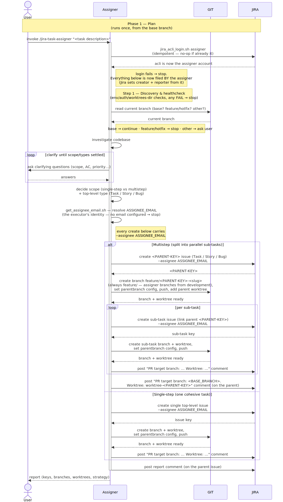
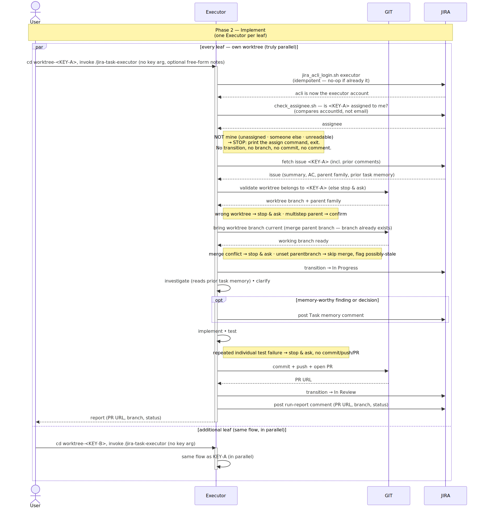
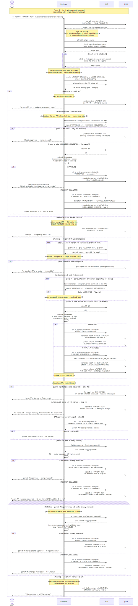

# jira-sdlc-tools

[](LICENSE)

A Claude Code plugin marketplace for Jira-tracked, parallel feature
delivery via git worktrees.

## What's here

This repo currently hosts one plugin, **[`jira-sdlc`](plugins/jira-sdlc)**
— three coupled skills (`jira-task-assigner`, `jira-task-executor`,
`jira-task-reviewer`) that turn a feature request into Jira issues and
git worktrees, implement each piece in parallel, and then review and
merge the result as a single unit, leaving only the final release merge
for a human.

This page is the front door. Everything about how the plugin actually
works — architecture, prerequisites, configuration, a full usage
walkthrough, safety model, and troubleshooting — lives in
[`plugins/jira-sdlc/README.md`](plugins/jira-sdlc/README.md).

The three skills, one per stage of the lifecycle:

- **`jira-task-assigner`** — turns a feature/task/bug description into
  Jira issues with matching git branches and worktrees. Investigates the
  codebase, asks clarifying questions, decides whether the request is one
  self-contained task or a multistep split into parallel sub-tasks, and
  gives every leaf issue its own branch and worktree so parallel work can
  start immediately.
- **`jira-task-executor`** — implements the issue implied by the current
  worktree's branch, end to end: status transition, investigation,
  implementation, tests, commit, push, and PR. No issue-key argument —
  run it from inside the issue's own worktree.
- **`jira-task-reviewer`** — run from the parent issue's worktree.
  Reviews each sub-task PR into the parent branch (approve or request
  changes), posts findings to Jira, and reviews the parent PR into the
  base branch once the sub-task PRs are merged. Never merges anything
  itself.

## Task lifecycle preview

The three skills map to three phases of a task's life:

1. **Phase 1 · Plan**  
   skill: `jira-task-assigner`  
   Jira state: **To Do**
   - investigates the codebase
   - asks clarifying questions
   - settles the scope (one issue, or a parent split into sub-tasks)
   - files the Jira issues
   - provisions a git branch and worktree for each
   - records the PR target branch the later phases build on
2. **Phase 2 · Implement**  
   skill: `jira-task-executor`  
   Jira state: **In Progress**
   - runs once per worktree, in parallel
   - confirms it owns the worktree and brings the branch up to date
   - implements the issue, runs the tests, commits, pushes, and opens a PR
   - moves the issue to *In Review*
3. **Phase 3 · Review & aggregate approval**  
   skill: `jira-task-reviewer`  
   Jira state: **In Review**
   - reviews each PR across six dimensions (correctness, patterns, scope, regressions, tests, hygiene)
   - posts its verdict to GitHub and Jira
   - sends rejected issues back to *In Progress*
   - never merges — that stays a human call
---

<table>
<tr>
<td align="center" valign="top" width="33%">
<strong>Phase 1 · Plan</strong><br>
<code>jira-task-assigner</code><br>
<a href="plugins/jira-sdlc/docs/TASK-LIFECYCLE-PHASE-1.md">Full diagram &amp; notes →</a><br><br>
<a href="plugins/jira-sdlc/docs/TASK-LIFECYCLE-PHASE-1.md"></a>
</td>
<td align="center" valign="top" width="33%">
<strong>Phase 2 · Implement</strong><br>
<code>jira-task-executor</code><br>
<a href="plugins/jira-sdlc/docs/TASK-LIFECYCLE-PHASE-2.md">Full diagram &amp; notes →</a><br><br>
<a href="plugins/jira-sdlc/docs/TASK-LIFECYCLE-PHASE-2.md"></a>
</td>
<td align="center" valign="top" width="33%">
<strong>Phase 3 · Review &amp; aggregate approval</strong><br>
<code>jira-task-reviewer</code><br>
<a href="plugins/jira-sdlc/docs/TASK-LIFECYCLE-PHASE-3.md">Full diagram &amp; notes →</a><br><br>
<a href="plugins/jira-sdlc/docs/TASK-LIFECYCLE-PHASE-3.md"></a>
</td>
</tr>
</table>

## Install

### Remote — from the marketplace (recommended)

```
/plugin marketplace add kantorv/jira-sdlc-tools
/plugin install jira-sdlc@jira-sdlc-tools
```

### Local — clone, then load with `--plugin-dir`

```bash
git clone https://github.com/kantorv/jira-sdlc-tools.git
claude --plugin-dir ./jira-sdlc-tools/plugins/jira-sdlc
```

No marketplace step and nothing gets installed — this loads the plugin
directly from your local clone for that Claude Code session. Point
`--plugin-dir` at the plugin's own root (`plugins/jira-sdlc`), not the
toolkit repo root — the toolkit root only holds `marketplace.json`,
not a `plugin.json`. Useful if you'd rather track updates via `git pull`
than a marketplace, or if you're testing a change before publishing it.
If you're planning to actively edit the plugin rather than just run it,
see [Development](#development) below for the edit-reload loop.

### Either way

Create two files in the root of the repo you're building features in:

1. **`jira-sdlc-tools.env`** — team-shared settings (project key, status names, default branch). A filled-in template ships at [`jira-sdlc-tools.env`](jira-sdlc-tools.env) in this repo's root; copy it over and fill in the blanks.
2. **`jira-sdlc-tools.local.env`** — developer/machine-specific settings (worktrees path, Jira URL, email, token path). This file is **gitignored**; each developer creates their own copy. See [`jira-sdlc-tools.local.env.example`](jira-sdlc-tools.local.env.example) for the template.

The plugin README explains what each value means. Then you're ready to run `/jira-sdlc:jira-task-assigner`.

## Repository layout

```
jira-sdlc-tools/
├── .claude-plugin/
│   └── marketplace.json        # lists every plugin this repo offers
├── plugins/
│   └── jira-sdlc/              # the plugin itself
│       ├── .claude-plugin/
│       │   └── plugin.json
│       ├── skills/
│       ├── docs/
│       ├── LICENSE
│       └── README.md           # full plugin documentation
├── jira-sdlc-tools.env         # template — team-shared settings (committed)
├── jira-sdlc-tools.local.env.example  # template — machine-specific settings (gitignored)
├── AGENTS.md                   # repo-wide instructions for AI coding agents
├── CLAUDE.md                   # imports AGENTS.md + Claude Code–specific notes
├── LICENSE
└── README.md                   # this file
```

It's split into a marketplace layer (this level) and a plugin layer
(`plugins/jira-sdlc/`) so the marketplace can grow to host more
Jira/SDLC-related plugins later without another reorganization — right
now there's just the one.

## Development

Editing a skill needs a tighter loop than a marketplace install gives
you: Claude Code copies a plugin snapshot into its cache at install
time, so changes to your clone won't show up in an installed copy until
you reinstall.

1. **Clone the repo:**
   ```bash
   git clone https://github.com/kantorv/jira-sdlc-tools.git
   cd jira-sdlc-tools
   ```

2. **Load it manually**, pointing at the plugin's own root — not the
   toolkit repo root, which only holds `marketplace.json`:
   ```bash
   claude --plugin-dir ./plugins/jira-sdlc
   ```
   No install step, no marketplace. If `jira-sdlc` is already installed
   from a marketplace elsewhere on the same machine, `--plugin-dir`
   takes precedence for that session, so you're never testing against a
   stale cached copy without realizing it.

3. **After each edit, reload instead of restarting:**
   ```
   /reload-plugins
   ```
   Picks up changes to skills, agents, hooks, and MCP/LSP servers
   without a full session restart.

There's no build or test suite to run — these are prompt files for an
LLM agent plus two JSON manifests, not compiled code. See
[`AGENTS.md`](AGENTS.md) for what actually counts as validating a
change. Note too that this toolkit repo isn't a valid target for its
own skills — you'll need a separate application repo, with its own
`jira-sdlc-tools.env`, to actually exercise one against.

## Contributing

Read [`AGENTS.md`](AGENTS.md) first, especially if an AI coding agent is
doing the work — it covers the constraints that are easy to break
without realizing it (the `_shared/` reference-path relationship, what
else to update if you rename a skill or the plugin, how to validate a
change with no test suite to run).

## Trademarks

Jira and Atlassian are trademarks or registered trademarks of Atlassian
Pty Ltd, in the United States and/or other countries. This is an
independent, community-built project that integrates with Jira through
its public CLI and APIs; it is not affiliated with, endorsed by, or
sponsored by Atlassian, and its references to Jira are solely to
describe compatibility.

## License

[MIT](LICENSE), covering the whole repo, including the plugin.