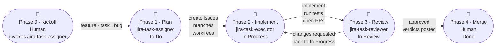
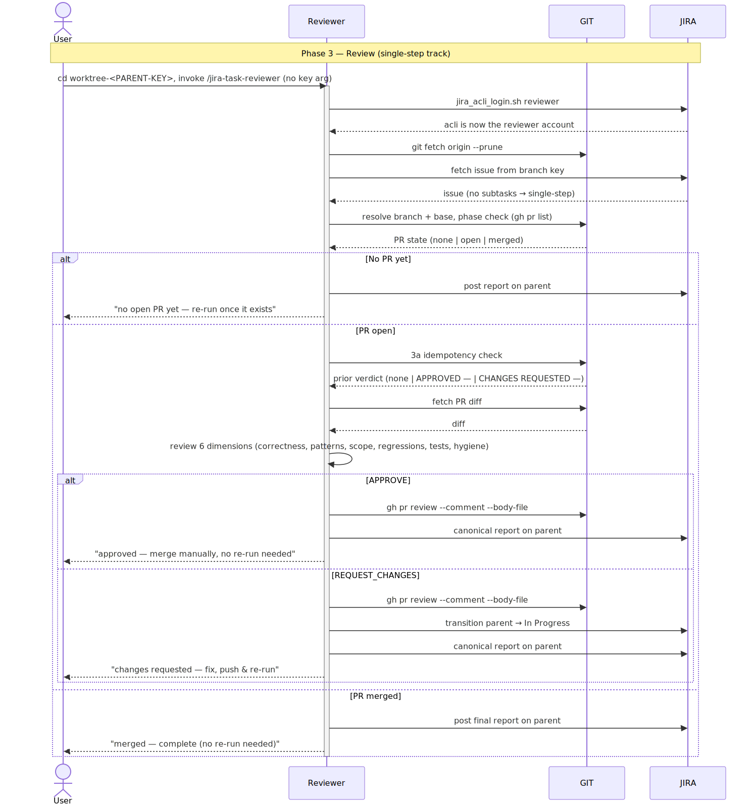

# jira-sdlc-tools

[](LICENSE)

An SDLC layer for AI coding assistants — the Jira API, the Gitflow model, and
git worktrees as isolated per-issue workspaces.

Shipped as a Claude Code plugin (installable from its own marketplace) and as
a loose skill set for coding-assistant platforms that respect the Claude or
[agentskills.io](https://agentskills.io) specifications.

The skills are explicit-invocation only by design — never auto-triggered —
and carry the corresponding setting on both specs: `disable-model-invocation`
for Claude, `allow_implicit_invocation: false` for agentskills.io.

## ⚠️ Caution

**This plugin acts on your behalf in both git and Jira.** Given your
credentials, it will commit, create and push branches, open and update
pull requests, and take the other actions needed to follow the
[`gitflow`](plugins/jira-sdlc/docs/SDLC.md) strategy — and it will
create, update, transition, and comment on issues in your Jira project.
Those actions are visible to your team and land under your (or agent's own) account.

Use it with caution: point it at a project you're comfortable having
changed, and read [Configuration](#either-way) before the first run so
you know which repo and which Jira project it's wired to.

What it deliberately never does on its own — merging into your base
branch, deleting Jira issues, resolving conflicts — is listed in
[Safety model](plugins/jira-sdlc/README.md#safety-model).

## What's here

This repo currently hosts one plugin, **[`jira-sdlc`](plugins/jira-sdlc)**
— three coupled skills (`jira-task-assigner`, `jira-task-executor`,
`jira-task-reviewer`) that turn a feature request into Jira issues and
git worktrees, implement each piece in parallel, and then review and
merge the result as a single unit, leaving only the final release merge
for a human.

This page is the front door. Everything about how the plugin actually
works — architecture, prerequisites, configuration, a full usage
walkthrough, safety model, and troubleshooting — lives in
[`plugins/jira-sdlc/README.md`](plugins/jira-sdlc/README.md).

The three skills, one per stage of the lifecycle:

- **[`jira-task-assigner`](plugins/jira-sdlc/skills/jira-task-assigner/SKILL.md)** — turns a feature/task/bug description into
  Jira issues with matching git branches and worktrees. Investigates the
  codebase, asks clarifying questions, decides whether the request is one
  self-contained task or a multistep split into parallel sub-tasks, and
  gives every leaf issue its own branch and worktree so parallel work can
  start immediately.
- **[`jira-task-executor`](plugins/jira-sdlc/skills/jira-task-executor/SKILL.md)** — implements the issue implied by the current
  worktree's branch, end to end: status transition, investigation,
  implementation, tests, commit, push, and PR. No issue-key argument —
  run it from inside the issue's own worktree.
- **[`jira-task-reviewer`](plugins/jira-sdlc/skills/jira-task-reviewer/SKILL.md)** — run from the parent issue's worktree.
  Reviews each sub-task PR into the parent branch (approve or request
  changes), posts findings to Jira, and reviews the parent PR into the
  base branch once the sub-task PRs are merged. Never merges anything
  itself.

## Quick install

### Claude Code

#### Remote — from the marketplace (recommended)

```
/plugin marketplace add kantorv/jira-sdlc-tools
/plugin install jira-sdlc@jira-sdlc-tools
```

#### Local — clone, then load with `--plugin-dir`

```bash
git clone https://github.com/kantorv/jira-sdlc-tools.git
claude --plugin-dir ./jira-sdlc-tools/plugins/jira-sdlc
```

### Non Claude Code assistants

Assistants that read the Claude skills spec don't need the plugin wrapper —
copy the skills in and they discover the three directly:

```bash
cp -r plugins/jira-sdlc/skills/* skills/
```

What has to end up there:

```text
skills/
├── jira-task-assigner/
│   ├── SKILL.md
│   └── agents/openai.yml     ← Codex + Antigravity only
├── jira-task-executor/
│   ├── SKILL.md
│   └── agents/openai.yml
├── jira-task-reviewer/
│   ├── SKILL.md
│   └── agents/openai.yml
└── _shared/                  ← sibling, not nested — SKILL.md reads ../_shared/…
    ├── jira-acli-reference.md
    ├── jira-api-reference.md
    ├── project-config.md
    ├── scripts/
    └── templates/
```

That `skills/` folder is `.codex/skills/` for Codex, `.agent/skills/` for
Antigravity, `~/.claude/skills/` for Cursor (shared with Claude Code), and
whatever path `kilo.jsonc` points at for Kilo Code.

For every platform's skills directory, spec, wiring and verification status,
see the [Platform Compatibility Matrix](#platform-compatibility-matrix) at the
bottom.

## Full Setup

Two shorter routes through the same ground:

- **[Step by step](plugins/jira-sdlc/docs/STEP-BY-STEP.md)** — the ordered
  walkthrough: tools, tokens, settings, and a healthcheck, in the order you
  actually do them.
- **[Full setup checklist](plugins/jira-sdlc/docs/FULL-SETUP-CHECKLIST.md)** —
  the same prerequisites as tickable items, each with how to verify it, ending
  in one command that checks most of them for you.

### Prerequisites

Three CLIs must be installed and authenticated on your machine first.

**Install tools**

| Tool   | Title           | Uses                       | Install URL                                                              | Auth method | Token link                                                                        | Local docs                                                                          |
| ------ | --------------- | -------------------------- | ----------------------------------------------------------------------- | ----------- | --------------------------------------------------------------------------------- | ----------------------------------------------------------------------------------- |
| `git`  | Version control | commit/push                | [git-scm.com/downloads](https://git-scm.com/downloads)                  | global auth | —                                                                                 | —                                                                                   |
| `gh`   | GitHub CLI      | pr create/update           | [cli.github.com](https://cli.github.com/)                               | token       | [GitHub fine-grained PAT](https://github.com/settings/personal-access-tokens/new) | [GH-PAT-SESSION-LOGIN.md](plugins/jira-sdlc/docs/github/GH-PAT-SESSION-LOGIN.md)     |
| `acli` | Atlassian CLI   | jira api (issues, comments)| [install acli](https://developer.atlassian.com/cloud/acli/guides/install-acli/) | token       | [Jira API token](https://id.atlassian.com/manage-profile/security/api-tokens)     | [JIRA-ACLI.md](plugins/jira-sdlc/docs/JIRA-ACLI.md)                                  |

**Platform specific**
| Platform | Needs | Why |
|---|---|---|
| **Windows** | [`pwsh`](https://learn.microsoft.com/powershell/scripting/install/installing-powershell-on-windows) (PowerShell 7+) **or** `powershell` (5.1, ships with Windows) | execute `.ps1` scripts |
| **Linux / macOS** | [`jq`](https://jqlang.github.io/jq/download/) · [`python3`](https://www.python.org/downloads/) *(recommended)* | JSON parsing, scripting |

`git` uses your machine's existing global credentials. `gh` authenticates
with a GitHub PAT (`GITHUB_PAT_TOKEN`) and `acli` with a Jira API token
(`JIRA_TOKEN`) — both set per repo in `jira-sdlc-tools.local.env` (see
[Either way](#either-way) below).

---

 

### Tokens to get

Two API tokens go into `jira-sdlc-tools.local.env` — one for Jira, one for
GitHub:

| Token | Get it from | Permissions to add | Granular? | What it's for | Docs |
|---|---|---|---|---|---|
| `JIRA_TOKEN` | [Jira API tokens](https://id.atlassian.com/manage-profile/security/api-tokens) | N/A (granular per-issue scopes are rejected by acli) | No — use non scoped **API token** | authenticates `acli` to the Jira REST API — issues, comments, transitions | [JIRA-ACLI.md](plugins/jira-sdlc/docs/JIRA-ACLI.md) |
| `GITHUB_PAT_TOKEN` | [GitHub fine-grained PAT](https://github.com/settings/personal-access-tokens/new) | **Contents** → Read and write · **Pull requests** → Read and write (**Metadata** → Read-only is added automatically) | Yes — fine-grained PAT | authenticates `gh` to push the branch and open PRs | [GH-PAT-SESSION-LOGIN.md](plugins/jira-sdlc/docs/github/GH-PAT-SESSION-LOGIN.md) |

### Either way

Create two files in the root of the repo you're building features in:

1. **`jira-sdlc-tools.env`** — team-shared settings (project key, status names, default branch). A filled-in template ships at [`jira-sdlc-tools.env`](jira-sdlc-tools.env) in this repo's root; copy it over and fill in the blanks.
2. **`jira-sdlc-tools.local.env`** — developer/machine-specific settings (worktrees path, Jira URL, email, token path). This file is **gitignored**; each developer creates their own copy. See [`jira-sdlc-tools.local.env.example`](jira-sdlc-tools.local.env.example) for the template.

The plugin README explains what each value means. Then you're ready to run `/jira-sdlc:jira-task-assigner`.

## Jira states - who can move a card

The four statuses are configurable — `<STATUS_*>` below are the tokens you map
onto your board's real names in `jira-sdlc-tools.env`. Full detail, including
what each skill does at every step, is in
**[Jira states](plugins/jira-sdlc/docs/JIRA-STATES.md)**.

✅ does it · ⚠️ only with your confirmation · ❌ never

| Who | `<STATUS_TODO>` | `<STATUS_IN_PROGRESS>` | `<STATUS_IN_REVIEW>` | `<STATUS_DONE>` |
|---|---|---|---|---|
| **You** | ✅ anytime — usually just the creation default | ✅ anytime | ✅ anytime | ✅ anytime — `acli … transition`, or drag the card |
| **[`jira-task-assigner`](plugins/jira-sdlc/skills/jira-task-assigner/SKILL.md)** | ❌ it creates the issue and lets your workflow's creation default stand | ❌ | ❌ | ❌ transitions nothing at all — issues, branches and worktrees only |
| **[`jira-task-executor`](plugins/jira-sdlc/skills/jira-task-executor/SKILL.md)** | ❌ | ✅ step 3, when it picks the issue up | ✅ step 11, right after it opens the PR | ❌ step 11 explicitly leaves Done to the merge, whoever does it |
| **[`jira-task-reviewer`](plugins/jira-sdlc/skills/jira-task-reviewer/SKILL.md)** | ❌ | ✅ step 3d, on a CHANGES REQUESTED verdict — sub-task or single-step only, never the multistep parent on a 5b reject | ❌ it only *reads* this status, to pick which sub-tasks to review | ⚠️ step 7 asks once at the end of a run, for approved issues only, and moves nothing you don't confirm |
| **[GitHub Actions](plugins/jira-sdlc/docs/STATE-TRANSITIONS-WITH-GITHUB-ACTIONS.md)** | ❌ none ships | ✅ `jira_issue_transition_on_branch.yml` — on `create` of a `feature/*`/`hotfix/*` branch, and only from `<STATUS_TODO>` | ✅ `jira_issue_transition_on_pr_open.yml` — on PR opened/reopened, skipped if already In Review or Done | ✅ `jira_issue_transition_on_merge.yml` — on PR closed-as-merged, skipped if already Done |
| **[Jira Automation](plugins/jira-sdlc/docs/INSTALLING-GITHUB-FOR-JIRA.md)** (incl. GitHub for Jira) | ✅ possible (a rule on issue create), rarely needed | ✅ possible — e.g. the dev-panel *branch created* trigger | ✅ possible — e.g. the *pull request created* trigger | ✅ the common one — *pull request merged*, or *all sub-tasks Done → close the parent* |

The GitHub Actions row is **this repo's own CI** (`.github/workflows/`), not
files the plugin installs — a marketplace install copies only
`plugins/jira-sdlc/`. Copy them into your project to get that row; setup and
secrets are in
[Driving Jira state from GitHub Actions](plugins/jira-sdlc/docs/STATE-TRANSITIONS-WITH-GITHUB-ACTIONS.md).

## Task lifecycle preview

The three skills map to three phases of a task's life. The Jira states
below use the default Kanban board names (To Do / In Progress / In
Review) — these are configurable per project, so map them to your own
workflow's status names.



<table>
<tr>
<td align="center" valign="top" width="33%">
<strong>Phase 1 · Plan</strong><br>
<code>jira-task-assigner</code><br>
<a href="plugins/jira-sdlc/docs/TASK-LIFECYCLE-PHASE-1.md">Full diagram &amp; notes →</a><br><br>
<a href="plugins/jira-sdlc/docs/TASK-LIFECYCLE-PHASE-1.md"></a>
</td>
<td align="center" valign="top" width="33%">
<strong>Phase 2 · Implement</strong><br>
<code>jira-task-executor</code><br>
<a href="plugins/jira-sdlc/docs/TASK-LIFECYCLE-PHASE-2.md">Full diagram &amp; notes →</a><br><br>
<a href="plugins/jira-sdlc/docs/TASK-LIFECYCLE-PHASE-2.md"></a>
</td>
<td align="center" valign="top" width="33%">
<strong>Phase 3 · Review &amp; aggregate approval</strong><br>
<code>jira-task-reviewer</code><br>
<a href="plugins/jira-sdlc/docs/TASK-LIFECYCLE-PHASE-3.md">Full diagram &amp; notes →</a><br><br>
<a href="plugins/jira-sdlc/docs/TASK-LIFECYCLE-PHASE-3.md"></a>
</td>
</tr>
</table>

See **[Task lifecycle](plugins/jira-sdlc/docs/TASK-LIFECYCLE.md)** for the
full phase-by-phase breakdown (skills, Jira states, and per-phase steps).

## Repository layout

```
jira-sdlc-tools/
├── .claude-plugin/
│   └── marketplace.json        # lists every plugin this repo offers
├── plugins/
│   └── jira-sdlc/              # the plugin itself
│       ├── .claude-plugin/
│       │   └── plugin.json
│       ├── skills/
│       ├── docs/
│       ├── LICENSE
│       └── README.md           # full plugin documentation
├── jira-sdlc-tools.env         # template — team-shared settings (committed)
├── jira-sdlc-tools.local.env.example  # template — machine-specific settings (gitignored)
├── AGENTS.md                   # repo-wide instructions for AI coding agents
├── CLAUDE.md                   # imports AGENTS.md + Claude Code–specific notes
├── LICENSE
└── README.md                   # this file
```

It's split into a marketplace layer (this level) and a plugin layer
(`plugins/jira-sdlc/`) so the marketplace can grow to host more
Jira/SDLC-related plugins later without another reorganization — right
now there's just the one.

## Development

Editing a skill needs a tighter loop than a marketplace install gives
you: Claude Code copies a plugin snapshot into its cache at install
time, so changes to your clone won't show up in an installed copy until
you reinstall.

1. **Clone the repo:**
   ```bash
   git clone https://github.com/kantorv/jira-sdlc-tools.git
   cd jira-sdlc-tools
   ```

2. **Load it manually**, pointing at the plugin's own root — not the
   toolkit repo root, which only holds `marketplace.json`:
   ```bash
   claude --plugin-dir ./plugins/jira-sdlc
   ```
   No install step, no marketplace. If `jira-sdlc` is already installed
   from a marketplace elsewhere on the same machine, `--plugin-dir`
   takes precedence for that session, so you're never testing against a
   stale cached copy without realizing it.

3. **After each edit, reload instead of restarting:**
   ```
   /reload-plugins
   ```
   Picks up changes to skills, agents, hooks, and MCP/LSP servers
   without a full session restart.

There's no build or test suite to run — these are prompt files for an
LLM agent plus two JSON manifests, not compiled code. See
[`AGENTS.md`](AGENTS.md) for what actually counts as validating a
change. Note too that this toolkit repo isn't a valid target for its
own skills — you'll need a separate application repo, with its own
`jira-sdlc-tools.env`, to actually exercise one against.

### Run your own

For anyone who wants to customize the skills and run their own version
rather than track this one.

This repo is [MIT-licensed](LICENSE) and is already a ready-to-use Claude
Code marketplace — it's only a few clicks from being cloned or forked into
your own copy, then registered as a marketplace in your local Claude Code.
Fork or clone it, edit the skills to taste, and install from your local
folder:

1. **Fork it on GitHub** (if you want your own upstream to push to), then
   clone your copy:
   ```bash
   git clone https://github.com/<you>/jira-sdlc-tools.git
   ```
2. **Add the local folder as a marketplace**, pointing at the repo root
   (the directory holding `.claude-plugin/marketplace.json`):
   ```
   /plugin marketplace add ./jira-sdlc-tools
   /plugin install jira-sdlc@jira-sdlc-tools
   ```
   From here it behaves like the remote install — your fork is the source.
   While actively editing, use the `--plugin-dir` edit-reload loop above
   instead, since a marketplace install copies a snapshot into the cache.

## Contributing

Read [`AGENTS.md`](AGENTS.md) first, especially if an AI coding agent is
doing the work — it covers the constraints that are easy to break
without realizing it (the `_shared/` reference-path relationship, what
else to update if you rename a skill or the plugin, how to validate a
change with no test suite to run).

## Trademarks

Jira and Atlassian are trademarks or registered trademarks of Atlassian
Pty Ltd, in the United States and/or other countries. This is an
independent, community-built project that integrates with Jira through
its public CLI and APIs; it is not affiliated with, endorsed by, or
sponsored by Atlassian, and its references to Jira are solely to
describe compatibility.

## License

[MIT](LICENSE), covering the whole repo, including the plugin.

## Platform Compatibility Matrix

The skills target the Claude skills spec, so `jira-sdlc` also works —
natively or through the [Agent Skills](https://agentskills.io)
adaptation — in a growing set of other AI coding assistants: Cursor, Kilo
Code, Codex, Antigravity, OpenCode, Grok Build, Pi,
and Kimi Code. See [**Platform Compatibility Matrix**](INTEGRATIONS.md) for the
platform-by-platform table — each one's spec, wiring, integration status,
and a link to its detailed doc.

| Platform | Specification | How it loads | Integration status | Compatibility | Documentation |
|---|---|---|---|---|---|
| [Claude Code](plugins/jira-sdlc/docs/integrations/CLAUDECODE.md) | Native Claude skills | plugin marketplace · `.claude/skills/` drop-in copy · `--plugin-dir` | First-class (reference) | ✅ | [`CLAUDECODE.md`](plugins/jira-sdlc/docs/integrations/CLAUDECODE.md) |
| [Cursor](plugins/jira-sdlc/docs/integrations/CURSOR.md) | Native Claude skills | shares the `~/.claude/` tree with Claude Code | Verified — Linux/macOS | ✅ | [`CURSOR.md`](plugins/jira-sdlc/docs/integrations/CURSOR.md) |
| [Kilo Code](plugins/jira-sdlc/docs/integrations/KILO.md) | Native Claude skills | `kilo.jsonc` skills path | Working | ✅ | [`KILO.md`](plugins/jira-sdlc/docs/integrations/KILO.md) |
| [Codex (CLI)](plugins/jira-sdlc/docs/integrations/CODEX.md) | Agent Skills | `.codex/skills/` copy + per-skill `agents/openai.yml` | Working — sandbox & timing caveats, testing needed | ⚠️ | [`CODEX.md`](plugins/jira-sdlc/docs/integrations/CODEX.md) |
| [Antigravity](plugins/jira-sdlc/docs/integrations/ANTIGRAVITY.md) | Agent Skills | `.agent/skills/` discovery (live-tested) + per-skill `agents/openai.yml` | Verified — Antigravity IDE 1.23.2 & agy 1.0.8 work; other releases untested | ✅ | [`ANTIGRAVITY.md`](plugins/jira-sdlc/docs/integrations/ANTIGRAVITY.md) |
| [OpenCode](plugins/jira-sdlc/docs/integrations/OPENCODE.md) | Native Claude skills | `.opencode/skills/` discovery + `opencode.json` override | Draft — not run in this environment | ❔ | [`OPENCODE.md`](plugins/jira-sdlc/docs/integrations/OPENCODE.md) |
| [Grok Build (xAI)](plugins/jira-sdlc/docs/integrations/GROK.md) | Native Claude skills | reads Claude Code skills, plugins, and hooks zero-config | Draft — flag honour unverified; not run in this environment | ❔ | [`GROK.md`](plugins/jira-sdlc/docs/integrations/GROK.md) |
| [Pi (pi.dev)](plugins/jira-sdlc/docs/integrations/PI.md) | Native Claude skills | `settings.json` skills path | Draft — not run in this environment | ❔ | [`PI.md`](plugins/jira-sdlc/docs/integrations/PI.md) |
| [Kimi Code](plugins/jira-sdlc/docs/integrations/KIMI-CODE.md) | Native Claude skills | `extra_skill_dirs` in `config.toml` | Working — verified in this run | ✅ | [`KIMI-CODE.md`](plugins/jira-sdlc/docs/integrations/KIMI-CODE.md) |

**Compatibility:** ✅ works — verified in a live session · ⚠️ caution — works
with caveats, not run end-to-end here · ❌ not compatible · ❔ not tested — not
yet exercised in this environment. See [Platform Compatibility Matrix](INTEGRATIONS.md) for the
full status legend.

## Lab channel

Everything above describes the **main** channel — this repo's default
branch, and what every install command on this page gives you: the three
core skills, reviewed, released, and tagged.

The **lab** channel is the same plugin sourced from the `lab` branch
instead. It's kept synced with the default branch, so it's never *behind*
main — it's main plus work that hasn't landed yet: more advanced scripts,
wider permissions, and an extra skill.

| Name | Type | Description | Example reports |
|---|---|---|---|
| [`conversation-debugger`](https://github.com/kantorv/jira-sdlc-tools/blob/lab/plugins/jira-sdlc/skills/conversation-debugger/SKILL.md) | skill | Post-mortems a recorded run of one of the three core skills against its own prose, verdicting each instruction as followed / diverged / skipped / not-reached. | TBD |
| [`feature_report`](https://github.com/kantorv/jira-sdlc-tools/blob/lab/plugins/jira-sdlc/skills/conversation-debugger/scripts/feature_report.md) | script | Rolls a whole feature's runs up into a single report. | TBD |

### Example reports

| Report | Generated by | Source | Description |
|---|---|---|---|
| [`jira-task-assigner-JST-126`](plugins/jira-sdlc/docs/examples/reports/jira-task-assigner-JST-126-e0471131-44aa-44cb-9ed8-9ca85852bc89.md) | ai | `conversation-debugger` | Single-run post-mortem of a `jira-task-assigner` conversation for JST-126, verdicting each instruction as followed / diverged / skipped / not-reached. |
| [`jira-task-executor-JST-125`](plugins/jira-sdlc/docs/examples/reports/jira-task-executor-JST-125-bb91775f-028f-48b1-acdb-9eaec28d6d9b.md) | ai | `conversation-debugger` | Single-run post-mortem of a `jira-task-executor` conversation for JST-125, run on the Windows/PowerShell dispatch path. |
| [`jira-task-reviewer-JST-122`](plugins/jira-sdlc/docs/examples/reports/jira-task-reviewer-JST-122-df864d2f-3115-4f06-b3c2-24456615eed0.md) | ai | `conversation-debugger` | Single-run post-mortem of a `jira-task-reviewer` conversation for JST-122, run on the Windows/PowerShell dispatch path. |
| [`JST-122-story-report`](plugins/jira-sdlc/docs/examples/reports/JST-122-story-report.md) | script | `feature_report` | Feature-wide rollup for multistep JST-122 (parent + 3 child issues, 15 conversations) built from `collect_feature` JSON — token/cost/model totals, nothing re-estimated. |
| [`JST-126-task-report`](plugins/jira-sdlc/docs/examples/reports/JST-126-task-report.md) | script | `feature_report` | Feature-wide rollup for single-issue JST-126 (3 conversations) built from `collect_feature` JSON — token/cost/model totals, nothing re-estimated. |

To install it, suffix the marketplace repo with `@lab`:

```
/plugin marketplace add kantorv/jira-sdlc-tools@lab
/plugin install jira-sdlc@jira-sdlc-tools
```

Worth knowing before you switch: the extras aren't release-gated, and they
reach wider than the core three do — into your whole workspace rather than
a single issue's worktree, with the scripts and permissions to match.

See [**LAB-CHANNEL.md**](https://github.com/kantorv/jira-sdlc-tools/blob/lab/LAB-CHANNEL.md)
on the lab branch for the full description, both install routes, and the
lab-only configuration step.