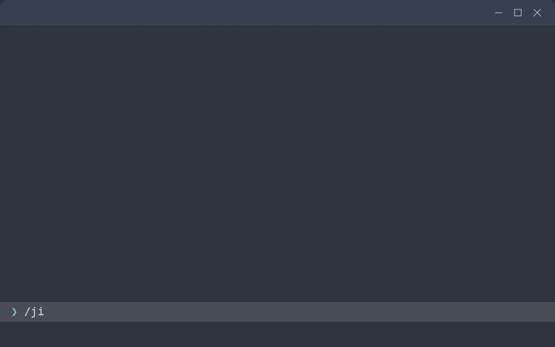
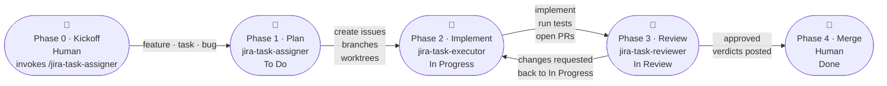
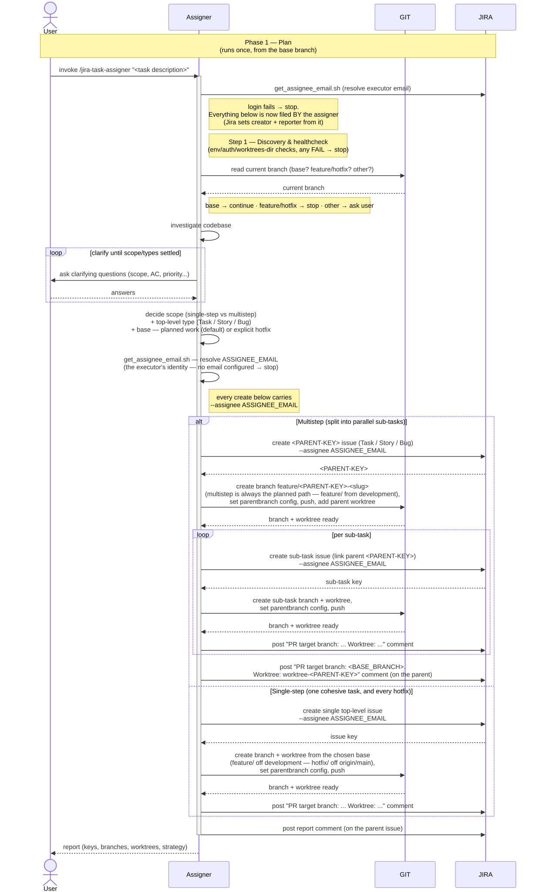
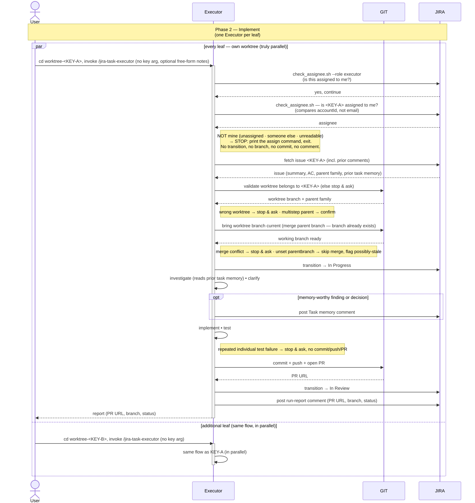
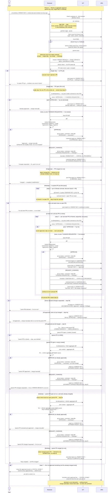

# jira-sdlc-tools

[](LICENSE)

An SDLC layer for AI coding assistants — the Jira API, the Gitflow model, and
git worktrees as isolated per-issue workspaces.

Shipped as a Claude Code plugin (installable from its own marketplace) and as
a loose skill set for coding-assistant platforms that respect the Claude or
[agentskills.io](https://agentskills.io) specifications.

The skills are explicit-invocation only by design — never auto-triggered —
and carry the corresponding setting on both specs: `disable-model-invocation`
for Claude, `allow_implicit_invocation: false` for agentskills.io.

## ⚠️ Caution

**This plugin acts as an authenticated user in both git and Jira.** Given
credentials, it will commit, create and push branches, open and update
pull requests, and take the other actions needed to follow the
[`gitflow`](plugins/jira-sdlc/docs/SDLC.md) strategy — and it will
create, update, transition, and comment on issues in your Jira project.
Those actions are visible to your team and land under whichever account you
configured — your own, or a dedicated one per skill.

Use it with caution: point it at a project you're comfortable having
changed, and read
[Settings files](plugins/jira-sdlc/docs/FULL-SETUP-CHECKLIST.md#settings-files)
before the first run so you know which repo and which Jira project it's wired to.

What it deliberately never does on its own — merging into your base
branch, deleting Jira issues, resolving conflicts — is listed in
[Safety model](plugins/jira-sdlc/README.md#safety-model).

## What's here

This repo currently hosts one plugin, **[`jira-sdlc`](plugins/jira-sdlc)**
— three coupled skills (`jira-task-assigner`, `jira-task-executor`,
`jira-task-reviewer`) that turn a feature request into Jira issues and
git worktrees, implement each piece in parallel, and then review and
merge the result as a single unit, leaving only the final release merge
for a human. A fourth, `jst-install`, is the setup skill you run once
before any of them.

This page is the front door. Everything about how the plugin actually
works — architecture, prerequisites, configuration, a full usage
walkthrough, safety model, and troubleshooting — lives in
[`plugins/jira-sdlc/README.md`](plugins/jira-sdlc/README.md).

The three skills, one per stage of the lifecycle:

- **[`jira-task-assigner`](plugins/jira-sdlc/skills/jira-task-assigner/SKILL.md)** — turns a feature/task/bug description into
  Jira issues with matching git branches and worktrees. Investigates the
  codebase, asks clarifying questions, decides whether the request is one
  self-contained task or a multistep split into parallel sub-tasks, and
  gives every leaf issue its own branch and worktree so parallel work can
  start immediately.
- **[`jira-task-executor`](plugins/jira-sdlc/skills/jira-task-executor/SKILL.md)** — implements the issue implied by the current
  worktree's branch, end to end: status transition, investigation,
  implementation, tests, commit, push, and PR. No issue-key argument —
  run it from inside the issue's own worktree.
- **[`jira-task-reviewer`](plugins/jira-sdlc/skills/jira-task-reviewer/SKILL.md)** — run from the parent issue's worktree.
  Reviews each sub-task PR into the parent branch (approve or request
  changes), posts findings to Jira, and reviews the parent PR into the
  base branch once the sub-task PRs are merged. Never merges anything
  itself.

Plus one that runs before all three, once per project:

- **[`jst-install`](plugins/jira-sdlc/skills/jst-install/SKILL.md)** — guided
  first-time setup. Walks the four sections of
  [Step by step](plugins/jira-sdlc/docs/STEP-BY-STEP.md) — local tooling,
  GitHub repo prep, Jira board prep, healthcheck — verifying each with the
  bundled `statuscheck` script before moving on, so a missing `development`
  branch or a misspelled status name surfaces at setup rather than mid-run.


## Examples

### JIRA-TASK-ASSIGNER
```bash
claude
> /jira-sdlc:jira-task-assigner "Refactor the InstantProductViewset create action. The action is currently separated into two perform_create methods. Investigate the code to determine whether this flow could be simplified. Additionally, check for any redundant code. Reference: cropapp/catalog/views.py, lines 1265–1676"
```





### JIRA-TASK-EXECUTOR
```bash
# cd into each worktree it creates, run this in each one (no key —
# derived from that worktree's branch):
claude
> /jira-sdlc:jira-task-executor 
```


### JIRA-TASK-REVIEWER
```bash
# once the sub-task's PR is up, run from the same worktree:
claude
> /jira-sdlc:jira-task-reviewer 
```


## Platform Compatibility Matrix

The skills target the Claude skills spec, so `jira-sdlc` also works —
natively or through the [Agent Skills](https://agentskills.io)
adaptation — in a growing set of other AI coding assistants: Cursor, Kilo
Code, Codex, Antigravity, OpenCode, Grok Build, Pi,
and Kimi Code. See [**Platform Compatibility Matrix**](INTEGRATIONS.md) for the
platform-by-platform table — each one's spec, wiring, integration status,
and a link to its detailed doc.

| Platform | Specification | How it loads | Integration status | Compatibility | Documentation |
| -- | -- | -- | -- | -- | -- |
| [Claude Code](plugins/jira-sdlc/docs/integrations/CLAUDECODE.md) | Native Claude skills | plugin marketplace · `.claude/skills/` drop-in copy · `--plugin-dir` | First-class (reference) | ✅ | [`CLAUDECODE.md`](plugins/jira-sdlc/docs/integrations/CLAUDECODE.md) |
| [Cursor](plugins/jira-sdlc/docs/integrations/CURSOR.md) | Native Claude skills | shares the `~/.claude/` tree with Claude Code | Verified — Linux/macOS | ✅ | [`CURSOR.md`](plugins/jira-sdlc/docs/integrations/CURSOR.md) |
| [Kilo Code](plugins/jira-sdlc/docs/integrations/KILO.md) | Native Claude skills | `kilo.jsonc` skills path | Working | ✅ | [`KILO.md`](plugins/jira-sdlc/docs/integrations/KILO.md) |
| [Codex (CLI)](plugins/jira-sdlc/docs/integrations/CODEX.md) | Agent Skills | `.codex/skills/` copy + per-skill `agents/openai.yml` | Working — sandbox & timing caveats, testing needed | ⚠️ | [`CODEX.md`](plugins/jira-sdlc/docs/integrations/CODEX.md) |
| [Antigravity](plugins/jira-sdlc/docs/integrations/ANTIGRAVITY.md) | Agent Skills | `.agent/skills/` discovery (live-tested) + per-skill `agents/openai.yml` | Verified — Antigravity IDE 1.23.2 & agy 1.0.8 work; other releases untested | ✅ | [`ANTIGRAVITY.md`](plugins/jira-sdlc/docs/integrations/ANTIGRAVITY.md) |
| [OpenCode](plugins/jira-sdlc/docs/integrations/OPENCODE.md) | Native Claude skills | `.opencode/skills/` discovery + `opencode.json` override | Verified | ✅ | [`OPENCODE.md`](plugins/jira-sdlc/docs/integrations/OPENCODE.md) |
| [Grok Build (xAI)](plugins/jira-sdlc/docs/integrations/GROK.md) | Native Claude skills | reads Claude Code skills, plugins, and hooks zero-config | Draft — flag honour unverified; not run in this environment | ❔ | [`GROK.md`](plugins/jira-sdlc/docs/integrations/GROK.md) |
| [Pi (pi.dev)](plugins/jira-sdlc/docs/integrations/PI.md) | Native Claude skills | `settings.json` skills path | Caution — does not respect skill arguments | ⚠️ | [`PI.md`](plugins/jira-sdlc/docs/integrations/PI.md) |
| [Kimi Code](plugins/jira-sdlc/docs/integrations/KIMI-CODE.md) | Native Claude skills | `extra_skill_dirs` in `config.toml` | Working — verified in this run | ✅ | [`KIMI-CODE.md`](plugins/jira-sdlc/docs/integrations/KIMI-CODE.md) |

**Compatibility:** ✅ works — verified in a live session · ⚠️ caution — works
with caveats, not run end-to-end here · ❌ not compatible · ❔ not tested — not
yet exercised in this environment. See [Platform Compatibility Matrix](INTEGRATIONS.md) for the
full status legend.


## Prerequisites

### Tools

| Tool | Title | Uses | Install URL | Local docs |
| -- | -- | -- | -- | -- |
| `git` | Version control | commit/push | [git-scm.com/downloads](https://git-scm.com/downloads) | — |
| `gh` | GitHub CLI | pr create/update | [cli.github.com](https://cli.github.com/) | [GH-PAT-SESSION-LOGIN.md](plugins/jira-sdlc/docs/github/GH-PAT-SESSION-LOGIN.md) |
| `jq` | JSON processor | parse Jira REST responses (`jira.sh`) | [jqlang.github.io/jq](https://jqlang.github.io/jq/download/) | — |
| `python3` *(recommended)* | Scripting | scripting, JSON parsing, etc. | [python.org/downloads](https://www.python.org/downloads/) | — |

**Platform specific**

| Platform | Needs | Tested on | Why |
| -- | -- | -- | -- |
| **Windows** | [`pwsh`](https://learn.microsoft.com/powershell/scripting/install/installing-powershell-on-windows) (PowerShell 7+) **or** `powershell` (5.1, ships with Windows) | Windows 11 | execute `.ps1` scripts |
| **Linux** | `bash` | Ubuntu 22.04 | execute `.sh` scripts |
| **macOS** | `bash`/`sh` | ⚠️ not tested | execute `.sh` scripts |

`git` uses your machine's existing global credentials. `gh` authenticates
with a GitHub PAT (`GITHUB_PAT_TOKEN`) and `jira.sh` with a per-role Jira
API token (`JIRA_EXECUTOR_TOKEN` / `JIRA_ASSIGNER_TOKEN` /
`JIRA_REVIEWER_TOKEN`) — all set per repo in `jira-sdlc-tools.local.env`
(see [Full Setup](#full-setup) below).

### Tokens and auth

| Tool | Auth type | Scopes | Shared across roles | Description | Link |
| -- | -- | -- | -- | -- | -- |
| Jira | Scoped `classic` token | <span style="white-space:nowrap">`read:jira-user`</span><br><span style="white-space:nowrap">`read:jira-work`</span><br><span style="white-space:nowrap">`write:jira-work`</span> (3 needed) | No | A **per-role** token (assigner, executor, reviewer), sent as per-request Basic auth on every call — there's no login session to share. | [SECURITY.md](plugins/jira-sdlc/docs/SECURITY.md#jira) |
| `gh` | GitHub PAT | <span style="white-space:nowrap">Contents (read/write)</span><br><span style="white-space:nowrap">Pull requests (read/write)</span> | ⚠️ Partial — re-logs in at the start of every run, never logs out | One `GITHUB_PAT_TOKEN` logs `gh` in for the whole run, so all three skills act as the same GitHub identity — unlike Jira, there's no per-role split. | [SECURITY.md](plugins/jira-sdlc/docs/SECURITY.md#github) |
| `git` | SSH key or credentials manager | N/A | Yes (uses your regular login) | Commits, pushes, and worktrees ride on your machine's existing git setup — the plugin configures no credentials of its own, so every commit lands under your own account. | [SECURITY.md](plugins/jira-sdlc/docs/SECURITY.md#git) |

> ⚠️ **This plugin is designed to run in a shared environment** — the same
> checkout where a coding assistant operates *and* where you yourself still
> run `git` commands by hand. That's why `git` auth is left shared between
> you and the agent rather than split out: a separate agent identity would
> otherwise fight your own commits/pushes for the same repo state. If your
> setup doesn't need that — the agent is the only thing ever touching
> `git` here — it can authenticate with its own PAT instead, the same way
> `gh` already does. See
> [GITHUB-PAT-AGENT-OWNED-ENV.md](plugins/jira-sdlc/docs/github/GITHUB-PAT-AGENT-OWNED-ENV.md)
> for how to set that up.

## Quick install

### Claude Code

#### Remote — from the marketplace (recommended)

```
/plugin marketplace add kantorv/jira-sdlc-tools
/plugin install jira-sdlc@jira-sdlc-tools
```

#### Local — clone, then load with `--plugin-dir`

```bash
git clone https://github.com/kantorv/jira-sdlc-tools.git
claude --plugin-dir ./jira-sdlc-tools/plugins/jira-sdlc
```

### Non Claude Code assistants

Assistants that read the Claude skills spec don't need the plugin wrapper —
copy the skills in and they discover them directly:

```bash
cp -r plugins/jira-sdlc/skills/* skills/
```

What has to end up there:

```text
skills/
├── jira-task-assigner/
│   ├── SKILL.md
│   └── agents/openai.yml     ← Codex + Antigravity only
├── jira-task-executor/
│   ├── SKILL.md
│   └── agents/openai.yml
├── jira-task-reviewer/
│   ├── SKILL.md
│   └── agents/openai.yml
├── jst-install/
│   └── SKILL.md              ← run once, before the other three
└── _shared/                  ← sibling, not nested — SKILL.md reads ../_shared/…
    ├── jira-api-reference.md
    ├── project-config.md
    ├── scripts/
    └── templates/
```

That `skills/` folder is `.codex/skills/` for Codex, `.agent/skills/` for
Antigravity, `~/.claude/skills/` for Cursor (shared with Claude Code), and
whatever path `kilo.jsonc` points at for Kilo Code.

For every platform's skills directory, spec, wiring and verification status,
see the [Platform Compatibility Matrix](#platform-compatibility-matrix) at the
bottom.

## Full Setup

Everything to have in place before the first run — the three CLIs, both API
tokens, the two settings files, and the branches and board your project needs —
is a tickable list in
**[Full setup checklist](plugins/jira-sdlc/docs/FULL-SETUP-CHECKLIST.md)**,
ending in one command that verifies most of it for you.

Prefer it as prose? **[Step by step](plugins/jira-sdlc/docs/STEP-BY-STEP.md)**
walks the same ground in the order you actually do it.

Prefer to be walked through it? `/jira-sdlc:jst-install` covers the same four
sections interactively, checking each one before moving to the next.

## Applications

Beyond the walkthrough above, the plugin is consumed two ways — as a Claude
Code marketplace plugin, or as a loose skillset copied into a project's own
skills folder — and this repo ships demo GitHub Actions workflows under
[`.github/workflows/`](.github/workflows/) showing both consumption modes
driving the three skills headlessly in CI, from a standalone reviewer gate on
an open PR up to the full assigner → executor → reviewer chain on the feature
and hotfix paths. Full detail, including production-environment setup and
which secrets each demo reads, is in
**[Applications](plugins/jira-sdlc/docs/applications/APPLICATIONS.md)**.

Five scenarios, each with its own walkthrough. "Approvals" counts the
`environment: production` pauses a run waits on before it can continue.

- **[Feature flow](plugins/jira-sdlc/docs/applications/ci-feature-flow-demo.md)**
  — the whole assigner → executor → reviewer chain on the planned path: a
  GitHub issue becomes a Jira issue and a `feature/*` branch, gets implemented,
  and ends as an open, reviewed PR. Nothing is merged. Comment-triggered, up to
  3 approvals.
  [`demo-claude-feature-flow.yml`](.github/workflows/demo-claude-feature-flow.yml)
  (Claude Code · `/make-feature`) ·
  [`demo-fcc-nvidia-nim-feature-flow.yml`](.github/workflows/demo-fcc-nvidia-nim-feature-flow.yml)
  (Free Claude Code + NVIDIA NIM · `/fcc-make-feature`)
- **[Hotfix flow](plugins/jira-sdlc/docs/applications/ci-hotfix-flow-demo.md)**
  — the same chain on the emergency path: `hotfix/*` cut off
  `<PRODUCTION_BRANCH>`, PR aimed back at it, assigner forced single-step.
  Comment-triggered, up to 3 approvals.
  [`demo-claude-hotfix-flow.yml`](.github/workflows/demo-claude-hotfix-flow.yml)
  (Claude Code · `/make-hotfix`)
- **[Review a PR](plugins/jira-sdlc/docs/applications/ci-review-pr-demo.md)** —
  the reviewer on its own against an already-open PR, posting its verdict to
  GitHub and Jira and merging nothing. Comment-triggered, 1 approval.
  [`demo-claude-reviewer.yml`](.github/workflows/demo-claude-reviewer.yml)
  (Claude Code · `/review`) ·
  [`demo-fcc-nvidia-nim-reviewer.yml`](.github/workflows/demo-fcc-nvidia-nim-reviewer.yml)
  (Free Claude Code + NVIDIA NIM · `/fcc-review`)
- **[Issue to task / bug](plugins/jira-sdlc/docs/applications/ci-issue-to-task-demo.md)**
  — the assigner alone: a commented issue becomes a Jira Task (or Bug) with its
  branch and worktree, and the run stops there. Comment-triggered
  (`/make-task` / `/make-bug`), gated by the OWNER/MEMBER author check — and
  **no approval gate**: `environment: production` was dropped, so the comment
  guard is the only boundary and its secrets resolve from the repo level
  (pending the environment-secret redistribution flagged by JST-225 AC#4).
  [`demo-claude-issue-to-task.yml`](.github/workflows/demo-claude-issue-to-task.yml)
  (Claude Code · `/make-task`) ·
  [`demo-claude-issue-to-bug.yml`](.github/workflows/demo-claude-issue-to-bug.yml)
  (Claude Code · `/make-bug`)
- **[Smoke test](plugins/jira-sdlc/docs/applications/ci-smoke-test-demo.md)** —
  **no skill runs.** It installs a coding assistant, points it at this plugin's
  `skills/`, and drives one plain inference to prove the backend is wired up —
  the plumbing check before you trust a new client or model with a real flow.
  Manual, no approval gate.
  [`demo-kimi-openrouter-reviewer.yml`](.github/workflows/demo-kimi-openrouter-reviewer.yml)
  (Kimi Code + OpenRouter · `workflow_dispatch`)

## Jira states - who can move a card

The four anchor statuses (`<STATUS_TODO>`, `<STATUS_IN_PROGRESS>`,
`<STATUS_IN_REVIEW>`, `<STATUS_DONE>`) are configurable — the tokens you map
onto your board's real status names in `.jst/jira-sdlc-tools.env`. Who moves a
card to which state — the three skills, GitHub Actions, a Jira automation
app, or direct REST calls — is consolidated in
**[Jira state movements](plugins/jira-sdlc/docs/JIRA-STATE-MOVEMENTS.md)**.

## Task lifecycle preview

The three skills map to three phases of a task's life. The Jira states
below use the default Kanban board names (To Do / In Progress / In
Review) — these are configurable per project, so map them to your own
workflow's status names.


```mermaid
flowchart LR
    Kickoff([👤<br/>Phase 0 · Kickoff<br/>Human<br/>invokes /jira-task-assigner]) -->|feature · task · bug| Plan
    Plan([🤖<br/>Phase 1 · Plan<br/>jira-task-assigner<br/>To Do]) -->|create issues<br/>branches<br/>worktrees| Execute([🤖<br/>Phase 2 · Implement<br/>jira-task-executor<br/>In Progress])
    Execute -->|implement<br/>run tests<br/>open PRs| Review([🤖<br/>Phase 3 · Review<br/>jira-task-reviewer<br/>In Review])
    Review -->|changes requested<br/>back to In Progress| Execute
    Review -->|approved<br/>verdicts posted| Merge([👤<br/>Phase 4 · Merge<br/>Human<br/>Done])
```

<table>
<tr>
<td align="center" valign="top" width="33%">
<strong>Phase 1 · Plan</strong><br>
<code>jira-task-assigner</code><br>
<a href="plugins/jira-sdlc/docs/TASK-LIFECYCLE-PHASE-1.md">Full diagram &amp; notes →</a><br><br>
<a href="plugins/jira-sdlc/docs/TASK-LIFECYCLE-PHASE-1.md"></a>
</td>
<td align="center" valign="top" width="33%">
<strong>Phase 2 · Implement</strong><br>
<code>jira-task-executor</code><br>
<a href="plugins/jira-sdlc/docs/TASK-LIFECYCLE-PHASE-2.md">Full diagram &amp; notes →</a><br><br>
<a href="plugins/jira-sdlc/docs/TASK-LIFECYCLE-PHASE-2.md"></a>
</td>
<td align="center" valign="top" width="33%">
<strong>Phase 3 · Review &amp; aggregate approval</strong><br>
<code>jira-task-reviewer</code><br>
<a href="plugins/jira-sdlc/docs/TASK-LIFECYCLE-PHASE-3.md">Full diagram &amp; notes →</a><br><br>
<a href="plugins/jira-sdlc/docs/TASK-LIFECYCLE-PHASE-3.md"></a>
</td>
</tr>
</table>

See **[Task lifecycle](plugins/jira-sdlc/docs/TASK-LIFECYCLE.md)** for the
full phase-by-phase breakdown (skills, Jira states, and per-phase steps).

## Repository layout

```
jira-sdlc-tools/
├── .claude-plugin/
│   └── marketplace.json        # lists every plugin this repo offers
├── plugins/
│   └── jira-sdlc/              # the plugin itself
│       ├── .claude-plugin/
│       │   └── plugin.json
│       ├── skills/
│       ├── docs/
│       ├── LICENSE
│       └── README.md           # full plugin documentation
├── .jst/                       # settings folder — the only location the skills read
│   ├── jira-sdlc-tools.env     # template — team-shared settings (committed)
│   └── jira-sdlc-tools.local.env.example  # template — machine-specific (gitignored)
├── AGENTS.md                   # repo-wide instructions for AI coding agents
├── CLAUDE.md                   # imports AGENTS.md + Claude Code–specific notes
├── LICENSE
└── README.md                   # this file
```

It's split into a marketplace layer (this level) and a plugin layer
(`plugins/jira-sdlc/`) so the marketplace can grow to host more
Jira/SDLC-related plugins later without another reorganization — right
now there's just the one.

## Development

Editing a skill needs a tighter loop than a marketplace install gives
you: Claude Code copies a plugin snapshot into its cache at install
time, so changes to your clone won't show up in an installed copy until
you reinstall.

1. **Clone the repo:**

   ```bash
   git clone https://github.com/kantorv/jira-sdlc-tools.git
   cd jira-sdlc-tools
   ```

2. **Load it manually**, pointing at the plugin's own root — not the
   toolkit repo root, which only holds `marketplace.json`:

   ```bash
   claude --plugin-dir ./plugins/jira-sdlc
   ```

   No install step, no marketplace. If `jira-sdlc` is already installed
   from a marketplace elsewhere on the same machine, `--plugin-dir`
   takes precedence for that session, so you're never testing against a
   stale cached copy without realizing it.

3. **After each edit, reload instead of restarting:**

   ```
   /reload-plugins
   ```

   Picks up changes to skills, agents, hooks, and MCP/LSP servers
   without a full session restart.

There's no build or test suite to run — these are prompt files for an
LLM agent plus two JSON manifests, not compiled code. See
[`AGENTS.md`](AGENTS.md) for what actually counts as validating a
change. Note too that this toolkit repo isn't a valid target for its
own skills — you'll need a separate application repo, with its own
`.jst/jira-sdlc-tools.env`, to actually exercise one against.

### Run your own

For anyone who wants to customize the skills and run their own version
rather than track this one.

This repo is [MIT-licensed](LICENSE) and is already a ready-to-use Claude
Code marketplace — it's only a few clicks from being cloned or forked into
your own copy, then registered as a marketplace in your local Claude Code.
Fork or clone it, edit the skills to taste, and install from your local
folder:

1. **Fork it on GitHub** (if you want your own upstream to push to), then
   clone your copy:
   ```bash
   git clone https://github.com/<you>/jira-sdlc-tools.git
   ```
2. **Add the local folder as a marketplace**, pointing at the repo root
   (the directory holding `.claude-plugin/marketplace.json`):
   ```
   /plugin marketplace add ./jira-sdlc-tools
   /plugin install jira-sdlc@jira-sdlc-tools
   ```
   From here it behaves like the remote install — your fork is the source.
   While actively editing, use the `--plugin-dir` edit-reload loop above
   instead, since a marketplace install copies a snapshot into the cache.

## Contributing

Read [`AGENTS.md`](AGENTS.md) first, especially if an AI coding agent is
doing the work — it covers the constraints that are easy to break
without realizing it (the `_shared/` reference-path relationship, what
else to update if you rename a skill or the plugin, how to validate a
change with no test suite to run).

## Trademarks

Jira and Atlassian are trademarks or registered trademarks of Atlassian
Pty Ltd, in the United States and/or other countries. This is an
independent, community-built project that integrates with Jira through
its public CLI and APIs; it is not affiliated with, endorsed by, or
sponsored by Atlassian, and its references to Jira are solely to
describe compatibility.

## License

[MIT](LICENSE), covering the whole repo, including the plugin.

## Lab channel

Everything above describes the **main** channel — this repo's default
branch, and what every install command on this page gives you: the three
core skills, reviewed, released, and tagged.

The **lab** channel is the same plugin sourced from the `lab` branch
instead. It's kept synced with the default branch, so it's never *behind*
main — it's main plus work that hasn't landed yet: more advanced scripts,
wider permissions, and an extra skill.

| Name | Type | Description | Example reports |
| -- | -- | -- | -- |
| [`conversation-debugger`](https://github.com/kantorv/jira-sdlc-tools/blob/lab/plugins/jira-sdlc/skills/conversation-debugger/SKILL.md) | skill | Post-mortems a recorded run of one of the three core skills against its own prose, verdicting each instruction as followed / diverged / skipped / not-reached. | TBD |
| [`feature_report`](https://github.com/kantorv/jira-sdlc-tools/blob/lab/plugins/jira-sdlc/skills/conversation-debugger/scripts/feature_report.md) | script | Rolls a whole feature's runs up into a single report. | TBD |

### Example reports

| Report | Generated by | Source | Description |
| -- | -- | -- | -- |
| [`jira-task-assigner-JST-126`](plugins/jira-sdlc/docs/examples/reports/jira-task-assigner-JST-126-e0471131-44aa-44cb-9ed8-9ca85852bc89.md) | ai | `conversation-debugger` | Single-run post-mortem of a `jira-task-assigner` conversation for JST-126, verdicting each instruction as followed / diverged / skipped / not-reached. |
| [`jira-task-executor-JST-125`](plugins/jira-sdlc/docs/examples/reports/jira-task-executor-JST-125-bb91775f-028f-48b1-acdb-9eaec28d6d9b.md) | ai | `conversation-debugger` | Single-run post-mortem of a `jira-task-executor` conversation for JST-125, run on the Windows/PowerShell dispatch path. |
| [`jira-task-reviewer-JST-122`](plugins/jira-sdlc/docs/examples/reports/jira-task-reviewer-JST-122-df864d2f-3115-4f06-b3c2-24456615eed0.md) | ai | `conversation-debugger` | Single-run post-mortem of a `jira-task-reviewer` conversation for JST-122, run on the Windows/PowerShell dispatch path. |
| [`JST-122-story-report`](plugins/jira-sdlc/docs/examples/reports/JST-122-story-report.md) | script | `feature_report` | Feature-wide rollup for multistep JST-122 (parent + 3 child issues, 15 conversations) built from `collect_feature` JSON — token/cost/model totals, nothing re-estimated. |
| [`JST-126-task-report`](plugins/jira-sdlc/docs/examples/reports/JST-126-task-report.md) | script | `feature_report` | Feature-wide rollup for single-issue JST-126 (3 conversations) built from `collect_feature` JSON — token/cost/model totals, nothing re-estimated. |

To install it, suffix the marketplace repo with `@lab`:

```
/plugin marketplace add kantorv/jira-sdlc-tools@lab
/plugin install jira-sdlc@jira-sdlc-tools
```

Worth knowing before you switch: the extras aren't release-gated, and they
reach wider than the core three do — into your whole workspace rather than
a single issue's worktree, with the scripts and permissions to match.

See [**LAB-CHANNEL.md**](https://github.com/kantorv/jira-sdlc-tools/blob/lab/LAB-CHANNEL.md)
on the lab branch for the full description, both install routes, and the
lab-only configuration step.
