# Jira tokens

Each role needs a **classic Jira API token** with these permissions/scopes:

- `read:jira-user`
- `read:jira-work`
- `write:jira-work`

The tokens are **per-role** and are sent as per-request Basic authentication;
there is no login session to share. A token always belongs to the account that
created it, so create each one while signed in as that role's user.

See [Creating Jira tokens](../../../process/SECURITY.md#jira).

**Using a single account?** Skip *Account setup* and follow *Token setup* once,
signed in as yourself.

**Multiple (3) additional accounts** After [adding the users](jira-users.md), go to your mailbox. You should have
three invitation emails:

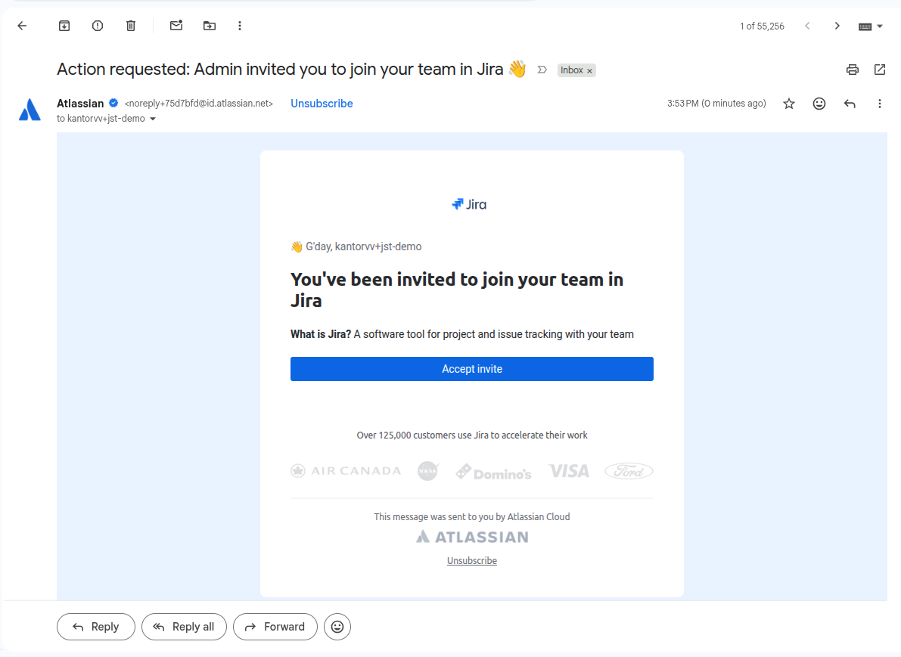

Repeat the steps below for **each** of them.

## Account setup

1. Open the invitation email and click **Accept invite**.

2. You're redirected to the email verification screen.

   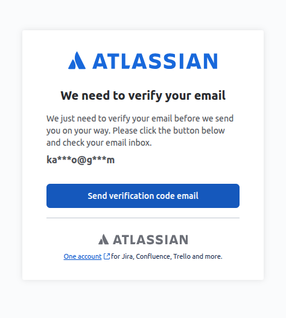

3. Go back to your mailbox, copy the verification code, and paste it into the
   verification field.

   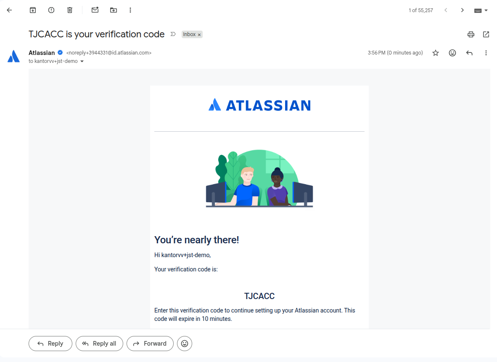

4. Fill in the name and password in the post-setup form. Make the **full name
   match the role**, e.g. `Jira Task Executor`, so the board shows which role
   did what.

   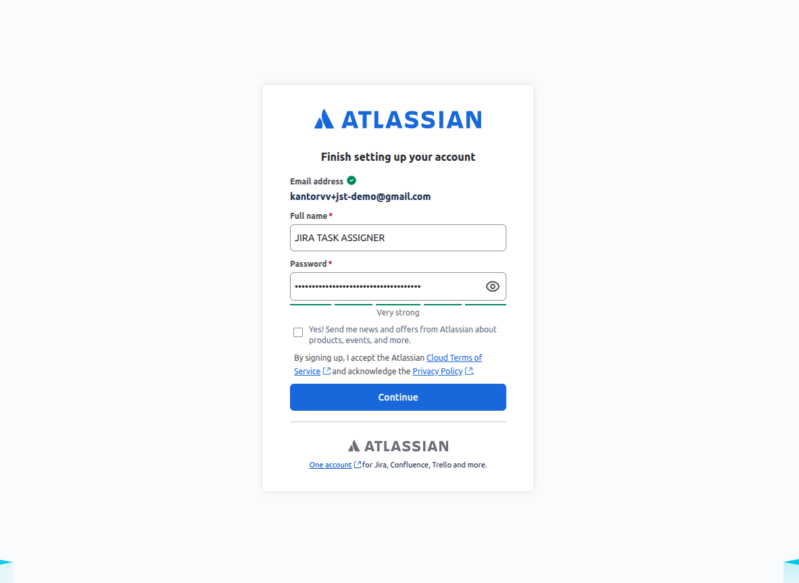

## Token setup

05. You might be redirected to an onboarding screen. It doesn't matter what you
    select there. Once you reach the boards list, open the token page:
    [id.atlassian.com/manage-profile/security/api-tokens](https://id.atlassian.com/manage-profile/security/api-tokens).

06. You land on an email verification screen.

    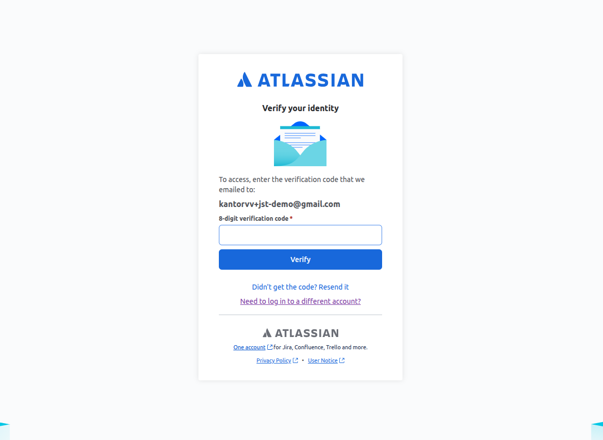

07. Go to your mailbox and copy the code into the verification field. You then
    reach the **API tokens** screen.

    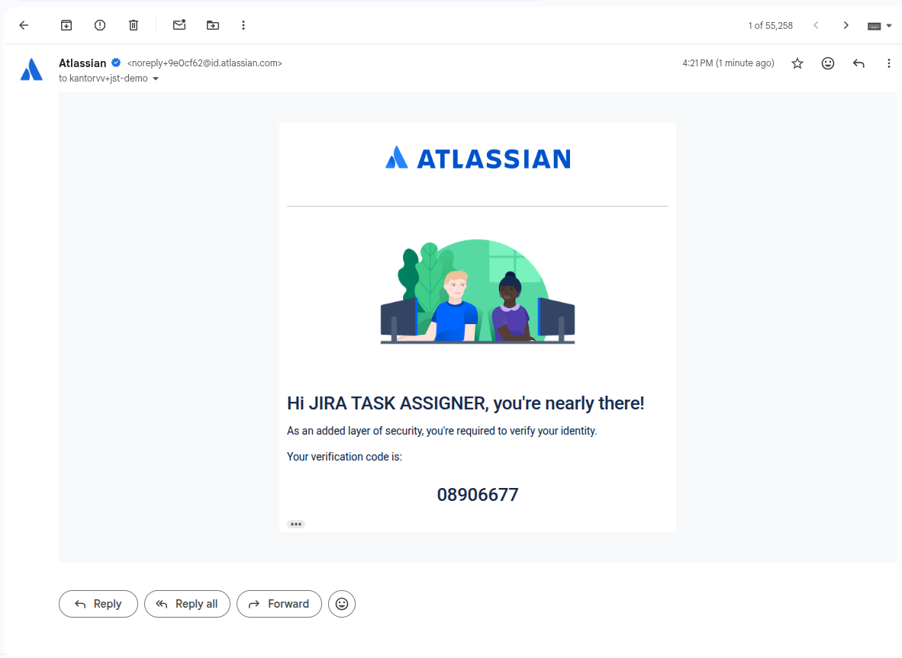

08. Click **Create API token with scopes**.

    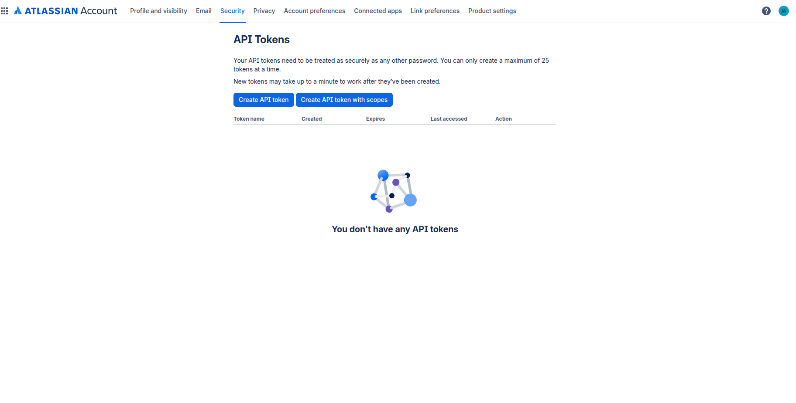

    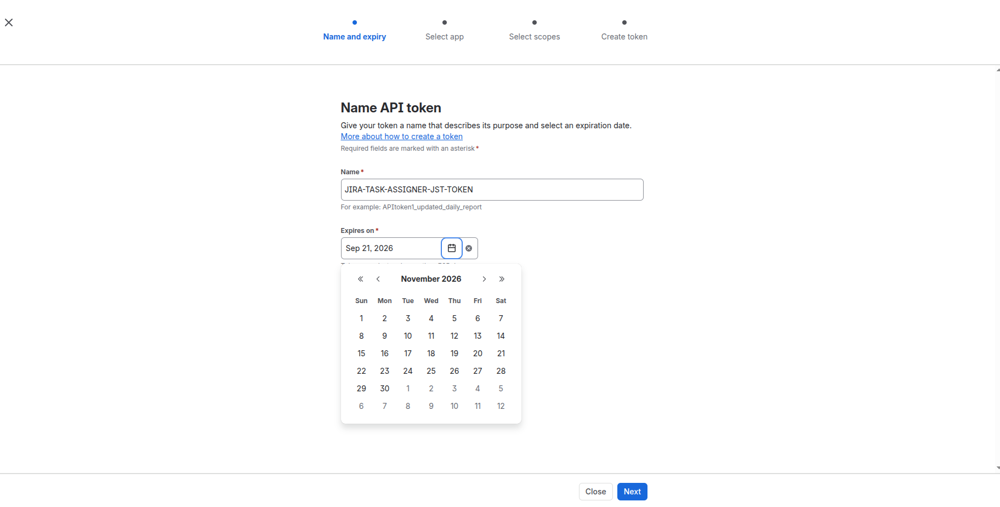

09. On the app selection screen, select **Jira** only.

    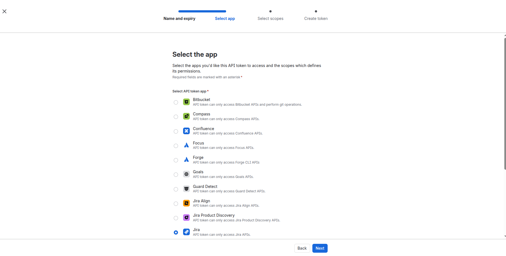

10. Set the scope type filter to **Classic**, then find and select each of the
    three permissions: `read:jira-user`, `read:jira-work` and `write:jira-work`.

    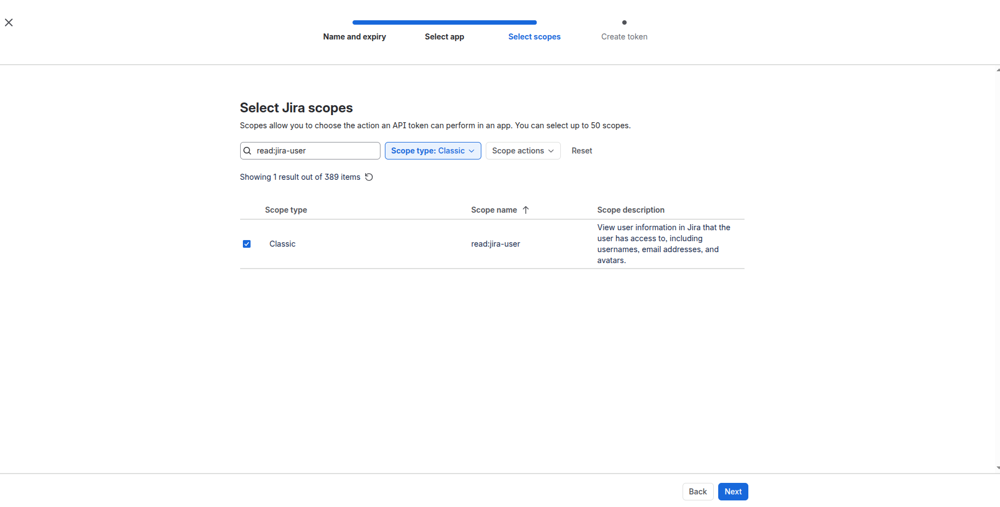

    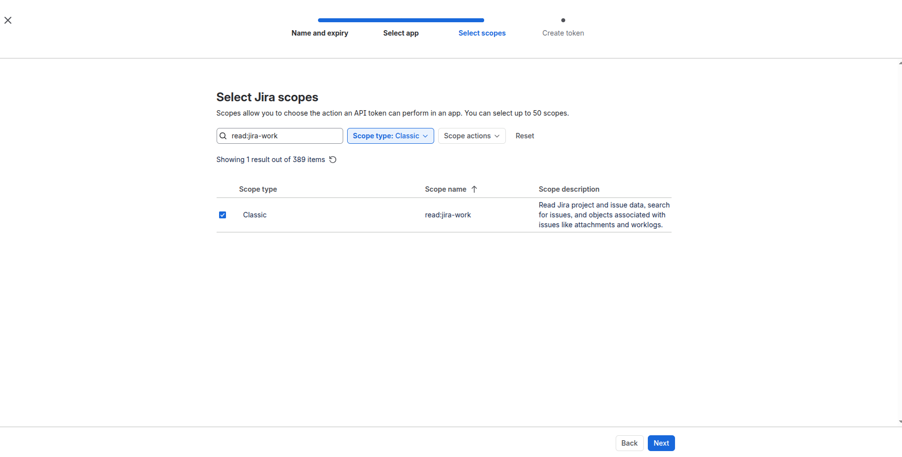

    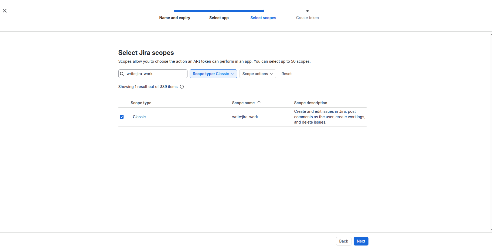

    With all three selected, the review screen looks like this. Click
    **Create token**.

    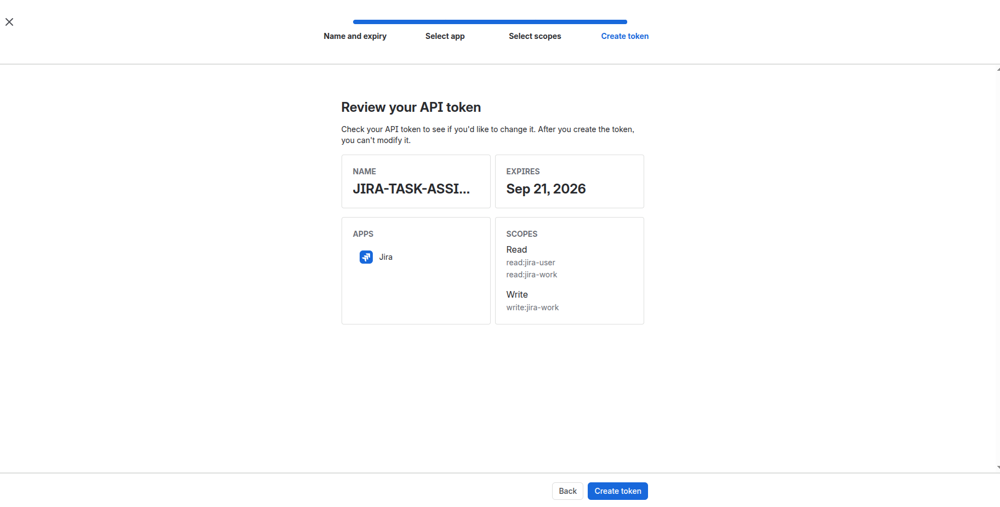

11. Copy the token and store it locally together with the user's email. Both go into
    `.jst/jira-sdlc-tools.local.env` (see
    [Fill `.jst/jira-sdlc-tools.local.env`](../software/fill-the-local-env.md)).
    Copy it now: Atlassian only shows it once.

    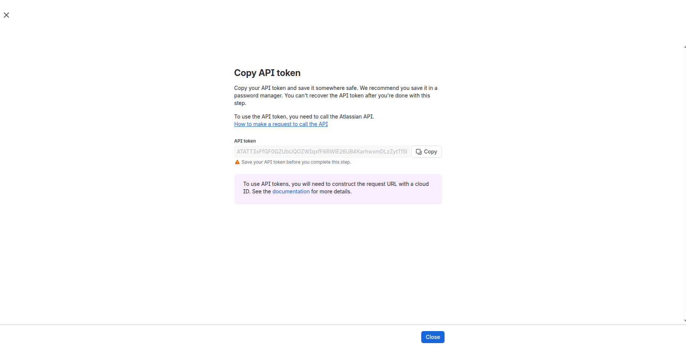

12. Confirm the token was created:

    1. Go to
       [id.atlassian.com/manage-profile/security/api-tokens](https://id.atlassian.com/manage-profile/security/api-tokens).

       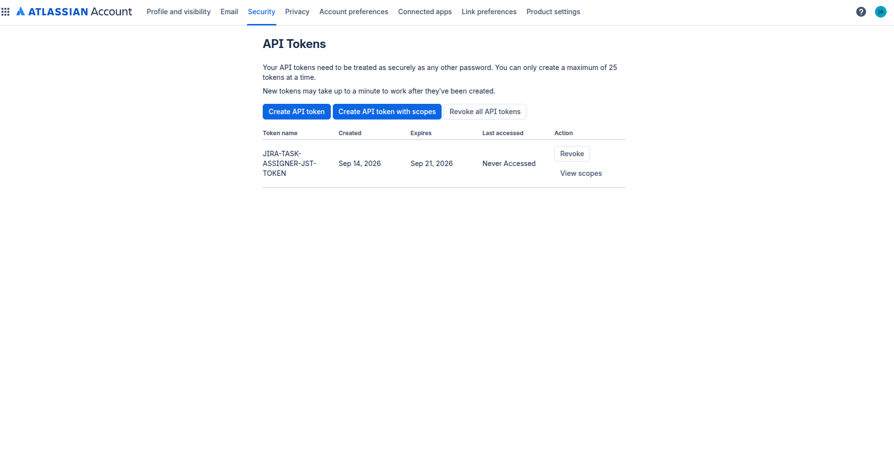

    2. Check that the token you just created is listed.

    3. Confirm it has all three required scopes: `read:jira-user`,
       `read:jira-work` and `write:jira-work`.

       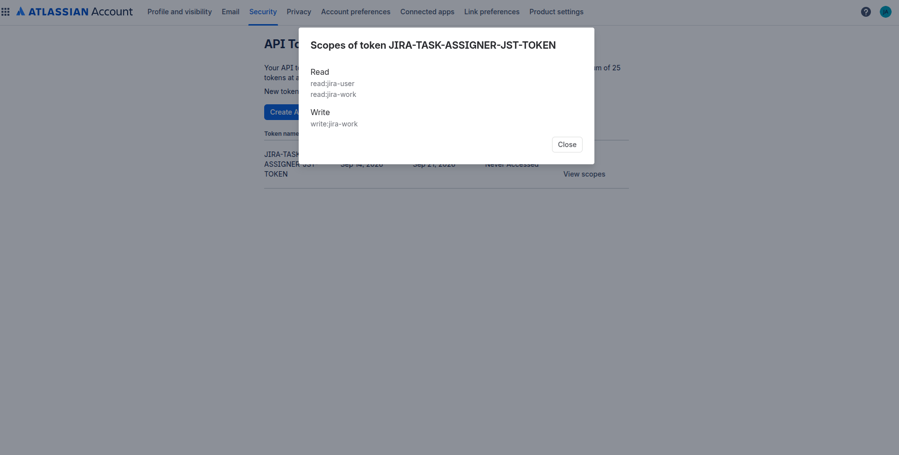
