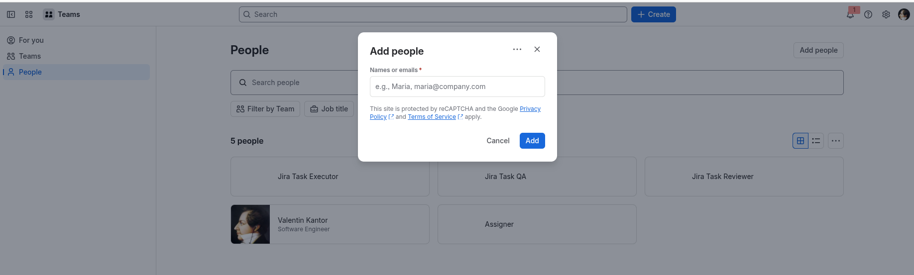
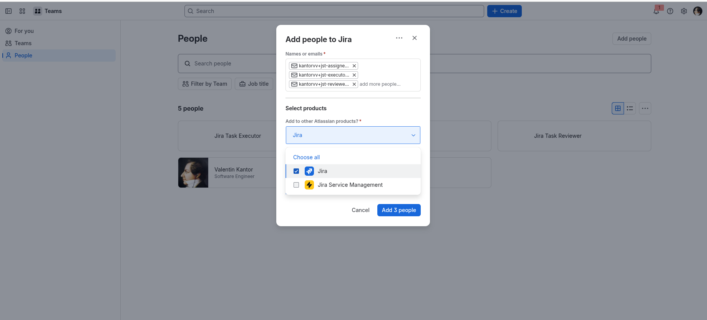

# Jira users and tokens

You can use one Jira account for all three roles, or separate accounts for
`assigner`, `executor`, and `reviewer`.

## Working with a single account (yours)

Create just **one** token for your own account. Then put that same email and
token into all three roles in `.jst/jira-sdlc-tools.local.env`:
`JIRA_ASSIGNER_*`, `JIRA_EXECUTOR_*` and `JIRA_REVIEWER_*` all get the same pair.
This is the quickest setup. The trade-off is that the board shows every
transition and comment as coming from you, not from a specific role.

## Multiple roles

Create **three additional users** in your Atlassian organization, one per role.
This fits the free tier, which allows up to 10 users per organization.

1. Go to **Teams → People → Add people**.

   

2. In **Names or emails**, enter all three addresses. They don't need three
   mailboxes: with Gmail, a `+` suffix delivers to your own inbox, so every
   role can point at your account:

   - `yourusername+jira-task-assigner@gmail.com`
   - `yourusername+jira-task-executor@gmail.com`
   - `yourusername+jira-task-reviewer@gmail.com`

   Each role still gets its own Atlassian user, while every invitation and
   notification arrives in one inbox.

3. Under **Select products**, choose **Jira**. In the **Jira space** dropdown,
   don't select anything.

4. Click **Add 3 people**.

   

5. Accept each invitation from your inbox. Then, signed in as that user, create
   its API token as described below. A token always belongs to the account that
   created it.

## API tokens

Create a **classic Jira API token** for each role you use. The required
permissions/scopes are:

- `read:jira-user`
- `read:jira-work`
- `write:jira-work`

The tokens are **per-role** and are sent as per-request Basic authentication;
there is no login session to share.

See [Creating Jira tokens](../../../process/SECURITY.md#jira).
