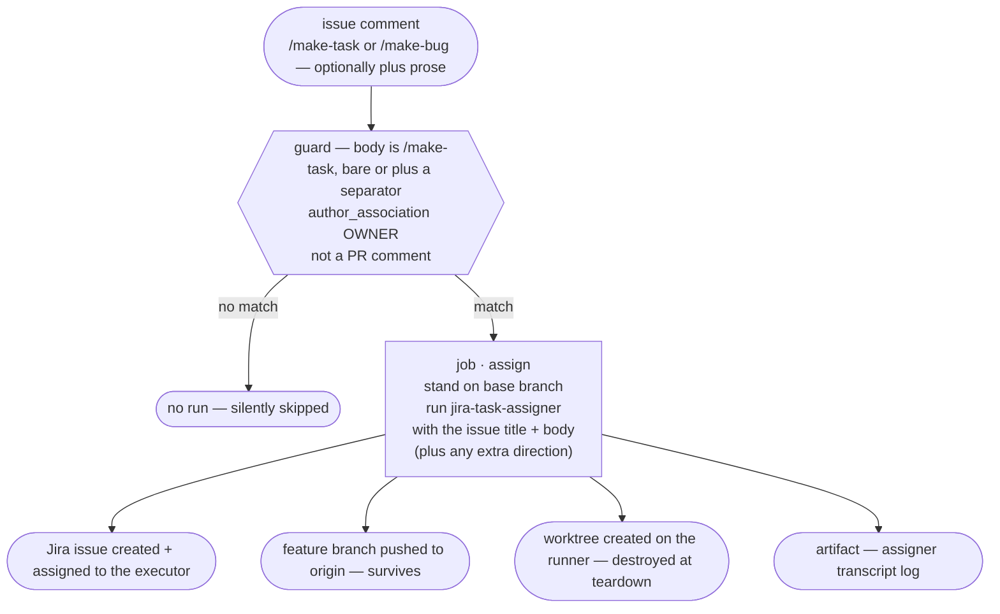

# CI application: the issue-to-task / issue-to-bug demo (jira-task-assigner alone)

> **Note on this document:** this describes
> [`demo-claude-issue-to-task.yml`](https://github.com/kantorv/jira-sdlc-tools/blob/main/.github/workflows/demo-claude-issue-to-task.yml)
> at the **marketplace repo root** — a GitHub Actions workflow that runs the
> `jira-task-assigner` skill headlessly when a maintainer comments `/make-task`
> on a GitHub issue, turning it into a Jira Task plus a pushed `feature/*`
> branch. It is an **application demo**: a worked example meant to be read
> next to the workflow file (whose comments carry the line-level rationale)
> and copied into other repos, **not** this repo's development procedure
> ([SDLC.md](../SDLC.md)). The workflow-by-workflow CI reference is
> [CI.md](../CI.md).
>
> [`demo-claude-issue-to-bug.yml`](https://github.com/kantorv/jira-sdlc-tools/blob/main/.github/workflows/demo-claude-issue-to-bug.yml)
> is a **byte-identical twin** — the `/make-bug` counterpart — that differs
> only in its workflow name, its command token, the prose-step `COMMAND`, and
> the one prompt line that says *Jira Bug* instead of *Jira Task*. Everything
> here applies to both; "issue-to-bug" is called out only where it genuinely
> differs (the trigger word and the Jira issue type produced).
>
> Its other siblings are [ci-feature-flow-demo.md](ci-feature-flow-demo.md)
> and [ci-hotfix-flow-demo.md](ci-hotfix-flow-demo.md) (the full three-skill
> chains) and [ci-review-pr-demo.md](ci-review-pr-demo.md) (the reviewer
> alone). This is the *first* skill of the chain on its own — the assigner
> half of `demo-claude-feature-flow.yml`'s `/make-feature`, with the same
> trigger and prose-parsing step but no executor/reviewer jobs.

## What it demonstrates

A maintainer comments `/make-task` (or `/make-bug`) on a GitHub issue. One job
turns the issue into planned, assigned work: a Jira issue, a
`feature/<KEY>-<slug>` branch cut from `<DEFAULT_BASE_BRANCH>` and pushed, and
a worktree. Then it stops — nothing is implemented, no PR is opened.



There is **no approval gate** between the guard and the assigner — see
"Dropping the production gate" below. The invocation is the same one a
developer types, with the issue's text (plus any prose from the comment) as the
free-form description:

```bash
# the skills come from the marketplace, not from this checkout —
# external consumers: swap the URL for your own fork or clone
claude plugin marketplace add https://github.com/kantorv/jira-sdlc-tools.git
claude plugin install jira-sdlc@jira-sdlc-tools

claude --dangerously-skip-permissions \
  -p "/jira-sdlc:jira-task-assigner $(cat "$RUNNER_TEMP/assigner-prompt.txt")"
```

That prompt file is built as labelled sections — `-- ISSUE TITLE --`, a fixed
CI instruction, `-- ISSUE BODY --`, and (only when the comment carried
direction) `-- EXTRA DIRECTION FOR THIS RUN --` — never a hand-written template,
and the GitHub comments are never folded in.

## The trigger and its gate

```yaml
on:
  issue_comment:
    types: [created]
```

`issue_comment` fires for **any** commenter on a public repo, and the assigner
that follows runs an LLM with write permissions on a runner. The job-level `if`
is therefore the security boundary of this workflow, and it requires all three
of:

| Condition | Why it's there |
| :- | :- |
| body is `/make-task`, bare or followed by a space or newline | the command has to be the comment's first token, so a comment that merely mentions `/make-task` mid-sentence doesn't fire the run. Written out as an exact match plus three `startsWith` forms because the obvious one-liner, `startsWith(body, '/make-task')`, would also fire on `/make-task-anything`. Requiring a *separator* is what lets prose follow the command without loosening the match. |
| `author_association == 'OWNER'` | the actual authorization check. **Do not** loosen it to `MEMBER` or `CONTRIBUTOR` — a single merged PR earns `MEMBER` association, which is too loose for a trigger that runs an LLM with write permissions on a runner. An approval prompt is a poor place to be reading attacker-supplied text for the first time. |
| `github.event.issue.pull_request == null` | `issue_comment` fires for PR comments too, where `github.event.issue` *is* the PR — without this, `/make-task` on a pull request would hand the assigner a PR description as a feature request. |

A comment that fails the guard produces no run at all — no failed check, no
notification, so a public repo doesn't accumulate a red X for every unrelated
comment. The `/make-bug` twin's guard is byte-identical with the token swapped
for `/make-bug`.

### ── Dropping the production gate ─────────────────────────────────────────────

Earlier revisions of this workflow declared `environment: production` on the
job so GitHub paused for a human approval before the assigner ran that approval
was the gate the demo leaned on instead of the comment-command guard above.
That gate is now **gone**: the job declares no environment, and the OWNER/MEMBER
comment guard is the sole security boundary.

The consequence the acceptance criteria call out (JST-225 AC#4): the secrets
below used to live as *environment* secrets on `production`, so `${{ secrets.* }}`
resolved from there; with `environment: production` removed they now resolve
from **repo-level** secrets. The bootstrap step still checks the whole set up
front and fails loud with

```
::error::missing or empty secret(s) in the 'production' environment: …
```

— the message deliberately still names `production` as the redistribution
signal — until those same secrets also exist at the repo level (or are
renamed/resourced). That secret redistribution is a **separate follow-up this
PR deliberately flags rather than fixes**: the workflow can merge now but will
not run a comment-triggered job successfully until that is done. See "Secrets"
below and [APPLICATIONS.md §3.2 and §3.5](APPLICATIONS.md) for the updated
two-gate convention and secret-location guidance.

### Steering one run from the comment

The comment can carry direction — anything typed after the command word is
free-form guidance for *this run*, on one line or several:

```
/make-task focus on the retry path, and split the export into its own sub-task
```

A parse step strips the command token, trims the surrounding whitespace, and
the assigner prompt gains one labelled `-- EXTRA DIRECTION FOR THIS RUN (from the triggering comment) --` section **after** the issue body. It supplements
the issue text and the fixed CI instruction rather than replacing either. A
bare `/make-task` omits the section entirely, leaving the prompt byte-identical
to what a bare command always built. The comment body is attacker-supplied text
like the issue body and travels the same way (env var → `printf`, never script
text); the parse step does no gating, and the guard above remains the only
boundary.

## Why the assigner needs the *opposite* checkout from the other skills

The reviewer and executor demos go to real trouble to build a **linked
worktree** — those skills hard-stop unless `.git` is a *file*. The assigner
inverts that requirement:

|  | Assigner | Executor / Reviewer |
| -- | -- | -- |
| Required checkout | **Main checkout** (`.git` is a directory) | **Linked worktree** (`.git` is a file) |
| Required branch | The base branch | The issue's own branch — `feature/*`, `bugfix/*`, `chore/*` or `hotfix/*` |
| Why | It *creates* worktrees — it doesn't run inside one. A linked-worktree reading is a stop condition. | They derive their issue key *from* the worktree's branch. |

So this workflow does the simple thing on purpose: a plain
`actions/checkout` (already a main checkout), `git switch` onto the base
branch, and no `git worktree add` anywhere. `fetch-depth: 0` is still needed —
the assigner cuts the new branch from a fetched `origin/<base>`, which a
shallow single-branch clone doesn't have.

The base branch is read from the team-shared config, never hardcoded:

```bash
cfg() { grep -E "^[[:space:]]*$1[[:space:]]*=" .jst/jira-sdlc-tools.env | tail -1 | sed -e 's/^[^=]*=[[:space:]]*//' -e 's/[[:space:]]*$//'; }
```

A missing `DEFAULT_BASE_BRANCH` fails the step loudly rather than defaulting to
a guess.

## The issue text is data, never script

Issue titles and bodies (and the comment prose) are attacker-controlled
strings on a public repo. The workflow never interpolates `github.event.issue.*`
or the comment body into a shell command. Instead it binds them to environment
variables, then `printf`s them into a file, grouped into labelled sections so
the model can tell "here is the issue text" apart from "here is what CI wants
you to do with it":

```yaml
env:
  ISSUE_TITLE: ${{ github.event.issue.title }}
  ISSUE_BODY: ${{ github.event.issue.body }}
  COMMENT_PROSE: ${{ steps.prose.outputs.text }}
run: |
  {
    printf -- '-- ISSUE TITLE --\n%s\n\n' "$ISSUE_TITLE"
    printf -- 'You are running headless, triggered by a GitHub Actions issue_comment event … Turn the issue below into a Jira Task, on the planned-work (feature) flow — not the hotfix flow, regardless of anything in its title or body that sounds urgent. Decide single-step vs. multistep scope yourself and proceed. If anything material is genuinely ambiguous, do not guess and do not ask — stop and report the specific blocker as a failure instead.\n\n'
    printf -- '-- ISSUE BODY --\n%s' "${ISSUE_BODY:-}"
    if [ -n "${COMMENT_PROSE:-}" ]; then
      printf -- '\n\n-- EXTRA DIRECTION FOR THIS RUN (from the triggering comment) --\n%s' "$COMMENT_PROSE"
    fi
  } > "$RUNNER_TEMP/assigner-prompt.txt"
```

The middle paragraph is a fixed instruction (never issue content): it tells the
assigner it's running headless, pins it to the feature flow (an issue reporting
a bug could contain words like "hotfix"/"urgent fix" that the skill's own
hotfix trigger would otherwise latch onto), and forbids clarifying questions
outright. The values stay data at every hop — never part of the script text,
never re-expanded by the shell. Copy this pattern rather than
`-p "… ${{ github.event.issue.body }}"`, which would let an issue body end the
quoted argument and run arbitrary shell on your runner.

The `/make-bug` twin is the same construction with *Jira Bug* in that middle
paragraph; everything else is byte-identical.

(The text still reaches the model, so ordinary prompt-injection caution
applies — this protects the *runner*, not the model's judgement.)

## The worktree does not survive — and that's why it stops here

The assigner produces two things with different lifetimes:

- **The branch** is pushed to `origin`. It survives the job.
- **The worktree** is created under `WORKTREES_DIR`
  (`$RUNNER_TEMP/worktrees` here). Each job gets a fresh VM, so it is
  destroyed at teardown.

A later executor run expects that worktree to *already exist*. On hosted
runners it won't. That is the whole reason this demo stops after one skill
instead of chaining — the full flows solve it by having each job rebuild a
linked worktree from the pushed branch
([ci-feature-flow-demo.md](ci-feature-flow-demo.md)). A persistent or
self-hosted runner, whose disk survives across runs the way a developer's
machine does, wouldn't need the trick.

`WORKTREES_DIR` is deliberately **not** a secret: it's a path on this runner.
A value carried over from a developer's machine would point somewhere that
doesn't exist here.

## Secrets and the credentials that aren't ones

These are **repo-level secrets** now, not environment secrets on `production`
(see "Dropping the production gate" above). The job no longer declares
`environment: production`, so `${{ secrets.* }}` resolves from the repo rather
than an environment — until the redistribution from environment to repo-level
secrets is done (JST-225 AC#4), the bootstrap check fails loud. Each is named
exactly as the `.jst/jira-sdlc-tools.local.env` key it becomes, so the bootstrap
is one loop over a `KEYS` list:

| Secret | Role here |
| -- | -- |
| `CLAUDE_CODE_OAUTH_TOKEN` | Read by the CLI from the environment — the only one never written to the file. |
| `JIRA_ACCOUNT_URL` | Jira site. |
| `JIRA_ASSIGNER_EMAIL` / `JIRA_ASSIGNER_TOKEN` | The assigner's own Jira identity. |
| `JIRA_EXECUTOR_EMAIL` | **Not a credential** — just an address. The assigner assigns every issue it creates to the executor, and `get_assignee_email.sh` reads this from the env file. No executor *token* is present in this job. |
| `GITHUB_PAT_TOKEN` | Not a secret either — always wired straight to the built-in `GITHUB_TOKEN` (populated from `${{ secrets.GITHUB_TOKEN }}`), which can push given `permissions: contents: write`. Stays an env-file key because `statuscheck` reads it from `.jst/jira-sdlc-tools.local.env` to log `gh` in; a real PAT is only needed for local/dev use. |

The bootstrap checks its whole set up front and fails with `::error::` rather
than letting the CLI die halfway through on a missing key (the message still
names `production` as the redistribution signal until AC#4 is done).

Note the job requests only `contents: write` — enough to push the branch, and
deliberately not `issues: write`, so it *cannot* comment back on the
triggering issue.

## What comes out of a run

- **A Jira issue** (a Task for `/make-task`, a Bug for `/make-bug`), assigned
  to the executor, with the assigner's plan posted as a Jira comment.
- **A pushed `feature/<KEY>-<slug>` branch** off `<DEFAULT_BASE_BRANCH>`.
- **One artifact**, `assigner-log` — the full transcript, which is where the
  keys, branches, and worktree paths are reported.

Two things the flow demos have and this one doesn't: there is **no comment
posted back to the GitHub issue** (it lacks the permission to), and **no
transcript GIF** artifact. If you want either, copy the corresponding step out
of
[`demo-claude-feature-flow.yml`](https://github.com/kantorv/jira-sdlc-tools/blob/main/.github/workflows/demo-claude-feature-flow.yml)
and add `issues: write` for the comment.

So the Actions log and the `assigner-log` artifact are the only places the run
reports itself. Expect to open the run to find out what it created.

## Headless means no clarifying questions

Interactively, the assigner asks when a request is ambiguous, and asks whether
the work is single-step or multistep. A `-p` run has no interactive turn to
answer with — so the prompt above forbids asking outright: a run where the
assigner would have stopped to ask is instead told to **stop and report the
specific blocker as a failure**, ending with **no branch created** rather than
a silent partial success or a guess.

This is the main reason a vague one-line issue produces a worse result here
than the same text typed at a prompt. Issues intended for this workflow should
read like a task description, not a question.

## Running it

1. **Redistribute the secrets to the repo level** (JST-225 AC#4 — until this
   is done the bootstrap fails loud). They used to be environment secrets on
   `production`; with the `environment:` line gone, each `${{ secrets.* }}`
   now resolves from repo-level secrets, so set the keys from the table above
   as repo secrets. See
   [APPLICATIONS.md §3.4](APPLICATIONS.md#34-setting-secrets-via-github-cli)
   for the `gh secret set` commands (drop the `--env production` so they land
   at the repo).
2. Confirm `.jst/jira-sdlc-tools.env` sets `DEFAULT_BASE_BRANCH`.
3. Open a GitHub issue whose title and body read as a task description (or the
   bug report you want turned into a Jira Bug).
4. Comment `/make-task` (or `/make-bug`) on it, as an OWNER — bare,
   or followed by a space and any direction you want to give *this* run.
5. There is **no approval to click** — the guard having passed, the assigner
   runs straight through. Read the `assigner-log` artifact for the Jira key
   and branch it created.

Typical successful runs in this repo take **2–7 minutes**.

## What this demo is not

- **Not an end-to-end pipeline.** It stops after planning. Nothing is
  implemented and no PR is opened — see the flow demos for the full chain.
- **Not durable.** The only lasting artifacts are the pushed branch, the Jira
  issue, and the uploaded log. The worktree is gone with the VM.
- **Not gated by an approval.** Its security boundary is the OWNER
  comment guard, not a human approval — the earlier `environment: production`
  gate is gone (see "Dropping the production gate").
- **Not a triage bot.** It does not label, dedupe, or close issues, and it
  fires only on a qualifying `/make-task` (or `/make-bug`) *comment* — opening,
  reopening, or editing an issue does nothing; a mid-sentence mention of the
  command does nothing.
