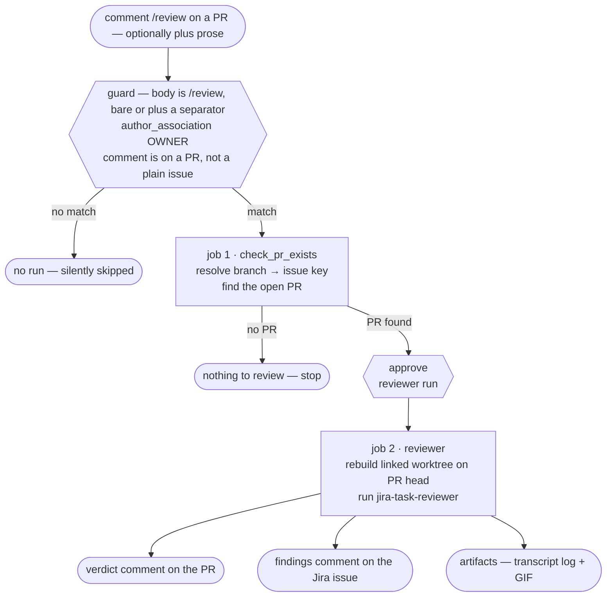

# CI application: the review-a-PR demo (jira-task-reviewer alone)

> **Note on this document:** this describes the **review-a-PR** scenario — the
> `jira-task-reviewer` skill run headlessly in CI against a PR that already
> exists. Unlike its siblings it is not one file: two workflows at the
> marketplace repo root implement it on different model backends
> ([`demo-claude-reviewer.yml`](https://github.com/kantorv/jira-sdlc-tools/blob/main/.github/workflows/demo-claude-reviewer.yml)
> and
> [`demo-fcc-nvidia-nim-reviewer.yml`](https://github.com/kantorv/jira-sdlc-tools/blob/main/.github/workflows/demo-fcc-nvidia-nim-reviewer.yml)).
> Despite its filename,
> [`demo-kimi-openrouter-reviewer.yml`](https://github.com/kantorv/jira-sdlc-tools/blob/main/.github/workflows/demo-kimi-openrouter-reviewer.yml)
> is **not** one of them — it invokes no skill and belongs to the smoke-test
> scenario ([APPLICATIONS.md §2c](APPLICATIONS.md#2c-the-same-demos-by-scenario)).
> It is an **application demo**: a worked example meant to be read next to the
> workflow files and copied into other repos, **not** this repo's development
> procedure ([SDLC.md](../process/SDLC.md)). The workflow-by-workflow CI reference is
> [CI.md](../process/CI.md).
>
> Its siblings are [ci-feature-flow-demo.md](ci-feature-flow-demo.md) and
> [ci-hotfix-flow-demo.md](ci-hotfix-flow-demo.md) — the full three-skill
> chains. This one is the single-skill case: no assigner, no executor, no Jira
> issue created. Everything about runner-vs-developer-machine worktree
> rebuilding is explained in those two in the same words.

## The gate reads the PR, not the ref — a trap worth knowing

This workflow was `workflow_dispatch`-only until JST-204 switched it to a
`/review` comment. Its gating job read the branch from `github.ref_name`, which
was correct under dispatch — there `ref_name` *is* the branch you dispatched
from — but on an `issue_comment` event `github.ref_name` is always the
repository's **default branch**, never the PR head. Every `/review` run
therefore died in ~6 seconds with:

```
##[error]Branch name 'development' does not match required format: feature/PROJ-NNN-slug or hotfix/PROJ-NNN-slug
```

The gate now takes the PR from the event instead of the ref. Under
`issue_comment` on a PR, `github.event.issue.number` **is** the PR number:

```bash
PR_JSON=$(gh pr view "$PR_NUMBER" --repo "$REPO_NAME" --json headRefName,state)
BRANCH_NAME=$(printf '%s' "$PR_JSON" | jq -r '.headRefName')
```

Keep this in mind if you copy the gate anywhere: **a workflow's ref and the
branch it is meant to act on are the same thing only under
`workflow_dispatch` and `push`.** For `issue_comment`, `issues`, and
`schedule`, the ref is the default branch and the target must be read from the
event payload.

## What it demonstrates

A PR already exists — opened by a human, or by the executor job of one of the
flow demos. Someone asks for a review, and a single job reviews it: no issue
is created, no code is written, nothing is merged.



Two jobs, not three. The reviewer skill supplies its own instructions — the
workflow's only job is to stand up the exact environment the skill's
healthcheck demands, then invoke it bare:

```bash
# the skills come from the marketplace, not from either checkout —
# external consumers: swap the URL for your own fork or clone
claude plugin marketplace add https://github.com/kantorv/jira-sdlc-tools.git
claude plugin install jira-sdlc@jira-sdlc-tools

claude --dangerously-skip-permissions \
  --model "$DEFAULT_REVIEWER_MODEL" \
  -p "/jira-sdlc:jira-task-reviewer"
```

No issue-key argument. The skill derives the issue from the branch of the
worktree it is standing in — which is why the worktree, not the prompt, is
what this workflow spends its effort building.

What the prompt *can* carry is the prose from the triggering comment, appended
as the skill's argument — see *Steering the review from the comment* below.

## The trigger and its gate

The intended trigger is a comment. The guard has three clauses, all necessary:

| Clause | Why |
| -- | -- |
| `github.event.issue.pull_request` | `issue_comment` fires for plain issues too. This is what restricts it to PR comments. |
| body is `/review`, bare or followed by a space or newline | The command, which must be the comment's first token. Written out as an exact match plus three `startsWith` forms rather than the bare `startsWith(body, '/review')` this used to be — that one also fired on `/reviewer-anything`. Requiring a *separator* is what lets prose follow the command without loosening the match. |
| `author_association == 'OWNER'` | The security boundary. `issue_comment` fires for *any* commenter on a public repo; without this, a stranger's comment would spend your tokens and your Jira credentials. `MEMBER` is **not** accepted — a single merged PR earns `MEMBER` association, which is too loose. |

The trigger word differs per backend so that one comment can't start two
workflows on a repo where both are installed: `/review` for the Claude
implementation, `/fcc-review` for the FCC + NVIDIA NIM one.

### Steering the review from the comment

Anything typed after the command is free-form direction for *this* review:

```
/review focus on the error paths — the happy path was reviewed last week
```

It also works across lines:

```
/review
Focus on the error paths.
Skip the docs churn; it was reviewed in the last PR.
```

A parse step strips the command token, trims the surrounding whitespace, and
passes the remainder to the skill as its argument, which `jira-task-reviewer`
documents as free-form notes about the run (focus areas, constraints,
context):

```bash
-p "/jira-sdlc:jira-task-reviewer Focus on the error paths. …"
```

A bare `/review` produces the bare invocation shown earlier, byte for byte —
the fallback isn't an empty argument, it's the same command line this demo has
always run. The prose is direction, not an override: the skill still derives
the issue from the worktree's branch, still reviews the whole diff, and still
posts its verdict to GitHub and Jira.

Comment bodies are attacker-supplied text, so the body reaches the shell only
as an env var and is assembled with `printf` — never interpolated into the
script. The parse step does no gating; the guard above is still the only thing
between a commenter and the run, which is also why it stays entirely inside the
job-level `if:`.

Then `check_pr_exists` validates the branch name against
`^(feature|hotfix)/[A-Z][A-Z0-9_]+-[0-9]+-`, extracts the issue key from it,
and looks for an open PR on that branch. If there is no PR, the reviewer job
is skipped rather than failed — there is simply nothing to review.

## The `environment: production` gate

The reviewer job declares `environment: production`. That always scopes which
secrets it can read, and — if the environment has **Required reviewers**
enabled — makes GitHub pause for a human before it starts. There is only one
skill here, so there is at most one gate: the point at which you can eyeball
the diff before the review spends tokens on it. With Required reviewers left
unchecked the job runs unattended, still correctly scoped to the environment's
secrets. See [APPLICATIONS.md §3.1–3.2](APPLICATIONS.md) for the full
two-gate convention. Setup is
[APPLICATIONS.md §3](APPLICATIONS.md#3-production-environment-settings).

The gating job runs *before* the environment gate, deliberately: resolving the
branch and confirming a PR exists is cheap and needs no secrets, so a comment
on a PR that doesn't qualify is rejected without ever asking a human to
approve anything.

## The one constraint that shapes the whole job

**The reviewer skill hard-stops unless it runs in a linked worktree** (`.git`
is a *file*) on a `feature/*` or `hotfix/*` branch. A bare `actions/checkout`
produces a *main checkout* (`.git` is a *directory*), which fails the
`worktree` row of the skill's healthcheck before any review happens.

So the job keeps two checkouts at once:

1. **The main checkout**, from `actions/checkout` with `fetch-depth: 0`,
   switched to the PR's **base** branch. Standing on the base rather than the
   head is what lets the worktree below exist at all — git refuses to check
   the same branch out twice.
2. **A linked worktree** on the PR's **head** branch, rebuilt under
   `$RUNNER_TEMP/worktrees/worktree-<KEY>`. This is where the skill actually
   runs.

```bash
git fetch origin "+refs/heads/$HEAD:refs/remotes/origin/$HEAD"
git worktree add --track -B "$HEAD" "$WT" "origin/$HEAD"
git config "branch.$HEAD.parentbranch" "$BASE"
```

That last line matters more than it looks. `parentbranch` is machine-local git
config, so it never survives into CI — and it is the *first* source the
reviewer's PR-base resolver consults, ahead of the assigner's durable
"PR target branch:" Jira comment. Re-setting it to the PR's real base gets the
right answer on the first source instead of falling through to a default, and
it is correct for both shapes: a sub-task PR (base = the parent branch) and a
single-step PR (base = `<DEFAULT_BASE_BRANCH>`).

Head and base come from the PR itself (`gh pr view --json headRefName,baseRefName`), not from the ref the run started on — this workflow
has no upstream assigner job to hand them forward.

## Three caveats worth knowing before copying this

1. **Don't export `GH_TOKEN`/`GITHUB_TOKEN` into the step that runs the
   skill.** Every skill starts with statuscheck, which reads
   `GITHUB_PAT_TOKEN` out of the env *file* and runs `gh auth logout && gh auth login --with-token`; `gh` refuses that login while either variable is
   set in the environment. The skill step exports only the model credential;
   the one step that needs `GH_TOKEN` (resolving head/base) sets it before the
   skill runs, never alongside it.
2. **The skills come from the marketplace, not from either checkout.** The
   job runs `claude plugin marketplace add` + `claude plugin install`, which
   clones the plugin repo's **default** branch. If a PR changes a skill file,
   this demo reviews that PR with the *marketplace's* copy — land skill
   changes on the plugin repo's default branch if you want them exercised
   here.
3. **Self-review.** The executor opens PRs with the same `gh` account this
   reviewer logs in as, and GitHub blocks approving your own PR — which is why
   the skill records its verdict as a PR **comment** prefixed
   `APPROVED — …` / `CHANGES REQUESTED — …` rather than a formal approval.

## The two implementations

Both share the `check_pr_exists` gate byte-for-byte, and both invoke the skill
identically. They differ only in what drives the model.

|  | `demo-claude-reviewer.yml` | `demo-fcc-nvidia-nim-reviewer.yml` |
| -- | -- | -- |
| **Trigger** | `/review` comment, bare or plus prose | `/fcc-review` comment, bare or plus prose |
| **Model backend** | Claude CLI, pinned `2.1.220`, default model `sonnet` | Same CLI, pointed at a local FCC proxy (`ANTHROPIC_BASE_URL=http://127.0.0.1:8082`) that fronts NVIDIA NIM; default `z-ai/glm-5.2` |
| **Credential** | `CLAUDE_CODE_OAUTH_TOKEN` | `NVIDIA_NIM_API_KEY` |
| **Skill step timeout** | 25 min | 60 min |
| **Environment gate** | `production` | `production` |
| **Worktree** | Linked, on PR head | Linked, on PR head |

The FCC variant is the same job with three steps inserted (`Install uv` →
`Install FCC server only` → `Start fcc-server (background)`) and the model
credential swapped. Everything downstream is identical, which is the point:
the skill doesn't know what's behind `ANTHROPIC_BASE_URL`.

### Why `demo-kimi-openrouter-reviewer.yml` isn't a third one

Its filename says reviewer, but it **never invokes `jira-task-reviewer`**. It
is the pre-skill baseline the Claude demo replaced: it installs Kimi Code,
writes a `~/.kimi-code/config.toml` pointing `extra_skill_dirs` at this
plugin's `skills/`, then reviews with a hand-written prompt fed `gh pr diff`
and posts the result via `gh pr review --comment`. It writes nothing to Jira,
builds no worktree, and has no environment gate.

That makes it a **smoke test**, not a review implementation — it proves a
backend installs, authenticates, sees the skills, and returns a completion,
which is the rung below any of these flows. It has its own scenario row in
[APPLICATIONS.md §2c](APPLICATIONS.md#2c-the-same-demos-by-scenario). Reach
for it when a real run fails on a new client and you need to know whether the
assistant is even answering before you go hunting in the skills.

> The header comment inside `demo-kimi-openrouter-reviewer.yml` claims it
> "posts no review to Jira or GitHub". That is stale — the Jira half is right,
> the GitHub half is not; the `Post review` step does post. The same file's
> sibling headers describe a `workflow_dispatch`-only trigger that two of the
> three no longer have.

## What comes out of a run

- **A verdict comment on the PR**, prefixed `APPROVED — …` or
  `CHANGES REQUESTED — …`.
- **A findings comment on the Jira issue**, and on a rejection the skill
  transitions the issue back to `<STATUS_IN_PROGRESS>` — the transition, not
  the comment, is the actual workflow gate.
- **Two artifacts**: `reviewer-log` (the full transcript) and
  `reviewer-transcript-gif` (the session replayed as an animated GIF via
  `agent-log-gif`, `continue-on-error` so it never reddens a green run).

Unlike the feature and hotfix flow demos, **no workflow-side comment is posted
back to the triggering issue.** The skill owns everything that gets written;
the workflow only uploads artifacts. If you want the transcript echoed onto
the issue, copy that step out of
[`demo-claude-feature-flow.yml`](https://github.com/kantorv/jira-sdlc-tools/blob/main/.github/workflows/demo-claude-feature-flow.yml).

Nothing is ever merged. That stays a human act.

## Running it

1. Ensure the `production` environment exists with the reviewer secrets —
   `JIRA_ACCOUNT_URL`, `JIRA_REVIEWER_EMAIL`, `JIRA_REVIEWER_TOKEN`,
   `CLAUDE_CODE_OAUTH_TOKEN` (or `NVIDIA_NIM_API_KEY` for the FCC variant).
   See [APPLICATIONS.md §3.4](APPLICATIONS.md#34-setting-secrets-via-github-cli).
2. Open a PR from a `feature/<KEY>-…` or `hotfix/<KEY>-…` branch.
3. Comment `/review` on it (`/fcc-review` for the FCC variant) as an OWNER or
   OWNER of the repo — bare, or followed by a space or newline and whatever
   you want this review to focus on (see *Steering the review from the
   comment*).
4. Approve the `production` gate if GitHub pauses (it will only pause when the
   environment has Required reviewers enabled).

A comment on a PR whose head isn't an issue branch fails the gate by design —
the reviewer derives its issue key from that branch name. A comment on a
closed or merged PR is a no-op rather than a failure.

> `demo-claude-reviewer.yml` still carries a commented-out `workflow_dispatch:`
> block with a model input, left from before JST-204. It is inert — the gate
> now reads `github.event.issue.number`, which a dispatch run wouldn't set, so
> re-enabling it would need the gate taught to handle both event shapes.

## What this demo is not

- **Not a required status check.** It runs on request, not on every push, and
  its verdict is a comment — nothing blocks a merge.
- **Not a merge step.** The reviewer never merges, and this workflow adds no
  merge of its own.
- **Not a full-flow demo.** No issue is created and no code is written; it
  reviews what is already there. For the three-skill chain see
  [ci-feature-flow-demo.md](ci-feature-flow-demo.md).
- **Not a replacement for `/code-review` or this repo's own `validator.yml`.**
  It demonstrates the *skill* running in CI, against a Jira-tracked issue
  branch.
