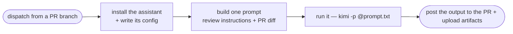

# CI application: the smoke-test demo (a plain prompt, no skill)

> **Note on this document:** this describes
> [`demo-kimi-openrouter-reviewer.yml`](https://github.com/kantorv/jira-sdlc-tools/blob/main/.github/workflows/demo-kimi-openrouter-reviewer.yml)
> at the marketplace repo root. Despite the filename it is **not** a reviewer
> demo — it never invokes a skill. Its siblings are the four skill-running
> demos, indexed in [APPLICATIONS.md §2c](APPLICATIONS.md#2c-the-same-demos-by-scenario).

## What it is

The simplest thing in this repo: **install a coding assistant on a runner,
hand it one prompt, and check that something came back.**

That's the whole demo. No skill is invoked, no Jira issue is touched, no
worktree is built. The prompt happens to be a code-review prompt with a PR
diff pasted into it, but that's incidental — it could be any prompt. What's
being tested is the *plumbing*, not the review.



## Why you'd run it

As the rung below every other demo. When a real flow fails on a backend you
haven't used here before, this answers the first question — *is the assistant
even installed, authenticated, and returning completions in CI?* — before you
go looking for a bug in the skills.

It also confirms the assistant can **find** the skills: its config points
`extra_skill_dirs` at this plugin's `skills/` directory. Discoverable is not
the same as invoked; the run proves the path resolves, nothing more.

## What the job actually does

1. **Resolve and cache the CLI** — fetch the latest Kimi Code version, cache
   `~/.kimi-code` keyed on it, install only on a cache miss.

2. **Write `~/.kimi-code/config.toml`** — the model to use, the OpenRouter
   provider and API key, and `extra_skill_dirs` pointing at
   `plugins/jira-sdlc/skills`.

3. **Build one prompt file** — a hand-written review instruction block, then
   the PR's diff from `gh pr diff` appended between markers.

4. **Run it, once:**

   ```bash
   kimi -p @/tmp/full-prompt.txt
   ```

   The prompt tells the model to write its answer to `/tmp/report.md`, and the
   step fails loudly if that file comes back empty — which is the actual
   assertion this smoke test makes.

5. **Post and upload** — `gh pr review --comment --body-file /tmp/report.md`,
   plus the report and the Kimi session directory as artifacts.

## Trigger and inputs

Manual `workflow_dispatch` only, with a `model` choice input (two free
Nemotron models on OpenRouter). Dispatch it **from a `feature/<KEY>-…` or
`hotfix/<KEY>-…` branch that has an open PR** — the gating job reads the
branch you dispatched from, validates its shape, and skips if no PR is open.

That gate reads `github.ref_name`, which is correct here precisely *because*
the trigger is `workflow_dispatch`. The two skill-based reviewer demos copied
this gate and then switched to a comment trigger, which broke them until the
gate was changed to read the PR from the event instead — the trap is worth
understanding before copying this file
([ci-review-pr-demo.md](ci-review-pr-demo.md)).

## Secrets

Two, both repo-level:

| Secret | For |
| -- | -- |
| `OPENROUTER_API_KEY` | The model backend. The step fails up front if it's empty. |
| `GITHUB_TOKEN` | Built in. Reads the diff, posts the comment. |

No Jira credentials — it writes nothing to Jira. **No `environment:` gate**
(see [APPLICATIONS.md §3.1–3.2](APPLICATIONS.md)), so it never pauses for
approval and reads no environment secrets. It's the one demo where that's
fine: it has no credentials worth gating and creates nothing.

## Adapting it to another assistant

The shape is what's reusable — install, configure, one prompt, assert output:

- Swap the install step and the config file for your client's equivalents.
- Keep `extra_skill_dirs` (or the equivalent) pointed at
  `plugins/jira-sdlc/skills` if you want the discovery check too.
- Keep the non-empty-output assertion. Without it the job goes green when the
  model returns nothing, which defeats the purpose.

Once that passes, move up to a real scenario — start with
[ci-review-pr-demo.md](ci-review-pr-demo.md), which is the same PR-review
job done properly through the skill.

## What this demo is not

- **Not a reviewer.** Its filename says otherwise, but it never runs
  `jira-task-reviewer`. Its review quality is whatever one hand-written prompt
  gets you, with no Jira write-back and no verdict semantics.
- **Not a skill test.** Discovering the skills directory is not running a
  skill.
- **Not gated.** No environment, no approval, no author check beyond needing
  dispatch permission.
