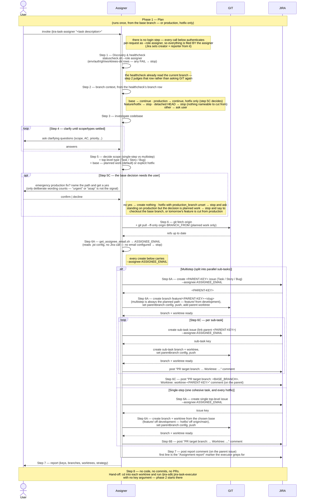

# Task Lifecycle — Phase 1: Plan

Phase 1 of the task lifecycle, run by the **`jira-task-assigner`** skill.
Triggered once per task, **invoked from the default base branch** (or from
the production branch, which is accepted only for an emergency hotfix) — the
assigner refuses to run on an existing `feature/`/`hotfix/` issue branch or
from a detached HEAD (which gives the new branches nothing nameable to be
cut from), and asks the user how to proceed on any other branch.

This phase ends when the assigner reports back: issues exist, branches
and worktrees are ready, a `"PR target branch: ... Worktree: ..."`
comment is posted on every leaf issue (plus one more on the parent
issue itself in the multistep case) for the next phase to read, and
the report itself is posted as a Jira comment on the parent issue in
addition to the chat reply.

The diagram surfaces the two systems the assigner actually drives as
their own swimlanes — **GIT** (anything that mutates repo state:
the pre-branch fetch/pull, creating branches, setting
`parentbranch` config, pushing, adding worktrees) and **JIRA**
(anything that mutates issue state: creating the top-level or sub-task
issue, posting comments) — so the full interaction reads
`User ↔ Assigner ↔ GIT ↔ JIRA` left to right. The healthcheck and
`get_assignee_email.sh` are drawn as self-calls because they **gather facts
rather than mutate** either system — not because they stay local.
`get_assignee_email.sh` genuinely only reads `.jst/` config, but the
healthcheck also *probes* both credentials over the network
(`GET /myself` for Jira, `GET /repos/…` for GitHub). Both reads, neither a
write.

## Sequence diagram

## What the diagram shows

- **Step labelling** — every node carries the step number
  `jira-task-assigner`'s own `SKILL.md` gives it, so the diagram and the
  skill can be read side by side. The assigner numbers **Discovery &
  healthcheck as its step 1**; phases 2 and 3 run the same check as an
  *unnumbered pre-step*, so their diagrams label it `Pre-step — Discovery & healthcheck` instead. The step, its name, and the `statuscheck.sh` call
  are identical in all three — only each skill's own numbering differs, and
  the diagrams follow the skill rather than renumbering it.
- **Participant routing** — the assigner is the orchestrator between
  three parties. **GIT** owns repo state (the pre-branch
  `fetch`/`pull --ff-only`, branch creation, the
  `branch.<branch>.parentbranch` git config entry, the push, and
  `git worktree add`). **JIRA** owns issue state (creating the top-level or
  sub-task issue — the sub-task carries its parent link — and posting the
  durable `PR target branch` comment). Everything else (the healthcheck,
  reading the branch context off its rows, investigating the codebase,
  deciding scope, and resolving `ASSIGNEE_EMAIL`) stays inside the assigner.
- **The branch context is read once, by the healthcheck** — step 2 judges
  the `branch` row step 1 already produced rather than asking GIT again;
  `SKILL.md` says so explicitly ("the script already ran
  `git branch --show-current`; don't re-run it"). The same is true of
  `get_assignee_email.sh` (step 6A), which only reads `.jst/` config — it
  makes no Jira call, so it is drawn as a self-call, not a JIRA arrow.
- **Refresh before branching (step 6)** — both paths `git fetch origin`
  first; only planned work also runs `git pull --ff-only origin <BRANCH_FROM>`,
  because the hotfix path cuts from the freshly fetched
  `origin/<PRODUCTION_BRANCH>` and a pull there would only move whichever
  branch happens to be checked out.
- **Two identities, and they are not the same one** — there is no login
  step: every Jira call carries `--role assigner` and authenticates on that
  credential per request, so Jira records the assigner as the `creator` and
  `reporter` of every issue
  here — both are derived from the authenticated account, no flag needed.
  But each issue is **assigned to the executor** (`get_assignee_email.sh`
  → `--assignee` on every create, top-level *and* sub-task), because the
  executor is who will pick it up — and phase 2 *refuses* an issue that
  isn't assigned to it. So the board reads correctly end to end: filed by
  the assigner, owned by the executor. Both identities come from that role's
  own required credential pair — there is no default account either can fall
  back to. See
  [`plugins/jira-sdlc/skills/_shared/project-config.md`](https://github.com/kantorv/jira-sdlc-tools/blob/main/plugins/jira-sdlc/skills/_shared/project-config.md).
- **Investigate + clarify loop** — the main place the user is asked
  anything by `jira-task-assigner`; questions persist until scope,
  acceptance criteria, and priority are settled. (The branch-context
  "ask otherwise" path, if triggered, is also a user question, as is the
  hotfix confirmation below.)
- **The hotfix path has an explicit user gate (step 5C)** — the `opt` after
  step 5. The assigner takes it *only* when the user deliberately asked for
  an emergency production fix; urgency wording ("urgent", "asap",
  "blocking") is not that signal, and even on deliberate wording it names
  the path and waits for a yes before creating anything. A false positive
  points a PR at production, shipping code that never sat in staging — which
  is why this is a gate rather than an inference. The same `opt` carries 5C's
  two stop conditions: a hotfix whose `production_branch` row read `unset`
  (don't invent the name of the branch you're about to target), and standing
  on the production branch when the decision turns out to be planned work
  (continuing would cut tomorrow's feature from production).
- **Scope decision first** — the assigner settles scope and the
  top-level type (`alt Multistep / else Single-step`); inside the
  multistep loop it provisions each sub-task's issue (JIRA) then branch
  - worktree (GIT) uniformly.
- **The base decision rides along with scope** — planned work (the
  default) branches `feature/` off `development`, while an *explicitly
  requested* emergency production fix branches a single `hotfix/` off
  `origin/main` (SDLC.md §4). Because it cuts from the fetched remote ref
  rather than checking production out, the hotfix works the same whether
  you invoke it from `development` or from `main` — `main` is a permitted
  start state, never a required one, and step 5C stops if it turns out to
  be planned work. Either way the `Multistep` arm is always the planned
  path, and the two never mix within a run.
- **Provisioning is uniform** — *every* scenario (single-step,
  multistep parent, sub-task) records `branch.<branch>.parentbranch`
  in git config via GIT, pushes the branch to the remote via GIT, and
  ends with the assigner posting a `PR target branch: ... Worktree: ...` comment to JIRA for that leaf — the durable source of
  truth the executor and reviewer will read later. In the multistep
  case this happens once per sub-task *and* once more on the parent
  issue after the sub-task loop, so it's neither one-per-leaf nor a
  single comment overall.
- **The final report is durable too** — before `deactivate Assigner`,
  the report goes to JIRA as a comment on the parent issue in addition
  to the chat reply to the user, so a later phase (or a fresh session)
  can recover it without relying on chat history. Its first line is the
  literal `Assignment report` marker, which is how phase 2's step 4 finds
  it among the issue's other comments.
- **Step 8 is the hand-off, and it is a real step** — the assigner
  deliberately stops short of writing any code, commits, or PRs, and ends
  by pointing the user (or one subagent per worktree) at
  `/jira-sdlc:jira-task-executor`, run from inside each worktree with **no
  key argument**. That closing note is where phase 2's diagram picks up.

## Related

- [Phase 2 — Implement](TASK-LIFECYCLE-PHASE-2.md)
- [Phase 3 — Review & aggregate approval](TASK-LIFECYCLE-PHASE-3.md)
- [jira-task-assigner SKILL.md](https://github.com/kantorv/jira-sdlc-tools/blob/main/plugins/jira-sdlc/skills/jira-task-assigner/SKILL.md)
