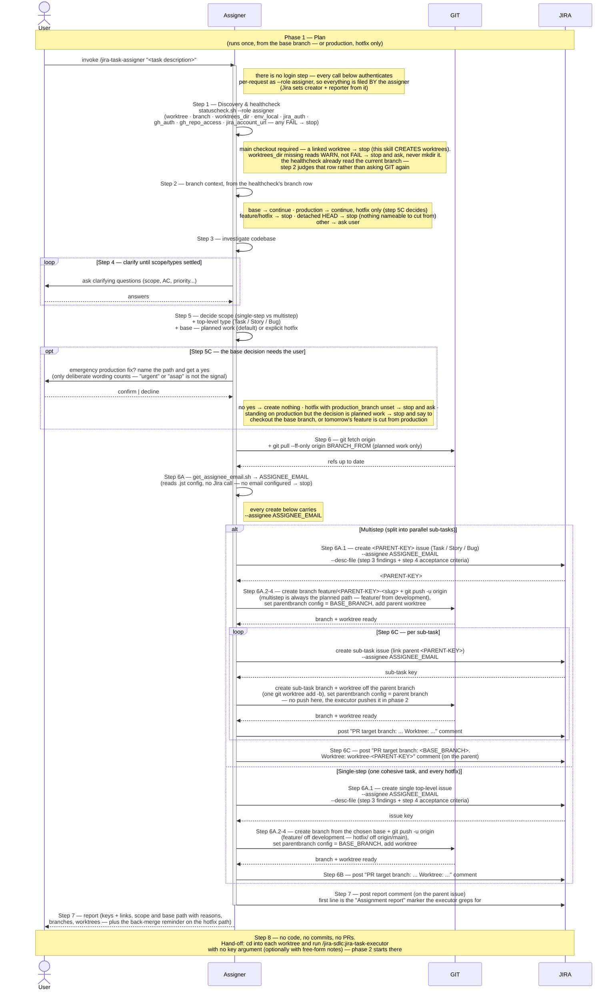

# Task Lifecycle — Phase 1: Plan

Phase 1 of the task lifecycle, run by the **`jira-task-assigner`** skill.
Triggered once per task, **from the main repo checkout** — never a linked
worktree, the opposite reading from phases 2 and 3, because this is the skill
that *creates* the worktrees — and **on the default base branch** (or on the
production branch, which is accepted only for an emergency hotfix). The
assigner refuses to run on an existing `feature/`/`hotfix/` issue branch or
from a detached HEAD (which gives the new branches nothing nameable to be
cut from), and asks the user how to proceed on any other branch.

This phase ends when the assigner reports back: issues exist, branches
and worktrees are ready, a `"PR target branch: ... Worktree: ..."`
comment is posted on every leaf issue (plus one more on the parent
issue itself in the multistep case) for the next phase to read, and
the report itself is posted as a Jira comment on the parent issue in
addition to the chat reply.

The diagram surfaces the two systems the assigner actually drives as
their own swimlanes — **GIT** (anything that mutates repo state:
the pre-branch fetch/pull, creating branches, setting
`parentbranch` config, pushing, adding worktrees) and **JIRA**
(anything that mutates issue state: creating the top-level or sub-task
issue, posting comments) — so the full interaction reads
`User ↔ Assigner ↔ GIT ↔ JIRA` left to right. The healthcheck and
`get_assignee_email.sh` are drawn as self-calls because they **gather facts
rather than mutate** either system — not because they stay local.
`get_assignee_email.sh` genuinely only reads `.jst/` config, but the
healthcheck also *probes* both credentials over the network
(`GET /myself` for Jira, `GET /repos/…` for GitHub). Both reads, neither a
write.

## Sequence diagram

## What the diagram shows

- **Step labelling** — every node carries the step number
  `jira-task-assigner`'s own `SKILL.md` gives it, so the diagram and the
  skill can be read side by side. The assigner numbers **Discovery &
  healthcheck as its step 1**; phases 2 and 3 run the same check as an
  *unnumbered pre-step*, so their diagrams label it `Pre-step — Discovery & healthcheck` instead. The step, its name, and the `statuscheck.sh` call
  are identical in all three — only the `--role` argument, the rerun-hint
  override (the assigner and reviewer wrap the call in `STATUSCHECK_RERUN`,
  the executor doesn't) and each skill's own numbering differ, and the
  diagrams follow the skill rather than renumbering it.
- **Two preconditions step 1 judges for itself** — the `worktree` row never
  FAILs, and `worktrees_dir` FAILs only when the path isn't absolute, so the
  skill decides both rather than the script. The assigner requires the **main
  checkout**, stopping on a linked-worktree reading because it *creates*
  worktrees rather than running inside one, and it requires `<WORKTREES_DIR>`
  to already exist — a missing one reads WARN, and the skill stops to ask
  rather than `mkdir`ing it, since the convention may have changed.
- **Participant routing** — the assigner is the orchestrator between
  three parties. **GIT** owns repo state (the pre-branch
  `fetch`/`pull --ff-only`, branch creation, the
  `branch.<branch>.parentbranch` git config entry, the push, and
  `git worktree add`). **JIRA** owns issue state (creating the top-level or
  sub-task issue — the sub-task carries its parent link — and posting the
  durable `PR target branch` comment). Everything else (the healthcheck,
  reading the branch context off its rows, investigating the codebase,
  deciding scope, and resolving `ASSIGNEE_EMAIL`) stays inside the assigner.
- **The branch context is read once, by the healthcheck** — step 2 judges
  the `branch` row step 1 already produced rather than asking GIT again;
  `SKILL.md` says so explicitly ("the script already ran
  `git branch --show-current`; don't re-run it"). The same is true of
  `get_assignee_email.sh` (step 6A), which only reads `.jst/` config — it
  makes no Jira call, so it is drawn as a self-call, not a JIRA arrow.
- **Refresh before branching (step 6)** — both paths `git fetch origin`
  first; only planned work also runs `git pull --ff-only origin <BRANCH_FROM>`,
  because the hotfix path cuts from the freshly fetched
  `origin/<PRODUCTION_BRANCH>` and a pull there would only move whichever
  branch happens to be checked out.
- **Two identities, and they are not the same one** — there is no login
  step: every Jira call carries `--role assigner` and authenticates on that
  credential per request, so Jira records the assigner as the `creator` and
  `reporter` of every issue
  here — both are derived from the authenticated account, no flag needed.
  But each issue is **assigned to the executor** (`get_assignee_email.sh`
  → `--assignee` on every create, top-level *and* sub-task), because the
  executor is who will pick it up — and phase 2 *refuses* an issue that
  isn't assigned to it. So the board reads correctly end to end: filed by
  the assigner, owned by the executor. Both identities come from that role's
  own required credential pair — there is no default account either can fall
  back to. See
  [`plugins/jira-sdlc/skills/_shared/project-config.md`](https://github.com/kantorv/jira-sdlc-tools/blob/main/plugins/jira-sdlc/skills/_shared/project-config.md).
- **Investigate + clarify loop** — the main place the user is asked
  anything by `jira-task-assigner`; questions persist until scope,
  acceptance criteria, and priority are settled, and the answers are then
  written into the issue description at step 6A.1 rather than left in chat.
  It is not the only place, though. Five other points can put a question to
  the user, none of them drawn as this loop: an empty `$ARGUMENTS` (asked for
  before anything runs, the healthcheck included), a `worktrees_dir` row that
  read WARN, the branch-context "ask otherwise" path, a
  `git pull --ff-only` that exits on real divergence at step 6, and the
  hotfix confirmation below — which carries a sixth of its own, the
  `production_branch`-unset stop.
- **The hotfix path has an explicit user gate (step 5C)** — the `opt` after
  step 5. The assigner takes it *only* when the user deliberately asked for
  an emergency production fix; urgency wording ("urgent", "asap",
  "blocking") is not that signal, and even on deliberate wording it names
  the path and waits for a yes before creating anything. A false positive
  points a PR at production, shipping code that never sat in staging — which
  is why this is a gate rather than an inference. The `opt`'s note carries
  all three of 5C's stop conditions — the gate itself (no yes → create
  nothing) plus two that fire independently of the answer: a hotfix whose
  `production_branch` row read `unset` (don't invent the name of the branch
  you're about to target), and standing on the production branch when the
  decision turns out to be planned work (continuing would cut tomorrow's
  feature from production). Two more hotfix-only obligations land later and
  aren't drawn as nodes: step 6 confirms the `PR target branch` comment
  actually posted (the base resolver's last fallback is
  `<DEFAULT_BASE_BRANCH>`, so a hotfix that lost its comment reads as
  ordinary planned work to a later session), and step 7's report has to say
  the fix still needs to reach `<DEFAULT_BASE_BRANCH>` after it lands on
  production, or the bug returns with the next sprint release.
- **Scope decision first** — the assigner settles scope and the
  top-level type (`alt Multistep / else Single-step`); inside the
  multistep loop it provisions each sub-task's issue (JIRA) and then its
  branch and worktree (GIT) uniformly.
- **The base decision rides along with scope** — planned work (the
  default) branches `feature/` off `development`, while an *explicitly
  requested* emergency production fix branches a single `hotfix/` off
  `origin/main` ([SDLC.md](../process/SDLC.md) §4). Because it cuts from the
  fetched remote ref rather than checking production out, the hotfix works
  the same whether you invoke it from `development` or from `main` — `main`
  is a permitted start state, never a required one, and step 5C stops if it
  turns out to be planned work. Either way the `Multistep` arm is always the
  planned path, and the two never mix within a run.
- **Provisioning is uniform, with one exception — the push** — *every*
  scenario (single-step, multistep parent, sub-task) records
  `branch.<branch>.parentbranch` in git config via GIT and ends with the
  assigner posting a `PR target branch: ... Worktree: ...` comment to JIRA for
  that leaf — the durable source of truth the executor and reviewer will read
  later. In the multistep case that comment happens once per sub-task *and*
  once more on the parent issue after the sub-task loop, so it's neither
  one-per-leaf nor a single comment overall. **The branch is pushed only on
  the top-level path**: step 6A.2 is the assigner's one and only
  `git push -u origin`, for the single-step issue's branch or the multistep
  parent's. Step 6C's three actions for a sub-task are `git worktree add -b`,
  the `parentbranch` config, and the comment — no push. A sub-task branch
  first reaches the remote in phase 2, at the executor's own step 09.
  The recorded `parentbranch` value differs with it: `<BASE_BRANCH>` for a
  top-level branch (never `<BRANCH_FROM>` — on the hotfix path `gh` can
  target `main` but not `origin/main`), and the parent's branch for a
  sub-task.
- **The final report is durable too** — before `deactivate Assigner`,
  the report goes to JIRA as a comment on the parent issue in addition
  to the chat reply to the user, so a later phase (or a fresh session)
  can recover it without relying on chat history. Its first line is the
  literal `Assignment report` marker, which is how phase 2's step 4 finds
  it among the issue's other comments.
- **Step 8 is the hand-off, and it is a real step** — the assigner
  deliberately stops short of writing any code, commits, or PRs, and ends
  by pointing the user (or one subagent per worktree) at
  `/jira-sdlc:jira-task-executor`, run from inside each worktree with **no
  key argument** — optionally with free-form prose notes for that run. Also
  out of scope here: merging the parent branch back into its own base once
  the sub-tasks land. That closing note is where phase 2's diagram picks up.

## Related

- [Phase 2 — Implement](TASK-LIFECYCLE-PHASE-2.md)
- [Phase 3 — Review & aggregate approval](TASK-LIFECYCLE-PHASE-3.md)
- [jira-task-assigner SKILL.md](https://github.com/kantorv/jira-sdlc-tools/blob/main/plugins/jira-sdlc/skills/jira-task-assigner/SKILL.md)
