# Task Lifecycle — Phase 2: Implement

Phase 2 of the task lifecycle, run by the **`jira-task-executor`** skill.
Triggered **once per leaf issue**, from inside its own worktree. Multiple
executors run in parallel against the worktrees the assigner set up.

The diagram surfaces the two systems the executor drives as their own
swimlanes — **GIT** (repo and PR state: merging the parent branch current,
committing, pushing, and the `gh` calls that list, comment on, or open the
PR) and
**JIRA** (issue state: the ownership check, fetching
the issue and its prior comments, the *In Progress* / *In Review*
transitions, any `Task memory` comments posted along the way, and the final
run-report comment) — so the full interaction reads
`User ↔ Executor ↔ GIT ↔ JIRA` left to right. The split is by **what a call
is about**, not by whether it writes: read-only calls sit on both lanes
(`gh pr list`, the issue fetch, the ownership probe). What is drawn as a
**self-call** instead is the executor's own tooling — `ensure_local_env`,
`statuscheck` and `pr_base.sh`, whose subject is the executor's *own*
context (is my config here, is my environment sound, which base do I
target) — and **not** because they stay local. Two of them reach the
network to answer it: the healthcheck *probes* both credentials
(`GET /myself` for Jira, `GET /repos/…` for GitHub), and `pr_base.sh`'s
second source is the issue's own `PR target branch:` **Jira comment** — the
durable one, which survives a fresh clone where the git config it tries
first isn't there. `ensure_local_env` is the only genuinely local one, and
it does write: it copies `.jst/jira-sdlc-tools.local.env` in from the main
checkout when the worktree lacks it.

## Sequence diagram

```mermaid
sequenceDiagram
    actor User
    participant Executor
    participant GIT
    participant JIRA

    Note over User,JIRA: Phase 2 — Implement<br/>(one Executor per leaf)

    par every leaf — own worktree (truly parallel)
        User->>Executor: cd worktree-<KEY-A>, invoke /jira-task-executor (no key arg, optional free-form notes)
        activate Executor
        Executor->>Executor: Pre-step — ensure_local_env.sh<br/>(worktree gets .jst local.env if it is missing — no login step)
        Executor->>JIRA: Pre-step — check_assignee.sh --role executor<br/>(is <KEY-A> assigned to me? compares accountId, not email)
        JIRA-->>Executor: assignee
        Note right of Executor: NOT mine → STOP, exit. No transition, no branch, no commit, no comment.<br/>unassigned · assigned to someone else → the stop prints the assign command.<br/>unreadable (no access · API timeout) → stops earlier, without it
        Executor->>Executor: Pre-step — Discovery & healthcheck<br/>statuscheck.sh --role executor<br/>(worktree · branch · issue_key · parent_branch · production_branch ·<br/>bootstrap · jira_account_url · gh_auth · gh_repo_access — any FAIL → stop)
        Note right of Executor: not a linked worktree, or not a feature/ or hotfix/ issue branch → stop.<br/>issue_key comes off the branch name — it is the only source of <KEY-A>.<br/>gh rows are checked HERE so step 10 never discovers a logged-out gh
        opt Step 1a — bootstrap row read "present"
            Executor->>Executor: .jst/bootstrap.sh with the JST_* contract<br/>(fail-soft — report a non-zero exit and carry on)
        end
        Executor->>JIRA: Step 1b — fetch issue <KEY-A><br/>(summary, description, issuetype, status, parent, subtasks, comment)
        JIRA-->>Executor: issue (summary, AC, parent family, prior comments)
        Note right of Executor: subtasks non-empty → <KEY-A> is a multistep PARENT, not an<br/>implementation surface → confirm with the user before continuing
        Executor->>GIT: Step 2 — bring worktree branch current<br/>(merge origin/<parent-branch>, or the local ref when it was never pushed)
        GIT-->>Executor: working branch ready
        Note right of Executor: merge conflict → stop & ask · unset parentbranch → skip merge, flag possibly-stale
        Executor->>JIRA: Step 3 — transition → In Progress<br/>(skipped when the issue already reads it — the normal state<br/>on a re-run after a reject, and asking anyway exits 8)
        Executor->>Executor: Step 4 — investigate<br/>reads the prior comments in authority order — a reviewer<br/>"CHANGES REQUESTED —" verdict first, then the Assignment report,<br/>then prior Task memory, then the last run report
        opt Step 5 — something material is still ambiguous
            Executor->>User: ask before writing code<br/>(an implementation choice that would change the result — never guessed at)
            User-->>Executor: answer
            Note right of Executor: step 3's transition stands while waiting — someone HAS picked<br/>the issue up, so it is not rolled back to To Do even if no answer comes
        end
        Executor->>Executor: Step 6 — implement
        opt memory-worthy finding or decision
            Executor->>JIRA: post Task memory comment
        end
        Executor->>Executor: Step 7a — find this project's test commands<br/>(CLAUDE.md · AGENTS.md · README — recovered from package.json,<br/>Makefile or CI when only half of them are written down)
        opt the repo has no test layer at all
            Executor->>User: install a runner and the test deps now?<br/>(its own task — not the executor's call to make for them)
            User-->>Executor: yes → fold both commands into CLAUDE.md · AGENTS.md<br/>no → skip testing
            Note right of Executor: declined → skip the rest of step 7, say so in the report,<br/>and go straight to step 8. This is the one path that commits untested
        end
        Executor->>Executor: Step 7b — run each affected test alone, then the whole suite<br/>Step 7c — a suite failure is re-run individually before it counts
        Note right of Executor: still failing on the individual re-run → stop & ask, no commit/push/PR
        Executor->>GIT: Step 8 — commit (staged explicitly) • Step 9 — push -u origin
        GIT-->>Executor: branch pushed
        Executor->>GIT: Step 10 — gh pr list --head <branch> --state open
        GIT-->>Executor: the open PR and its URL, or none
        alt an open PR already exists (the re-run after a reject)
            Executor->>GIT: gh pr comment — what this run fixed<br/>(no second PR, the base is not re-resolved,<br/>and the URL is the one the list just returned)
        else no PR yet
            Executor->>Executor: pr_base.sh --role executor --parent-key <PARENT_KEY><br/>git config → Jira "PR target branch:" comment →<br/>parent-branch search → env default (top-level issues only)
            Note right of Executor: source=unresolved → stop & ask · source=branch-search → proceed,<br/>naming the branch in the report · source=env-default → proceed, say so ·<br/>a hotfix/ prefix disagreeing with the resolved base → stop & ask
            Executor->>GIT: gh pr create --base PR_BASE<br/>(body links https://<JIRA_ACCOUNT_URL>/browse/<KEY-A>)
            GIT-->>Executor: PR URL
            Note right of Executor: gh fails here (repo permissions · network) → report the error and still<br/>hand back the compare URL so the user can open the PR by hand
        end
        Executor->>JIRA: Step 11 — transition → In Review<br/>(likewise skipped when already there — by now the work is<br/>committed and pushed, so a hard stop here would be the worst place to take one)
        Executor->>JIRA: Step 12 — post the one run-report comment (PR URL, branch, status)
        Executor-->>User: Step 12 — report (PR URL, branch, status)
        Note right of Executor: Done is never set here — a sub-task waits for its PR to be merged<br/>into the parent branch, a single-step issue for the merge into the base.<br/>A reject sends the issue back to In Progress and this whole flow re-runs
        deactivate Executor
    and additional leaf (same flow, in parallel)
        User->>Executor: cd worktree-<KEY-B>, invoke /jira-task-executor (no key arg)
        activate Executor
        Executor->>Executor: same flow as KEY-A (in parallel)
        deactivate Executor
    end
```

## What the diagram shows

- **Step labelling** — every node carries the step number
  `jira-task-executor`'s own `SKILL.md` gives it (its steps are the bold
  `01.`–`12.` list, written here as 1–12 — the leading zero is a
  markdown-list artifact, not part of the step id). The credential block and
  **Discovery & healthcheck run before step 1 and are unnumbered in the
  skill**, so they are labelled `Pre-step` here. Phase 1 runs the same
  healthcheck but numbers it *its* step 1, so its diagram reads `Step 1 — Discovery & healthcheck`. The step name and the `statuscheck.sh` call are
  identical across all three phases — only each skill's own numbering
  differs, and the diagrams follow the skill rather than renumbering it.
- **Three pre-flight steps, in a fixed order** — `ensure_local_env.sh`
  (make sure the worktree has its credentials file), then
  `check_assignee.sh --role executor` (the ownership gate), then the
  `statuscheck.sh` healthcheck. The healthcheck is what turns the branch
  name into `<KEY>`, confirms this is a *linked worktree* on a
  `feature/`/`hotfix/` issue branch, and reads `gh_auth` + `gh_repo_access`
  up front — the whole point of running it before any work is that step 10
  never discovers a logged-out `gh` after the implementation is already
  written and pushed.
- **Participant routing** — the executor orchestrates between three
  parties. **GIT** owns repo and PR state (merging the parent branch
  current, the commit, the push, and the `gh` calls that list, comment on,
  or open the
  PR). **JIRA** owns issue state (the `check_assignee` ownership probe, the
  issue fetch that carries the parent family *and prior comments*, the *In
  Progress* and *In Review* transitions, any `Task memory` comments posted
  along the way, and the final run-report comment). Everything
  else (the pre-flight scripts, the bootstrap hook, `pr_base.sh`,
  investigating, clarifying, implementing, testing) stays inside
  the executor.
- **The bootstrap hook (step 1a)** — a worktree is a source tree, not a
  running instance. When the healthcheck's `bootstrap` row reads *present*,
  the executor runs the project's optional `.jst/bootstrap.sh` (or
  `.jst/bootstrap.ps1`) from the worktree root, automatically and with no
  confirmation prompt, passing the `JST_*` contract. It is **fail-soft**: a
  non-zero exit is reported in the final report and the run carries on, since
  a broken hook is the project's environment problem, not a reason to
  abandon work the executor can still do. Most projects ship no hook at all,
  which is why it is drawn as an `opt`.
- **Parallel lanes** — the `par / and / end` block encodes the
  worktree-level parallelism the assigner's phase 1 setup makes
  possible. **Every leaf has its own worktree** and can run concurrently.
- **Two of the executor's questions are drawn as round-trips, because the
  run continues down either arm** — step 5, when the description or
  acceptance criteria leaves an implementation choice that would change the
  result (it asks rather than guesses, and step 3's transition deliberately
  *stands* while it waits — someone has picked the issue up, so the issue is
  not rolled back to *To Do* even if no answer comes); and step 7a, when the
  repo has no test layer at all. Both are `opt` blocks with a real `User`
  round-trip, the same way phase 1 draws its clarify loop and hotfix gate.
  The skill's other user-facing questions are drawn as **notes** rather than
  round-trips, because they gate the run instead of branching it: step 1b's
  confirmation when `<KEY>` turns out to have sub-tasks, and the stop-and-ask
  guards at step 2 (merge conflict) and step 10 (`source=unresolved`, or a
  prefix disagreeing with the resolved base).
- **Finding the test commands is its own step (7a)** — which runner a
  project uses, how it selects one test, and how it runs the suite vary too
  much to ship a plugin default, so the executor reads `CLAUDE.md`,
  `AGENTS.md` or the README first, and recovers whatever is missing from
  `package.json` scripts, `Makefile` targets or CI config when only half of
  it is written down. If the repo has **no test layer at all**, installing
  one is its own task and not the executor's call: it asks. Declining is a
  real path with a real consequence — the rest of step 7 is skipped, the
  report has to say testing was skipped and why, and the run commits
  untested. That is the only path here that reaches step 8 without 7b/7c.
- **Uniform path** — the healthcheck confirms the worktree, then the
  executor brings its branch current, commits, pushes, opens (or updates) a
  PR (GIT), transitions to *In Review* (JIRA), and posts its run-report
  comment (JIRA). The PR is the thing phase 3 reviews.
- **Step 10 has two arms, and the second one is the re-run** — the executor
  runs `gh pr list --head <branch> --state open` *before* anything else at
  step 10. An **existing open PR** means this is the re-run after a
  rejection: step 9's push has already updated that PR, so the executor
  posts a `gh pr comment` saying what it fixed — for the reviewer's next
  pass — and creates nothing. It also does **not** re-resolve the base: an
  open PR's base is not this run's decision. Only the **no-PR-yet** arm
  resolves a base, and it does so with `pr_base.sh`, which tries git config
  → the Jira `PR target branch:` comment → a parent-branch search → the env
  default (top-level issues only, never a sub-task). `source=unresolved`
  stops the run and asks, as does a `hotfix/` branch whose resolved base
  isn't the production branch — retargeting a production fix at staging
  neither ships it nor gets it versioned. The two sources that *do* proceed
  still owe the report a sentence: `branch-search` names the branch it
  recovered, `env-default` says that it fell through to the default.
- **Status transitions the executor owns** — to *In Progress* on start,
  to *In Review* on PR open (both JIRA). Each is **skipped when the issue
  already reads that status**: workflows generally offer no transition into
  the status an issue already occupies, so asking anyway exits 8, and a
  non-zero `jira.sh` result is a stop condition. That matters most on a
  re-run after a reject — the reviewer has already put the issue back to
  *In Progress*, and aborting there would end the run before it ever read
  the reviewer's findings.
- **Task memory is a first-class JIRA interaction, not a single comment
  invariant** — step 1b's fetch carries the issue's comments, and step 4
  reads them in a fixed order of authority: a reviewer
  `CHANGES REQUESTED —` verdict first (on a re-run it *is* the spec for that
  pass), then phase 1's `Assignment report`, then prior
  `Task memory (jira-task-executor)` notes, then the previous run report.
  The executor may then post its own memory notes as
  investigation/implementation turns up findings worth
  preserving (the `opt` block — zero or more per run, not fixed). These
  are expected companions to the **one** comprehensive run report posted
  after the *In Review* transition (PR URL, branch, final status) — the
  invariant is "one run report per run," not "one Jira comment per run."
- **Identity is per-request, and ownership is a gate** — there is no login
  step. Every Jira call carries `--role executor` and authenticates on that
  credential for the one request, so every Jira write in the run — the *In
  Progress* and *In Review* transitions, the task-memory notes, the run
  report — is attributed to the executor account rather than to whoever
  happened to be logged in. Ownership is then **confirmed, not assumed**
  (`check_assignee.sh`): `<KEY>` must be assigned to that account. Anything
  else — unassigned, assigned to someone else, unreadable — stops the run
  *before* it has touched anything. The first two stop with the
  `jira issue assign …` command ready to paste; the unreadable case (no
  access to the project, or a Jira timeout) stops earlier than that message
  is built, so it reports the read failure instead. This is the counterpart to phase 1
  assigning every issue to the executor on create: the assigner says who owns
  the work, and the executor refuses to work anything it doesn't own.
  (Ownership is compared by `accountId`, not by email — Jira only exposes an
  assignee's `emailAddress` to that user themselves, so an email comparison
  cannot tell "someone else's" from "unassigned". See
  [`plugins/jira-sdlc/skills/_shared/jira-api-reference.md` §10](https://github.com/kantorv/jira-sdlc-tools/blob/main/plugins/jira-sdlc/skills/_shared/jira-api-reference.md).)
- **Guards before work starts, and along the way** — the worktree and
  branch are validated by the **healthcheck**, not by a separate read: its
  `worktree`, `branch` and `issue_key` rows are what establish that this is
  `<KEY>`'s own linked worktree, and `SKILL.md`'s step 2 leans on that
  ("Discovery already guaranteed you're on `<KEY>`'s own issue branch"). One
  ownership question survives into step 1b: if the fetched issue has
  **sub-tasks**, `<KEY>` is a multistep parent — a merge target, not an
  implementation surface — and the executor asks the user to confirm rather
  than silently implementing on it. Two more guards can stop the run
  *before it commits anything*: a merge conflict while bringing the branch
  current (GIT), and a test that still fails when re-run individually after
  the suite run (both leave the run stopped, with no commit/push/PR). Step
  10 can stop it too — `source=unresolved`, or a prefix disagreeing with the
  resolved base — but by then the commit and the push have already landed,
  so what is missing there is the PR, not the work.
- **Phase 2 never sets Done** — step 11 transitions to *In Review* and
  stops there. A sub-task reaches `<STATUS_DONE>` when its PR is merged into
  the parent branch, a single-step issue when its PR is merged into the base
  branch — by GitHub-for-Jira's merge automation where that is connected, or
  by hand. The other exit is a rejection, which sends the issue back to *In
  Progress* and re-runs this whole flow: step 4 reads the reviewer's
  `CHANGES REQUESTED —` findings as the specification for that pass, and
  step 10's first arm updates the PR that already exists.

## Related

- [Phase 1 — Plan](TASK-LIFECYCLE-PHASE-1.md)
- [Phase 3 — Review & aggregate approval](TASK-LIFECYCLE-PHASE-3.md)
- [jira-task-executor SKILL.md](https://github.com/kantorv/jira-sdlc-tools/blob/main/plugins/jira-sdlc/skills/jira-task-executor/SKILL.md)
