# Task Lifecycle — Phase 3: Review & aggregate approval

Phase 3 of the task lifecycle, run by the **`jira-task-reviewer`** skill.
Triggered from an issue's own worktree (branch-derived key, no key
argument) after every leaf executor has reported back and transitioned
its issue to `<STATUS_IN_REVIEW>`.

**Scope is set by the worktree you stand in**, and there are three entry
shapes, not two. From the **parent's** worktree the reviewer handles both
single-step top-level issues (no sub-tasks) and multistep parents (with
sub-tasks): for single-step it reviews the one PR and posts a final report
— no re-run needed (GitHub-for-Jira auto-transitions the issue to
`<STATUS_DONE>` on merge); for multistep it reviews each sub-task PR, finds
or creates the aggregate parent PR once sub-tasks are merged, and reviews
that too. From a **sub-task's own** worktree it reviews *that sub-task's PR
and nothing else* — no sibling, no parent PR, and no track determined; a
full pass is then a separate run from the parent's worktree. The reviewer
never merges anything — that remains the user's deliberate step. When a run
approved anything, its last step (7) asks whether to move those issues to
`<STATUS_DONE>` and transitions only what the user says yes to.

The diagram surfaces the two systems the reviewer drives as their own
swimlanes — **GIT** (anything that mutates or reads repo/PR state:
`git fetch --prune`, resolving the parent/base branches from the
`branch.<PARENT-BRANCH>.parentbranch` git config that the assigner
wrote in phase 1, the phase-check `gh pr list`, the per-PR `3a`
idempotency lookup, fetching PR diffs, `gh pr review --comment --body-file` with `APPROVED —` / `CHANGES REQUESTED —` body-prefix
verdicts, and finding or creating the aggregate parent PR) and **JIRA**
(anything that mutates issue state: fetching the parent + In-Review
sub-tasks, reading `fields.parent.key` off a sub-task's own fetch to reach
its parent, each rejected
sub-task → In Progress transition, multi-line comments on the reviewed
issue after every verdict, the per-sub-task summary comment on the
parent, every report comment posted on the parent, and the step-7
user-approved → Done transitions) — so the full
interaction reads `User ↔ Reviewer ↔ GIT ↔ JIRA` left to right.

## Sequence diagram

```mermaid
sequenceDiagram
    actor User
    participant Reviewer
    participant GIT
    participant JIRA

    Note over User,JIRA: Phase 3 — Review & aggregate approval<br/>(scope follows the worktree — parent single-step, parent multistep, or one sub-task)
    User->>Reviewer: cd worktree-<PARENT-KEY>, invoke /jira-task-reviewer (no key arg)

    activate Reviewer
    Reviewer->>Reviewer: ensure_local_env.sh<br/>(credentials file exists — there is no login step)
    Reviewer->>JIRA: statuscheck.sh --role reviewer<br/>(healthcheck — jira_auth probes the reviewer credential)
    JIRA-->>Reviewer: rows OK, continue
    Note right of Reviewer: any FAIL row → stop.<br/>Every verdict comment + reject transition below<br/>authenticates per-request as the reviewer
    Reviewer->>GIT: git fetch origin --prune
    Reviewer->>JIRA: fetch issue from branch key<br/>(type, status, parent, subtasks)
    JIRA-->>Reviewer: issue fields
    opt branch key is a Subtask — run from a sub-task's own worktree
        Note over Reviewer,JIRA: Different run shape — scope is that ONE sub-task PR.<br/>fields.parent.key is read only to resolve <PARENT-BRANCH> (the PR's base)<br/>via pr_base.sh --parent-key · the parent is never re-fetched as an acting issue ·<br/>fields.subtasks is never read · no track is determined · the parent PR is never touched
        Note over Reviewer: walk: step 2 (this sub-task alone) → 3 → 6 → 7, then the run ends.<br/>A full pass is a separate run from the parent's worktree — the rest of this diagram
    end
    Note over Reviewer: determine track from fields.subtasks<br/>(empty → single-step · non-empty → multistep)
    Reviewer->>GIT: resolve <PARENT-BRANCH> (branch -a --list globs)<br/>+ <BASE_BRANCH> (pr_base.sh --branch, parentbranch config)
    Reviewer->>GIT: phase check — list PR (state all)
    GIT-->>Reviewer: PR state (none | open | merged | closed-unmerged)
    Note over Reviewer: both phase checks share two rules — several PRs back → act on the OPEN one<br/>(several open → ask which) · a CLOSED, unmerged PR matches no enumerated state,<br/>so stop and ask: someone abandoned this branch's PR deliberately, and both<br/>opening a replacement and reviewing a dead one would guess at intent

    alt Single-step — no PR yet
        Note over Reviewer: executor hasn't opened a PR
        Reviewer->>JIRA: post report on <PARENT-KEY><br/>(no PR yet — nothing to review)
        Reviewer-->>User: "no open PR yet — reviewer runs once it exists"

    else Single-step — PR open (first run)
        Note over Reviewer: single-step: the one PR is the whole set → review loop (step 3)
        Reviewer->>GIT: 3a idempotency — my prior verdict comment on this PR?
        GIT-->>Reviewer: none | "APPROVED —" | "CHANGES REQUESTED —"<br/>(the MOST RECENT verdict wins — a later one supersedes an earlier)
        alt most recent is "APPROVED —" and no re-review requested
            Reviewer->>JIRA: post report on <PARENT-KEY><br/>(already approved — waiting for merge)
            Reviewer-->>User: "already approved — merge manually"
        else none · most recent "CHANGES REQUESTED —" · or $ARGUMENTS forces a re-review
            Reviewer->>GIT: fetch PR diff
            GIT-->>Reviewer: diff
            Reviewer->>Reviewer: review 6 dimensions<br/>(correctness • patterns • scope<br/>regressions • tests • hygiene)
            alt APPROVE
                Reviewer->>GIT: gh pr review --comment --body-file<br/>"APPROVED — <summary>"
                Reviewer->>JIRA: canonical report on <PARENT-KEY><br/>(S-APPROVED, step 6)
                Reviewer-->>User: "approved — merge manually<br/>GitHub-for-Jira handles Done, no re-run needed"
            else REQUEST_CHANGES
                Reviewer->>GIT: gh pr review --comment --body-file<br/>"CHANGES REQUESTED — <findings>"
                Reviewer->>JIRA: transition <PARENT-KEY> → <STATUS_IN_PROGRESS>
                Reviewer->>JIRA: canonical report on <PARENT-KEY><br/>(S-CHANGES-REQUESTED, step 6)
                Reviewer-->>User: "changes requested — fix, push & re-run"
            end
        end

    else Single-step — PR merged (re-run)
        Note over Reviewer: detect merged PR — GitHub-for-Jira<br/>already handled Done, no wrap-up
        Reviewer->>JIRA: post final report on <PARENT-KEY><br/>(S-MERGED, step 6)
        Reviewer-->>User: "merged — complete (S-MERGED)"

    else Multistep — no parent PR yet
        Note over Reviewer: "no parent PR" splits on sub-task status —<br/>EVERY sub-task <STATUS_DONE> → the PRs are already merged and only the<br/>parent PR is missing, so skip to step 5 (the only place it is created) ·<br/>any sub-task not yet <STATUS_DONE> → still in flight, full pass below
        loop step 2 — per In Review sub-task: discover branch + PR
            Reviewer->>GIT: git branch -a --list "*feature/<SUBTASK-KEY>-*"<br/>"*hotfix/<SUBTASK-KEY>-*" (anchored, strips the + worktree marker), gh pr list
            GIT-->>Reviewer: sub-task branch + open PR (or none)
            Note over Reviewer: no branch / no open PR → flag & skip this sub-task
        end
        alt zero sub-tasks have an open PR
            Reviewer->>JIRA: post report on <PARENT-KEY> (nothing to review)
            Reviewer-->>User: "no sub-task PRs to review — re-run later"
        else at least one sub-task PR to review
            loop step 3 — per sub-task PR (In Review, sequential, one pass)
                Reviewer->>GIT: 3a idempotency — my prior verdict comment on this PR?
                GIT-->>Reviewer: none | "APPROVED —" | "CHANGES REQUESTED —"<br/>(most recent wins)
                alt most recent is "APPROVED —" and no re-review requested
                    Note over Reviewer: record approved, skip re-review → next sub-task PR
                else none · most recent "CHANGES REQUESTED —" · or $ARGUMENTS forces a re-review
                    Reviewer->>GIT: fetch PR diff
                    GIT-->>Reviewer: diff
                    Reviewer->>Reviewer: review 6 dimensions<br/>(correctness • patterns • scope<br/>regressions • tests • hygiene)
                    alt APPROVE
                        Reviewer->>GIT: gh pr review --comment --body-file<br/>"APPROVED — <summary>"
                        Reviewer->>JIRA: canonical report on <SUBTASK-KEY><br/>(M-SUBTASK-APPROVED)
                        Reviewer->>JIRA: parent tally on <PARENT-KEY><br/>"Sub-task <KEY>: ✅ approved"
                    else REQUEST_CHANGES
                        Reviewer->>GIT: gh pr review --comment --body-file<br/>"CHANGES REQUESTED — <findings>"
                        Reviewer->>JIRA: transition <SUBTASK-KEY> → <STATUS_IN_PROGRESS>
                        Reviewer->>JIRA: canonical report on <SUBTASK-KEY><br/>(M-SUBTASK-CHANGES-REQUESTED)
                        Reviewer->>JIRA: parent tally on <PARENT-KEY><br/>"Sub-task <KEY>: ❌ changes requested"
                        Note over Reviewer: continue to next sub-task PR
                    end
                end
            end

            Note over Reviewer: all sub-task PRs visited (step 4)
            alt Some rejected (changes requested) — step 4b
                Reviewer->>JIRA: full report on <PARENT-KEY><br/>(M-SOME-BLOCKED: approved + rejected + findings)
                Reviewer-->>User: "some PRs blocked — fix & re-run"
            else All approved, some not yet merged — step 4a
                Reviewer->>JIRA: report on <PARENT-KEY><br/>(M-ALL-APPROVED — waiting for merge)
                Reviewer-->>User: "all approved — merge manually, then re-run for the parent PR"
            else All approved and all merged — 4a's guard, then step 5
                Note over Reviewer: guard: "every PR in the set is merged" is NOT "the feature is complete".<br/>The set only ever held sub-tasks that were <STATUS_IN_REVIEW> at step 1, so any<br/>sub-task not yet <STATUS_DONE> — still in progress, or skipped by step 2 for having<br/>no branch or no PR — stays on M-ALL-APPROVED and goes to step 6 instead.<br/>Otherwise step 5 would open an aggregate PR missing the outstanding work
                Reviewer->>GIT: 5a — find or create parent PR<br/>(<PARENT-BRANCH> → <BASE_BRANCH>)
                GIT-->>Reviewer: parent PR (open | created | closed)
                alt parent PR CLOSED
                    Reviewer-->>User: "parent PR is closed — stop, user decides"
                else parent PR open or newly created
                    Reviewer->>GIT: 3a idempotency + fetch aggregate diff
                    GIT-->>Reviewer: prior verdict + aggregate diff
                    Reviewer->>Reviewer: 5b — review aggregate diff (lighter pass)
                    alt APPROVE (or already approved)
                        Reviewer->>GIT: gh pr review --comment --body-file<br/>"APPROVED — <summary>" (no auto-merge)
                        Reviewer->>JIRA: report on <PARENT-KEY><br/>(M-PARENT-READY, step 6)
                        Reviewer-->>User: "parent PR approved — merge manually"
                    else REQUEST_CHANGES
                        Reviewer->>GIT: gh pr review --comment --body-file<br/>"CHANGES REQUESTED — <findings>"
                        Reviewer->>JIRA: report on <PARENT-KEY><br/>(M-PARENT-CHANGES-REQUESTED, step 6)
                        Reviewer-->>User: "parent PR changes requested — fix on <PARENT-BRANCH> & re-run"
                    end
                end
            end
        end

    else Multistep — parent PR open
        Note over Reviewer: an open parent PR splits on sub-task status too —<br/>EVERY sub-task <STATUS_DONE> → the merges have happened, go straight to 5b below ·<br/>any sub-task not yet <STATUS_DONE> → the parent PR was opened early and the sub-tasks<br/>are still the work, so run the full step-2 pass and leave the parent PR to a later run
        Reviewer->>GIT: 3a idempotency + refresh aggregate diff
        GIT-->>Reviewer: prior verdict + aggregate diff
        Reviewer->>Reviewer: 5b — refresh aggregate review (lighter pass)<br/>skip if already "APPROVED —"
        alt APPROVE (or already approved)
            Reviewer->>GIT: gh pr review --comment --body-file<br/>"APPROVED — <summary>"
            Reviewer->>JIRA: report on <PARENT-KEY><br/>(M-PARENT-READY, step 6)
            Reviewer-->>User: "parent PR reviewed and approved — merge manually"
        else REQUEST_CHANGES
            Reviewer->>GIT: gh pr review --comment --body-file<br/>"CHANGES REQUESTED — <findings>"
            Reviewer->>JIRA: report on <PARENT-KEY><br/>(M-PARENT-CHANGES-REQUESTED, step 6)
            Reviewer-->>User: "parent PR changes requested — fix & re-run"
        end

    else Multistep — parent PR merged (re-run)
        Note over Reviewer: detect merged parent PR — GitHub-for-Jira<br/>handled Done, no wrap-up
        Reviewer->>JIRA: post final report on <PARENT-KEY><br/>(M-FULLY-COMPLETE, step 6)
        Reviewer-->>User: "fully complete — all PRs merged"
    end

    opt step 7 — this run approved something (not the already-merged exits)
        Reviewer->>User: move the approved issues to <STATUS_DONE>?<br/>(names every approved key — asked once)
        User-->>Reviewer: yes (all or some) | no
        Reviewer->>JIRA: transition each approved key → <STATUS_DONE><br/>(only the ones the user said yes to)
        Note over Reviewer,JIRA: declined or non-interactive → nothing moves<br/>merge automation closes them later · no extra Jira comment
    end
    deactivate Reviewer
```

## What the diagram shows

- **Two tracks, three entry shapes, one skill** — from the parent's
  worktree, step 1 determines the track from `fields.subtasks`: empty →
  **single-step** (the PR set is the one parent PR), non-empty →
  **multistep** (the PR set is each In Review sub-task PR). Each track walks
  its own branches from the same phase check. The third entry shape — a run
  from a **sub-task's own** worktree — determines no track at all: its PR set
  is that one sub-task's PR, and it never reaches the phase checks, step 4
  or step 5. In all three the review-loop body (step 3, including its 3a
  idempotency check) is identical — only the PR set and the post-loop
  outcomes differ.
- **Participant routing** — the reviewer orchestrates three parties.
  **GIT** owns repo/PR state: the opening fetch, resolving
  `<PARENT-BRANCH>` + `<BASE_BRANCH>` (the latter read from the
  `parentbranch` git config the assigner wrote in phase 1 — the
  phase-1 → phase-3 thread), the phase-check `gh pr list`, the per-PR 3a
  idempotency lookup, fetching PR diffs, the verdict comment (`gh pr review --comment --body-file`), and finding or creating the aggregate
  parent PR. **JIRA** owns issue state: fetching the parent + sub-tasks
  (filtering to `<STATUS_IN_REVIEW>`), climbing from a sub-task branch to
  its parent, each rejected sub-task → In Progress transition with its
  findings comment, and the summary/report comments posted on the parent
  after every review.
- **A sub-task branch does not climb into a full pass** — the reviewer
  derives the key from the current branch (feature/<KEY>-slug or
  hotfix/<KEY>-slug) and `jira.sh` fetches that issue. A top-level issue with
  no sub-tasks follows the single-step track. If the issue is a **Subtask**,
  the run's scope stays that one sub-task's PR: `fields.parent.key` (already
  on the sub-task's own fetch) is read *only* to resolve `<PARENT-BRANCH>`,
  the base its PR targets, via `pr_base.sh --parent-key`. The parent is never
  re-fetched as an acting issue, `fields.subtasks` is never read, no track is
  determined, and the parent PR is never touched — that sweep belongs to a
  separate run from the parent's own worktree. Its walk is step 2 (for this
  one sub-task) → 3 → 6 → 7.
- **Phase check first, and track-aware** — an explicit GIT `gh pr list`
  whose return dispatches the top-level branches. On the **single-step**
  track it has three outcomes: *no* PR → report that the executor hasn't
  opened one yet and exit (nothing to review); an *open* PR → the step-3
  review loop; a *merged* PR → the S-MERGED report and exit. On the
  **multistep** track both the *no parent PR* and the *open parent PR*
  outcomes split further on the **sub-task statuses**, because neither state
  means what it looks like on its own: every sub-task `<STATUS_DONE>` → the
  merges have happened, so skip to step 5 (the only place the parent PR is
  ever created, and where 4a's "merge them manually, then re-run" lands);
  any sub-task not yet `<STATUS_DONE>` → the work is still in flight, so run
  the full step-2 pass and leave the parent PR to a later run. A *merged*
  parent PR → the M-FULLY-COMPLETE report and exit. Both phase checks also
  share two rules: several PRs back → act on the OPEN one (several open →
  ask which), and a **CLOSED, unmerged** PR matches no enumerated state, so
  stop and ask — someone abandoned that branch's PR deliberately, and both
  opening a replacement and reviewing a dead one would be guessing at intent.
  Every merged-state exit posts the step-6 report only — GitHub-for-Jira
  already handled `<STATUS_DONE>`, so there is no wrap-up to take and step 7
  has nothing to offer.
- **The reviewer carries its own Jira identity on every call** — there is no
  login step to run first. `jira.sh` / `jira.ps1` authenticates
  **per-request** as `--role reviewer`, picking that role's `email:token`
  pair out of `jira-sdlc-tools.local.env` for the one call, so every
  canonical report and every reject-path transition below is attributed to
  the reviewer's Jira account. Nothing is stored and no account is "active",
  which is why a reviewer run can overlap a phase-2 executor run without
  either one displacing the other's credentials. Note this is the reviewer's
  **Jira** identity; its **GitHub** identity is a separate thing, and the one
  that matters for the idempotency check below. See
  [`plugins/jira-sdlc/skills/_shared/project-config.md`](https://github.com/kantorv/jira-sdlc-tools/blob/main/plugins/jira-sdlc/skills/_shared/project-config.md)
  and
  [`plugins/jira-sdlc/skills/_shared/jira-api-reference.md`](https://github.com/kantorv/jira-sdlc-tools/blob/main/plugins/jira-sdlc/skills/_shared/jira-api-reference.md)
  §9.
- **Idempotent review (step 3a)** — before every PR review — the
  single-step PR, each multistep sub-task PR, and the aggregate parent PR
  (5b) — the reviewer checks whether *its own* GitHub identity already left
  a verdict comment (matched on author + body prefix, never on review
  `state` — both verdicts land as comments, so this identity leaves no
  review state to key on). The **most recent** verdict wins: a later one
  supersedes an earlier, which is what makes an approve→regression→reject
  sequence readable. Most recent `APPROVED —` → skip re-review and report
  the PR as already approved/awaiting merge, *unless* `$ARGUMENTS` asks for
  a re-review — that is the manual override for exactly this case. Most
  recent `CHANGES REQUESTED —` → a fresh re-review of the pushed fixes.
  This is the `3a idempotency` node drawn in each review branch.
- **Empty exits and flag-and-skip (step 2)** — the reviewer first discovers
  each In Review sub-task's branch (anchored `git branch -a --list` globs
  that also strip git's `+` marker for a branch checked out in another
  worktree) and its open PR. A sub-task with **no branch or no open PR** is
  flagged and skipped, not reviewed. If **zero** sub-tasks have an open PR,
  the run reports that there is nothing to review and exits before the
  review loop — except on the multistep track, where the phase check's split
  applies first: every sub-task `<STATUS_DONE>` means the PRs are merged and
  only the parent PR is missing, so the run goes to step 5 instead of
  exiting. Step 2 also runs on the sub-task-worktree path, for that one
  sub-task alone — it is the only place a branch becomes the `prNumber` that
  3a needs.
- **Both verdicts go through `--comment --body-file`** — in this plugin's
  default deployment the executor and reviewer share one `gh` account, and
  GitHub blocks an author from approving *or* requesting changes on their
  own PR. Both verdicts are recorded as review comments with the decision
  in their body prefix (`APPROVED — …` / `CHANGES REQUESTED — …`). The
  Jira transition to `<STATUS_IN_PROGRESS>` (reject path) is the actual
  workflow gate; the GitHub comment records findings and makes the verdict
  machine-detectable by the idempotency check (step 3a).
- **Single-step is one-and-done** — on the single-step track, approval
  posts the final report immediately (S-APPROVED outcome, step 6), then
  step 7 offers to close the issue. Decline and GitHub-for-Jira
  auto-transitions it to `<STATUS_DONE>` when the user merges instead;
  either way no reviewer re-run is required. Only the
  S-CHANGES-REQUESTED outcome (reject) needs a re-run after fixes.
- **Single pass, no merge cascade** — each In Review sub-task PR is
  reviewed **in order, one at a time**. The verdict happens
  immediately per-PR. There is no separate "batch merge" step; approved
  PRs are left for the human to merge manually, and rejected items keep
  the loop going so the full state is known. The only thing that stops
  the loop is running out of sub-task PRs.
- **Continue on rejection, don't stop** — when a PR fails the review,
  the reviewer posts the `CHANGES REQUESTED —` verdict comment, transitions
  that issue back to `<STATUS_IN_PROGRESS>`, **records it as blocked**, and
  continues to the next sub-task. After every single PR (approved or
  rejected), a short summary comment is posted on the parent so the human
  can see progress in real time (intentional audit trail). The final
  report at the end (step 6) lists both approved and rejected items so the
  fix-and-re-run cycle is clear.
- **Parent PR: review, approve *or reject*, still never merge (multistep
  only)** — once every sub-task PR is merged, the reviewer finds or creates
  the aggregate parent PR (GIT). If that PR is already **CLOSED** it stops
  and lets the user decide (5a) — it never reopens or recreates it.
  Otherwise it reviews the lighter aggregate diff (integration focus) and
  records a verdict on the parent PR via `gh pr review --comment --body-file`: **approve** → M-PARENT-READY (awaiting the human's manual
  merge), or **request changes** → M-PARENT-CHANGES-REQUESTED (integration
  `file:line` findings; fix on `<PARENT-BRANCH>` and re-run). Unlike a
  sub-task reject, the parent reject does **not** transition any Jira issue
  — the aggregate `<PARENT-KEY>` stays as-is. The reviewer never calls
  `gh pr merge` on the parent — merging into `<BASE_BRANCH>` is the human
  release decision. After the parent PR merges, no re-run is required; a
  re-run only reports the already-merged state (M-FULLY-COMPLETE).
- **No automatic status transitions** — the reviewer never moves an issue
  to Done on its own. The only transition it performs unprompted is a
  **rejected** issue → In Progress, and only on a *sub-task* reject (3d) or
  a *single-step* reject (3d) — never on the multistep parent-PR reject
  (5b), where no executor will pick the parent branch up anyway.
- **Done is offered, never assumed (step 7)** — the run's last step names
  every issue it approved and asks once whether to close them, moving only
  what the user confirms. It asks because an approval is not a merge: the
  reviewer never merges, so those PRs are still open, and on boards where
  Done means merged the card would be jumping ahead of the automation that
  really closes it. Boards that close at approval want the opposite, and
  nothing in the repo says which kind this project is. Declining (or a
  non-interactive run) leaves everything as-is and GitHub-for-Jira's merge
  automation closes the issues later. The already-merged exits (S-MERGED,
  M-FULLY-COMPLETE) skip the question — those issues are Done already. No
  extra Jira comment is posted either way: the step-6 report is still the
  run's single final comment.
- **Every terminal branch posts a JIRA report comment on the parent**
  — per step 6, the report goes to chat *and* as a single Jira comment
  on `<PARENT-KEY>`: the single-step *no-PR-yet* exit, the single-step
  approve/reject (S-APPROVED / S-CHANGES-REQUESTED) and merged (S-MERGED)
  reports, the multistep *nothing-to-review* exit, the M-ALL-APPROVED and
  M-SOME-BLOCKED reports, the parent approve (M-PARENT-READY) and parent
  reject (M-PARENT-CHANGES-REQUESTED) reports, and the merged-state report
  (M-FULLY-COMPLETE). The one branch that stops without a step-6 report is
  the parent-PR-CLOSED case (5a) — it surfaces the state to the user in
  chat and waits for their decision.

## Related

- [Phase 1 — Plan](TASK-LIFECYCLE-PHASE-1.md)
- [Phase 2 — Implement](TASK-LIFECYCLE-PHASE-2.md)
- [jira-task-reviewer SKILL.md](https://github.com/kantorv/jira-sdlc-tools/blob/main/plugins/jira-sdlc/skills/jira-task-reviewer/SKILL.md)
