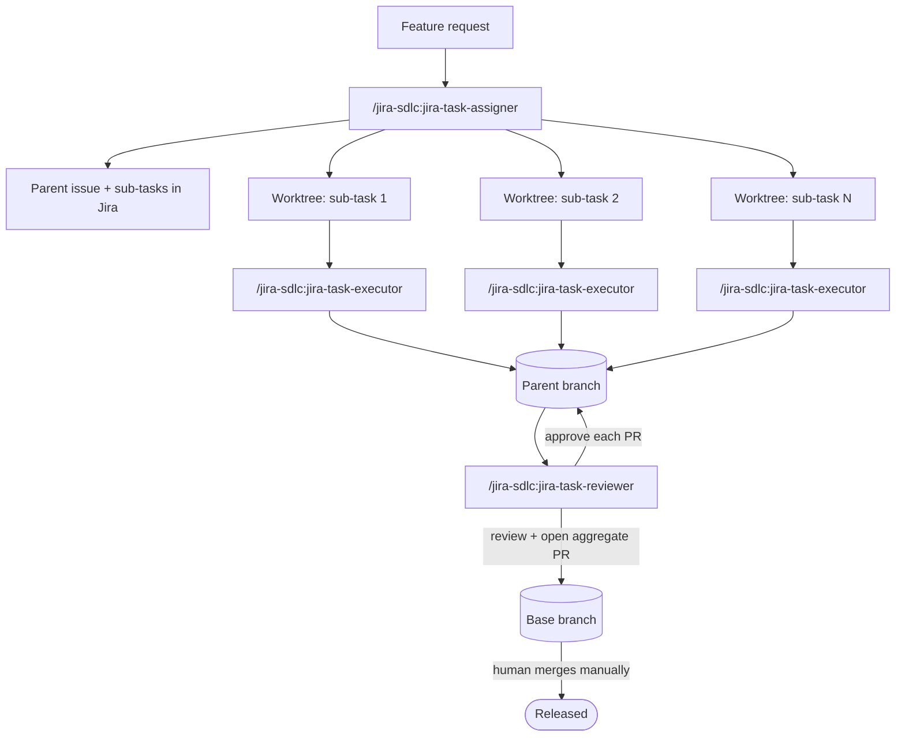

# jira-sdlc-tools

[](LICENSE)

A Claude Code plugin with three skills — **`jira-task-assigner`**,
**`jira-task-executor`**, and **`jira-task-reviewer`** — that turn a
feature request into parallel, Jira-tracked implementation work using git
worktrees, and then review and merge the result as a single unit.

You describe the work once. The assigner plans it into Jira issues,
branches, and worktrees. An executor runs in each worktree and does the
implementation. The reviewer works through the resulting PRs, approves what
passes and flags what doesn't for the human to fix, and never merges anything
— leaving merges and the final release to a human.

## Contents

- [Overview](#overview)
- [Quick start](#quick-start)
- [How the three skills relate](#how-the-three-skills-relate)
- [Core concepts](#core-concepts)
- [Prerequisites](#prerequisites)
- [Installation](#installation)
- [Repository layout](#repository-layout)
- [Configuration](#configuration)
- [Usage walkthrough](#usage-walkthrough)
- [Re-run behavior](#re-run-behavior)
- [Safety model](#safety-model)
- [Known limitations](#known-limitations)
- [First-run verification checklist](#first-run-verification-checklist)
- [Troubleshooting / FAQ](#troubleshooting--faq)
- [The branching model this assumes](#the-branching-model-this-assumes)
- [Contributing](#contributing)
- [License](#license)
- [Acknowledgments](#acknowledgments)

## Overview

Splitting a feature into parallel work usually means someone manually
creates the Jira sub-tasks, manually sets up branches or worktrees for
each, manually tracks which PR targets what, and manually reviews and
merges everything back together at the end. This toolkit automates all
of that *except* the two decisions that should stay human: the final
merge into your base branch, and anything genuinely ambiguous along the
way.

Three skills, three jobs:

| Skill | Runs | Does |
|---|---|---|
| `jira-task-assigner` | Once, on a task description | Plans: creates the Jira issue(s), decides single-step vs. multistep, creates branches and `git worktree`s, decides how each piece should land in git. Never writes code. |
| `jira-task-executor` | Once per leaf issue, inside its worktree | Implements: branch/worktree setup, Jira status transition, investigation, implementation, tests, commit, push, PR. |
| `jira-task-reviewer` | Once, on the parent issue | Reviews: iterates over each In Review sub-task PR, approves or requests changes per-PR (continuing past rejections), posts findings to Jira, and reviews the aggregate parent PR. Never merges anything — all merges are manual. |

## Quick start

```
/plugin marketplace add kantorv/jira-sdlc-tools
/plugin install jira-sdlc@jira-sdlc-tools
```

Create `jira-sdlc-tools.env` in the project root for your repo (see
[Configuration](#configuration)), then:

```
/jira-sdlc:jira-task-assigner "Add CSV export to the reports page"

# cd into each worktree it creates, run this in each one (no key —
# derived from that worktree's branch):
/jira-sdlc:jira-task-executor

# once the sub-task PRs are up, cd into the parent worktree:
/jira-sdlc:jira-task-reviewer
```

The rest of this document explains what's actually happening at each of
those steps, and what to configure before you rely on it.

## How the three skills relate




The diagram shows the multistep path — one worktree and dedicated branch
per sub-task, all merging into the parent branch. A single-step task is
just the top-level issue and its worktree (PR targets the base branch
directly).

Nothing here gets passed by hand. Two mechanisms carry state between the
three skills:

- **`git config branch.<branch>.parentbranch`** — set by the assigner on
  every branch it creates, read by the executor (to find its PR base) and
  the reviewer (to find the parent branch's own base). Local to a clone.
- **Jira comments** — `"PR target branch: ..."` posted by the assigner as
  a durable fallback for the same information. These survive a fresh clone
  or a different machine, which the git config alone doesn't.

The executor and reviewer both check the git config first and fall back to
the Jira comment if it's missing.

## Core concepts

**Worktrees are the parallelism mechanism.** Each leaf issue (a
self-contained single task, or one sub-task of a split) gets its own
`git worktree`, so multiple executors — separate terminals, or separate
subagents — can implement different pieces at the same time without
switching branches out from under each other in a single checkout.

**What the assigner creates.** The assigner runs only from your base
branch — invoke it from an existing feature/hotfix branch and it stops,
telling you to checkout the base branch first (it doesn't append
sub-tasks to an existing parent). From the base branch it always
provisions one top-level issue (`Task`/`Story`/`Bug`) with a matching
branch and a `git worktree`, then:

- **Single-step** — the top-level issue is the only issue. The executor
  runs in that worktree on a dedicated branch whose PR targets the base
  branch directly.
- **Multistep** — the top-level issue becomes the parent. Each sub-task
  gets its own dedicated branch, worktree, and PR into the parent branch.
  The parent branch (and its worktree) is the merge target for the
  sub-tasks' PRs.

**Every sub-task gets a dedicated branch.** Each sub-task has its own
branch, worktree, and PR into the parent branch — regardless of size. A
one-line fix and a multi-file feature both go through the same
branch → worktree → PR → review → manual merge path. There's no "small
enough to commit straight to the parent" shortcut.

This keeps the flow uniform (every leaf follows the same steps), makes
every sub-task individually reviewable, and means every change lands
through an explicit PR rather than an implicit commit on the parent
branch.

**Picking `Task` vs. `Story` for the top-level issue.** When the user
hasn't told you which to use, the assigner decides by complexity: a
`Story` for larger, multi-faceted requests that deliver end-to-end user
value; a `Task` for smaller, localized, or strictly technical chores. A
`Bug` is always used for a defect or regression.

**Jira shape assumed.** Two-level hierarchy with no `Epic` level:
`Story`, `Task`, and `Bug` are the top-level types (peers), with
`Sub-task` underneath.

**Jira status flow across the three skills.** Each skill drives the issue's
Kanban status explicitly with the four status names from
`jira-sdlc-tools.env`, so board progress reflects the work without
relying on opaque GitHub-for-Jira transition rules:
- New issues created by `jira-task-assigner` start in `<STATUS_TODO>`
  (Jira's default initial status for new issues — no explicit move needed).
- `jira-task-executor` transitions a leaf issue to `<STATUS_IN_PROGRESS>`
  when it starts work (step 3), then to `<STATUS_IN_REVIEW>` once it opens
  the sub-task's PR (step 11, dedicated-branch path only).
- `jira-task-reviewer` transitions a rejected sub-task back to
  `<STATUS_IN_PROGRESS>` (step 3d, `REQUEST_CHANGES` path) so the executor
  can pick it up again. It never transitions anything to `<STATUS_DONE>` —
  GitHub-for-Jira automation handles that when the human merges the PRs.

## Prerequisites

- **Claude Code**, a version with plugin support.
- **The official Atlassian CLI (`acli`)** — the primary CLI these skills
  drive Jira through; the lean shared reference
  (`skills/_shared/jira-acli-reference.md`) documents the exact flag
  behavior the skills invoke, with a detailed companion
  (`docs/JIRA-ACLI.md`) for rationale, discovery procedures, and every
  command no skill invokes. Authenticated once against your
  Jira Cloud instance with `acli jira auth login` using the
  `JIRA_ACCOUNT_URL`, `JIRA_ACCOUNT_EMAIL`, and `JIRA_TOKEN` values
  from `jira-sdlc-tools.local.env` (see
  [Configuration](#configuration)). `acli` stores the credentials, so no
  per-command token prefix.

- **GitHub CLI (`gh`)**, authenticated.
- **[GitHub-for-Jira](https://github.com/github/github-for-jira)**
  connected between your Jira project and GitHub repo — automatic
  branch-to-issue linking depends on it.
- **Git with worktree support** (any reasonably current git).
- **A documented way to run tests** — the executor's test step reads
  the project's `CLAUDE.md` / `AGENTS.md` (or similar) for "one
  test" and "full suite" commands; they no longer live in
  `jira-sdlc-tools.env`. If the project doesn't document them,
  the executor will ask whether to install a runner — and skip the
  test step if you decline.
- **A worktrees directory that already exists**, as a sibling of your
  repo — the assigner refuses to create it for you.

## Installation

### Option A — Plugin + marketplace (recommended)

1. Add the marketplace at `kantorv/jira-sdlc-tools` and install the
   plugin:
   ```
   /plugin marketplace add kantorv/jira-sdlc-tools
   /plugin install jira-sdlc@jira-sdlc-tools
   ```
2. Fill in `jira-sdlc-tools.env` in the project root — see
   [Configuration](#configuration).
3. The three skills are now available as `/jira-sdlc:jira-task-assigner`,
   `/jira-sdlc:jira-task-executor`, and `/jira-sdlc:jira-task-reviewer`.

   Self-hosting or forking? Push the repo to your own GitHub and
   `marketplace add` *that* `owner/repo` instead.

**Why the layout matters:** a marketplace install only copies the
plugin's own root directory into Claude Code's plugin cache. `_shared/`
lives at `skills/_shared/` — *inside* the plugin root — specifically so
the `../_shared/...` relative paths the three skills use still resolve
after install. Don't restructure this into three independent plugins that
each try to reach a `_shared/` sitting outside themselves; that path
won't survive the copy.

**If you rename the plugin** (the `name` field in
`.claude-plugin/plugin.json`), also update the self-referential
`/jira-sdlc:...` mentions inside `jira-task-assigner` (its step 1
Discovery & healthcheck `STATUSCHECK_RERUN` override, and step 8),
`jira-task-executor` (step 11 and its Discovery & healthcheck error
messages), and `jira-task-reviewer` (its own Discovery & healthcheck
section's `STATUSCHECK_RERUN` override, plus steps 4a/4b/4c and 6) to
match your new name — those are the only places the plugin name
is hardcoded into the skill bodies themselves.

### Option B — Drop-in (no marketplace)

```bash
cp -r plugins/jira-sdlc/skills/* ~/.claude/skills/   # personal, all projects
# or
cp -r plugins/jira-sdlc/skills/* .claude/skills/     # project-level, commit it to your repo
```
Run from the root of your `kantorv/jira-sdlc-tools` clone.

Invocation is then the bare form: `/jira-task-assigner`,
`/jira-task-executor`, `/jira-task-reviewer` — there's no plugin
namespace. If you go this route, edit the three `/jira-sdlc:...`
references mentioned above back down to their bare form.

## Repository layout

```
jira-sdlc-tools/                # marketplace root (this repo)
├── .claude-plugin/
│   └── marketplace.json           # single-plugin marketplace manifest
└── plugins/
    └── jira-sdlc/                 # ← plugin root (what install copies)
        ├── .claude-plugin/
        │   └── plugin.json        # plugin metadata (the only file in here)
        ├── skills/
        │   ├── jira-task-assigner/
        │   │   └── SKILL.md
        │   ├── jira-task-executor/
        │   │   └── SKILL.md
        │   ├── jira-task-reviewer/
        │   │   └── SKILL.md
        │   └── _shared/
        │       ├── jira-acli-reference.md   # official Atlassian CLI (acli) — lean call-site reference (detailed companion: docs/JIRA-ACLI.md)
        │       ├── jira-api-reference.md    # direct REST API (no acli) — verified curl examples
        │       ├── project-config.md        # ← reference: describes each .env variable
        │       └── scripts/
        │           ├── acli-create-parent-and-subtasks.sh  # seed a parent + sub-tasks from a manifest
        │           └── acli-list-subtasks.sh               # list a parent's sub-tasks via acli view --json
        ├── docs/
        │   ├── examples/
        │   │   └── acli-list-subtasks.py  # original python version, kept for reference
        │   ├── JIRA-ACLI.md          # detailed acli companion — rationale + commands no skill invokes (lean ref: skills/_shared/jira-acli-reference.md)
        │   ├── JIRA-GITHUB-API.md
        │   ├── JIRA-KANBAN-BOARD.md
        │   └── SDLC.md            # the branching/release policy these skills assume
        ├── LICENSE
        └── README.md
```

The marketplace root (`jira-sdlc-tools/`) hosts `marketplace.json`; `plugins/jira-sdlc/`
is the plugin root Claude Code copies on install. `_shared/` lives inside it
deliberately — see [Installation](#installation) for why that matters.

## Configuration

All project-specific values live in two files in the project root:

| File | Purpose | Committed? |
|------|---------|------------|
| `jira-sdlc-tools.env` | Team-shared settings (project key, default base branch, Jira workflow status names) | ✅ Yes |
| `jira-sdlc-tools.local.env` | Machine-specific settings (worktrees directory, Jira account URL/email, token path) | ❌ No — gitignored |

See `skills/_shared/project-config.md` for a description of each variable.

Copy the templates from the marketplace root:
```bash
cp /path/to/jira-sdlc-tools/jira-sdlc-tools.env .
cp /path/to/jira-sdlc-tools/jira-sdlc-tools.local.env.example jira-sdlc-tools.local.env
# then fill in jira-sdlc-tools.local.env with your machine-specific values
```

Nothing else under `skills/` should need editing. It covers:

- Your Jira project key and worktrees directory (required)
- Your default base branch (required)
- Your Jira workflow's real status names — these are flagged as "confirm once" inside the skills themselves, since status *names* aren't standardized across Jira projects
- The Jira auth token (`JIRA_TOKEN` — the raw API token value itself, not a path to a file containing one; see the one-time `acli jira auth login` in the config reference)

Test commands are **not** here anymore — `jira-task-executor` step 7 reads them from the project's own `CLAUDE.md` / `AGENTS.md`.

Open `jira-sdlc-tools.env` and read it top to bottom before your first run; it's short, and every skill points back to it.

### Generating the Jira API token

Create the token at
[`id.atlassian.com` → Security → API tokens](https://id.atlassian.com/manage-profile/security/api-tokens).
Atlassian offers two kinds, and the choice matters because `acli` and a
raw REST call don't accept them the same way:

- **Classic, unscoped — "Create API token".** *Always works*, everywhere:
  with `acli` (what the three skills drive Jira through) and with every
  REST endpoint. It carries the full Jira permissions of the account it
  belongs to, so scope it down by restricting **that account's project
  role/permissions**, not the token. **This is the one to use for
  `JIRA_TOKEN`** — `acli` cannot operate with a scoped token (see below).

- **Scoped — "Create API token with scopes".** Least privilege, but with
  a hard constraint: a scoped token is **rejected by Basic auth on the
  `*.atlassian.net` site domain**, so `acli`'s Jira operations fail with
  it (its login may still succeed, then every `workitem` call errors). It
  only works when you call the REST API directly through the
  **`https://api.atlassian.com/ex/jira/<cloudId>` gateway** — which is how
  the direct-REST transition workflows
  (`.github/workflows/jira_issue_transition_*.yml`) authenticate. For that
  transition flow the least-privilege set is exactly three **coarse**
  scopes:

  | Scope | Grants |
  |---|---|
  | `read:jira-user` | identity check at login |
  | `read:jira-work` | read an issue's status + list its transitions |
  | `write:jira-work` | perform the transition |

  Avoid the *granular* per-resource scopes (`read:issue:jira`,
  `read:issue.transition:jira`, …): `GET issue` requires a whole bundle of
  them at once, and any missing member fails with
  `Unauthorized; scope does not match`. The three coarse scopes above sidestep
  that entirely.

In short: **classic token for the `acli`-driven skills; a 3-scope token
only if you specifically want least privilege for the REST-gateway
transition workflows.**

## Usage walkthrough

Say you're on `development` and want: *"Add CSV export to the reports
page: backend endpoint, frontend button, feature-flag config."*

**1. Plan it:**
```
/jira-sdlc:jira-task-assigner "Add CSV export to the reports page: backend endpoint, frontend button, feature-flag config"
```
The assigner investigates the codebase, asks anything genuinely
ambiguous, decides this splits into independent pieces (multistep), and
creates:
- `PROJ-401` (parent Story) on `feature/PROJ-401-csv-export`, with its
  own worktree `worktree-PROJ-401`
- `PROJ-402` (backend endpoint) → worktree + branch
- `PROJ-403` (frontend button) → worktree + branch
- `PROJ-404` (feature-flag config) → worktree + branch

It reports the keys, branches, and worktree paths in chat, and posts the
same as a Jira comment on `PROJ-401`.

**2. Implement each piece — in parallel:**

In three terminals (or three subagents, one per worktree):
```
cd ../myapp-worktrees/worktree-PROJ-402 && claude
> /jira-sdlc:jira-task-executor
```
No key argument — it's derived from that worktree's own branch
(`feature/PROJ-402-...`). ...and the same for `PROJ-403` and `PROJ-404`.
Each executor implements, tests, commits, pushes, and opens a PR into
`feature/PROJ-401-csv-export`, then reports the PR link.

**3. Review and merge the set:**

cd into the parent worktree (`worktree-PROJ-401`), then:
```
/jira-sdlc:jira-task-reviewer
```
The reviewer only processes sub-tasks whose Jira status is `<STATUS_IN_REVIEW>`
(e.g. "In Review") — if a sub-task is still in progress, it is skipped for
now. For each In Review sub-task, it checks if it has already reviewed that
PR (skipping if yes), reads the full diff, and evaluates it against six
criteria. Both verdicts are posted as review comments via
`gh pr review --comment --body-file` with a body prefix (`APPROVED — …`
/ `CHANGES REQUESTED — …`) — the executor and reviewer share one `gh`
account, and GitHub blocks self-approve and self-request-changes, so
state-based reviews can't be used. On approve, the PR is left for you to
merge manually on GitHub. On reject, the reviewer moves the issue back to
`<STATUS_IN_PROGRESS>` (the actual gate), posts findings, and continues
the loop so the full state is known.

Once the loop finishes, the report tells you which sub-tasks are approved
(waiting for your manual merge) and which are rejected (need fixes). You
merge the approved ones on GitHub, fix and re-run the reviewer for the
rejected ones, and repeat until all sub-task PRs are merged into the parent
branch. Only then does the reviewer find (or create) the aggregate parent
PR, review that too, and approve it — still leaving the merge to you.

**4. Merge the release:**

You merge `feature/PROJ-401-csv-export → development` manually on
GitHub — always a human step. GitHub-for-Jira auto-transitions all related
issues to Done on merge. No reviewer re-run is needed once the parent PR is
merged — GitHub-for-Jira already handled the Done transitions, and the
reviewer has no post-merge action to take.

**Single-step issues** (no sub-tasks) skip the aggregate cycle: the
reviewer reviews the one PR directly, posts its final report, and no
re-run is needed. GitHub-for-Jira handles Done on merge.

## Re-run behavior

All three skills check "what phase am I in" before acting, so re-invoking
mid-flight is safe by design:

- **Assigner**, run again from the base branch → a fresh planning pass
  that provisions a brand-new top-level issue. It aborts if invoked from
  an existing feature/hotfix branch — it doesn't append sub-tasks to an
  existing parent, so checkout the base branch first.
- **Executor**, run again on an issue with an existing branch → resumes
  it rather than creating a second branch for the same issue.
- **Reviewer** — no parent PR yet → full review pass. Parent PR open →
  only refreshes the aggregate review, doesn't re-touch sub-tasks. Parent
  PR merged → reports the merged state and exits; there's nothing left to
  do (GitHub-for-Jira already transitioned the issues to Done).

## Safety model

Deliberately never automated, regardless of how routine a run looks:

- **Merging the parent branch into its base.** Always a manual step for
  a human — the reviewer only ever prepares and approves that PR.
- **`acli jira workitem delete --key <KEY> --yes`.** The skills hand back
  a ready-to-paste command instead of running it, even for throwaway
  issues created in the same session. (Unlike `jira-cli`'s `delete`,
  acli's accepts `--yes` and *can* run unattended — so the guardrail
  against auto-deleting matters more, not less.)
- **Resolving an ambiguous branch match.** Zero or multiple branches
  matching a key means the skill asks, rather than guessing which one
  you meant.
- **Conflict resolution.** A merge conflict — sub-task into parent, or
  parent into base — stops the relevant skill for you to resolve by hand.
- **Continuing past a rejected PR.** One `REQUEST_CHANGES` moves that
  sub-task back to `<STATUS_IN_PROGRESS>` and continues reviewing the
  rest. The full state is reported at the end.

## Known limitations

- Built around **GitHub + GitHub-for-Jira** specifically — branch-to-issue
  linking relies on that integration. Adapting to GitLab/Bitbucket means
  replacing that mechanism, not just swapping CLI commands.
- Assumes **no `Epic` type** and doesn't create or group under Epics —
  `Story`, `Task`, and `Bug` (peers) are the top-level types it creates.
- The assigner runs **only from your base branch**. Invoked from an
  existing feature/hotfix branch, it stops and tells you to checkout the
  base branch first — it doesn't append sub-tasks to an existing parent
  (that case is TBD per the skill).
- The reviewer works through sub-task PRs **sequentially, by design** —
  one review at a time, with per-PR GH approval (or rejection) and a
  summary on the parent. For a large sub-task count this means later
  PRs wait on earlier ones being reviewed first.
- An AI code review is not a substitute for the human judgment still
  required at the one step that's never automated (the final merge) —
  treat the automated review as a strong first pass, not a replacement
  for your own team's standards.

## First-run verification checklist

A few things the skills themselves flag as "confirm once against real
output" rather than assume — worth running deliberately before your first
real task, not discovering mid-failure:

- [ ] `acli jira workitem view <any-existing-key> --json --fields 'summary,description,issuetype,status,parent,subtasks'`
      (the review-fetch field list; source of truth: `skills/_shared/jira-acli-reference.md` §3) —
      confirm `fields.subtasks` is shaped the way the skills expect (the
      default `--json` omits `subtasks`/`parent`/`comment`, so this
      list names `subtasks` explicitly; it's an array of objects with
      a `.key`, not bare strings).
  - Prints your project's real workflow status names — fill the confirmed
      values into `<STATUS_TODO>` / `<STATUS_IN_PROGRESS>` /
      `<STATUS_IN_REVIEW>` / `<STATUS_DONE>` in `jira-sdlc-tools.env`.
- [ ] `acli jira workitem comment create --help` — the skills write
      multi-line comments to a temp file and post with `--body-file <real file>`.
      Confirm that form works (acli reads the body from a real file path
      only — stdin is not supported).
- [ ] Browse URL — acli has no `open` subcommand. The skills build the
      issue link as `https://<JIRA_ACCOUNT_URL>/browse/<KEY>` from the
      `JIRA_ACCOUNT_URL` token; confirm that resolves to your instance.

## Troubleshooting / FAQ

**A sub-task with an open PR is not being reviewed by `jira-task-reviewer`.**
The reviewer only processes sub-tasks whose Jira status is `<STATUS_IN_REVIEW>`
(e.g., "In Review"). A sub-task still in `<STATUS_IN_PROGRESS>` (or any other
status) is silently skipped. Ask the executor to transition it (or move it
manually) and re-run the reviewer.

**I fixed a sub-task that the reviewer rejected, but re-running still shows
changes requested.**
The reviewer detects prior verdicts by its own GitHub login + body prefix
(`APPROVED —` / `CHANGES REQUESTED —`), not by review state. If the
original verdict was `CHANGES REQUESTED —` (and no later `APPROVED —`
overrides it), re-running causes a *re-review* of the fresh code, and a
fresh verdict comment with new findings. If the PR still fails criteria,
the rejection remains. If all findings are addressed, the new verdict will
be `APPROVED —` and the PR is ready for you to merge manually.

**The parent PR was closed instead of merged.**
The reviewer stops and asks what you want to do rather than reopening it
or creating a replacement PR on its own.

**`gh` isn't installed, or isn't authenticated.**
The relevant skill reports the problem and gives you the PR/compare URLs
directly so you can review or merge manually.

**Zero, or more than one, branch matches an issue key.**
Both the assigner and reviewer stop and ask rather than guessing — this
usually means a stale branch, a naming typo, or two branches that
shouldn't both reference that key.

**A full test suite run reports failures, but the individual tests
passed.**
The executor treats this as likely flakiness: it re-runs only the failed
tests individually before deciding whether the suite actually passed. A
second individual failure stops the run for your input — it won't keep
retrying on its own.

**I renamed the plugin and now the reviewer's "re-run" instructions in
its own report are wrong.**
See the note in [Installation](#installation) — three self-references
inside `jira-task-assigner` and `jira-task-reviewer` hardcode the
`jira-sdlc:` prefix and need a matching update.

## The branching model this assumes

[`docs/SDLC.md`](docs/SDLC.md) is the full branching and release policy
these skills were written against: `main` / `development` /
`feature/*` / `hotfix/*` / `release/*` branches, a two-week sprint
cadence with a feature-freeze cut, an emergency hotfix flow that bypasses
`development` entirely, SemVer tagging on `main`, and feature flags for
anything that spans more than one sprint. It also includes a short set of
directives aimed specifically at AI coding assistants (branch naming,
target-branch defaults, feature-flag policy, and how the release branch's
name — not PR labels or commit messages — drives the version bump).

If your branching model differs, adapt that document to match yours, then
update `<DEFAULT_BASE_BRANCH>` in `jira-sdlc-tools.env` and the
`feature/`/`hotfix/` prefix logic in `jira-task-assigner` and
`jira-acli-reference.md` §7 accordingly — the skills follow whatever
policy `docs/SDLC.md` describes, not the other way around.

## Contributing

Issues and PRs welcome. If you're proposing a change to one of the three
`SKILL.md` files, please describe which step of the assigner's planning
flow (single-step vs. multistep), or
which review/execution step, it affects — the control flow between the
three skills is easy to get subtly wrong at the seams (git-config vs.
Jira-comment fallback, phase detection, In Review filter, idempotency), so a
concrete before/after scenario in the PR description goes a long way.

## License

[MIT](LICENSE).

## Acknowledgments

- The official **Atlassian CLI (`acli`)** — the primary CLI these skills
  are now written against; stores credentials after a one-time login and
  handles sub-task `--parent` correctly on this project.
- [`Introducing the Atlassian Command Line Interface (ACLI) for Jira`](https://www.atlassian.com/blog/jira/atlassian-command-line-interface) — Official documentation
- [GitHub-for-Jira](https://github.com/github/github-for-jira) — automatic
  branch-to-issue linking.
- Built for [Claude Code](https://claude.com/claude-code).
- [A successful Git branching model](https://nvie.com/posts/a-successful-git-branching-model).

