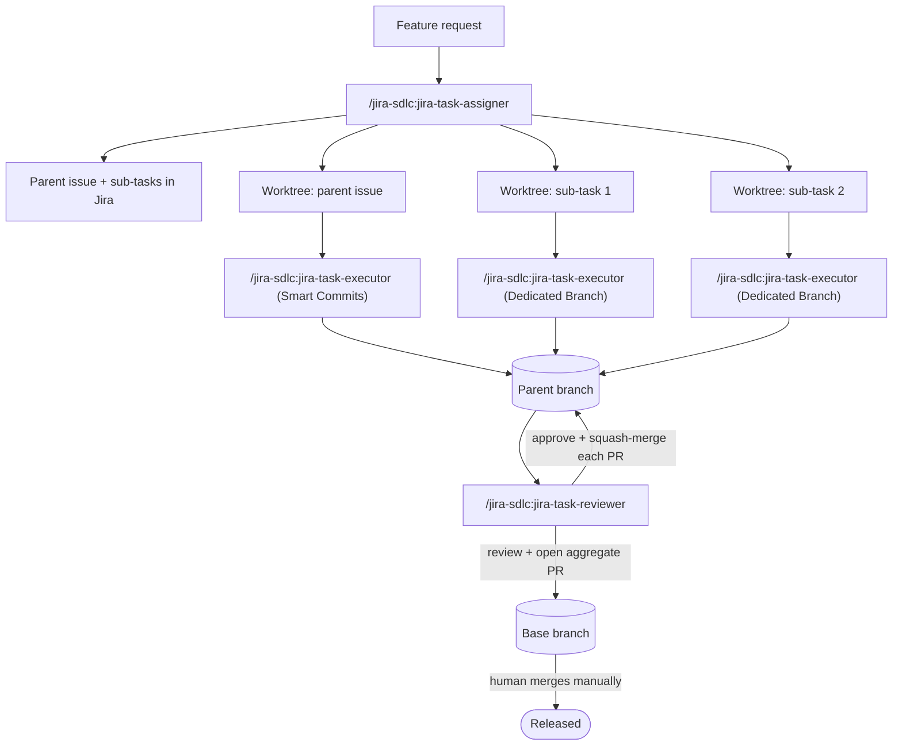

# jira-sdlc-toolkit

A Claude Code plugin with three skills — **`jira-task-assigner`**,
**`jira-task-executor`**, and **`jira-task-reviewer`** — that turn a
feature request into parallel, Jira-tracked implementation work using git
worktrees, and then review and merge the result as a single unit[cite: 2].

You describe the work once[cite: 2]. The assigner plans it into Jira issues,
branches, and worktrees[cite: 2]. An executor runs in each worktree and does the
implementation[cite: 2]. The reviewer works through the resulting PRs, merges what
passes, and stops on anything that doesn't — leaving only the final
release merge for a human[cite: 2].

## Contents

* [Overview](https://www.google.com/search?q=%23overview)
* [Quick start](https://www.google.com/search?q=%23quick-start)
* [How the three skills relate](https://www.google.com/search?q=%23how-the-three-skills-relate)
* [Core concepts](https://www.google.com/search?q=%23core-concepts)
* [Prerequisites](https://www.google.com/search?q=%23prerequisites)
* [Installation](https://www.google.com/search?q=%23installation)
* [Repository layout](https://www.google.com/search?q=%23repository-layout)
* [Configuration](https://www.google.com/search?q=%23configuration)
* [Usage walkthrough](https://www.google.com/search?q=%23usage-walkthrough)
* [Re-run behavior](https://www.google.com/search?q=%23re-run-behavior)
* [Safety model](https://www.google.com/search?q=%23safety-model)
* [Known limitations](https://www.google.com/search?q=%23known-limitations)
* [First-run verification checklist](https://www.google.com/search?q=%23first-run-verification-checklist)
* [Troubleshooting / FAQ](https://www.google.com/search?q=%23troubleshooting--faq)
* [The branching model this assumes](https://www.google.com/search?q=%23the-branching-model-this-assumes)
* [Contributing](https://www.google.com/search?q=%23contributing)
* [License](https://www.google.com/search?q=%23license)
* [Acknowledgments](https://www.google.com/search?q=%23acknowledgments)

---

## Overview

Splitting a feature into parallel work usually means someone manually
creates the Jira sub-tasks, manually sets up branches or worktrees for
each, manually tracks which PR targets what, and manually reviews and
merges everything back together at the end[cite: 2]. This toolkit automates all
of that *except* the two decisions that should stay human: the final
merge into your base branch, and anything genuinely ambiguous along the
way[cite: 2].

Three skills, three jobs[cite: 2]:

| Skill | Runs | Does |
| --- | --- | --- |
| `jira-task-assigner` | Once, on a task description | **Plans**: validates branch context, creates the parent issue, decides single-step vs. multistep, creates branches, provisions the mandatory parent worktree (and child worktrees if needed), and decides how each sub-task should land in git[cite: 2, 5]. Never writes code[cite: 2]. |
| `jira-task-executor` | Once per leaf issue, inside its assigned worktree | **Implements**: branch/worktree setup, Jira status transition, investigation, implementation, tests, commit, push, PR[cite: 2]. |
| `jira-task-reviewer` | Once, on the parent issue | **Integrates**: reviews each sub-task PR in order, approves and squash-merges what passes, stops on the first rejection, then preps (but never merges) the parent's own PR into its base[cite: 2]. |

---

## Quick start

```
/plugin marketplace add kantorv/jira-sdlc-toolkit
/plugin install jira-sdlc@jira-sdlc-toolkit

```

Create `jira-tools-plugin.env` in the project root for your repo (see
[Configuration](https://www.google.com/search?q=%23configuration)), then[cite: 2]:

```
/jira-sdlc:jira-task-assigner "Add CSV export to the reports page"

# cd into each worktree it creates, run this in each one:
/jira-sdlc:jira-task-executor PROJ-XXX

# once the sub-task PRs are up, from the main repo:
/jira-sdlc:jira-task-reviewer PROJ-XXX   # the *parent* key

```

The rest of this document explains what's actually happening at each of
those steps, and what to configure before you rely on it[cite: 2].

---

## How the three skills relate



Nothing here gets passed by hand[cite: 2]. Two mechanisms carry state between the
three skills[cite: 2]:

* **`git config branch.<branch>.parentbranch`** — set by the assigner on
every branch it creates, read by the executor (to find its PR base) and
the reviewer (to find the parent branch's own base)[cite: 2]. Local to a clone[cite: 2].
* **Jira comments** — `"PR target branch: ..."` and `"Git strategy: ..."`,
posted by the assigner as a durable fallback for the same information[cite: 2].
These survive a fresh clone or a different machine, which the git config
alone doesn't[cite: 2].

The executor and reviewer both check the git config first and fall back to
the Jira comment if it's missing[cite: 2].

---

## Core concepts

**Worktrees are the parallelism mechanism.**[cite: 2] To maintain a clean environment, the assigner **always** provisions a dedicated `git worktree` for the top-level parent issue[cite: 5]. For multi-step tasks, sub-tasks utilizing a dedicated branch get their own separate child worktrees, allowing multiple executors (or subagents) to implement different components in parallel without branch conflicts[cite: 2, 5].

**Dedicated branch vs. smart commit.** The assigner decides, per sub-task, how its implementation should land in git[cite: 2, 5]:

* **Dedicated branch** — receives its own child worktree and an isolated branch[cite: 5]. The executor delivers work via a standard Pull Request merging back into the parent branch[cite: 2, 5]. This is the default for substantial components requiring multi-file changes or extensive validation[cite: 2, 5].
* **Smart commit** — does not receive a separate child worktree[cite: 5]. The executor runs directly inside the shared **parent worktree** on the parent branch, utilizing the `<ISSUE-KEY> #done <message>` convention[cite: 2, 5]. GitHub-for-Jira reads this syntax and transitions the issue automatically without requiring a PR layer[cite: 2]. This is reserved for quick, focused, or sequential fixes[cite: 2, 5].

**The Unified Assignment Flow.** Instead of wrestling with complex combinatorics or guessing context from pre-existing branches, the assigner enforces a streamlined, predictable flow[cite: 5]:

1. **Base Branch Enforcement**: The tool must be run from a clean base branch (e.g., `main` or `development`)[cite: 5]. Running it from an existing feature or hotfix branch triggers an immediate abort[cite: 5].
2. **Mandatory Parent Foundation**: It always constructs a parent Jira issue (`Task`, `Story`, or `Bug`), initializes a dedicated parent branch, and establishes a local parent worktree[cite: 5].
3. **Linear Progression**: Single-step requests stop here[cite: 5]. Multistep requests break into sub-tasks under the newly minted parent, mapping each to either a dedicated branch worktree or a smart commit strategy on the parent worktree[cite: 5].

**Jira shape assumed.** Two-level hierarchy: `Task`/`Story`/`Bug` at the
top, `Sub-task` underneath, no `Epic`[cite: 2]. If your project has Epics, see
`<HAS_EPIC_TYPE>` in `jira-tools-plugin.env`[cite: 2].

**Jira status flow across the three skills.** Each skill drives the issue's
Kanban status explicitly with the four status names from
`jira-tools-plugin.env`, so board progress reflects the work without
relying on opaque GitHub-for-Jira transition rules[cite: 2]:

* New issues created by `jira-task-assigner` start in `<STATUS_TODO>`[cite: 2].
* `jira-task-executor` transitions a leaf issue to `<STATUS_IN_PROGRESS>`
when it starts work, then to `<STATUS_IN_REVIEW>` once it opens
the sub-task's PR (dedicated-branch path only)[cite: 2].
* `jira-task-reviewer` transitions a sub-task to `<STATUS_DONE>` when it
squash-merges its PR; transitions the parent to `<STATUS_IN_REVIEW>`
when it opens the aggregate PR; and to `<STATUS_DONE>` once the
human merges that PR[cite: 2].
The smart-commit path skips In Review — the `#done` Smart Commit
transitions the issue straight from In Progress to Done via GitHub-for-Jira[cite: 2].

---

## Prerequisites

* **Claude Code**, a version with plugin support[cite: 2].
* **[`jira-cli`](https://www.google.com/search?q=https://github.com/ankitpokhrel/jira-cli)** — the
ankitpokhrel fork specifically; authenticated (`jira init`) against your Jira Cloud instance[cite: 2].
* **GitHub CLI (`gh`)**, authenticated[cite: 2].
* **[GitHub-for-Jira](https://www.google.com/search?q=https://github.com/github/github-for-jira)**
connected between your Jira project and GitHub repo[cite: 2].
* **Git with worktree support** (any reasonably current git)[cite: 2].
* **A test runner and commands to plug into `jira-tools-plugin.env**`[cite: 2].
* **Semver PR labels** (`patch`/`minor`/`major`) already created on the GitHub repo[cite: 2].
* **A worktrees directory that already exists**, as a sibling of your
repo[cite: 2].

---

## Installation

### Option A — Plugin + marketplace (recommended)

1. Add the marketplace at `kantorv/jira-sdlc-toolkit` and install the
plugin[cite: 2]:
```
/plugin marketplace add kantorv/jira-sdlc-toolkit
/plugin install jira-sdlc@jira-sdlc-toolkit

```


2. Fill in `jira-tools-plugin.env` in the project root — see
[Configuration](https://www.google.com/search?q=%23configuration)[cite: 2].
3. The three skills are now available as `/jira-sdlc:jira-task-assigner`,
`/jira-sdlc:jira-task-executor`, and `/jira-sdlc:jira-task-reviewer`[cite: 2].

### Option B — Drop-in (no marketplace)

```bash
cp -r plugins/jira-sdlc/skills/* ~/.claude/skills/   # personal, all projects
# or
cp -r plugins/jira-sdlc/skills/* .claude/skills/     # project-level, commit it to your repo

```

Run from the root of your `kantorv/jira-sdlc-toolkit` clone[cite: 2]. Invocation uses the bare form: `/jira-task-assigner`, etc[cite: 2].

---

## Repository layout

```
jira-sdlc-toolkit/                # marketplace root (this repo)
├── .claude-plugin/
│   └── marketplace.json           # single-plugin marketplace manifest
└── plugins/
    └── jira-sdlc/                 # ← plugin root (what install copies)
        ├── .claude-plugin/
        │   └── plugin.json        # plugin metadata
        ├── skills/
        │   ├── jira-task-assigner/
        │   │   └── SKILL.md
        │   ├── jira-task-executor/
        │   │   └── SKILL.md
        │   ├── jira-task-reviewer/
        │   │   └── SKILL.md
        │   └── _shared/
        │       ├── jira-cli-reference.md
        │       └── project-config.md       # ← reference: describes .env variables
        ├── docs/
        │   ├── JIRA-GITHUB-API.md
        │   ├── JIRA-KANBAN-BOARD.md
        │   └── SDLC.md            # branching/release policy
        ├── LICENSE
        └── README.md

```

---

## Configuration

All project-specific values live in `jira-tools-plugin.env`
— see `skills/_shared/project-config.md` for a description of each variable[cite: 2]. Top configurations include your Jira project key, worktrees directory path, default base branch, and real workflow status names[cite: 2].

---

## Usage walkthrough

Say you're on `development` and want: *"Add CSV export to the reports page: backend endpoint, frontend button, and a quick localized cleanup text fix."*

**1. Plan it:**

```
/jira-sdlc:jira-task-assigner "Add CSV export to the reports page"

```

The assigner investigates the codebase, evaluates scope, and sets up a unified workspace structure[cite: 2, 5]:

* `PROJ-401` (parent Story) on branch `feature/PROJ-401-csv-export` -> allocates a mandatory parent worktree: `../myapp-worktrees/worktree-PROJ-401`[cite: 5].
* `PROJ-402` (backend endpoint sub-task) -> **Dedicated branch** strategy + individual child worktree[cite: 5].
* `PROJ-403` (frontend button sub-task) -> **Dedicated branch** strategy + individual child worktree[cite: 5].
* `PROJ-404` (cleanup text fix sub-task) -> **Smart commit** strategy targeting the parent worktree directly[cite: 5].

It reports the keys, branches, and worktree paths in chat, and posts the same as a Jira comment on `PROJ-401`[cite: 2].

**2. Implement each piece:**

For parallelized dedicated branches, step into their isolated worktrees[cite: 2]:

```bash
cd ../myapp-worktrees/worktree-PROJ-402 && claude
> /jira-sdlc:jira-task-executor PROJ-402

```

For the smart commit task (`PROJ-404`), step directly into the parent worktree[cite: 5]:

```bash
cd ../myapp-worktrees/worktree-PROJ-401 && claude
> /jira-sdlc:jira-task-executor PROJ-404

```

Each executor automatically matches the designated strategy, handles the implementation, pushes changes, and manages standard branch PR loops or instant smart commit closures[cite: 2, 5].

**3. Review and merge the set:**

```
/jira-sdlc:jira-task-reviewer PROJ-401

```

The reviewer evaluates all sub-tasks in sequence[cite: 2]. If they all pass automated review gates, it squash-merges them into `feature/PROJ-401-csv-export` and opens an aggregate PR targeting `development`[cite: 2].

**4. Merge the release:**
You merge `feature/PROJ-401-csv-export → development` manually on GitHub[cite: 2]. Running the reviewer one final time handles the post-merge wrap-up comment adjustments and cleanup recommendations[cite: 2].

---

## Re-run behavior

All skills check their context before executing to guarantee safe execution[cite: 2]:

* **Assigner** — Enforces a strict base branch constraint[cite: 5]. It cannot be re-run from inside an active feature or hotfix branch; it will halt immediately to avoid contaminating existing issue workspaces[cite: 5].
* **Executor** — Resumes work on an existing active branch/worktree safely rather than duplicate-provisioning assets[cite: 2].
* **Reviewer** — Dynamically steps through evaluation phases depending on whether sub-task PRs are open, the aggregate PR is ready, or the parent branch is fully merged[cite: 2].

---

## Safety model

Deliberately never automated, regardless of how routine a run looks[cite: 2]:

* **Merging the parent branch into its base.** Always a manual step for a human[cite: 2].
* **`jira issue delete`.** The skills hand back a ready-to-paste command instead of running it[cite: 2].
* **Conflict resolution.** A merge conflict stops the skill for manual human sorting[cite: 2].
* **Continuing past a rejected PR.** One `REQUEST_CHANGES` halts the entire cascade[cite: 2].

---

## Known limitations

* Built around **GitHub + GitHub-for-Jira** explicitly[cite: 2].
* Assumes **no Epic type** by default[cite: 2].
* The reviewer works through sub-task PRs **sequentially, by design**[cite: 2].
* Sub-task PRs are always **squash-merged**[cite: 2].

---

## First-run verification checklist

Confirm these capabilities via your terminal before initializing your first workflow[cite: 2]:

* [ ] `jira issue view <any-existing-key> --raw` — confirm `fields.subtasks` format[cite: 2].
* [ ] Fill your confirmed project workflow status names into `jira-tools-plugin.env`[cite: 2].
* [ ] `jira issue comment --help` — confirm support for `--template -` piping[cite: 2].
* [ ] `git config user.email` matches your Jira account's email exactly (mandatory for Smart Commits)[cite: 2].

---

## Troubleshooting / FAQ

**`gh pr merge` reports a conflict during the merge cascade.**
The reviewer stops and reports it[cite: 2]. Resolve the conflict manually and re-run the reviewer[cite: 2].

**Zero, or more than one, branch matches an issue key.**
Both the assigner and reviewer stop and ask rather than guessing stale branch configurations[cite: 2].

---

## The branching model this assumes

[`docs/SDLC.md`](https://www.google.com/search?q=docs/SDLC.md) outlines the full branch lifecycle (`main`, `development`, `feature/*`, `hotfix/*`) and sprint cadence standards followed by this toolkit[cite: 2]. If your branching parameters differ, customize that documentation and update your local variables inside `jira-tools-plugin.env`[cite: 2].

---

## Contributing

Issues and PRs welcome[cite: 2]. Please ensure any core adjustments describe exactly how they interact with the straight-line parent execution architecture and the git-config fallback behaviors[cite: 2].

---

## License

[MIT](https://www.google.com/search?q=LICENSE)[cite: 2].

---

## Acknowledgments

* [`ankitpokhrel/jira-cli`](https://www.google.com/search?q=https://github.com/ankitpokhrel/jira-cli) — the underlying engine for Jira coordination[cite: 2].
* [GitHub-for-Jira](https://www.google.com/search?q=https://github.com/github/github-for-jira) — enabling seamless issue transit hooks via automated smart commits[cite: 2].