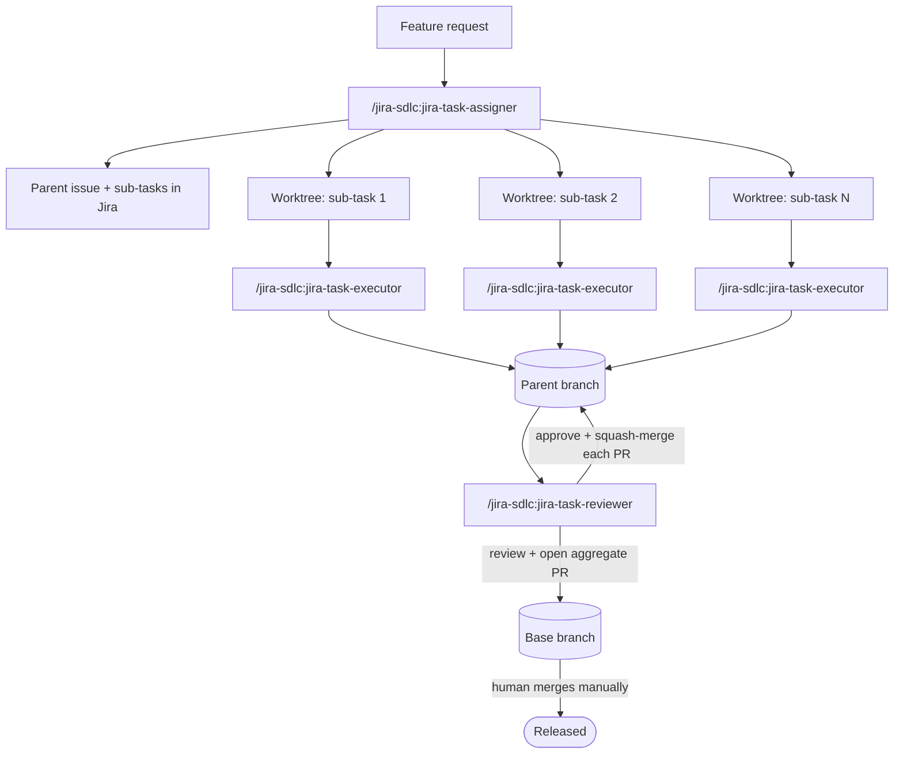

# jira-sdlc-toolkit

[](LICENSE)

A Claude Code plugin with three skills — **`jira-task-assigner`**,
**`jira-task-executor`**, and **`jira-task-reviewer`** — that turn a
feature request into parallel, Jira-tracked implementation work using git
worktrees, and then review and merge the result as a single unit.

You describe the work once. The assigner plans it into Jira issues,
branches, and worktrees. An executor runs in each worktree and does the
implementation. The reviewer works through the resulting PRs, merges what
passes, and stops on anything that doesn't — leaving only the final
release merge for a human.

## Contents

- [Overview](#overview)
- [Quick start](#quick-start)
- [How the three skills relate](#how-the-three-skills-relate)
- [Core concepts](#core-concepts)
- [Prerequisites](#prerequisites)
- [Installation](#installation)
- [Repository layout](#repository-layout)
- [Configuration](#configuration)
- [Usage walkthrough](#usage-walkthrough)
- [Re-run behavior](#re-run-behavior)
- [Safety model](#safety-model)
- [Known limitations](#known-limitations)
- [First-run verification checklist](#first-run-verification-checklist)
- [Troubleshooting / FAQ](#troubleshooting--faq)
- [The branching model this assumes](#the-branching-model-this-assumes)
- [Contributing](#contributing)
- [License](#license)
- [Acknowledgments](#acknowledgments)

## Overview

Splitting a feature into parallel work usually means someone manually
creates the Jira sub-tasks, manually sets up branches or worktrees for
each, manually tracks which PR targets what, and manually reviews and
merges everything back together at the end. This toolkit automates all
of that *except* the two decisions that should stay human: the final
merge into your base branch, and anything genuinely ambiguous along the
way.

Three skills, three jobs:

| Skill | Runs | Does |
|---|---|---|
| `jira-task-assigner` | Once, on a task description | Plans: creates the Jira issue(s), decides single-step vs. multistep, creates branches and `git worktree`s, decides how each piece should land in git. Never writes code. |
| `jira-task-executor` | Once per leaf issue, inside its worktree | Implements: branch/worktree setup, Jira status transition, investigation, implementation, tests, commit, push, PR. |
| `jira-task-reviewer` | Once, on the parent issue | Integrates: reviews each sub-task PR in order, approves and squash-merges what passes, stops on the first rejection, then preps (but never merges) the parent's own PR into its base. |

## Quick start

```
/plugin marketplace add kantorv/claude-code-plugins
/plugin install jira-sdlc@jira-sdlc-toolkit
```

Fill in `skills/_shared/project-config.md` for your repo (see
[Configuration](#configuration)), then:

```
/jira-sdlc:jira-task-assigner "Add CSV export to the reports page"

# cd into each worktree it creates, run this in each one:
/jira-sdlc:jira-task-executor PROJ-XXX

# once the sub-task PRs are up, from the main repo:
/jira-sdlc:jira-task-reviewer PROJ-XXX   # the *parent* key
```

The rest of this document explains what's actually happening at each of
those steps, and what to configure before you rely on it.

## How the three skills relate



Nothing here gets passed by hand. Two mechanisms carry state between the
three skills:

- **`git config branch.<branch>.parentbranch`** — set by the assigner on
  every branch it creates, read by the executor (to find its PR base) and
  the reviewer (to find the parent branch's own base). Local to a clone.
- **Jira comments** — `"PR target branch: ..."` and `"Git strategy: ..."`,
  posted by the assigner as a durable fallback for the same information.
  These survive a fresh clone or a different machine, which the git config
  alone doesn't.

The executor and reviewer both check the git config first and fall back to
the Jira comment if it's missing.

## Core concepts

**Worktrees are the parallelism mechanism.** Each leaf issue (a
self-contained single task, or one sub-task of a split) gets its own
`git worktree`, so multiple executors — separate terminals, or separate
subagents — can implement different pieces at the same time without
switching branches out from under each other in a single checkout.

**Dedicated branch vs. smart commit.** The assigner decides, per leaf
issue, how its work should land:
- **Dedicated branch** — its own branch and PR, merging into the branch
  its worktree was created from. The default when issues have separate
  worktrees.
- **Smart commit** — committed directly with a `<KEY> #done <message>`
  commit message (no new branch, no PR); GitHub-for-Jira reads the
  special syntax and transitions the issue automatically. The default
  when several small, non-parallelizable sub-tasks share one worktree.

The executor reads this decision from a Jira comment rather than
re-deciding it — see `jira-task-assigner`'s "Git strategy" section for
the full reasoning.

**The five assignment cases.** What the assigner creates depends on two
independent questions: does a parent issue already exist (inferred from
the current branch), and does the request split into genuinely
parallelizable pieces or not.

| Case | Parent exists? | Single- or multistep? | What gets created |
|---|---|---|---|
| A | No | Multistep | New parent issue + parent branch (no worktree of its own); one worktree + dedicated branch per sub-task, targeting the parent branch |
| B | No | Single-step | One issue; one worktree + dedicated branch targeting the base branch directly — no parent branch layer |
| C | Yes | Multistep | Sub-tasks under the existing parent; one worktree + dedicated branch per sub-task, targeting the parent branch |
| D | Yes | Single-step | Same as C, with exactly one sub-task |
| E | — | Single-step, but splits into non-parallelizable sub-tasks (e.g. all touch the same files) | New parent issue + parent branch; **one shared worktree**; each sub-task lands via **smart commit** instead of its own branch/PR |

**Jira shape assumed.** Two-level hierarchy: `Task`/`Story`/`Bug` at the
top, `Sub-task` underneath, no `Epic`. If your project has Epics, see
`<HAS_EPIC_TYPE>` in `project-config.md`.

## Prerequisites

- **Claude Code**, a version with plugin support.
- **[`jira-cli`](https://github.com/ankitpokhrel/jira-cli)** — the
  ankitpokhrel fork specifically; the shared reference documents its
  exact non-interactive flag behavior, which isn't identical across
  Jira CLIs. Authenticated (`jira init`) against your Jira Cloud instance.
- **GitHub CLI (`gh`)**, authenticated.
- **[GitHub-for-Jira](https://github.com/github/github-for-jira)**
  connected between your Jira project and GitHub repo — the smart-commit
  transitions and automatic branch-to-issue linking both depend on it.
- **Git with worktree support** (any reasonably current git).
- **A test runner and commands to plug into `project-config.md`** — the
  executor's test step ships with a Playwright example but the underlying
  policy is framework-agnostic.
- **Semver PR labels** (`patch`/`minor`/`major`, or your equivalents)
  already created on the GitHub repo — the executor requires one on every
  PR it opens.
- **A worktrees directory that already exists**, as a sibling of your
  repo — the assigner refuses to create it for you.

## Installation

### Option A — Plugin + marketplace (recommended)

1. Push this repo somewhere Claude Code can reach it (a GitHub repo is
   easiest).
2. In Claude Code:
   ```
   /plugin marketplace add YOUR_ORG/claude-code-plugins
   /plugin install jira-sdlc@jira-sdlc-toolkit
   ```
3. Fill in `skills/_shared/project-config.md` — see
   [Configuration](#configuration).
4. The three skills are now available as `/jira-sdlc:jira-task-assigner`,
   `/jira-sdlc:jira-task-executor`, and `/jira-sdlc:jira-task-reviewer`.

**Why the layout matters:** a marketplace install only copies the
plugin's own root directory into Claude Code's plugin cache. `_shared/`
lives at `skills/_shared/` — *inside* the plugin root — specifically so
the `../_shared/...` relative paths the three skills use still resolve
after install. Don't restructure this into three independent plugins that
each try to reach a `_shared/` sitting outside themselves; that path
won't survive the copy.

**If you rename the plugin** (the `name` field in
`.claude-plugin/plugin.json`), also update the three self-referential
`/jira-sdlc:...` mentions inside `jira-task-assigner` (step 8) and
`jira-task-reviewer` (step 5, both report templates) to match your new
name — those are the only places the plugin name is hardcoded into the
skill bodies themselves.

### Option B — Drop-in (no marketplace)

```bash
cp -r skills/* ~/.claude/skills/   # personal, all projects
# or
cp -r skills/* .claude/skills/     # project-level, commit it to your repo
```

Invocation is then the bare form: `/jira-task-assigner`,
`/jira-task-executor`, `/jira-task-reviewer` — there's no plugin
namespace. If you go this route, edit the three `/jira-sdlc:...`
references mentioned above back down to their bare form.

## Repository layout

```
claude-code-plugins/                # marketplace root (this repo)
├── .claude-plugin/
│   └── marketplace.json           # single-plugin marketplace manifest
└── plugins/
    └── jira-sdlc/                 # ← plugin root (what install copies)
        ├── .claude-plugin/
        │   └── plugin.json        # plugin metadata (the only file in here)
        ├── skills/
        │   ├── jira-task-assigner/
        │   │   └── SKILL.md
        │   ├── jira-task-executor/
        │   │   └── SKILL.md
        │   ├── jira-task-reviewer/
        │   │   └── SKILL.md
        │   └── _shared/
        │       ├── jira-cli-reference.md   # jira-cli syntax, auth, git conventions
        │       └── project-config.md       # ← fill this in for your project
        ├── docs/
        │   ├── JIRA-GITHUB-API.md
        │   ├── JIRA-KANBAN-BOARD.md
        │   └── SDLC.md            # the branching/release policy these skills assume
        ├── LICENSE
        └── README.md
```

The marketplace root (`claude-code-plugins/`) hosts `marketplace.json`; `plugins/jira-sdlc/`
is the plugin root Claude Code copies on install. `_shared/` lives inside it
deliberately — see [Installation](#installation) for why that matters.

## Configuration

All project-specific values live in **`skills/_shared/project-config.md`**
— nothing else under `skills/` should need editing. It covers:

- Your Jira project key and worktrees directory (required)
- Your default base branch and where your coding conventions live
  (required)
- Test commands for `jira-task-executor`'s test step
- Your Jira workflow's real status names — these are flagged as
  "confirm once" inside the skills themselves, since status *names*
  aren't standardized across Jira projects
- Semver label names, the Jira auth token fallback path, and whether your
  project has an `Epic` type (optional — sensible defaults given)

Open that file and read it top to bottom before your first run; it's
short, and every skill points back to it.

## Usage walkthrough

Say you're on `development` and want: *"Add CSV export to the reports
page: backend endpoint, frontend button, tests."*

**1. Plan it:**
```
/jira-sdlc:jira-task-assigner "Add CSV export to the reports page: backend endpoint, frontend button, tests"
```
The assigner investigates the codebase, asks anything genuinely
ambiguous, decides this splits into independent pieces (multistep, case A
— no parent branch exists yet), and creates:
- `PROJ-401` (parent Task) on `feature/PROJ-401-csv-export`
- `PROJ-402` (backend endpoint) → worktree, dedicated branch
- `PROJ-403` (frontend button) → worktree, dedicated branch
- `PROJ-404` (tests) → worktree, dedicated branch

It reports the keys, branches, and worktree paths in chat, and posts the
same as a Jira comment on `PROJ-401`.

**2. Implement each piece — in parallel:**

In three terminals (or three subagents, one per worktree):
```
cd ../myapp-worktrees/worktree-PROJ-402 && claude
> /jira-sdlc:jira-task-executor PROJ-402
```
...and the same for `PROJ-403` and `PROJ-404`. Each executor reads its own
`Git strategy:` comment, implements, tests, commits, pushes, and opens a
PR into `feature/PROJ-401-csv-export`, then reports the PR link.

**3. Review and merge the set:**
```
/jira-sdlc:jira-task-reviewer PROJ-401
```
The reviewer works through `PROJ-402` → `PROJ-403` → `PROJ-404` in order.
Only if **all three** pass does it approve-and-squash-merge each into
`feature/PROJ-401-csv-export`, then open (or find) the aggregate PR from
that branch into `development`, review that too, and report it's ready
for you to merge — it stops short of merging that one itself.

If `PROJ-403` had failed review, the reviewer stops immediately: it
doesn't even review `PROJ-404`, and *nothing* gets merged, not even
`PROJ-402`. It reports which PRs were reviewed and the specific findings
blocking `PROJ-403`, and tells you to fix it and re-run. The next run
starts the whole review pass over — re-reviewing `PROJ-402` and
`PROJ-404` too, deliberately, since diffs are usually small and an early
exit means they were never actually confirmed against their latest state.

**4. Merge the release:**

You merge `feature/PROJ-401-csv-export → development` manually on
GitHub — always a human step. Then run the reviewer once more:
```
/jira-sdlc:jira-task-reviewer PROJ-401
```
It detects the parent PR is now merged, posts a final Jira comment on
`PROJ-401` summarizing everything that landed, and lists any orphaned
local branches for you to clean up.

## Re-run behavior

All three skills check "what phase am I in" before acting, so re-invoking
mid-flight is safe by design:

- **Assigner**, run again against a branch that already has a parent →
  treats new sub-tasks as siblings under the existing parent (cases C/D)
  instead of creating a duplicate parent.
- **Executor**, run again on an issue with an existing branch → resumes
  it rather than creating a second branch for the same issue.
- **Reviewer** — no parent PR yet → full review pass. Parent PR open →
  only refreshes the aggregate review, doesn't re-touch sub-tasks. Parent
  PR merged → runs the post-merge wrap-up and nothing else.

## Safety model

Deliberately never automated, regardless of how routine a run looks:

- **Merging the parent branch into its base.** Always a manual step for
  a human — the reviewer only ever prepares and approves that PR.
- **`jira issue delete`.** The skills hand back a ready-to-paste command
  instead of running it, even for throwaway issues created in the same
  session.
- **Resolving an ambiguous branch match.** Zero or multiple branches
  matching a key means the skill asks, rather than guessing which one
  you meant.
- **Conflict resolution.** A merge conflict — sub-task into parent, or
  parent into base — stops the relevant skill for you to resolve by hand.
- **Continuing past a rejected PR.** One `REQUEST_CHANGES` halts the
  whole review/merge cascade, not just that one PR.

## Known limitations

- Built around **GitHub + GitHub-for-Jira** specifically — smart commits
  and branch-to-issue linking both rely on that integration. Adapting to
  GitLab/Bitbucket means replacing those mechanisms, not just swapping
  CLI commands.
- Assumes **no Epic type**. See `<HAS_EPIC_TYPE>` in
  `project-config.md` if yours has one.
- The reviewer works through sub-task PRs **sequentially, by design** —
  not in parallel — so the early-exit behavior stays simple to reason
  about. For a large sub-task count this means later PRs wait on earlier
  ones being reviewed first.
- Sub-task PRs are always **squash-merged**. If you need merge commits or
  rebase-merges preserved, that's a change to `jira-task-reviewer` step
  4a.
- An AI code review is not a substitute for the human judgment still
  required at the one step that's never automated (the final merge) —
  treat the automated review as a strong first pass, not a replacement
  for your own team's standards.

## First-run verification checklist

A few things the skills themselves flag as "confirm once against real
output" rather than assume — worth running deliberately before your first
real task, not discovering mid-failure:

- [ ] `jira issue view <any-existing-key> --raw` — confirm
      `fields.subtasks` is shaped the way the skills expect (an array of
      objects with a `.key`, not bare strings).
  - Prints your project's real workflow status names — fill the
      confirmed values into `<STATUS_IN_PROGRESS>` / `<STATUS_DONE>` in
      `project-config.md`.
- [ ] `jira issue comment --help` — confirm the flag for piping a
      multi-line comment from stdin (the skills assume `--template -`).
- [ ] `jira open <any-key> --no-browser` — confirm it prints the issue URL
      rather than trying to open a browser.
- [ ] `git config user.email` matches your Jira account's email exactly
      — required for Smart Commit's `#done` to fire.
- [ ] `gh api repos/<org>/<repo>/labels --jq '.[].name'` — confirm your
      semver labels exist (or update `<SEMVER_LABELS>` in
      `project-config.md` to match what does).

## Troubleshooting / FAQ

**`gh pr merge` reports a conflict during the merge cascade.**
Expected behavior — the reviewer stops and reports it rather than
attempting automatic resolution. Resolve the conflict yourself and
re-run.

**The parent PR was closed instead of merged.**
The reviewer stops and asks what you want to do rather than reopening it
or creating a replacement PR on its own.

**`gh` isn't installed, or isn't authenticated.**
The relevant skill reports the problem and gives you the PR/compare URLs
directly so you can review or merge manually.

**Zero, or more than one, branch matches an issue key.**
Both the assigner and reviewer stop and ask rather than guessing — this
usually means a stale branch, a naming typo, or two branches that
shouldn't both reference that key.

**A full test suite run reports failures, but the individual tests
passed.**
The executor treats this as likely flakiness: it re-runs only the failed
tests individually before deciding whether the suite actually passed. A
second individual failure stops the run for your input — it won't keep
retrying on its own.

**I renamed the plugin and now the reviewer's "re-run" instructions in
its own report are wrong.**
See the note in [Installation](#installation) — three self-references
inside `jira-task-assigner` and `jira-task-reviewer` hardcode the
`jira-sdlc:` prefix and need a matching update.

## The branching model this assumes

[`docs/SDLC.md`](docs/SDLC.md) is the full branching and release policy
these skills were written against: `main` / `development` /
`feature/*` / `hotfix/*` / `release/*` branches, a two-week sprint
cadence with a feature-freeze cut, an emergency hotfix flow that bypasses
`development` entirely, SemVer tagging on `main`, and feature flags for
anything that spans more than one sprint. It also includes a short set of
directives aimed specifically at AI coding assistants (branch naming,
target-branch defaults, feature-flag wrapping, commit message format).

If your branching model differs, adapt that document to match yours, then
update `<DEFAULT_BASE_BRANCH>` in `project-config.md` and the
`feature/`/`hotfix/` prefix logic in `jira-task-assigner` and
`jira-cli-reference.md` §7b accordingly — the skills follow whatever
policy `docs/SDLC.md` describes, not the other way around.

## Contributing

Issues and PRs welcome. If you're proposing a change to one of the three
`SKILL.md` files, please describe which of the five assignment cases (or
which review/execution step) it affects — the control flow between the
three skills is easy to get subtly wrong at the seams (git-config vs.
Jira-comment fallback, phase detection, early-exit behavior), so a
concrete before/after scenario in the PR description goes a long way.

## License

[MIT](LICENSE).

## Acknowledgments

- [`ankitpokhrel/jira-cli`](https://github.com/ankitpokhrel/jira-cli) —
  the CLI these skills are written against.
- [`Introducing JIRA cli`](https://medium.com/@ankitpokhrel/introducing-jira-cli-the-missing-command-line-tool-for-atlassian-jira-fe44982cc1de) — Medium article
- [GitHub-for-Jira](https://github.com/github/github-for-jira) — smart
  commits and automatic branch-to-issue linking.
- Built for [Claude Code](https://claude.com/claude-code).
