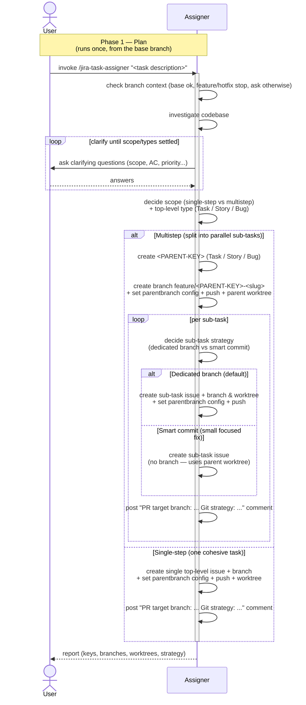

# Task Lifecycle — Phase 1: Plan

The planning phase of [TASK-LIFECYCLE.md](TASK-LIFECYCLE.md), run by the
**`jira-task-assigner`** skill. Triggered once per task, **invoked from
the default base branch** — the assigner refuses to run on an existing
`feature/`/`hotfix/` issue branch, and asks the user how to proceed on
any other non-base branch.

This phase ends when the assigner reports back: issues exist, branches
and worktrees are ready, and a single
`"PR target branch: ... Git strategy: ..."` comment is posted on every
leaf issue for the next phase to read.

## Sequence diagram

## What the diagram shows

- **Investigate + clarify loop** — the only place the user is asked
  anything by `jira-task-assigner`; questions persist until scope,
  acceptance criteria, and priority are settled.
- **Two-stage decision** — first the assigner settles scope and the
  top-level type (`alt Multistep / else Single-step`); only then,
  inside the multistep loop, does it pick each sub-task's per-leaf
  strategy (nested `alt Dedicated branch / else Smart commit`). The
  per-sub-task strategy is *not* fixed up front — it's chosen as each
  sub-task is created.
- **Provisioning is uniform** — *every* scenario (single-step,
  multistep parent, dedicated-branch sub-task, smart-commit sub-task)
  records `branch.<branch>.parentbranch` in git config, pushes the
  branch to the remote, and ends with the assigner posting a single
  `PR target branch: ... Git strategy: ...` comment (one comment with
  both lines) that the executor and reviewer will read later as the
  durable source of truth.

The assigner deliberately stops short of writing any code, commits, or
PRs — those are phase 2's job.

## Related

- [TASK-LIFECYCLE.md](TASK-LIFECYCLE.md) — full lifecycle with all four phases
- [jira-task-assigner SKILL.md](../skills/jira-task-assigner/SKILL.md)
