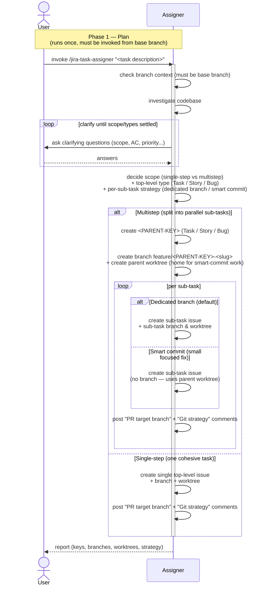

# Task Lifecycle — Phase 1: Plan

The planning phase of [TASK-LIFECYCLE.md](TASK-LIFECYCLE.md), run by the
**`jira-task-assigner`** skill. Triggered once per task, **must be
invoked from the default base branch** (the assigner refuses to run on
an existing feature/hotfix branch).

This phase ends when the assigner reports back: issues exist, branches
and worktrees are ready, and `"PR target branch: ..."` plus
`"Git strategy: ..."` comments are posted on every leaf issue for the
next phase to read.

## Sequence diagram

## What the diagram shows

- **Investigate + clarify loop** — the only place the user is asked
  anything by `jira-task-assigner`; questions persist until scope,
  acceptance criteria, and priority are settled.
- **One decision point** that admits three dimensions at once
  (`alt Multistep / else Single-step`, with another nested
  `alt Dedicated branch / else Smart commit` per leaf): whether the
  request is single-step, how to type the top-level issue, and how each
  sub-task should land in git.
- **Provisioning is uniform** — *every* scenario (single-step,
  multistep parent, dedicated-branch sub-task, smart-commit sub-task)
  ends with the assigner posting the `PR target branch` and
  `Git strategy` comments that the executor and reviewer will read
  later as their durable source of truth.

The assigner deliberately stops short of writing any code, commits, or
PRs — those are phase 2's job.

## Related

- [TASK-LIFECYCLE.md](TASK-LIFECYCLE.md) — full lifecycle with all four phases
- [jira-task-assigner SKILL.md](../skills/jira-task-assigner/SKILL.md)
