# Task Lifecycle — Phase 1: Plan

The planning phase of [TASK-LIFECYCLE.md](TASK-LIFECYCLE.md), run by the
**`jira-task-assigner`** skill. Triggered once per task, **invoked from
the default base branch** — the assigner refuses to run on an existing
`feature/`/`hotfix/` issue branch, and asks the user how to proceed on
any other non-base branch.

This phase ends when the assigner reports back: issues exist, branches
and worktrees are ready, and a single
`"PR target branch: ... Worktree: ..."` comment is posted on every
leaf issue for the next phase to read.

The diagram surfaces the two systems the assigner actually drives as
their own swimlanes — **GIT** (anything that mutates repo state:
reading the current branch, creating branches, setting
`parentbranch` config, pushing, adding worktrees) and **JIRA**
(anything that mutates issue state: creating the top-level or sub-task
issue, posting comments) — so the full interaction reads
`User ↔ Assigner ↔ GIT ↔ JIRA` left to right.

## Sequence diagram

```mermaid
sequenceDiagram
    actor User
    participant Assigner
    participant GIT
    participant JIRA

    Note over User,JIRA: Phase 1 — Plan<br/>(runs once, from the base branch)
    User->>Assigner: invoke /jira-task-assigner "<task description>"

    activate Assigner
    Assigner->>GIT: read current branch (base? feature/hotfix? other?)
    GIT-->>Assigner: current branch
    Note right of Assigner: base → continue · feature/hotfix → stop · other → ask user
    Assigner->>Assigner: investigate codebase

    loop clarify until scope/types settled
        Assigner->>User: ask clarifying questions (scope, AC, priority...)
        User-->>Assigner: answers
    end

    Assigner->>Assigner: decide scope (single-step vs multistep)<br/>+ top-level type (Task / Story / Bug)

    alt Multistep (split into parallel sub-tasks)
        Assigner->>JIRA: create <PARENT-KEY> issue (Task / Story / Bug)
        JIRA-->>Assigner: <PARENT-KEY>
        Assigner->>GIT: create branch feature/<PARENT-KEY>-<slug>,<br/>set parentbranch config, push, add parent worktree
        GIT-->>Assigner: branch + worktree ready
        loop per sub-task
            Assigner->>JIRA: create sub-task issue (link parent <PARENT-KEY>)
            JIRA-->>Assigner: sub-task key
            Assigner->>GIT: create sub-task branch + worktree,<br/>set parentbranch config, push
            GIT-->>Assigner: branch + worktree ready
            Assigner->>JIRA: post "PR target branch: ... Worktree: ..." comment
        end
    else Single-step (one cohesive task)
        Assigner->>JIRA: create single top-level issue
        JIRA-->>Assigner: issue key
        Assigner->>GIT: create branch + worktree,<br/>set parentbranch config, push
        GIT-->>Assigner: branch + worktree ready
        Assigner->>JIRA: post "PR target branch: ... Worktree: ..." comment
    end
    deactivate Assigner

    Assigner-->>User: report (keys, branches, worktrees, strategy)
```

## What the diagram shows

- **Participant routing** — the assigner is the orchestrator between
  three parties. **GIT** owns repo state (the initial branch-context
  read, branch creation, the `branch.<branch>.parentbranch` git config
  entry, the push, and `git worktree add`). **JIRA** owns issue state
  (creating the top-level or sub-task issue — the sub-task carries its
  parent link — and posting the durable `PR target branch` comment).
  Everything else (investigating the codebase, deciding scope) stays
  inside the assigner.
- **Investigate + clarify loop** — the only place the user is asked
  anything by `jira-task-assigner`; questions persist until scope,
  acceptance criteria, and priority are settled. (The branch-context
  "ask otherwise" path, if triggered, is also a user question.)
- **Scope decision first** — the assigner settles scope and the
  top-level type (`alt Multistep / else Single-step`); inside the
  multistep loop it provisions each sub-task's issue (JIRA) then branch
  + worktree (GIT) uniformly.
- **Provisioning is uniform** — *every* scenario (single-step,
  multistep parent, sub-task) records `branch.<branch>.parentbranch`
  in git config via GIT, pushes the branch to the remote via GIT, and
  ends with the assigner posting a single `PR target branch: ...
  Worktree: ...` comment to JIRA that the executor and reviewer will
  read later as the durable source of truth.

The assigner deliberately stops short of writing any code, commits, or
PRs — those are phase 2's job.

## Related

- [TASK-LIFECYCLE.md](TASK-LIFECYCLE.md) — full lifecycle with all three phases
- [jira-task-assigner SKILL.md](../skills/jira-task-assigner/SKILL.md)
