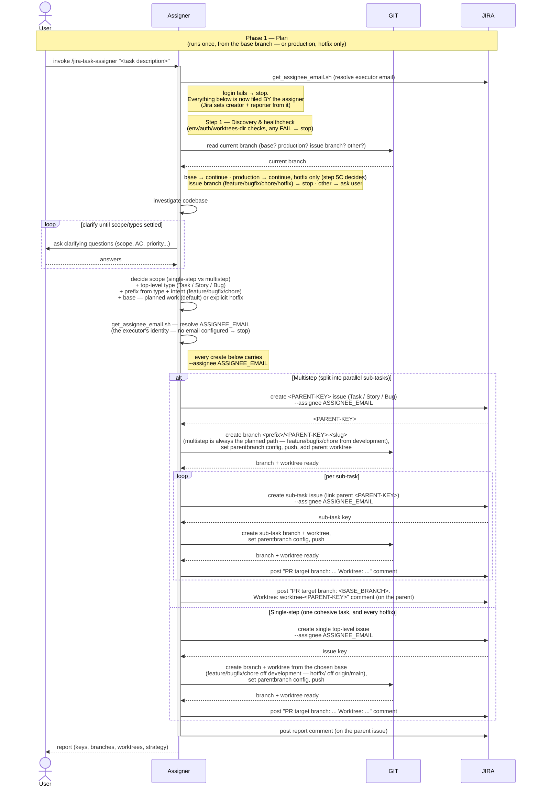

# Task Lifecycle — Phase 1: Plan

Phase 1 of the task lifecycle, run by the **`jira-task-assigner`** skill.
Triggered once per task, **invoked from the default base branch** (or from
the production branch, which is accepted only for an emergency hotfix) — the
assigner refuses to run on an existing issue branch of any prefix
(`feature/`, `bugfix/`, `chore/`, `hotfix/`),
and asks the user how to proceed on any other branch.

This phase ends when the assigner reports back: issues exist, branches
and worktrees are ready, a `"PR target branch: ... Worktree: ..."`
comment is posted on every leaf issue (plus one more on the parent
issue itself in the multistep case) for the next phase to read, and
the report itself is posted as a Jira comment on the parent issue in
addition to the chat reply.

The diagram surfaces the two systems the assigner actually drives as
their own swimlanes — **GIT** (anything that mutates repo state:
reading the current branch, creating branches, setting
`parentbranch` config, pushing, adding worktrees) and **JIRA**
(anything that mutates issue state: creating the top-level or sub-task
issue, posting comments) — so the full interaction reads
`User ↔ Assigner ↔ GIT ↔ JIRA` left to right.

## Sequence diagram

```mermaid
sequenceDiagram
    actor User
    participant Assigner
    participant GIT
    participant JIRA

    Note over User,JIRA: Phase 1 — Plan<br/>(runs once, from the base branch — or production, hotfix only)
    User->>Assigner: invoke /jira-task-assigner "<task description>"

    activate Assigner
    Assigner->>JIRA: get_assignee_email.sh (resolve executor email)
    Note right of Assigner: login fails → stop.<br/>Everything below is now filed BY the assigner<br/>(Jira sets creator + reporter from it)
    Note right of Assigner: Step 1 — Discovery & healthcheck<br/>(env/auth/worktrees-dir checks, any FAIL → stop)
    Assigner->>GIT: read current branch (base? production? issue branch? other?)
    GIT-->>Assigner: current branch
    Note right of Assigner: base → continue · production → continue, hotfix only (step 5C decides)<br/>issue branch (feature/bugfix/chore/hotfix) → stop · other → ask user
    Assigner->>Assigner: investigate codebase

    loop clarify until scope/types settled
        Assigner->>User: ask clarifying questions (scope, AC, priority...)
        User-->>Assigner: answers
    end

    Assigner->>Assigner: decide scope (single-step vs multistep)<br/>+ top-level type (Task / Story / Bug)<br/>+ prefix from type + intent (feature/bugfix/chore)<br/>+ base — planned work (default) or explicit hotfix

    Assigner->>Assigner: get_assignee_email.sh — resolve ASSIGNEE_EMAIL<br/>(the executor's identity — no email configured → stop)
    Note right of Assigner: every create below carries<br/>--assignee ASSIGNEE_EMAIL

    alt Multistep (split into parallel sub-tasks)
        Assigner->>JIRA: create <PARENT-KEY> issue (Task / Story / Bug)<br/>--assignee ASSIGNEE_EMAIL
        JIRA-->>Assigner: <PARENT-KEY>
        Assigner->>GIT: create branch <prefix>/<PARENT-KEY>-<slug><br/>(multistep is always the planned path — feature/bugfix/chore from development),<br/>set parentbranch config, push, add parent worktree
        GIT-->>Assigner: branch + worktree ready
        loop per sub-task
            Assigner->>JIRA: create sub-task issue (link parent <PARENT-KEY>)<br/>--assignee ASSIGNEE_EMAIL
            JIRA-->>Assigner: sub-task key
            Assigner->>GIT: create sub-task branch + worktree,<br/>set parentbranch config, push
            GIT-->>Assigner: branch + worktree ready
            Assigner->>JIRA: post "PR target branch: ... Worktree: ..." comment
        end
        Assigner->>JIRA: post "PR target branch: <BASE_BRANCH>.<br/>Worktree: worktree-<PARENT-KEY>" comment (on the parent)
    else Single-step (one cohesive task, and every hotfix)
        Assigner->>JIRA: create single top-level issue<br/>--assignee ASSIGNEE_EMAIL
        JIRA-->>Assigner: issue key
        Assigner->>GIT: create branch + worktree from the chosen base<br/>(feature/bugfix/chore off development — hotfix/ off origin/main),<br/>set parentbranch config, push
        GIT-->>Assigner: branch + worktree ready
        Assigner->>JIRA: post "PR target branch: ... Worktree: ..." comment
    end
    Assigner->>JIRA: post report comment (on the parent issue)
    deactivate Assigner

    Assigner-->>User: report (keys, branches, worktrees, strategy)
```

## What the diagram shows

- **Participant routing** — the assigner is the orchestrator between
  three parties. **GIT** owns repo state (the initial branch-context
  read, branch creation, the `branch.<branch>.parentbranch` git config
  entry, the push, and `git worktree add`). **JIRA** owns issue state
  (creating the top-level or sub-task issue — the sub-task carries its
  parent link — and posting the durable `PR target branch` comment).
  Everything else (investigating the codebase, deciding scope) stays
  inside the assigner.
- **Two identities, and they are not the same one** — the assigner
  **authenticates as itself** (per-request `--role assigner`) before anything
  else, so Jira records it as the `creator` and `reporter` of every issue
  here — both are derived from the authenticated account, no flag needed.
  But each issue is **assigned to the executor** (`get_assignee_email.sh`
  → `--assignee` on every create, top-level *and* sub-task), because the
  executor is who will pick it up — and phase 2 *refuses* an issue that
  isn't assigned to it. So the board reads correctly end to end: filed by
  the assigner, owned by the executor. Both identities come from that role's
  own required credential pair — there is no default account either can fall
  back to. See
  [`../skills/_shared/project-config.md`](../skills/_shared/project-config.md).
- **Investigate + clarify loop** — the only place the user is asked
  anything by `jira-task-assigner`; questions persist until scope,
  acceptance criteria, and priority are settled. (The branch-context
  "ask otherwise" path, if triggered, is also a user question.)
- **Scope decision first** — the assigner settles scope and the
  top-level type (`alt Multistep / else Single-step`); inside the
  multistep loop it provisions each sub-task's issue (JIRA) then branch
  - worktree (GIT) uniformly.
- **The base decision rides along with scope** — planned work (the
  default) branches off `development` under whichever prefix the issue type
  and intent call for (`feature/`, `bugfix/` or `chore/` — SDLC.md §2),
  while an *explicitly
  requested* emergency production fix branches a single `hotfix/` off
  `origin/main` (SDLC.md §4). Because it cuts from the fetched remote ref
  rather than checking production out, the hotfix works the same whether
  you invoke it from `development` or from `main` — `main` is a permitted
  start state, never a required one, and step 5C stops if it turns out to
  be planned work. Either way the `Multistep` arm is always the planned
  path, and the two never mix within a run.
- **Provisioning is uniform** — *every* scenario (single-step,
  multistep parent, sub-task) records `branch.<branch>.parentbranch`
  in git config via GIT, pushes the branch to the remote via GIT, and
  ends with the assigner posting a `PR target branch: ... Worktree: ...` comment to JIRA for that leaf — the durable source of
  truth the executor and reviewer will read later. In the multistep
  case this happens once per sub-task *and* once more on the parent
  issue after the sub-task loop, so it's neither one-per-leaf nor a
  single comment overall.
- **The final report is durable too** — before `deactivate Assigner`,
  the report goes to JIRA as a comment on the parent issue in addition
  to the chat reply to the user, so a later phase (or a fresh session)
  can recover it without relying on chat history.

The assigner deliberately stops short of writing any code, commits, or
PRs — those are phase 2's job.

## Related

- [Phase 2 — Implement](TASK-LIFECYCLE-PHASE-2.md)
- [Phase 3 — Review & aggregate approval](TASK-LIFECYCLE-PHASE-3.md)
- [jira-task-assigner SKILL.md](../skills/jira-task-assigner/SKILL.md)
