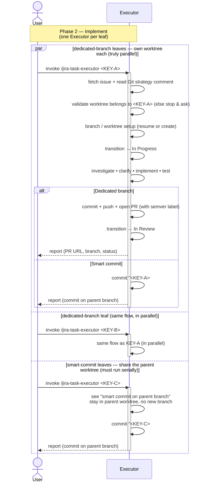

# Task Lifecycle — Phase 2: Implement

The implementation phase of [TASK-LIFECYCLE.md](TASK-LIFECYCLE.md), run
by the **`jira-task-executor`** skill. Triggered **once per leaf
issue**, from inside its dedicated—or shared parent—worktree. Multiple
executors run in parallel against the worktrees the assigner set up.

## Sequence diagram

## What the diagram shows

- **Parallel lanes** — the `par / and / and / end` block encodes the
  worktree-level parallelism the assigner's phase 1 setup makes
  possible. **Dedicated-branch leaves each have their own worktree**
  and can run concurrently; **smart-commit leaves share the parent
  worktree**, so two smart-commit invocations must run serially (they'd
  collide in the same working tree).
- **Branch of two paths** — the executor reads the `Git strategy:`
  comment and follows one of two shapes:
  - **Dedicated branch** (default): commit on its own branch, push,
    open a PR (with a required semver label), transition to
    *In Review*. The PR is the thing phase 3 reviews.
  - **Smart commit** (small focused fixes): local commit on the
    parent branch using the `<KEY> #done <msg>` message — no push, no
    PR. GitHub-for-Jira picks up the `#done` and transitions the issue
    straight to *Done* once the parent branch reaches the remote.
- **Status transitions the executor owns** — to *In Progress* on
  start, to *In Review* on PR open (dedicated branch only). Smart
  commits deliberately *stay* at *In Progress* here; the `#done`
  message owns their final transition.
- **Single closing comment** — the executor posts one Jira comment
  per run, not a short "PR opened" earlier in the flow.
- **Guards before work starts** — the executor validates that its
  worktree actually belongs to `<KEY>` (or its parent family) before
  doing anything, and if `<KEY>` turns out to be a multistep parent it
  asks the user to confirm rather than silently implementing on it.

## Related

- [TASK-LIFECYCLE.md](TASK-LIFECYCLE.md) — full lifecycle with all four phases
- [jira-task-executor SKILL.md](../skills/jira-task-executor/SKILL.md)
