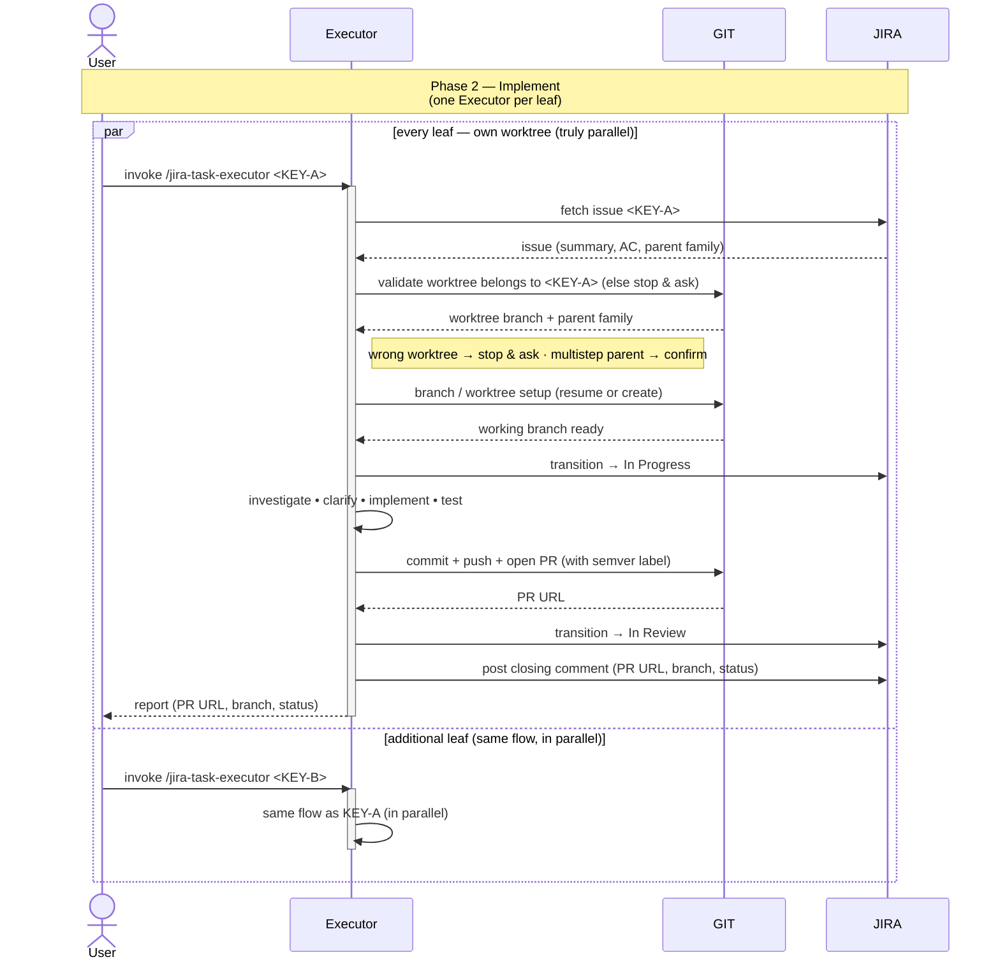

# Task Lifecycle — Phase 2: Implement

The implementation phase of [TASK-LIFECYCLE.md](TASK-LIFECYCLE.md), run
by the **`jira-task-executor`** skill. Triggered **once per leaf
issue**, from inside its own worktree. Multiple
executors run in parallel against the worktrees the assigner set up.

The diagram surfaces the two systems the executor drives as their own
swimlanes — **GIT** (anything that mutates repo state: reading the
worktree's branch and `parentbranch` config, resuming or creating a
worktree, committing, pushing, opening the PR with its semver label)
and **JIRA** (anything that mutates issue state: fetching the issue,
the *In Progress* / *In Review* transitions, the closing comment) —
so the full interaction reads `User ↔ Executor ↔ GIT ↔ JIRA` left to
right.

## Sequence diagram

## What the diagram shows

- **Participant routing** — the executor orchestrates between three
  parties. **GIT** owns repo state (the worktree-ownership read, the
  resume-or-create setup, the commit, the push, and the PR open with its
  required semver label). **JIRA** owns issue state (the issue fetch that
  carries the parent family used in the ownership check, the *In
  Progress* and *In Review* transitions, and the closing comment).
  Everything else (investigating, clarifying, implementing, testing)
  stays inside the executor.
- **Parallel lanes** — the `par / and / end` block encodes the
  worktree-level parallelism the assigner's phase 1 setup makes
  possible. **Every leaf has its own worktree** and can run concurrently.
- **Uniform path** — the executor validates its worktree (GIT), sets up
  its branch, commits, pushes, opens a PR (GIT — with a required semver
  label), transitions to *In Review* (JIRA), and posts its one closing
  comment (JIRA). The PR is the thing phase 3 reviews.
- **Status transitions the executor owns** — to *In Progress* on start,
  to *In Review* on PR open (both JIRA).
- **Single closing comment** — the executor posts one Jira comment per
  run, not a short "PR opened" earlier in the flow. Here it's shown
  explicitly as a `Executor → JIRA` arrow after the *In Review*
  transition, carrying the PR URL, branch, and final status.
- **Guards before work starts** — the executor validates that its
  worktree actually belongs to `<KEY>` (or its parent family) by reading
  GIT before doing anything, and if `<KEY>` turns out to be a multistep
  parent it asks the user to confirm rather than silently implementing
  on it.

## Related

- [TASK-LIFECYCLE.md](TASK-LIFECYCLE.md) — full lifecycle with all three phases
- [jira-task-executor SKILL.md](../skills/jira-task-executor/SKILL.md)
