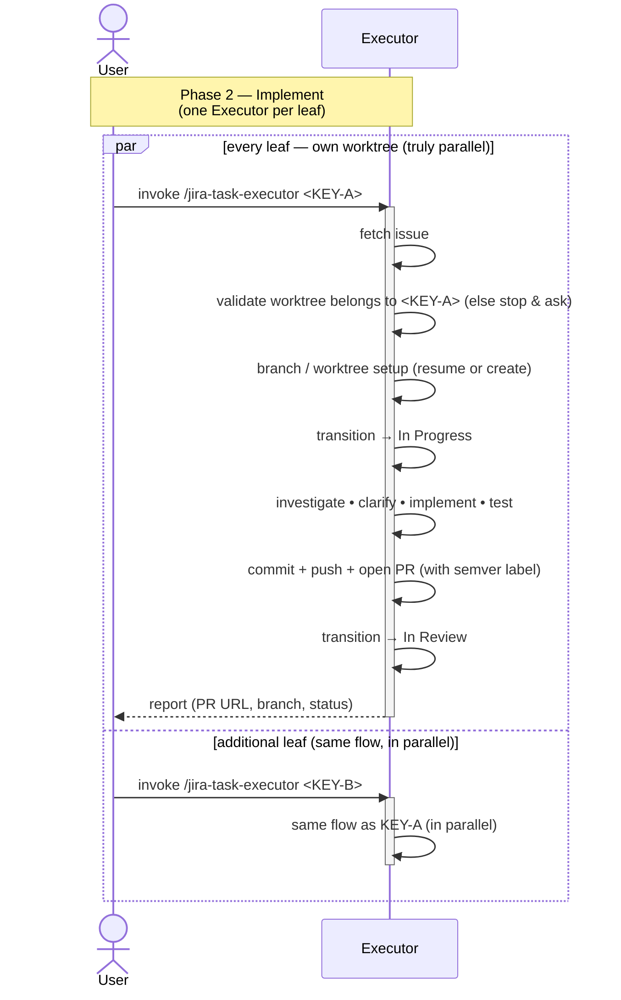

# Task Lifecycle — Phase 2: Implement

The implementation phase of [TASK-LIFECYCLE.md](TASK-LIFECYCLE.md), run
by the **`jira-task-executor`** skill. Triggered **once per leaf
issue**, from inside its own worktree. Multiple
executors run in parallel against the worktrees the assigner set up.

## Sequence diagram

## What the diagram shows

- **Parallel lanes** — the `par / and / end` block encodes the
  worktree-level parallelism the assigner's phase 1 setup makes
  possible. **Every leaf has its own worktree** and can run concurrently.
- **Uniform path** — the executor validates its worktree, sets up its
  branch, commits, pushes, opens a PR (with a required semver label),
  and transitions to *In Review*. The PR is the thing phase 3 reviews.
- **Status transitions the executor owns** — to *In Progress* on
  start, to *In Review* on PR open.
- **Single closing comment** — the executor posts one Jira comment
  per run, not a short "PR opened" earlier in the flow.
- **Guards before work starts** — the executor validates that its
  worktree actually belongs to `<KEY>` (or its parent family) before
  doing anything, and if `<KEY>` turns out to be a multistep parent it
  asks the user to confirm rather than silently implementing on it.

## Related

- [TASK-LIFECYCLE.md](TASK-LIFECYCLE.md) — full lifecycle with all four phases
- [jira-task-executor SKILL.md](../skills/jira-task-executor/SKILL.md)
