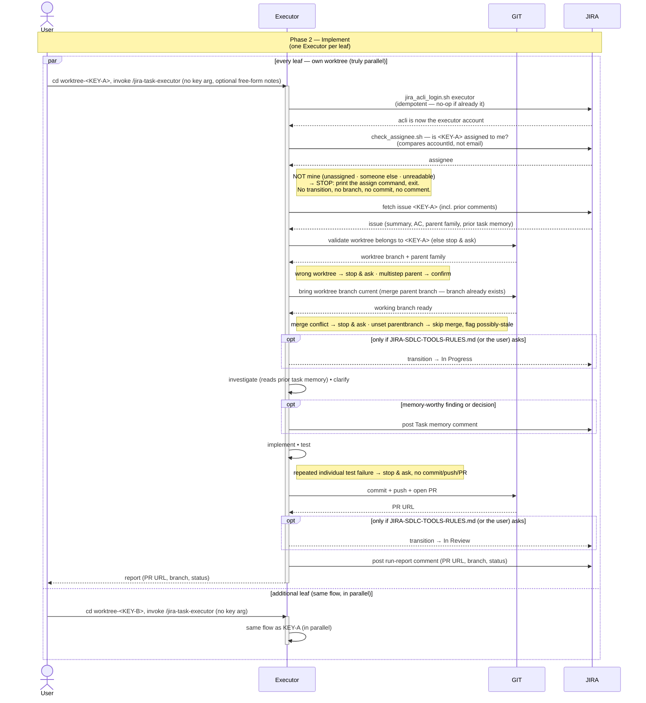

# Task Lifecycle — Phase 2: Implement

Phase 2 of the task lifecycle, run by the **`jira-task-executor`** skill.
Triggered **once per leaf issue**, from inside its own worktree. Multiple
executors run in parallel against the worktrees the assigner set up.

The diagram surfaces the two systems the executor drives as their own
swimlanes — **GIT** (anything that mutates repo state: reading the
worktree's branch and `parentbranch` config, merging the parent branch
current, committing, pushing, opening the PR) and
**JIRA** (anything that mutates issue state: fetching the issue and its
prior comments, any `Task memory` comments posted along the way, the
final run-report comment, and — only when a project rule asks for them —
the optional *In Progress* / *In Review* transitions) — so the full interaction reads
`User ↔ Executor ↔ GIT ↔ JIRA` left to right.

## Sequence diagram

## What the diagram shows

- **Participant routing** — the executor orchestrates between three
  parties. **GIT** owns repo state (the worktree-ownership read, merging
  the parent branch current, the commit, the push, and the PR open).
  **JIRA** owns issue state (the issue fetch
  that carries the parent family *and prior comments* used in the
  ownership check and task-memory read, any `Task memory` comments posted
  along the way, the final run-report comment, and the two *optional*
  transitions). Everything
  else (investigating, clarifying, implementing, testing) stays inside
  the executor.
- **Parallel lanes** — the `par / and / end` block encodes the
  worktree-level parallelism the assigner's phase 1 setup makes
  possible. **Every leaf has its own worktree** and can run concurrently.
- **Uniform path** — the executor validates its worktree (GIT), brings
  its branch current, commits, pushes, opens a PR (GIT), and posts its
  run-report comment (JIRA). The PR is the thing phase 3 reviews.
- **Status transitions are opt-in, and the executor owns none of them** —
  the two `opt` blocks with dashed arrows fire *only* when
  `JIRA-SDLC-TOOLS-RULES.md` (or the user, in chat) asks for them.
  Out of the box the executor never moves the card, and the run report
  states the status the issue is actually in. Both blocks are worth
  enabling if your board drives review off status: `jira-task-reviewer`
  picks up only sub-tasks sitting in *In Review*. See
  [JIRA-STATES.md](JIRA-STATES.md) for the copy-paste rule.
- **Task memory is a first-class JIRA interaction, not a single comment
  invariant** — the executor reads prior `Task memory
  (jira-task-executor)` comments as part of the step-1 fetch, and may
  post its own as investigation/implementation turns up findings worth
  preserving (the `opt` block — zero or more per run, not fixed). These
  are expected companions to the **one** comprehensive run report posted
  once the PR is open (PR URL, branch, current status) — the
  invariant is "one run report per run," not "one Jira comment per run."
- **Identity first, then ownership** — before anything else, the executor
  **logs in as itself** (`jira_acli_login.sh executor`), so every Jira write
  in the run — the task-memory notes, the run report, and any transition a
  project rule asked for — is attributed to the executor account rather than
  to whoever happened to be logged in. It then **gates on ownership**
  (`check_assignee.sh`): `<KEY>` must be assigned to that account. Anything
  else — unassigned, assigned to someone else, unreadable — stops the run
  *before* it has touched anything, printing the ready-to-paste
  `acli jira workitem assign …` command. This is the counterpart to phase 1
  assigning every issue to the executor on create: the assigner says who owns
  the work, and the executor refuses to work anything it doesn't own.
  (Ownership is compared by `accountId`, not by email — Jira only exposes an
  assignee's `emailAddress` to that user themselves, so an email comparison
  cannot tell "someone else's" from "unassigned". See
  [`../skills/_shared/jira-acli-reference.md` §3](../skills/_shared/jira-acli-reference.md).)
- **Guards before work starts, and along the way** — the executor
  validates that its worktree actually belongs to `<KEY>` (or its parent
  family) by reading GIT before doing anything, and if `<KEY>` turns out
  to be a multistep parent it asks the user to confirm rather than
  silently implementing on it. Two more guards can stop the run
  mid-flow: a merge conflict while bringing the branch current (GIT), and
  a test that still fails when re-run individually after the suite run
  (both leave the run stopped, with no commit/push/PR).

## Related

- [Phase 1 — Plan](TASK-LIFECYCLE-PHASE-1.md)
- [Phase 3 — Review & aggregate approval](TASK-LIFECYCLE-PHASE-3.md)
- [jira-task-executor SKILL.md](../skills/jira-task-executor/SKILL.md)
