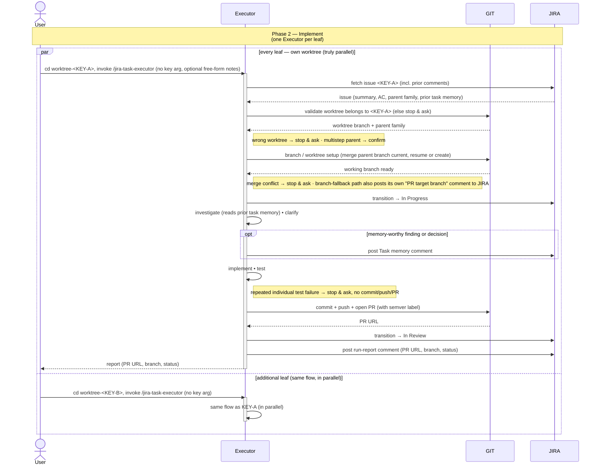

# Task Lifecycle — Phase 2: Implement

The implementation phase of [TASK-LIFECYCLE.md](TASK-LIFECYCLE.md), run
by the **`jira-task-executor`** skill. Triggered **once per leaf
issue**, from inside its own worktree. Multiple
executors run in parallel against the worktrees the assigner set up.

The diagram surfaces the two systems the executor drives as their own
swimlanes — **GIT** (anything that mutates repo state: reading the
worktree's branch and `parentbranch` config, merging the parent branch
current, resuming or creating a worktree, committing, pushing, opening
the PR with its semver label) and **JIRA** (anything that mutates issue
state: fetching the issue and its prior comments, the *In Progress* /
*In Review* transitions, any `Task memory` comments posted along the
way, the branch-fallback path's `PR target branch: ...` comment, and
the final run-report comment) — so the full interaction reads
`User ↔ Executor ↔ GIT ↔ JIRA` left to right.

## Sequence diagram

## What the diagram shows

- **Participant routing** — the executor orchestrates between three
  parties. **GIT** owns repo state (the worktree-ownership read, merging
  the parent branch current, the resume-or-create setup, the commit, the
  push, and the PR open with its required semver label). **JIRA** owns
  issue state (the issue fetch that carries the parent family *and prior
  comments* used in the ownership check and task-memory read, the *In
  Progress* and *In Review* transitions, any `Task memory` comments
  posted along the way, the branch-fallback path's own `PR target
  branch: ...` comment, and the final run-report comment). Everything
  else (investigating, clarifying, implementing, testing) stays inside
  the executor.
- **Parallel lanes** — the `par / and / end` block encodes the
  worktree-level parallelism the assigner's phase 1 setup makes
  possible. **Every leaf has its own worktree** and can run concurrently.
- **Uniform path** — the executor validates its worktree (GIT), sets up
  its branch, commits, pushes, opens a PR (GIT — with a required semver
  label), transitions to *In Review* (JIRA), and posts its run-report
  comment (JIRA). The PR is the thing phase 3 reviews.
- **Status transitions the executor owns** — to *In Progress* on start,
  to *In Review* on PR open (both JIRA).
- **Task memory is a first-class JIRA interaction, not a single comment
  invariant** — the executor reads prior `Task memory
  (jira-task-executor)` comments as part of the step-1 fetch, and may
  post its own as investigation/implementation turns up findings worth
  preserving (the `opt` block — zero or more per run, not fixed). These
  are expected companions to the **one** comprehensive run report posted
  after the *In Review* transition (PR URL, branch, final status) — the
  invariant is "one run report per run," not "one Jira comment per run."
- **Guards before work starts, and along the way** — the executor
  validates that its worktree actually belongs to `<KEY>` (or its parent
  family) by reading GIT before doing anything, and if `<KEY>` turns out
  to be a multistep parent it asks the user to confirm rather than
  silently implementing on it. Two more guards can stop the run
  mid-flow: a merge conflict while bringing the branch current (GIT), and
  a test that still fails when re-run individually after the suite run
  (both leave the run stopped, with no commit/push/PR).

## Related

- [TASK-LIFECYCLE.md](TASK-LIFECYCLE.md) — full lifecycle with all three phases
- [jira-task-executor SKILL.md](../skills/jira-task-executor/SKILL.md)
