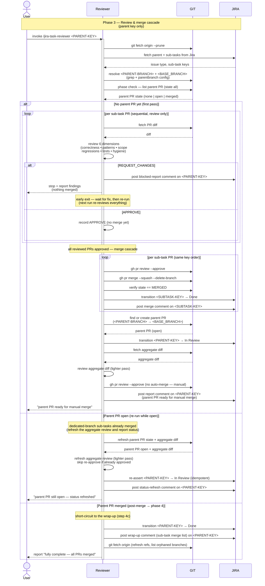

# Task Lifecycle — Phase 3: Review & merge cascade

The review phase of [TASK-LIFECYCLE.md](TASK-LIFECYCLE.md), run by the
**`jira-task-reviewer`** skill. Triggered once by the user on the
**parent** issue key (not a sub-task, not a top-level single-step
issue), after every leaf executor has reported back.

This phase ends when the reviewer has approved and squash-merged every
sub-task PR into the parent branch, then approved
the aggregate parent PR (without merging it). The parent PR is
handed off to the user as the deliberate manual step (phase 4).

The diagram surfaces the two systems the reviewer drives as their own
swimlanes — **GIT** (anything that mutates or reads repo/PR state:
`git fetch --prune`, resolving the parent/base branches from the
`branch.<PARENT-BRANCH>.parentbranch` git config that the assigner
wrote in phase 1, the phase-check `gh pr list`, fetching PR diffs, `gh
pr review --approve`, `gh pr merge --squash --delete-branch`, verifying
`MERGED`, find-or-create parent PR, and the cleanup `git fetch`) and
**JIRA** (anything that mutates issue state: fetching parent +
sub-tasks, each sub-task → Done transition and its merge comment, the
parent → In Review transition and its idempotent re-assert, the parent
→ Done wrap-up, and every report comment posted on the parent) — so
the full interaction reads `User ↔ Reviewer ↔ GIT ↔ JIRA` left to
right.

## Sequence diagram

## What the diagram shows

- **Participant routing** — the reviewer orchestrates three parties.
  **GIT** owns repo/PR state: the opening fetch, resolving
  `<PARENT-BRANCH>` + `<BASE_BRANCH>` (the latter read from the
  `parentbranch` git config the assigner wrote in phase 1 — the
  phase-1 → phase-3 thread), the phase-check `gh pr list`, fetching PR
  diffs, formal approval, squash-merge + branch delete, the `MERGED`
  verification, find-or-create parent PR, and the cleanup fetch.
  **JIRA** owns issue state: fetching the parent + sub-tasks, each
  sub-task → Done transition with its "merged into parent branch"
  comment, the parent → In Review transition (and its idempotent
  re-assert on re-runs), the parent → Done wrap-up, and every report
  comment posted on the parent. The reviewer keeps the reasoning — the
  6-dimension review, the recorded verdicts, and the lighter aggregate
  review.
- **Parent-only, refuses sub-task keys** — the reviewer is triggered on
  the parent key; a sub-task key is rejected, and a top-level issue with
  no sub-tasks has nothing to cascade through, so the reviewer exits
  early.
- **Phase check first** — visible as an explicit GIT `gh pr list`
  whose return dispatches the three branches: *no* parent PR means a
  full review pass (re-runs revisit everything), an *open* parent PR
  skips straight to the aggregate review refresh, a *merged* parent PR
  short-circuits to phase 4's post-merge wrap-up.
- **Two passes, not one** — sub-task PRs are reviewed **in order, one
  at a time**, but the review pass only *records* verdicts (no merging).
  Only if every reviewed PR is `APPROVE` does a **second pass** — the
  merge cascade — run, in the same key order. In the diagram, the
  review pass's reads (diff) hit GIT and its blocked outcome posts to
  JIRA; the cascade pass writes GIT (approve → merge → verify) then
  JIRA (Done transition + merge comment) per sub-task. This is the
  safety model in diagram form: the moment one PR fails, the review
  loop halts and *nothing* is merged, so the "(nothing merged)"
  guarantee holds even though some PRs were already approved in the
  review pass. (Re-runs re-review everything, since an early exit left
  some PRs un-reviewed against their latest state.)
- **Parent PR: review and approve, never merge** — the reviewer
  transitions `<PARENT-KEY>` to *In Review* (JIRA) **before** fetching
  and reviewing the lighter aggregate diff (GIT), then approves the
  parent PR (`gh pr review --approve`, GIT). It explicitly does *not*
  call `gh pr merge` on the parent — merging the parent branch into
  `<BASE_BRANCH>` is the human release decision, shown here as the one
  GIT arrow deliberately missing its merge sibling. That's the seam
  between this phase and phase 4.
- **Every terminal branch posts a JIRA report comment on the parent**
  — per step 5, the report goes to chat *and* as a single Jira comment
  on `<PARENT-KEY>` in all three branches: the blocked report
  (`REQUEST_CHANGES`), the parent-ready report (first pass), the
  status-refresh report (re-run while open), and the wrap-up report
  (post-merge).

## Related

- [TASK-LIFECYCLE.md](TASK-LIFECYCLE.md) — full lifecycle with all four phases
- [jira-task-reviewer SKILL.md](../skills/jira-task-reviewer/SKILL.md)
