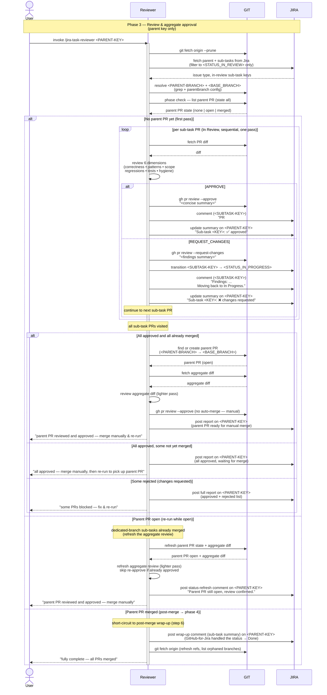

# Task Lifecycle — Phase 3: Review & aggregate approval

The review phase of [TASK-LIFECYCLE.md](TASK-LIFECYCLE.md), run by the
**`jira-task-reviewer`** skill. Triggered by the user on the
**parent** issue key after every leaf executor has reported back and
transitioned its sub-task to `<STATUS_IN_REVIEW>`.

This phase ends when the reviewer has **approved** every sub-task PR,
reported the combined status, and (once the human has merged those
sub-tasks) approved the aggregate parent PR. The reviewer never
merges anything — that remains the user's deliberate step.

The diagram surfaces the two systems the reviewer drives as their own
swimlanes — **GIT** (anything that mutates or reads repo/PR state:
`git fetch --prune`, resolving the parent/base branches from the
`branch.<PARENT-BRANCH>.parentbranch` git config that the assigner
wrote in phase 1, the phase-check `gh pr list`, fetching PR diffs, `gh
pr review --approve` / `--request-changes`, finding the aggregate parent
PR) and **JIRA** (anything that mutates issue state: fetching parent +
In-Review sub-tasks, each sub-task → In Progress transition on rejection,
multi-line comments on sub-task and parent after every review, the
aggregate parent PR review, and every report comment posted on the
parent) — so the full interaction reads `User ↔ Reviewer ↔ GIT ↔ JIRA`
left to right.

## Sequence diagram

## What the diagram shows

- **Participant routing** — the reviewer orchestrates three parties.
  **GIT** owns repo/PR state: the opening fetch, resolving
  `<PARENT-BRANCH>` + `<BASE_BRANCH>` (the latter read from the
  `parentbranch` git config the assigner wrote in phase 1 — the
  phase-1 → phase-3 thread), the phase-check `gh pr list`, fetching PR
  diffs, formal approval / changes-requested, and finding the aggregate
  parent PR. **JIRA** owns issue state: fetching the parent + sub-tasks
  (filtering to `<STATUS_IN_REVIEW>`), each rejected sub-task → In
  Progress transition with its findings comment, and the summary comment
  posted on the parent after every single sub-task review.
- **Parent-only, refuses sub-task keys** — the reviewer is triggered on
  the parent key; a sub-task key is rejected, and a top-level issue with
  no sub-tasks has nothing to cascade through, so the reviewer exits
  early.
- **Phase check first** — visible as an explicit GIT `gh pr list`
  whose return dispatches the three branches: *no* parent PR means a
  full sub-task review pass, an *open* parent PR skips straight to the
  aggregate review, a *merged* parent PR short-circuits to phase 4's
  post-merge wrap-up.
- **Single pass, no merge cascade** — each In Review sub-task PR is
  reviewed **in order, one at a time**. The verdict (approve or reject)
 FYI the `gh pr review` call happens immediately per-PR. There is no
  separate "batch merge" step; approved PRs are left for the human to
  merge manually, and rejected items keep the loop going so the full
  state is known. The only thing that stops the loop is running out of
  sub-task PRs.
- **Continue on rejection, don't stop** — when a PR fails the review,
  the reviewer posts `gh pr review --request-changes`, transitions that
  sub-task back to `<STATUS_IN_PROGRESS>`, **records it as blocked**, and
  continues to the next sub-task. After every single PR (approved or
  rejected), a short summary comment is posted on the parent so the human
  can see progress in real time. The final report at the end (step 7)
  lists both approved and rejected items so the fix-and-re-run cycle is
  clear.
- **Parent PR: review and approve, still never merge** — the reviewer
  reviews the lighter aggregate diff (GIT) and approves the parent PR
  (`gh pr review --approve`, GIT). It explicitly does *not* call `gh
  pr merge` on the parent — merging the parent branch into `<BASE_BRANCH>`
  is the human release decision. That's the seam between this phase and
  phase 4.
- **Automated status transitions removed** — the reviewer no longer moves
  sub-tasks to Done on merge (GitHub-for-Jira automation handles that)
  and no longer moves the parent to Done on merge. Transitions that the
  reviewer still performs: sub-task → In Progress on rejection.
- **Every terminal branch posts a JIRA report comment on the parent**
  — per step 7, the report goes to chat *and* as a single Jira comment
  on `<PARENT-KEY>` in all branches: the "all approved, merge
  manually" report, the "some rejected, fix and re-run" report, the
  parent-ready report, the status-refresh report (re-run while open), and
  the wrap-up report (post-merge).

## Related

- [TASK-LIFECYCLE.md](TASK-LIFECYCLE.md) — full lifecycle with all four phases
- [jira-task-reviewer SKILL.md](../skills/jira-task-reviewer/SKILL.md)
