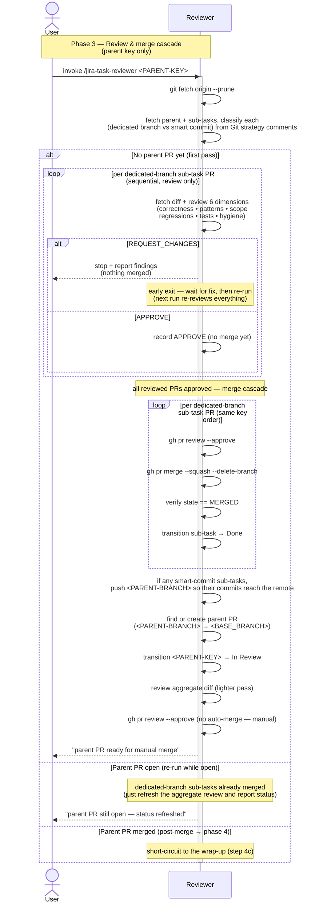

# Task Lifecycle — Phase 3: Review & merge cascade

The review phase of [TASK-LIFECYCLE.md](TASK-LIFECYCLE.md), run by the
**`jira-task-reviewer`** skill. Triggered once by the user on the
**parent** issue key (not a sub-task, not a top-level single-step
issue), after every leaf executor has reported back.

This phase ends when the reviewer has approved and squash-merged every
dedicated-branch sub-task PR into the parent branch, then approved
the aggregate parent PR (without merging it). The parent PR is
handed off to the user as the deliberate manual step (phase 4).

## Sequence diagram

## What the diagram shows

- **Parent-only, refuses sub-task keys** — the reviewer is triggered on
  the parent key; a sub-task key is rejected, and a top-level issue with
  no sub-tasks has nothing to cascade through, so the reviewer exits
  early.
- **Phase check first** — the reviewer inspects for an existing parent
  PR before anything else, so re-invocations stay correct: *no* parent
  PR means a full review pass (re-runs revisit everything), an *open*
  parent PR skips straight to the aggregate review, a *merged* parent
  PR short-circuits to phase 4's post-merge wrap-up.
- **Two passes, not one** — sub-task PRs are reviewed **in order, one
  at a time**, but the review pass only *records* verdicts (no merging).
  Only if every reviewed PR is `APPROVE` does a **second pass** — the
  merge cascade — run, in the same key order. This is the safety model
  in diagram form: the moment one PR fails, the review loop halts and
  *nothing* is merged, so the "(nothing merged)" guarantee holds even
  though some PRs were already approved in the review pass. (Re-runs
  re-review everything, since an early exit left some PRs un-reviewed
  against their latest state.)
- **Smart commits have no PR** — smart-commit sub-tasks aren't in
  either loop; their work is already on `<PARENT-BRANCH>` and is
  reviewed as part of the aggregate parent diff. Before that aggregate
  PR is created, the reviewer pushes `<PARENT-BRANCH>` to the remote so
  the smart commits (and their `#done` transitions) actually land —
  the executor's smart-commit path deliberately skips pushing.
- **Parent PR: review and approve, never merge** — the reviewer
  transitions `<PARENT-KEY>` to *In Review* **before** the aggregate
  review, then reviews the lighter aggregate diff and approves it. It
  explicitly does *not* call `gh pr merge` on the parent PR — merging
  the parent branch into `<BASE_BRANCH>` is the human release decision.
  That's the seam between this phase and phase 4.

## Related

- [TASK-LIFECYCLE.md](TASK-LIFECYCLE.md) — full lifecycle with all four phases
- [jira-task-reviewer SKILL.md](../skills/jira-task-reviewer/SKILL.md)
