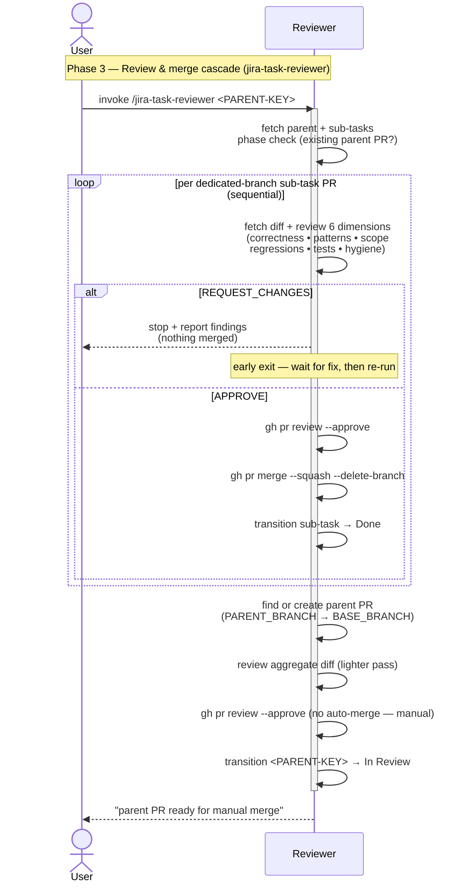

# Task Lifecycle — Phase 3: Review & merge cascade

The review phase of [TASK-LIFECYCLE.md](TASK-LIFECYCLE.md), run by the
**`jira-task-reviewer`** skill. Triggered once by the user on the
**parent** issue key (not a sub-task, not a top-level single-step
issue), after every leaf executor has reported back.

This phase ends when the reviewer has approved and squash-merged every
dedicated-branch sub-task PR into the parent branch, then approved
the aggregate parent PR (without merging it). The parent PR is
handed off to the user as the deliberate manual step (phase 4).

## Sequence diagram

## What the diagram shows

- **Phase check first** — the reviewer inspects for an existing parent
  PR first, so re-invocations stay correct: a *no* parent PR means a
  full review pass (re-runs revisit everything), an *open* parent PR
  skips straight to the aggregate review, a *merged* parent PR falls
  into phase 4's post-merge wrap-up.
- **Sequential per-PR loop** — sub-task PRs are reviewed **in order,
  one at a time**, not in parallel. Smart-commit sub-tasks have no PR
  of their own — they're picked up as part of the aggregate diff
  later in this phase.
- **Early exit semantics** — the `alt REQUEST_CHANGES / else APPROVE`
  is the safety model in diagram form: the moment one PR fails, the
  loop halts and *nothing* is merged. Subsequent PRs stay un-reviewed
  rather than being auto-approved, even though they'd been queued.
- **Cascade only on all-approve** — merge (`--squash` and
  `--delete-branch`) and the *Done* transition only run inside the
  `else APPROVE` branch, only after the loop completes without a
  rejection.
- **Parent PR review, never merge** — the aggregate parent PR is
  approved (`gh pr review --approve`) but the reviewer explicitly does
  *not* call `gh pr merge` on it. The parent issue moves to
  *In Review*, and the user merges the parent branch into `<BASE_BRANCH>`
  manually. That's the seam between this phase and phase 4.

## Related

- [TASK-LIFECYCLE.md](TASK-LIFECYCLE.md) — full lifecycle with all four phases
- [jira-task-reviewer SKILL.md](../skills/jira-task-reviewer/SKILL.md)
