# Task Lifecycle — Phase 3: Review & aggregate approval

Phase 3 of the task lifecycle, run by the **`jira-task-reviewer`** skill.
Triggered from the parent's worktree (branch-derived key; no key
argument) after every leaf executor has reported back and its issue is
sitting in `<STATUS_IN_REVIEW>` — put there by a project rule, your
automation, or a person (no skill moves it by default).

The reviewer handles **both** single-step top-level issues (no sub-tasks)
and multistep parents (with sub-tasks). For single-step, it reviews the
one PR and posts a final report — no re-run needed (GitHub-for-Jira
auto-transitions the issue to `<STATUS_DONE>` on merge). For multistep,
it reviews each sub-task PR, finds or creates the aggregate parent PR
once sub-tasks are merged, and reviews that too. The reviewer never
merges anything — that remains the user's deliberate step.

The diagram surfaces the two systems the reviewer drives as their own
swimlanes — **GIT** (anything that mutates or reads repo/PR state:
`git fetch --prune`, resolving the parent/base branches from the
`branch.<PARENT-BRANCH>.parentbranch` git config that the assigner
wrote in phase 1, the phase-check `gh pr list`, the per-PR `3a`
idempotency lookup, fetching PR diffs, `gh pr review --comment
--body-file` with `APPROVED —` / `CHANGES REQUESTED —` body-prefix
verdicts, and finding or creating the aggregate parent PR) and **JIRA**
(anything that mutates issue state: fetching the parent + In-Review
sub-tasks, climbing from a sub-task branch to its parent, each rejected
optional sub-task → In Progress transition, multi-line comments on the reviewed
issue after every verdict, the per-sub-task summary comment on the
parent, and every report comment posted on the parent) — so the full
interaction reads `User ↔ Reviewer ↔ GIT ↔ JIRA` left to right.

## Sequence diagram

```mermaid
sequenceDiagram
    actor User
    participant Reviewer
    participant GIT
    participant JIRA

    Note over User,JIRA: Phase 3 — Review & aggregate approval<br/>(parent key only, single-step or multistep)
    User->>Reviewer: cd worktree-<PARENT-KEY>, invoke /jira-task-reviewer (no key arg)

    activate Reviewer
    Reviewer->>JIRA: jira_acli_login.sh reviewer<br/>(idempotent — no-op if already it)
    JIRA-->>Reviewer: acli is now the reviewer account
    Note right of Reviewer: login fails → stop.<br/>Every verdict comment below<br/>is now attributed to the reviewer
    Reviewer->>GIT: git fetch origin --prune
    Reviewer->>JIRA: fetch issue from branch key<br/>(type, status, parent, subtasks)
    JIRA-->>Reviewer: issue fields
    opt branch key is a Subtask
        Reviewer->>JIRA: climb to fields.parent.key, re-fetch parent<br/>(note the climb in the report)
        JIRA-->>Reviewer: parent issue
    end
    Note over Reviewer: determine track from fields.subtasks<br/>(empty → single-step · non-empty → multistep)
    Reviewer->>GIT: resolve <PARENT-BRANCH> + <BASE_BRANCH><br/>(grep + parentbranch config)
    Reviewer->>GIT: phase check — list PR (state all)
    GIT-->>Reviewer: PR state (none | open | merged)

    alt Single-step — no PR yet
        Note over Reviewer: executor hasn't opened a PR
        Reviewer->>JIRA: post report on <PARENT-KEY><br/>(no PR yet — nothing to review)
        Reviewer-->>User: "no open PR yet — reviewer runs once it exists"

    else Single-step — PR open (first run)
        Note over Reviewer: single-step: the one PR is the whole set → review loop (step 3)
        Reviewer->>GIT: 3a idempotency — my prior verdict comment on this PR?
        GIT-->>Reviewer: none | "APPROVED —" | "CHANGES REQUESTED —"
        alt prior "APPROVED —" by me (terminal)
            Reviewer->>JIRA: post report on <PARENT-KEY><br/>(already approved — waiting for merge)
            Reviewer-->>User: "already approved — merge manually"
        else none, or prior "CHANGES REQUESTED —" (re-review)
            Reviewer->>GIT: fetch PR diff
            GIT-->>Reviewer: diff
            Reviewer->>Reviewer: review 6 dimensions<br/>(correctness • patterns • scope<br/>regressions • tests • hygiene)
            alt APPROVE
                Reviewer->>GIT: gh pr review --comment --body-file<br/>"APPROVED — <summary>"
                Reviewer->>JIRA: canonical report on <PARENT-KEY><br/>(S-APPROVED, step 6)
                Reviewer-->>User: "approved — merge manually<br/>GitHub-for-Jira handles Done, no re-run needed"
            else REQUEST_CHANGES
                Reviewer->>GIT: gh pr review --comment --body-file<br/>"CHANGES REQUESTED — <findings>"
                opt only if JIRA-SDLC-TOOLS-RULES.md (or the user) asks
                    Reviewer-->>JIRA: transition <PARENT-KEY> → <STATUS_IN_PROGRESS>
                end
                Reviewer->>JIRA: canonical report on <PARENT-KEY><br/>(S-CHANGES-REQUESTED, step 6)
                Reviewer-->>User: "changes requested — fix, push & re-run"
            end
        end

    else Single-step — PR merged (re-run)
        Note over Reviewer: detect merged PR — GitHub-for-Jira<br/>already handled Done, no wrap-up
        Reviewer->>JIRA: post final report on <PARENT-KEY><br/>(S-MERGED, step 6)
        Reviewer-->>User: "merged — complete (S-MERGED)"

    else Multistep — no parent PR yet (first pass)
        loop step 2 — per In Review sub-task: discover branch + PR
            Reviewer->>GIT: git branch -a | grep <SUBTASK-KEY>, gh pr list
            GIT-->>Reviewer: sub-task branch + open PR (or none)
            Note over Reviewer: no branch / no open PR → flag & skip this sub-task
        end
        alt zero sub-tasks have an open PR
            Reviewer->>JIRA: post report on <PARENT-KEY> (nothing to review)
            Reviewer-->>User: "no sub-task PRs to review — re-run later"
        else at least one sub-task PR to review
            loop step 3 — per sub-task PR (In Review, sequential, one pass)
                Reviewer->>GIT: 3a idempotency — my prior verdict comment on this PR?
                GIT-->>Reviewer: none | "APPROVED —" | "CHANGES REQUESTED —"
                alt prior "APPROVED —" by me
                    Note over Reviewer: record approved, skip re-review → next sub-task PR
                else none, or prior "CHANGES REQUESTED —" (re-review)
                    Reviewer->>GIT: fetch PR diff
                    GIT-->>Reviewer: diff
                    Reviewer->>Reviewer: review 6 dimensions<br/>(correctness • patterns • scope<br/>regressions • tests • hygiene)
                    alt APPROVE
                        Reviewer->>GIT: gh pr review --comment --body-file<br/>"APPROVED — <summary>"
                        Reviewer->>JIRA: canonical report on <SUBTASK-KEY><br/>(M-SUBTASK-APPROVED)
                        Reviewer->>JIRA: parent tally on <PARENT-KEY><br/>"Sub-task <KEY>: ✅ approved"
                    else REQUEST_CHANGES
                        Reviewer->>GIT: gh pr review --comment --body-file<br/>"CHANGES REQUESTED — <findings>"
                        opt only if JIRA-SDLC-TOOLS-RULES.md (or the user) asks
                            Reviewer-->>JIRA: transition <SUBTASK-KEY> → <STATUS_IN_PROGRESS>
                        end
                        Reviewer->>JIRA: canonical report on <SUBTASK-KEY><br/>(M-SUBTASK-CHANGES-REQUESTED)
                        Reviewer->>JIRA: parent tally on <PARENT-KEY><br/>"Sub-task <KEY>: ❌ changes requested"
                        Note over Reviewer: continue to next sub-task PR
                    end
                end
            end

            Note over Reviewer: all sub-task PRs visited (step 4)
            alt Some rejected (changes requested) — step 4b
                Reviewer->>JIRA: full report on <PARENT-KEY><br/>(M-SOME-BLOCKED: approved + rejected + findings)
                Reviewer-->>User: "some PRs blocked — fix & re-run"
            else All approved, some not yet merged — step 4a
                Reviewer->>JIRA: report on <PARENT-KEY><br/>(M-ALL-APPROVED — waiting for merge)
                Reviewer-->>User: "all approved — merge manually, then re-run for the parent PR"
            else All approved and all merged — step 5
                Reviewer->>GIT: 5a — find or create parent PR<br/>(<PARENT-BRANCH> → <BASE_BRANCH>)
                GIT-->>Reviewer: parent PR (open | created | closed)
                alt parent PR CLOSED
                    Reviewer-->>User: "parent PR is closed — stop, user decides"
                else parent PR open or newly created
                    Reviewer->>GIT: 3a idempotency + fetch aggregate diff
                    GIT-->>Reviewer: prior verdict + aggregate diff
                    Reviewer->>Reviewer: 5b — review aggregate diff (lighter pass)
                    alt APPROVE (or already approved)
                        Reviewer->>GIT: gh pr review --comment --body-file<br/>"APPROVED — <summary>" (no auto-merge)
                        Reviewer->>JIRA: report on <PARENT-KEY><br/>(M-PARENT-READY, step 6)
                        Reviewer-->>User: "parent PR approved — merge manually"
                    else REQUEST_CHANGES
                        Reviewer->>GIT: gh pr review --comment --body-file<br/>"CHANGES REQUESTED — <findings>"
                        opt only if JIRA-SDLC-TOOLS-RULES.md (or the user) asks
                            Reviewer-->>JIRA: transition <PARENT-KEY> → <STATUS_IN_PROGRESS>
                        end
                        Reviewer->>JIRA: report on <PARENT-KEY><br/>(M-PARENT-CHANGES-REQUESTED, step 6)
                        Reviewer-->>User: "parent PR changes requested — fix on <PARENT-BRANCH> & re-run"
                    end
                end
            end
        end

    else Multistep — parent PR open (re-run, sub-tasks already merged)
        Note over Reviewer: phase check found an open parent PR → step 5b
        Reviewer->>GIT: 3a idempotency + refresh aggregate diff
        GIT-->>Reviewer: prior verdict + aggregate diff
        Reviewer->>Reviewer: 5b — refresh aggregate review (lighter pass)<br/>skip if already "APPROVED —"
        alt APPROVE (or already approved)
            Reviewer->>GIT: gh pr review --comment --body-file<br/>"APPROVED — <summary>"
            Reviewer->>JIRA: report on <PARENT-KEY><br/>(M-PARENT-READY, step 6)
            Reviewer-->>User: "parent PR reviewed and approved — merge manually"
        else REQUEST_CHANGES
            Reviewer->>GIT: gh pr review --comment --body-file<br/>"CHANGES REQUESTED — <findings>"
            opt only if JIRA-SDLC-TOOLS-RULES.md (or the user) asks
                Reviewer-->>JIRA: transition <PARENT-KEY> → <STATUS_IN_PROGRESS>
            end
            Reviewer->>JIRA: report on <PARENT-KEY><br/>(M-PARENT-CHANGES-REQUESTED, step 6)
            Reviewer-->>User: "parent PR changes requested — fix & re-run"
        end

    else Multistep — parent PR merged (re-run)
        Note over Reviewer: detect merged parent PR — GitHub-for-Jira<br/>handled Done, no wrap-up
        Reviewer->>JIRA: post final report on <PARENT-KEY><br/>(M-FULLY-COMPLETE, step 6)
        Reviewer-->>User: "fully complete — all PRs merged"
    end
    deactivate Reviewer
```

## What the diagram shows

- **Two tracks, one skill** — step 1 determines the track from
  `fields.subtasks`: empty → **single-step** (the PR set is the one parent
  PR), non-empty → **multistep** (the PR set is each In Review sub-task
  PR). Each track walks its own branches from the same phase check; the
  review-loop body (step 3, including its 3a idempotency check) is
  identical — only the PR set and the post-loop outcomes differ.
- **Participant routing** — the reviewer orchestrates three parties.
  **GIT** owns repo/PR state: the opening fetch, resolving
  `<PARENT-BRANCH>` + `<BASE_BRANCH>` (the latter read from the
  `parentbranch` git config the assigner wrote in phase 1 — the
  phase-1 → phase-3 thread), the phase-check `gh pr list`, the per-PR 3a
  idempotency lookup, fetching PR diffs, the verdict comment (`gh pr
  review --comment --body-file`), and finding or creating the aggregate
  parent PR. **JIRA** owns issue state: fetching the parent + sub-tasks
  (filtering to `<STATUS_IN_REVIEW>`), climbing from a sub-task branch to
  its parent, each rejected sub-task's *optional* → In Progress transition with its
  findings comment, and the summary/report comments posted on the parent
  after every review.
- **Parent via climb (sub-task branches climb up)** — the reviewer derives
  the key from the current branch (feature/<KEY>-slug or hotfix/<KEY>-slug)
  and `acli` fetches the issue. If the issue is a Subtask, step 1 climbs
  to its parent via `fields.parent.key` and continues from there — the
  `opt branch key is a Subtask` block right after the initial Jira fetch.
  A top-level issue with no sub-tasks follows the single-step track.
- **Phase check first, and track-aware** — an explicit GIT `gh pr list`
  whose return dispatches the top-level branches. On the **single-step**
  track it has three outcomes: *no* PR → report that the executor hasn't
  opened one yet and exit (nothing to review); an *open* PR → the step-3
  review loop; a *merged* PR → the S-MERGED report and exit. On the
  **multistep** track: *no* parent PR → a full sub-task review pass (step 2
  onward); an *open* parent PR → skip straight to the step-5 aggregate
  review; a *merged* parent PR → the M-FULLY-COMPLETE report and exit.
  Every merged-state exit posts the step-6 report only — GitHub-for-Jira
  already handled `<STATUS_DONE>` and there is no wrap-up to take.
- **The reviewer logs in as itself first** — `jira_acli_login.sh reviewer`,
  before any read or write, so every canonical report and every reject-path
  write below is attributed to the reviewer's Jira account rather than
  to whoever was logged in last (acli's credential store is machine-global,
  so that could be the executor from phase 2). The call is idempotent — a
  no-op when acli is already the reviewer — so it runs unconditionally. Note
  this is the reviewer's **Jira** identity; its **GitHub** identity is a
  separate thing, and the one that matters for the idempotency check below.
  See [`../skills/_shared/project-config.md`](../skills/_shared/project-config.md).
- **Idempotent review (step 3a)** — before every PR review — the
  single-step PR, each multistep sub-task PR, and the aggregate parent PR
  (5b) — the reviewer checks whether *its own* GitHub identity already left
  a verdict comment (matched on author + body prefix). A prior `APPROVED —`
  is terminal: it skips re-review and reports the PR as already
  approved/awaiting merge. A prior `CHANGES REQUESTED —` (with no later
  approval) triggers a fresh re-review of the pushed fixes. This is the
  `3a idempotency` node drawn in each review branch.
- **Empty exits and flag-and-skip (step 2)** — on the multistep first pass
  the reviewer first discovers each In Review sub-task's branch and open
  PR. A sub-task with **no branch or no open PR** is flagged and skipped,
  not reviewed. If **zero** sub-tasks have an open PR, the run reports that
  there is nothing to review and exits before the review loop.
- **Both verdicts go through `--comment --body-file`** — in this plugin's
  default deployment the executor and reviewer share one `gh` account, and
  GitHub blocks an author from approving *or* requesting changes on their
  own PR. Both verdicts are recorded as review comments with the decision
  in their body prefix (`APPROVED — …` / `CHANGES REQUESTED — …`). That
  prefix — not a Jira status — is the durable record of a verdict: it is
  what the idempotency check (step 3a) detects on a re-run, and it stands
  on its own whether or not a project rule adds a transition alongside it.
- **Single-step is one-and-done** — on the single-step track, approval
  posts the final report immediately (S-APPROVED outcome, step 6).
  Whatever moves the issue to `<STATUS_DONE>` on merge — GitHub-for-Jira,
  your automation, or a project rule — no reviewer re-run is required. Only the
  S-CHANGES-REQUESTED outcome (reject) needs a re-run after fixes.
- **Single pass, no merge cascade** — each In Review sub-task PR is
  reviewed **in order, one at a time**. The verdict happens
  immediately per-PR. There is no separate "batch merge" step; approved
  PRs are left for the human to merge manually, and rejected items keep
  the loop going so the full state is known. The only thing that stops
  the loop is running out of sub-task PRs.
- **Continue on rejection, don't stop** — when a PR fails the review,
  the reviewer posts the `CHANGES REQUESTED —` verdict comment (moving the
  issue back to `<STATUS_IN_PROGRESS>` only if a project rule asks),
  **records it as blocked**, and
  continues to the next sub-task. After every single PR (approved or
  rejected), a short summary comment is posted on the parent so the human
  can see progress in real time (intentional audit trail). The final
  report at the end (step 6) lists both approved and rejected items so the
  fix-and-re-run cycle is clear.
- **Parent PR: review, approve *or reject*, still never merge (multistep
  only)** — once every sub-task PR is merged, the reviewer finds or creates
  the aggregate parent PR (GIT). If that PR is already **CLOSED** it stops
  and lets the user decide (5a) — it never reopens or recreates it.
  Otherwise it reviews the lighter aggregate diff (integration focus) and
  records a verdict on the parent PR via `gh pr review --comment
  --body-file`: **approve** → M-PARENT-READY (awaiting the human's manual
  merge), or **request changes** → M-PARENT-CHANGES-REQUESTED (integration
  `file:line` findings; fix on `<PARENT-BRANCH>` and re-run). The parent
  reject is now shaped exactly like a sub-task reject — including the
  optional transition — where it used to be the one reject path that moved
  nothing. The reviewer never calls
  `gh pr merge` on the parent — merging into `<BASE_BRANCH>` is the human
  release decision. After the parent PR merges, no re-run is required; a
  re-run only reports the already-merged state (M-FULLY-COMPLETE).
- **The reviewer moves no card on its own** — every transition in the
  diagram sits inside an `opt` block on a dashed arrow, and fires only when
  `JIRA-SDLC-TOOLS-RULES.md` (or the user, in chat) asks for it. Out of the
  box a verdict is a review comment and a Jira report comment, nothing more.
  When you *do* enable the reject-path rule, write it as "every reject
  path": the old built-in behaviour transitioned on 3d but not on 5b, so a
  rejected multistep parent PR left its card reading *In Review* with no
  signal at all. See [JIRA-STATES.md](JIRA-STATES.md).
- **Every terminal branch posts a JIRA report comment on the parent**
  — per step 6, the report goes to chat *and* as a single Jira comment
  on `<PARENT-KEY>`: the single-step *no-PR-yet* exit, the single-step
  approve/reject (S-APPROVED / S-CHANGES-REQUESTED) and merged (S-MERGED)
  reports, the multistep *nothing-to-review* exit, the M-ALL-APPROVED and
  M-SOME-BLOCKED reports, the parent approve (M-PARENT-READY) and parent
  reject (M-PARENT-CHANGES-REQUESTED) reports, and the merged-state report
  (M-FULLY-COMPLETE). The one branch that stops without a step-6 report is
  the parent-PR-CLOSED case (5a) — it surfaces the state to the user in
  chat and waits for their decision.

## Related

- [Phase 1 — Plan](TASK-LIFECYCLE-PHASE-1.md)
- [Phase 2 — Implement](TASK-LIFECYCLE-PHASE-2.md)
- [jira-task-reviewer SKILL.md](../skills/jira-task-reviewer/SKILL.md)
