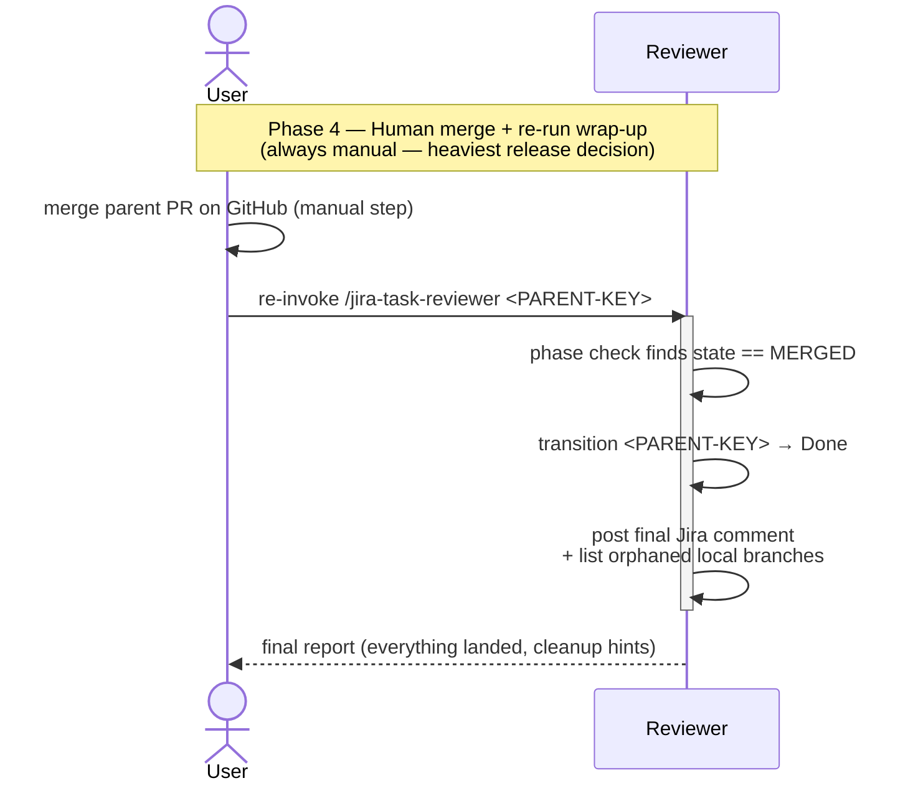

# Task Lifecycle — Phase 4: Human merge + re-run wrap-up

The release phase of [TASK-LIFECYCLE.md](TASK-LIFECYCLE.md). This phase
is deliberately the **only step that stays human** in the cascade: the
parent branch is *never* auto-merged into its base. The user merges
the parent PR on GitHub, then re-invokes the reviewer once more so it
can pick up the merged state and close out the parent issue.

## Sequence diagram

## What the diagram shows

- **The handover** — phase 3 ended with `gh pr review --approve` on
  the parent PR, not `gh pr merge`. This phase starts with the user
  clicking *merge* themselves on GitHub. The assignment is
  deliberately arranged this way (see the **Safety model** section of
  [README.md](../README.md)): the heaviest release decision in the
  cascade stays human.
- **Phase detection on re-invoke** — when the reviewer is re-invoked
  here, its phase check (phase 3, first step) sees `state == MERGED`
  and short-circuits straight to the wrap-up steps, never re-running
  the sub-task review cascade.
- **Wrap-up actions** — transition `<PARENT-KEY>` to *Done*, post a
  final multi-line Jira comment summarising what landed and which
  sub-tasks contributed, and identify any local branches that the
  base-branch has now eclipsed for the user to clean up at their
  discretion.
- **Skipped transitions are intentional** — note that no executor or
  reviewer in this phase touches a *remote* directly anymore; the
  only remote action is the user's manual merge. The reviewer's
  remaining work is book-keeping.

This phase is also the lifetime of `<PARENT-KEY>` on the board: it
entered at *In Review* at the end of phase 3, and exits at *Done*
when the re-invocation lands.

**Single-step top-level issues skip phases 3 and 4's reviewer wrap-up
entirely.** There's no parent-PR cascade and no reviewer re-run: the
user merges the one PR directly into `<BASE_BRANCH>`, and
GitHub-for-Jira's merge automation (or a manual `jira issue move`)
takes the issue to *Done*.

## Related

- [TASK-LIFECYCLE.md](TASK-LIFECYCLE.md) — full lifecycle with all four phases
- [jira-task-reviewer SKILL.md](../skills/jira-task-reviewer/SKILL.md)
