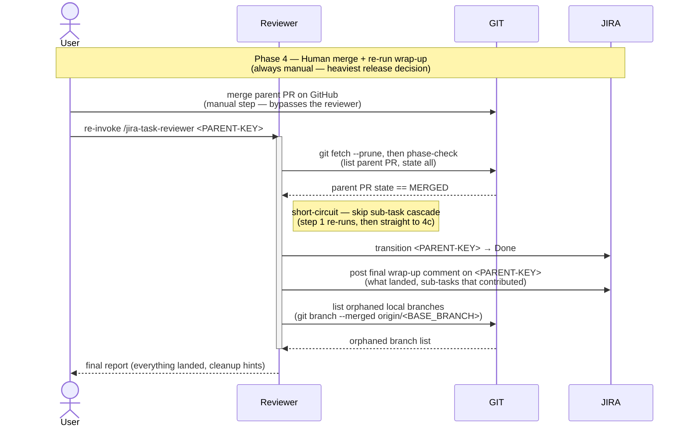

# Task Lifecycle — Phase 4: Human merge + re-run wrap-up

The release phase of [TASK-LIFECYCLE.md](TASK-LIFECYCLE.md). This phase
is deliberately the **only step that stays human** in the cascade: the
parent branch is *never* auto-merged into its base. The user merges
the parent PR on GitHub, then re-invokes the reviewer once more so it
can pick up the merged state and close out the parent issue.

The diagram surfaces the two systems this phase drives as their own
swimlanes — **GIT** (the manual GitHub merge that *the user* performs
directly, the reviewer's phase-check `gh pr list` that detects
`state == MERGED`, and the cleanup-time orphan-local-branch listing)
and **JIRA** (the parent → Done transition and the final wrap-up
comment) — so the full interaction reads `User ↔ Reviewer ↔ GIT ↔ JIRA`
left to right, with one defining quirk: this is the only phase where
the user's arrow reaches past the reviewer straight to GIT.

## Sequence diagram

## What the diagram shows

- **Participant routing** — phase 4's defining trait is that the *only*
  GIT mutation in this phase is made by the user, not the reviewer: the
  manual GitHub merge is drawn as `User → GIT`, jumping over the
  reviewer (the only such arrow in the whole four-phase sequence). The
  reviewer's re-run is book-keeping only — one GIT read up front (the
  phase-check `gh pr list` that detects `MERGED`), one GIT read at the
  end (the orphan-local-branch list), and two JIRA writes (parent →
  Done, and the final wrap-up comment). No GIT writes come from the
  reviewer here.
- **The handover** — phase 3 ended with `gh pr review --approve` on the
  parent PR, not `gh pr merge`. This phase starts with the user clicking
  *merge* themselves on GitHub (`User → GIT`, manual). The assignment is
  deliberately arranged this way (see the **Safety model** section of
  [README.md](../README.md)): the heaviest release decision in the
  cascade stays human.
- **Phase detection on re-invoke** — when the reviewer is re-invoked
  here, re-running phase 3's step 1, its phase check sees
  `state == MERGED` via GIT and short-circuits straight to the wrap-up
  (step 4c), never re-running the sub-task review cascade.
- **Wrap-up actions** — transition `<PARENT-KEY>` to *Done* (JIRA), post
  the final multi-line Jira comment summarising what landed and which
  sub-tasks contributed (JIRA), and list any local branches the base
  branch has now eclipsed (GIT read) for the user to clean up at their
  discretion.
- **Skipped transitions are intentional** — note that in this phase no
  executor or reviewer touches a *remote* directly anymore; the only
  remote action is the user's manual merge (`User → GIT`). The
  reviewer's remaining work is book-keeping.

This phase is also the lifetime of `<PARENT-KEY>` on the board: it
entered at *In Review* at the end of phase 3, and exits at *Done*
when the re-invocation lands.

**Single-step top-level issues skip phases 3 and 4's reviewer wrap-up
entirely.** There's no parent-PR cascade and no reviewer re-run: the
user merges the one PR directly into `<BASE_BRANCH>`, and
GitHub-for-Jira's merge automation (or a manual `jira issue move`)
takes the issue to *Done*.

## Related

- [TASK-LIFECYCLE.md](TASK-LIFECYCLE.md) — full lifecycle with all four phases
- [jira-task-reviewer SKILL.md](../skills/jira-task-reviewer/SKILL.md)
