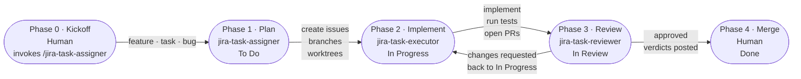

# Task lifecycle

The three skills map to three phases of a task's life. The Jira states
below use the default Kanban board names (To Do / In Progress / In
Review) — these are configurable per project, so map them to your own
workflow's status names.

0. **Phase 0 · Kickoff (done by Human)**  
   invokes `/jira-task-assigner`
   - the human entry point — invokes `/jira-task-assigner` with a feature, task, or bug
   - the single trigger that sets everything below in motion
1. **Phase 1 · Plan**  
   skill: `jira-task-assigner`  
   Jira state: **To Do**
   - investigates the codebase
   - asks clarifying questions
   - settles the scope (one issue, or a parent split into sub-tasks)
   - files the Jira issues
   - provisions a git branch and worktree for each
   - records the PR target branch the later phases build on
2. **Phase 2 · Implement**  
   skill: `jira-task-executor`  
   Jira state: **In Progress**
   - runs once per worktree, in parallel
   - confirms it owns the worktree and brings the branch up to date
   - implements the issue, runs the tests, commits, pushes, and opens a PR
   - issue moves to *In Review*
3. **Phase 3 · Review & aggregate approval**  
   skill: `jira-task-reviewer`  
   Jira state: **In Review**
   - reviews each PR across six dimensions (correctness, patterns, scope, regressions, tests, hygiene)
   - posts its verdict to GitHub and Jira
   - sends rejected issues back to *In Progress*
   - never merges — that stays a human call
4. **Phase 4 · Merge (done by Human)**  
   skill: skip  
   Jira state: **Done**
   - reviews the changes made
   - decides to merge into the base branch, or return it to development
   - after the merge, automation moves the issue to *Done*
---

<table>
<tr>
<td align="center" valign="top" width="33%">
<strong>Phase 1 · Plan</strong> 
<code>jira-task-assigner</code> 
<a href="TASK-LIFECYCLE-PHASE-1.md">Full diagram &amp; notes →</a>  

</td>
<td align="center" valign="top" width="33%">
<strong>Phase 2 · Implement</strong> 
<code>jira-task-executor</code> 
<a href="TASK-LIFECYCLE-PHASE-2.md">Full diagram &amp; notes →</a>  

</td>
<td align="center" valign="top" width="33%">
<strong>Phase 3 · Review &amp; aggregate approval</strong> 
<code>jira-task-reviewer</code> 
<a href="TASK-LIFECYCLE-PHASE-3.md">Full diagram &amp; notes →</a>  

</td>
</tr>
</table>
