# Task Lifecycle

The end-to-end flow a task goes through from a user's first request to
the parent PR being merged into the base branch — across the three
coupled skills of this plugin: **`jira-task-assigner`**, **`jira-task-executor`**,
and **`jira-task-reviewer`**.

The **sequence diagram** below is the canonical view; the prose that
follows narrates it.

## Sequence diagram

```mermaid
sequenceDiagram
    actor User
    participant Assigner
    participant Executor
    participant Reviewer

    Note over User,Assigner: Phase 1 — Plan<br/>(runs once, from the base branch)
    User->>Assigner: invoke /jira-task-assigner "<task description>"

    activate Assigner
    Assigner->>Assigner: check branch context
    Assigner->>Assigner: investigate codebase

    loop clarify until scope/types settled
        Assigner->>User: ask clarifying questions (scope, AC, priority...)
        User-->>Assigner: answers
    end

    Assigner->>Assigner: decide scope (single-step vs multistep)<br/>+ top-level type (Task / Story / Bug)

    alt Multistep (split into parallel sub-tasks)
        Assigner->>Assigner: create <PARENT-KEY> (Task / Story / Bug)
        Assigner->>Assigner: create branch feature/<PARENT-KEY>-<slug><br/>+ set parentbranch config + push + parent worktree
        loop per sub-task
            Assigner->>Assigner: create sub-task issue + branch & worktree<br/>+ set parentbranch config + push
            Assigner->>Assigner: post "PR target branch: ... Worktree: ..." comment
        end
    else Single-step (one cohesive task)
        Assigner->>Assigner: create single top-level issue + branch<br/>+ set parentbranch config + push + worktree
        Assigner->>Assigner: post "PR target branch: ... Worktree: ..." comment
    end
    deactivate Assigner

    Assigner-->>User: report (keys, branches, worktrees, strategy)

    Note over User,Reviewer: Phase 2 — Implement<br/>(one Executor per leaf)

    par every leaf — own worktree (parallel)
        User->>Executor: invoke /jira-task-executor <KEY-A>
        activate Executor
        Executor->>Executor: fetch issue + validate worktree
        Executor->>Executor: branch / worktree setup
        Executor->>Executor: transition → In Progress
        Executor->>Executor: investigate • clarify • implement • test
        Executor->>Executor: commit + push + open PR (semver label)
        Executor->>Executor: transition → In Review
        Executor-->>User: report (PR URL, branch, status)
        deactivate Executor
    and additional leaf (parallel)
        User->>Executor: invoke /jira-task-executor <KEY-B>
        activate Executor
        Executor->>Executor: same flow as KEY-A
        deactivate Executor
    end

    Note over User,Reviewer: Phase 3 — Review & merge cascade (parent key only)

    alt Multistep (reviewer cascade)
        User->>Reviewer: invoke /jira-task-reviewer <PARENT-KEY>
        activate Reviewer
        Reviewer->>Reviewer: git fetch origin --prune, fetch parent + sub-tasks

        alt No parent PR yet (first pass)
            loop per sub-task PR (sequential, review only)
                Reviewer->>Reviewer: fetch diff + review 6 dimensions
                alt REQUEST_CHANGES
                    Reviewer-->>User: stop + report findings (nothing merged)
                    Note over Reviewer: early exit — wait for fix, then re-run
                else APPROVE
                    Reviewer->>Reviewer: record APPROVE (no merge yet)
                end
            end
            Note over Reviewer: all reviewed PRs approved — merge cascade
            loop per sub-task PR (same key order)
                Reviewer->>Reviewer: gh pr review --approve
                Reviewer->>Reviewer: gh pr merge --squash --delete-branch
                Reviewer->>Reviewer: verify MERGED + transition sub-task → Done
            end
            Reviewer->>Reviewer: find or create parent PR (<PARENT-BRANCH> → <BASE_BRANCH>)
            Reviewer->>Reviewer: transition <PARENT-KEY> → In Review
            Reviewer->>Reviewer: review aggregate diff (lighter pass) + approve (no merge)
            Reviewer-->>User: "parent PR ready for manual merge"
        else Parent PR open (re-run)
            Note over Reviewer: sub-tasks already merged<br/>(just refresh the aggregate review and report status)
        else Parent PR merged (→ phase 4)
            Note over Reviewer: short-circuit to the post-merge wrap-up
        end
        deactivate Reviewer
    else Single-step (no reviewer)
        Note over User: user merges the single PR into the base branch manually
        Note over User: Done via GitHub-for-Jira merge automation (or manual jira issue move)
    end

    Note over User,Reviewer: Phase 4 — Human merges the release (always manual)
    alt Multistep
        User->>User: merge parent PR on GitHub (manual)
        User->>Reviewer: re-invoke /jira-task-reviewer <PARENT-KEY>
        activate Reviewer
        Reviewer->>Reviewer: phase check finds parent PR state == MERGED
        Reviewer->>Reviewer: transition <PARENT-KEY> → Done
        Reviewer->>Reviewer: post final Jira comment + list orphaned local branches
        deactivate Reviewer
        Reviewer-->>User: final report (everything landed, cleanup hints)
    else Single-step (already Done)
        Note over User: already Done — parent PR merged in the single-step branch above
    end
```

## Phase 1 — Plan (`jira-task-assigner`)

Triggered once by the user, **from the base branch** (the assigner
refuses to run on an existing feature/hotfix issue branch and asks how
to proceed on any other non-base branch — see
[jira-task-assigner §1](skills/jira-task-assigner/SKILL.md)).

The assigner:
1. Reads the branch context. The configured default base branch is
   fine; an existing `feature/`/`hotfix/` issue branch is refused; any
   other branch prompts the user rather than guessing.
2. Investigates the codebase to ground its scoping decisions.
3. **Clarification loop** — asks the user only about things that would
   change what gets built; doesn't ping what it can find itself.
4. Decides **scope** (single-step-purpose vs multistep — split into parallel
   sub-tasks only when the pieces are genuinely independent) **and the
   top-level type** (`Task` / `Story` / `Bug` per `jira-task-assigner`
   §4B).
5. Provisions issues, branches, and worktrees: records
   `branch.<branch>.parentbranch` in git config, pushes every branch
   it creates, and adds a worktree per leaf plus one parent worktree.
6. Posts a single `"PR target branch: ... Worktree: ..."` comment
   on each leaf issue — picked up later by the executor and reviewer
   as the durable fallback for the same info.

After phase 1, every leaf issue has its own worktree and branch.
Nothing is implemented yet — `jira-task-assigner` deliberately stops
short of writing code.

## Phase 2 — Implement (`jira-task-executor`)

Runs **once per leaf issue**, in its own worktree — multiple
executors run in parallel against the worktrees the assigner set up.
The user (or a sub-agent) invokes
`/jira-sdlc:jira-task-executor <KEY>` from inside each worktree.

What the executor does (see [jira-task-executor SKILL](skills/jira-task-executor/SKILL.md)):

1. Fetches the issue, checks for sub-tasks. If `<KEY>` is a multistep
   parent, it **asks the user to confirm** before implementing on the
   parent itself — a parent is normally a merge target, not an
   implementation target.
2. Validates that its worktree actually belongs to `<KEY>`
   (or its parent family) rather than assuming, then sets up its branch.
3. Transitions the issue to *In Progress*.
4. Investigates, may clarify, implements, tests (executor-level test
   policy: run each affected test individually first, then the full
   suite, and treat a red-but-individually-green suite as likely flake).
5. Commits, pushes, opens a PR with a required `patch`/`minor`/`major`
   semver label, and transitions the issue to *In Review*.
6. Posts a single Jira comment with the PR URL, not as a separate
   short "PR opened" earlier.

The diagram uses `par/and` to make the cross-worktree parallelism
explicit — three executors (or more) can be in flight at once.

## Phase 3 — Review & merge cascade (`jira-task-reviewer`)

Triggered once by the user on the **parent** key, not a sub-task. See
[jira-task-reviewer SKILL](skills/jira-task-reviewer/SKILL.md).

What the reviewer does:

1. **Phase check** — looks for an existing parent PR on `<PARENT-BRANCH>`
   → `<BASE_BRANCH>` to decide whether this is the first review pass, a
   re-run while the parent PR is open, or a post-merge wrap-up. Also
   rejects a sub-task key (parent only) and exits early on a top-level
   issue with no sub-tasks.
2. **Sequential per-PR review pass** of every sub-task PR, against six
   dimensions (correctness, pattern consistency, scope, regressions,
   test coverage, build hygiene) — this pass only *records* verdicts,
   it does not merge.
3. **Early exit on the first `REQUEST_CHANGES`** — *no* merges happen
   if any PR fails. The reviewer reports which PRs are blocked and
   which were already reviewed; the user fixes the blocker and
   re-invokes. The next run re-reviews everything, deliberately — the
   diff is usually small and an early exit means nothing was actually
   confirmed against its latest state.
4. **Merge cascade** (a *second* pass, only when every reviewed PR is
   approved) — for each: `gh pr review --approve`,
   `gh pr merge --squash --delete-branch`, verify `MERGED`, transition
   the sub-task to *Done*. Squash keeps the parent-branch history
   one-commit-per-sub-task.
5. **Prepare the aggregate parent PR** (parent branch → base branch):
   transition `<PARENT-KEY>` to *In Review*, find or create the parent
   PR, review the lighter aggregate diff, and approve it. The reviewer
   **never** merges this one — that's a deliberate human release
   decision.
6. Leaves a Jira comment and reports "ready for manual merge".

## Phase 4 — Human merge + re-run wrap-up

The merge of the parent branch into its base (`main` / `development` /
whatever `<BASE_BRANCH>` is) is **always manual**. This is by design —
the heaviest judgment call in the cascade is the one that stays human
(see the **Safety model** section of [README.md](../README.md)).

After the user merges the parent PR on GitHub, they re-invoke
`jira-task-reviewer <PARENT-KEY>` once more. It detects
`state == MERGED`, transitions the parent to *Done*, posts a final
Jira comment summarising what landed, and lists any orphaned local
branches for cleanup.

**Single-step top-level issues skip phases 3 and 4's reviewer re-run
entirely**: there's no parent-PR cascade, so the user just merges the
one PR directly into `<BASE_BRANCH>`, and GitHub-for-Jira's merge
automation (or a manual `jira issue move`) takes the issue to
*Done*.

## State passed between the three skills

Nothing is passed by hand. Two mechanisms carry state from one skill
to the next:

| Mechanism | Set in | Read in | Scope |
|---|---|---|---|
| `git config branch.<branch>.parentbranch` | `jira-task-assigner` (on every branch it creates) + fallback by `jira-task-executor` when it makes an issue's branch on the fly | `jira-task-executor` (to find its PR base), `jira-task-reviewer` (to find the parent branch's own base) | Local to a clone |
| Jira comment `"PR target branch: ... Worktree: ..."` | `jira-task-assigner` (every leaf) and `jira-task-executor` (fallback when it branches mid-flight) | `jira-task-executor` (when config is missing), `jira-task-reviewer` (when config is missing) | Durable across clones and machines |

Both skills that consume this state check the git-config first and
fall back to the Jira comment on miss — never the other way around.

## Per-phase views

The same flow split into one focused diagram per phase:

- [Phase 1 — Plan](TASK-LIFECYCLE-PHASE-1.md) — `jira-task-assigner`
- [Phase 2 — Implement](TASK-LIFECYCLE-PHASE-2.md) — `jira-task-executor`
- [Phase 3 — Review & merge cascade](TASK-LIFECYCLE-PHASE-3.md) — `jira-task-reviewer`
- [Phase 4 — Human merge + re-run wrap-up](TASK-LIFECYCLE-PHASE-4.md) — manual merge + re-invoke

## Related documents

- [README.md](../README.md) — overview, installation, quick-start
- [jira-task-assigner SKILL](skills/jira-task-assigner/SKILL.md)
- [jira-task-executor SKILL](skills/jira-task-executor/SKILL.md)
- [jira-task-reviewer SKILL](skills/jira-task-reviewer/SKILL.md)
- [SDLC.md](SDLC.md) — the branching/release policy these skills assume
- [JIRA-KANBAN-BOARD.md](JIRA-KANBAN-BOARD.md) — the Kanban-side view of the same statuses
