# Task Lifecycle

The end-to-end flow a task goes through from a user's first request to
the parent PR being merged into the base branch — across the three
coupled skills of this plugin: **`jira-task-assigner`**,
**`jira-task-executor`**, and **`jira-task-reviewer`**.

The diagram below surfaces the two systems each skill drives as their
own swimlanes — **GIT** (anything that mutates or reads repo/PR state)
and **JIRA** (anything that mutates or reads issue state) — so the
whole interaction reads `User ↔ skill ↔ GIT ↔ JIRA` left to right
across three phases. It is stitched from the three per-phase
diagrams ([P1](TASK-LIFECYCLE-PHASE-1.md),
[P2](TASK-LIFECYCLE-PHASE-2.md),
[P3](TASK-LIFECYCLE-PHASE-3.md)); those have the full arrow-level
routing detail, this one is the one-look canonical view.

## Sequence diagram

```mermaid
sequenceDiagram
    actor User
    participant Assigner
    participant Executor
    participant Reviewer
    participant GIT
    participant JIRA

    Note over User,JIRA: Phase 1 — Plan<br/>(runs once, from the base branch)
    User->>Assigner: invoke /jira-task-assigner "<task description>"

    activate Assigner
    Assigner->>GIT: read current branch (base? feature/hotfix? other?)
    GIT-->>Assigner: current branch
    Assigner->>Assigner: investigate codebase

    loop clarify until scope/types settled
        Assigner->>User: ask clarifying questions (scope, AC, priority...)
        User-->>Assigner: answers
    end

    Assigner->>Assigner: decide scope (single-step vs multistep)<br/>+ top-level type (Task / Story / Bug)

    alt Multistep (split into parallel sub-tasks)
        Assigner->>JIRA: create <PARENT-KEY> (Task / Story / Bug)
        Assigner->>GIT: create branch feature/<PARENT-KEY>-<slug>,<br/>set parentbranch config, push, add parent worktree
        loop per sub-task
            Assigner->>JIRA: create sub-task issue (link parent)
            Assigner->>GIT: create sub-task branch + worktree,<br/>set parentbranch config, push
            Assigner->>JIRA: post "PR target branch: ... Worktree: ..." comment
        end
    else Single-step (one cohesive task)
        Assigner->>JIRA: create single top-level issue
        Assigner->>GIT: create branch + worktree,<br/>set parentbranch config, push
        Assigner->>JIRA: post "PR target branch: ... Worktree: ..." comment
    end
    deactivate Assigner

    Assigner-->>User: report (keys, branches, worktrees, strategy)

    Note over User,JIRA: Phase 2 — Implement<br/>(one Executor per leaf)

    par every leaf — own worktree (parallel)
        User->>Executor: invoke /jira-task-executor <KEY-A>
        activate Executor
        Executor->>JIRA: fetch issue + (parent family for ownership check)
        Executor->>GIT: validate worktree belongs to <KEY-A> (else stop & ask)
        Executor->>GIT: branch / worktree setup (resume or create)
        Executor->>JIRA: transition → In Progress
        Executor->>Executor: investigate • clarify • implement • test
        Executor->>GIT: commit + push + open PR (semver label)
        Executor->>JIRA: transition → In Review + post closing comment
        Executor-->>User: report (PR URL, branch, status)
        deactivate Executor
    and additional leaf (parallel)
        User->>Executor: invoke /jira-task-executor <KEY-B>
        activate Executor
        Executor->>Executor: same flow as KEY-A (in parallel)
        deactivate Executor
    end

    Note over User,JIRA: Phase 3 — Review & aggregate approval (parent key only)

    alt Multistep (reviewer)
        User->>Reviewer: invoke /jira-task-reviewer <PARENT-KEY>
        activate Reviewer
        Reviewer->>GIT: git fetch origin --prune
        Reviewer->>JIRA: fetch parent + sub-tasks<br/>(filter to <STATUS_IN_REVIEW>)
        Reviewer->>GIT: resolve <PARENT-BRANCH> + <BASE_BRANCH><br/>(grep + parentbranch config)
        Reviewer->>GIT: phase check — list parent PR (state all)
        GIT-->>Reviewer: parent PR state (none | open | merged)

        alt No parent PR yet (first pass)
            loop per sub-task PR (sequential, In Review only)
                Reviewer->>GIT: fetch diff
                Reviewer->>Reviewer: review 6 dimensions
                alt APPROVE
                    Reviewer->>GIT: gh pr review --comment --body-file<br/>"APPROVED — <summary>"<br/>(no merge — human merges manually)
                    Reviewer->>JIRA: comment on <SUBTASK-KEY><br/>"PR #<n> reviewed and approved."
                    Reviewer->>JIRA: update summary on <PARENT-KEY><br/>"Sub-task <KEY>: ✅ approved"
                else REQUEST_CHANGES
                    Reviewer->>GIT: gh pr review --comment --body-file<br/>"CHANGES REQUESTED — <findings>"
                    Reviewer->>JIRA: transition <SUBTASK-KEY> → <STATUS_IN_PROGRESS>
                    Reviewer->>JIRA: comment on <SUBTASK-KEY><br/>"Findings: ...<br/>Moving back to In Progress."
                    Reviewer->>JIRA: update summary on <PARENT-KEY><br/>"Sub-task <KEY>: ❌ changes requested"
                    Note over Reviewer: continue to next sub-task PR
                end
            end
            Note over Reviewer: loop complete — check outcomes
            alt All approved and all already merged
                Reviewer->>GIT: find or create parent PR (<PARENT-BRANCH> → <BASE_BRANCH>)
                Reviewer->>GIT: fetch + review aggregate diff (lighter pass)
                Reviewer->>GIT: gh pr review --comment --body-file<br/>"APPROVED — <summary>" (no auto-merge — manual)
                Reviewer-->>User: "parent PR ready for manual merge"
            else All approved, some not yet merged
                Reviewer->>JIRA: post report on <PARENT-KEY><br/>(all approved, waiting for merge)
                Reviewer-->>User: "all approved — merge manually, then re-run"
            else Some rejected
                Reviewer->>JIRA: post full report on <PARENT-KEY><br/>(approved + rejected list)
                Reviewer-->>User: "some PRs blocked — fix & re-run"
            end
        else Parent PR open (re-run)
            Note over Reviewer: aggregate PR already open<br/>(refresh review, skip sub-tasks)
            Reviewer-->>User: "parent PR reviewed and ready for manual merge"
        else Parent PR merged (re-run wrap-up)
            Note over Reviewer: short-circuit to post-merge wrap-up (step 6)
            Reviewer->>JIRA: post wrap-up comment (sub-task summary) on <PARENT-KEY><br/>(GitHub-for-Jira handled the status → Done)
            Reviewer->>GIT: git fetch origin (refresh refs, list orphaned branches)
            Reviewer-->>User: "fully complete — all PRs merged (M-FULLY-COMPLETE)"
        end
        deactivate Reviewer
    else Single-step
        Note over Reviewer: single-step track: review the one PR (step 3)
        alt Single-step APPROVE
            Reviewer->>GIT: gh pr review --comment --body-file<br/>"APPROVED — <summary>"
            Reviewer->>JIRA: post final report on <PARENT-KEY><br/>(S-APPROVED, step 7)
            Reviewer-->>User: "approved — merge manually<br/>GitHub-for-Jira handles Done, no re-run needed"
        else Single-step REQUEST_CHANGES
            Reviewer->>GIT: gh pr review --comment --body-file<br/>"CHANGES REQUESTED — <findings>"
            Reviewer->>JIRA: transition <PARENT-KEY> → <STATUS_IN_PROGRESS>
            Reviewer->>JIRA: comment (<PARENT-KEY>)<br/>"PR failed review, findings:..."
            Reviewer-->>User: "changes requested — fix, push & re-run"
        end
    end
```

## Participant routing

Two lanes, one rule each — applied uniformly across all four phases:

- **GIT** — anything that mutates or reads **repo/PR state**: branch
  context reads, branch creation, the `branch.<branch>.parentbranch` git
  config entry (set in phase 1, read back in phases 2 and 3), the push,
  `git worktree add`, `git fetch --prune`, fetching PR diffs,
  `gh pr review --approve` / `--request-changes`, state-verification reads,
  find-or-create parent PR, and the cleanup orphan-branch listing. The
  reviewer **never calls `gh pr merge`** — it only approves PRs, and the
  human merges them on GitHub. *The one GIT write the skills never make*
  is `gh pr merge` on the **parent** PR — that's the human release
  decision (always manual, never automated by the reviewer).
- **JIRA** — anything that mutates or reads **issue state**: fetching
  the parent / sub-tasks / leaf issue (the parent family returned here
  feeds the executor's worktree-ownership check too), every status
  transition (*In Progress*, *In Review*, *Done*), every comment
  (assigner leaf "PR target branch" comments, executor closing comments,
  reviewer review-approval / blocked-report / wrap-up comments).
- **Stays inside the skill** — the reasoning that turns those reads into
  decisions: the assigner's scoping, the executor's
  investigate/clarify/implement/test, the reviewer's six-dimension
  review and recorded verdicts.

Two routing quirks the diagram makes visible:

1. The user's manual merge is the only arrow in the whole sequence that
   jumps a swimlane to GIT without going through a skill (`User → GIT`,
   past the reviewer). The reviewer is explicitly forbidden from that
   merge, so the user drives GIT directly.
2. On the **single-step** track, the reviewer handles the one PR itself
   (step 3): approve posts the final report immediately, and
   GitHub-for-Jira's merge automation takes the issue to *Done* — no
   re-run needed. The only re-run case on single-step is
   REQUEST_CHANGES (fix-and-retry).

## Phase 1 — Plan (`jira-task-assigner`)

Triggered once by the user, **from the base branch** (the assigner
refuses to run on an existing feature/hotfix issue branch and asks how
to proceed on any other non-base branch). The assigner clarifies scope
and provisions issues + branches + worktrees, then posts a single
`"PR target branch: ... Worktree: ..."` comment on each leaf — the
durable fallback the executor and reviewer read later. **Routing:** JIRA
owns issue creation and the leaf comments; GIT owns the branch-context
read, branch creation, the `parentbranch` config entry, the push, and
worktree creation. See
[Phase 1 — Plan](TASK-LIFECYCLE-PHASE-1.md).

## Phase 2 — Implement (`jira-task-executor`)

Runs **once per leaf issue**, in its own worktree — multiple executors
run in parallel against the worktrees the assigner set up. The executor
validates its worktree, transitions to *In Progress*, implements/tests,
commits + pushes + opens a PR with a required `patch`/`minor`/`major`
semver label, transitions to *In Review*, and posts a single closing
Jira comment. **Routing:** JIRA owns the issue fetch (which returns the
parent family used in the ownership check), the *In Progress* / *In
Review* transitions, and the closing comment; GIT owns the
worktree-ownership read, the resume-or-create branch setup, the
commit/push, and the PR open. See
[Phase 2 — Implement](TASK-LIFECYCLE-PHASE-2.md).

## Phase 3 — Review & aggregate approval (`jira-task-reviewer`)

Triggered once by the user on the **parent** key (not a sub-task). Step 1
determines the track from `fields.subtasks`: empty → **single-step**
(review the one PR directly into `<BASE_BRANCH>`; approve posts the final
report and no re-run is needed — GitHub-for-Jira handles Done on merge);
non-empty → **multistep** (review each In Review sub-task PR, then the
aggregate parent PR once sub-tasks are merged).

On the multistep track: each matching sub-task PR is reviewed
sequentially in one pass. Both verdicts go through `gh pr review
--comment --body-file` with a body prefix (`APPROVED — …` /
`CHANGES REQUESTED — …`) — the executor and reviewer share one `gh`
account in this plugin's default deployment, and GitHub blocks an author
from approving *or* requesting changes on their own PR. On reject, the
reviewer transitions the issue back to `<STATUS_IN_PROGRESS>` (that is
the actual gate), posts findings, and continues the loop (the user fixes
and re-runs later). After the loop, if all are approved and already
merged, the reviewer finds or creates the aggregate parent PR and
reviews that too (lighter pass, same `--comment --body-file` pattern).

The reviewer **never merges** anything — the human merges every PR
manually on GitHub. **Routing:** GIT owns the fetch, branch resolution
(the `parentbranch` config the assigner set in phase 1), diff fetches,
`gh pr review --comment --body-file`, and parent-PR find-or-create; JIRA
owns the parent+sub-task fetch (In Review filter), each rejected issue's
*In Progress* transition and findings comment, the per-review summary
comment on the parent (multistep audit trail), and every report comment
posted on the parent. See
[Phase 3 — Review & aggregate approval](TASK-LIFECYCLE-PHASE-3.md).

## State passed between the three skills

Nothing is passed by hand. Two mechanisms carry state from one skill to
the next, and both are visible as GIT/JIRA arrows in the diagram above:

| Mechanism | Set in | Read in | Scope |
|---|---|---|---|
| `git config branch.<branch>.parentbranch` | `jira-task-assigner` (on every branch it creates) + fallback by `jira-task-executor` when it makes an issue's branch on the fly | `jira-task-executor` (to find its PR base), `jira-task-reviewer` (to find the parent branch's own base) | Local to a clone |
| Jira comment `"PR target branch: ... Worktree: ..."` | `jira-task-assigner` (every leaf) and `jira-task-executor` (fallback when it branches mid-flight) | `jira-task-executor` (when config is missing), `jira-task-reviewer` (when config is missing) | Durable across clones and machines |

The diagram makes **which** system each arrow hits explicit: the
skills talk to GIT and JIRA in the order shown, and the two
state-passing mechanisms are why it matters — the `parentbranch` config
is the GIT trace the assigner leaves for phases 2 and 3, and the Jira
comment is the JIRA trace each leaf carries for the same consumers.

## Per-phase views

The same flow split into focused diagrams, one per phase:

- [Phase 1 — Plan](TASK-LIFECYCLE-PHASE-1.md)
- [Phase 2 — Implement](TASK-LIFECYCLE-PHASE-2.md)
- [Phase 3 — Review & aggregate approval](TASK-LIFECYCLE-PHASE-3.md)

## Related documents

- [README.md](../README.md) — overview, installation, quick-start
- [jira-task-assigner SKILL](skills/jira-task-assigner/SKILL.md)
- [jira-task-executor SKILL](skills/jira-task-executor/SKILL.md)
- [jira-task-reviewer SKILL](skills/jira-task-reviewer/SKILL.md)
- [SDLC.md](SDLC.md) — the branching/release policy these skills assume
- [JIRA-KANBAN-BOARD.md](JIRA-KANBAN-BOARD.md) — the Kanban-side view of the same statuses
