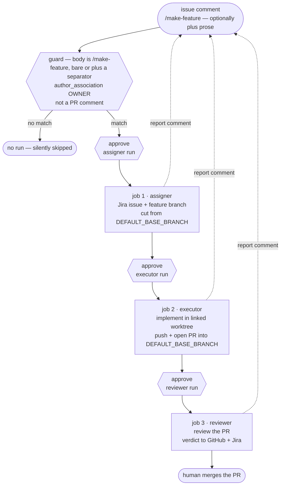

# CI application: the feature-flow demo (assigner → executor → reviewer)

> **Note on this document:** this describes
> [`demo-claude-feature-flow.yml`](../../../../.github/workflows/demo-claude-feature-flow.yml)
> at the **marketplace repo root** — a GitHub Actions workflow that chains all
> three `jira-sdlc` skills headlessly, one job per skill, turning a GitHub
> issue into a reviewed feature PR when someone comments `/make-feature` on it.
> It is an **application demo**: a worked example of running the skills in CI,
> meant to be read next to the workflow file (whose comments carry the
> line-level rationale) and copied into other repos. It is **not** this repo's
> development procedure — planned work here is human-driven
> ([SDLC.md](../SDLC.md)). The workflow-by-workflow CI reference is
> [CI.md](../CI.md).
>
> Its sibling is [ci-hotfix-flow-demo.md](./ci-hotfix-flow-demo.md) — the same
> three-job chain on the *emergency* flow. Everything the two share is
> explained there in the same words. **Read that one for the shared pattern**
> and this one for what planned work changes.

## What it demonstrates

A GitHub issue is the task description. A maintainer comments `/make-feature`
on it, and three sequential jobs — each a fresh runner VM, each running one
skill under its own Jira identity, with the issue key and branch handed
forward through job outputs — carry it to a reviewed PR:

1. **assigner** — turns the issue's title + body into a Jira issue, cuts
   `feature/<KEY>-<slug>` from `<DEFAULT_BASE_BRANCH>`, pushes it, and
   assigns the issue to the executor.
2. **executor** — rebuilds a linked worktree for that branch, implements the
   change, pushes, and opens a PR targeting `<DEFAULT_BASE_BRANCH>`.
3. **reviewer** — rebuilds the worktree again, reviews the PR, and posts its
   verdict to both GitHub and Jira.

Each job also comments its skill's report back on the triggering GitHub issue,
so the whole run is visible where the work was requested.

Nothing is merged. The run ends with an open, reviewed PR into
`<DEFAULT_BASE_BRANCH>`. Merging it is a human act — and from there the
ordinary release path applies ([SDLC.md](../SDLC.md)), with no tag bump of its
own.



## The difference from the hotfix demo, in four lines

The two workflows are deliberately near-identical, so the differences are
worth naming precisely — these are exactly the places a careless copy of one
into the other goes wrong:

|  | hotfix demo | this one |
| :- | :- | :- |
| trigger | `issue_comment` — `/make-hotfix` on an issue | `issue_comment` — `/make-feature` on an issue |
| branch | `hotfix/<KEY>-<slug>` off `origin/<PRODUCTION_BRANCH>` | `feature/<KEY>-<slug>` off `<DEFAULT_BASE_BRANCH>` |
| PR base / `parentbranch` | `<PRODUCTION_BRANCH>` | `<DEFAULT_BASE_BRANCH>` |
| assigner prompt | the issue text **plus** an explicit hotfix directive, which engages assigner step 5C (forces single-step scope, cuts from production) | issue title + body only — no directive, so scope is the assigner's own judgement |

Everything else — the guard on the trigger, the report comment and
transcript-GIF artifact per job, the per-role model defaults, the runner
bootstrap — is the same in both, described in the same words there.

## The trigger and its gate

```yaml
on:
  issue_comment:
    types: [created]
```

`issue_comment` fires for **any** commenter on a public repo, and what follows
runs an LLM with write permissions on a runner. The job-level `if` is therefore
the security boundary of this workflow, and it requires all three of:

| Condition | Why it's there |
| :- | :- |
| body is `/make-feature`, bare or followed by a space or newline | the command has to be the comment's first token, so a comment that merely mentions `/make-feature` mid-sentence doesn't fire the chain. Written out as an exact match plus three `startsWith` forms because the obvious one-liner, `startsWith(body, '/make-feature')`, would also fire on `/make-feature-anything`. Requiring a *separator* is what lets prose follow the command without loosening the match |
| `author_association == 'OWNER'` | the actual authorization check. **Do not** loosen it to `MEMBER` or `CONTRIBUTOR` — a single merged PR earns `MEMBER` association, which is too loose for a trigger that runs an LLM with write permissions on a runner — an approval prompt is a poor place to be reading attacker-supplied text for the first time |
| `github.event.issue.pull_request == null` | `issue_comment` fires for PR comments too, where `github.event.issue` *is* the PR — without this, `/make-feature` on a pull request would hand the assigner a PR description as a feature request |

Jobs 2 and 3 declare `needs`, and a skipped dependency skips its dependents,
so the guard is stated once on job 1.

A comment that fails the guard produces no run at all — no failed check, no
notification. That is deliberate: a public repo would otherwise accumulate a
red X for every unrelated comment.

**The issue, not the comment, is the task description.** The assigner receives
the issue's title, a blank line, then its body — the same shape
`demo-claude-issue-to-task.yml` uses. Issue bodies are attacker-supplied text,
so they reach the prompt through env vars and a `printf`-built temp file, never
interpolated into a shell command.

### Steering one run from the comment

The comment can still carry direction, though — anything typed after the
command word is free-form guidance for *this run*:

```
/make-feature split this per service, and reuse the existing retry helper
```

It also works across lines, which is the readable form for more than a phrase:

```
/make-feature
Split this per service.
Reuse the existing retry helper — do not add a dependency.
```

A parse step strips the command token, trims the surrounding whitespace, and
the assigner prompt gains one labelled section **after** the issue body:

```
-- ISSUE TITLE --
…

You are running headless, triggered by a GitHub Actions issue_comment event — …

-- ISSUE BODY --
…

-- EXTRA DIRECTION FOR THIS RUN (from the triggering comment) --
Split this per service.
Reuse the existing retry helper — do not add a dependency.
```

Three things about that placement are deliberate:

- **It supplements, never replaces.** The GitHub issue stays the task
  description and the fixed middle paragraph stays the CI instruction
  (headless, no clarifying questions, feature-not-hotfix). The prose is a
  fourth section, not a substitute for any of them.
- **A bare `/make-feature` omits the section entirely**, so the prompt is
  byte-identical to what this demo built before the feature existed. Adding
  prose is opt-in per comment; changing nothing changes nothing.
- **The comment body is attacker-supplied text like the issue body**, and
  travels the same way — into an env var, out through `printf` — never
  interpolated into the script. The parse step does no gating; the guard above
  is still the only thing between a commenter and the run.

Only the **assigner** reads the prose in this chain: jobs 2 and 3 run in
separate VMs off job 1's outputs and invoke their skills as they always have.
Direction meant for the reviewer goes in a `/review` comment on the PR instead
([ci-review-pr-demo.md](./ci-review-pr-demo.md)).

## The `environment: production` gate — one approval per skill

Every job declares `environment: production`, and that environment has
GitHub's **Required reviewers** rule checked. Protection is evaluated **before
each job starts**, so one `/make-feature` comment pauses three times. See
[APPLICATIONS.md §3.1–3.2](../APPLICATIONS.md) for the full two-gate convention:

| Pause | Approving it releases | What has happened so far |
| :- | :- | :- |
| before job 1 | the assigner | nothing — this is the "should this issue become work at all" gate, and the first place a human reads the issue text with the run in mind |
| before job 2 | the executor | a Jira issue exists and `feature/<KEY>-<slug>` is pushed — inspect both before any code is written |
| before job 3 | the reviewer | the change is pushed and the PR is open — eyeball the diff before the automated review spends tokens on it |

One environment reused across all three jobs is enough: the rule fires per
*job*, so it already yields one checkpoint per skill. Three environments would
buy nothing but configuration to keep in sync.

The environment is also the **secret scope** — every credential is an
environment secret on `production`, so a job that forgot its `environment:`
line would see empty strings (and fail its explicit up-front secret check),
never real credentials. The secret table is identical to the hotfix demo's:
see [ci-hotfix-flow-demo.md](./ci-hotfix-flow-demo.md#the-environment-production-gate--one-approval-per-skill).
Each secret is named **exactly as the `jira-sdlc-tools.local.env` key it
becomes**, which is what lets each job's env-file bootstrap be one loop over a
`KEYS` list instead of hand-mapped `printf`s.

## Runner vs. developer machine — what each job rebuilds

The skills were written for a developer machine: a persistent checkout,
sibling worktrees, machine-local git config, an interactive turn to answer
questions. A GitHub-hosted runner has none of that, so each job spends its
first steps reconstructing precisely the state the skills' own healthchecks
demand. This is the part worth studying before copying the pattern.

**Fresh VM per job → rebuild everything.** Each job rewrites
`.jst/jira-sdlc-tools.local.env` from its own role-scoped secrets, and jobs
2/3 rebuild the linked worktree the skills demand (next section).
`WORKTREES_DIR` and `GITHUB_PAT_TOKEN` are the two config keys that are
*not* secrets. `WORKTREES_DIR` points under `RUNNER_TEMP`, because a value
carried from a developer's machine would name a path that doesn't exist
here. `GITHUB_PAT_TOKEN` is always populated from the built-in
`GITHUB_TOKEN` (see the hotfix demo's secrets table) — a real PAT is only
needed for local/dev use, where `statuscheck` reads it from
`.jst/jira-sdlc-tools.local.env` to log `gh` in.

### Jobs 2 and 3 must build the worktree *before* invoking the skill

Both the executor job and the reviewer job run the same
`Rebuild the issue worktree` step immediately before their skill step. It is a
**precondition, not setup convenience**: the executor and reviewer each
hard-stop unless they are running in a *linked worktree* on an issue branch
(`feature/*`, `bugfix/*`, `chore/*`, `hotfix/*`). Skip it and the run dies in
the skill's healthcheck before
any work happens.

The step is byte-identical in both jobs:

```bash
WT="$RUNNER_TEMP/worktrees/worktree-$KEY"
git fetch origin "+refs/heads/$BRANCH:refs/remotes/origin/$BRANCH"
git worktree add --track -B "$BRANCH" "$WT" "origin/$BRANCH"
git config "branch.$BRANCH.parentbranch" "$PR_BASE"
```

`$BRANCH` is **the right branch** in the only sense that matters here: job 1's
`branch` output — the `feature/<KEY>-<slug>` the assigner actually created and
pushed. It is never re-derived, so jobs 2 and 3 cannot drift onto a different
branch than the one that was planned.

Three things make this step necessary rather than tidy:

1. **It's the *kind* of checkout, not the branch.** The check is one line in
   `statuscheck.sh` — `[ -f "$WT_ROOT/.git" ]`. A linked worktree's `.git` is
   a *file* (a `gitdir:` pointer); a normal checkout's is a *directory*. So
   pointing `actions/checkout` at the issue branch, or running
   `git checkout <branch>` in the workspace, still fails — being on the right
   branch does not make a main checkout acceptable.
2. **The job holds two checkouts at once, deliberately.** The
   `actions/checkout` workspace stays a main checkout standing on
   `<DEFAULT_BASE_BRANCH>` — the start state the assigner's healthcheck
   demands — while the linked worktree on the issue branch is where the
   skill *runs*. Neither alone satisfies both requirements. (Neither is where
   the *skills* come from: those are installed from the marketplace, below.)
3. **The working directory is the addressing mechanism.** Neither skill takes
   an issue-key argument; each derives its key from the branch of the worktree
   it stands in. That is what
   `working-directory: ${{ steps.worktree.outputs.path }}` on the skill step is
   for — it is how the job says *which issue*, and the local equivalent of
   `cd <WORKTREES_DIR>/worktree-<KEY> && claude`.

The fourth line restores `parentbranch` — the next paragraph covers why, and
why it is the one line here most easily copied over wrongly.

**`parentbranch` is machine-local.** The assigner records the PR target in
`git config branch.<branch>.parentbranch`, which evaporates with job 1's VM.
Jobs 2/3 re-set it from job 1's `pr_base` output — here
`<DEFAULT_BASE_BRANCH>`, and that is the single line most likely to be copied
over wrongly from the hotfix demo, where the same line is
`<PRODUCTION_BRANCH>`. The assigner's durable `PR target branch: …` Jira
comment is the fallback the skills would otherwise resolve from.

**The checkout must be switched to the base branch explicitly.** An
`issue_comment` event checks out the repo's *default* branch, which is not by
definition `<DEFAULT_BASE_BRANCH>` — and the assigner hard-stops unless it
runs in a main checkout on the base branch (it *creates* worktrees, it doesn't
run inside one).

**The skills come from the marketplace, not from the checkout.** Every job
installs the plugin the way a consumer would, which is what makes these
workflows copy-pasteable into a repo that doesn't contain the plugin:

```bash
claude plugin marketplace add https://github.com/kantorv/jira-sdlc-tools.git
claude plugin install jira-sdlc@jira-sdlc-tools
# external consumers: swap the URL for your own fork or clone
```

`marketplace add` clones the plugin repo's **default** branch, so what a run
exercises is whatever has landed there — never the skill files on the branch
under test. Land a skill change on that default branch before expecting a demo
run to pick it up.

**Never export `GH_TOKEN`/`GITHUB_TOKEN` into a step that runs a skill.**
Every skill starts with statuscheck, which logs `gh` in from the
`GITHUB_PAT_TOKEN` *inside the env file* via
`gh auth logout && gh auth login --with-token` — and `gh` refuses that login
while either token variable is exported, failing the healthcheck before any
work happens. The skill-running steps therefore export only
`CLAUDE_CODE_OAUTH_TOKEN`. The steps that do need `GH_TOKEN` (job 2's PR
confirmation and the three comment-posting steps) run *after* the skill and
set it inline on the one command.

**Self-review is by design.** Job 3's `gh` session is the same account that
opened the PR in job 2, and GitHub blocks approving your own PR. The reviewer
skill accounts for this: verdicts land as PR **comments** with a
machine-detectable `APPROVED — …` / `CHANGES REQUESTED — …` prefix, and the
Jira transition is the actual workflow gate.

**Headless means no questions.** The skills run with `-p` and
`--dangerously-skip-permissions` (acceptable on a throwaway non-root runner
VM, and nowhere else). A run where the assigner stops to ask a clarifying
question creates no branch, and job 1's capture step fails loud rather than
letting the chain continue on a guess. That check demands *exactly one* new
`feature/*` branch, which also catches the other end: if the assigner judges
the issue to be **multistep**, it creates a parent branch plus one per
sub-task, and this two-successor chain (one executor, one reviewer) cannot
carry that fan-out — so it stops instead of silently implementing one arbitrary
piece. Keep demo issues single-step in scope. Likewise the reviewer's closing
"move these to Done?" question goes unanswered, so a completed demo leaves the
Jira issue in `<STATUS_IN_REVIEW>` — the merge automation (or a human) takes it
to `<STATUS_DONE>` after the PR merges.

**Deliberate duplication.** The bootstrap steps (env file, config resolve,
base-branch switch, CLI install) are near-identical across the three jobs and
across the two demo workflows, and are *not* factored into a composite action:
these workflows are meant to be copied into other repos as a single file,
which a sibling helper would quietly break. Keep the copies byte-identical
apart from the role, so a diff between two jobs shows only what genuinely
differs.

## Reporting back to the issue

Beyond the log artifacts (`assigner-log`, `executor-log`, `reviewer-log`,
7-day retention), each job reports twice — once where the work was requested,
once where the run happened.

The **issue comment** is a structured summary — Jira key, branch, PR link
where applicable — followed by the full skill transcript, in plain markdown.
It is deliberately *not* folded into a `<details>` block: the comment reads top
to bottom without a click, and the conversation stays where the work was
requested instead of in an Actions tab nobody opens.

The **job summary** appends that same transcript to `$GITHUB_STEP_SUMMARY`,
under the one-line heading each job already writes there, so the run page
explains itself without opening the log or downloading an artifact. It has its
own ceiling — 1 MiB per step, against the comment's 65536 characters — and
gets the same truncation treatment, in a step that is `if: always()` for the
same reason the comment step is.

Three details in those steps are load-bearing:

- **The 65536-character comment limit.** A `gh issue comment` body over it
  fails the job outright, which would turn a successful skill run into a red
  X. The transcript is capped at 55000 bytes and keeps the **tail**, since the
  skill's own report is the last thing it prints, with a pointer to the full
  artifact in place of what was dropped.
- **A byte-wise cut can land mid-character.** The transcripts are full of
  em-dashes and box-drawing, and invalid UTF-8 makes the GitHub API reject the
  whole comment — so the truncated tail is passed through
  `iconv -c -f UTF-8 -t UTF-8`, which drops the orphaned continuation bytes.
- **The transcript is fenced with five backticks**, because the skill's own
  output contains triple-backtick blocks that would otherwise close the fence
  early. Every summary line is built with `printf` and the value as an
  argument, so a backtick or `$` in a branch name or issue key can't be
  re-expanded by the shell.

The comment steps run `if: always()` and after the skill, which is what lets a
*failed* run still explain itself on the issue: the summary carries
`job.status`, and a missing log becomes an explicit "the job failed before the
skill produced output" note rather than an empty block.

### The transcript GIFs

Each job uploads a second artifact next to its log — `assigner-transcript-gif`,
`executor-transcript-gif`, `reviewer-transcript-gif`, same 7-day retention —
holding the skill's own Claude Code session rendered to an animated GIF by
[agent-log-gif](https://pypi.org/project/agent-log-gif/): a terminal replay of
the run, Nord scheme, `linux` window chrome, tool calls visible, first 50
turns. It is purely a debugging affordance, and it earns its place on the case
the text log serves worst — a failed or simply *weird* headless run, which is
much easier to read as a replay than as 50000 characters of piped stdout.

**Why an artifact and not an attachment on the issue comment**, given
everything else in this section works hard to report where the work was
requested: GitHub has no API for attaching a file to an issue comment. Images
in comment bodies are uploads made by a *browser* session to a separate
user-content host, which a workflow's token cannot do. An artifact is the only
place a run can put a binary, so that is where it goes — the GIF is fetched
from the run's Artifacts panel, one click from the comment's own link back to
the run. Attaching it to the Jira issue was rejected for the same reason it is
not worth doing: the debugging audience is already in the Actions tab.

The rule for this step is that **a debug nicety must never redden a green
run**, which shapes all of it:

- `if: always()` — the failed run is the one you want the GIF for, so it must
  survive the skill step failing.
- `continue-on-error: true` plus a step `timeout-minutes` — a broken tool
  install, an unparseable session, or a slow render is *reported and skipped*,
  never fatal. The step deliberately runs without `set -e` so each failure path
  prints its own reason: no session file gives a `::notice::` and exits clean,
  a render failure gives a `::warning::` plus the renderer's last lines.
- **The job timeouts carry +5 minutes over their skill step** for this. Before,
  each job's budget sat only three to five minutes above the skill it runs, so
  a render at the end of a job whose skill used its whole budget would have
  been killed by the *job* timeout — which fails the job, defeating every guard
  above. Any workflow this step is ported into needs the same headroom.
- The renderer's progress output goes to a file rather than the Actions log;
  only the GIF's name, size and the renderer's final summary line are echoed.
- The session file is found by globbing `$HOME/.claude/projects/*/*.jsonl`
  rather than computing the project slug, which differs per job (job 1 runs
  `claude` from the workspace, jobs 2 and 3 from the worktree under
  `RUNNER_TEMP`). A fresh VM per job normally means exactly one file; zero and
  several are both handled rather than assumed away.

Sizing is worth knowing before you go looking for these: a *turn* is a whole
conversation turn, so `--turns 50` of a real skill run is not a small render —
a 2.9 MB session JSONL measured 8308 frames, 23 MB, and about three minutes.
That is what the step timeout is for. It also means a very long run is the one
most likely to skip its own GIF; the log artifact is always there either way.

## Running it

1. Create the `production` environment (repo → Settings → Environments),
   check **Required reviewers**, and add whoever should gate each step.
2. Add the secrets from the hotfix demo's table **to that environment** — the
   two workflows read the same set.
3. Open a GitHub issue whose title and body describe the work the way you'd
   describe it to `/jira-sdlc:jira-task-assigner` interactively. Keep it to
   one coherent, single-step piece of work (see *Headless means no questions*).
4. Comment `/make-feature` on it, as an OWNER — bare, or followed by
   a space or newline and any direction you want to give *this* run (see
   *Steering one run from the comment*).
5. Approve each of the three pauses as it arrives, inspecting the Jira issue,
   branch, and PR — plus each job's report comment on the issue — between them.
6. When job 3 finishes, read the review verdict on the PR. Merging it is yours.

Runs are serialized by a `concurrency` group — two at once would race on the
same Jira project and the same worktrees dir — and the group is per-workflow
rather than per-issue for exactly that reason.

## What this demo is not

A replacement for planned work as this repo actually does it, which is human
end to end. What the demo borrows is only the *flow semantics* —
`feature/<KEY>-<slug>` off the base branch, a PR aimed back at it, one leaf
one PR — which are real and identical to what the skills do on a developer
machine. The wiring around them (the comment trigger and its gate, job
chaining, output handoff, environment gates, reporting back to the issue) is
the CI pattern this document exists to explain.
