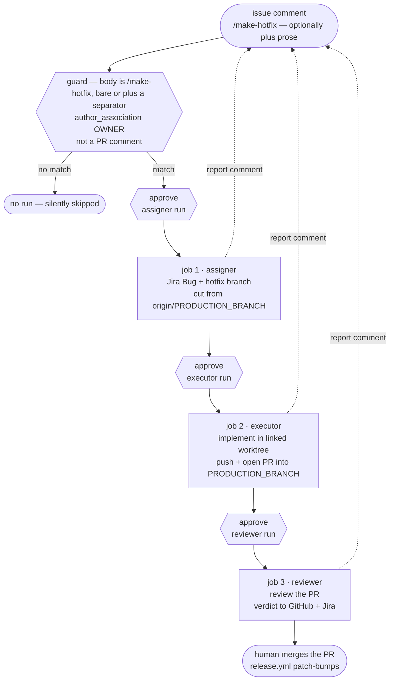

# CI application: the hotfix-flow demo (assigner → executor → reviewer)

> **Note on this document:** this describes
> [`demo-claude-hotfix-flow.yml`](../../../../.github/workflows/demo-claude-hotfix-flow.yml)
> at the **marketplace repo root** — a GitHub Actions workflow that chains all
> three `jira-sdlc` skills headlessly, one job per skill, to turn a GitHub
> issue into a reviewed hotfix PR when someone comments `/make-hotfix` on it.
> It is an **application demo**: a worked
> example of running the skills in a CI environment, meant to be read next to
> the workflow file (whose comments carry the line-level rationale) and copied
> into other repos. It is **not** this repo's hotfix procedure — that stays
> human-driven ([SDLC.md §4](../SDLC.md)). The workflow-by-workflow CI
> reference is [CI.md](../CI.md); this file covers just this one workflow, in
> depth.
>
> Its sibling is [ci-feature-flow-demo.md](./ci-feature-flow-demo.md) — the
> same three-job chain on the *planned-work* flow, triggered by a
> `/make-feature` comment instead. This file carries the shared pattern in
> full; that one covers only what differs.

## What it demonstrates

A GitHub issue is the bug report. A maintainer comments `/make-hotfix` on it,
and its title + body flow through three sequential jobs, each a fresh runner
VM, each running one skill under its own Jira identity, with the issue key and
branch handed forward through job outputs:

1. **assigner** — turns the issue's title + body into a Jira `Bug`, cuts
   `hotfix/<KEY>-<slug>` from the freshly fetched
   `origin/<PRODUCTION_BRANCH>`, pushes it, and assigns the issue to the
   executor.
2. **executor** — rebuilds a linked worktree for that branch, implements the
   fix, pushes, and opens a PR targeting `<PRODUCTION_BRANCH>`.
3. **reviewer** — rebuilds the worktree again, reviews the PR, and posts its
   verdict to both GitHub and Jira.

Each job also comments its skill's report back on the triggering GitHub issue,
so the whole run is visible where the fix was requested.

Nothing is merged. The run ends with an open, reviewed PR into
`<PRODUCTION_BRANCH>`; merging it is a human act, after which the repo's
`release.yml` patch-bumps the tag as for any `hotfix/*` merge
([SDLC.md §5](../SDLC.md)).



Every gate above is real, not decorative — see the next two sections.

## The trigger and its gate

```yaml
on:
  issue_comment:
    types: [created]
```

`issue_comment` fires for **any** commenter on a public repo, and what follows
runs an LLM with write permissions on a runner. The job-level `if` is therefore
the security boundary of this workflow, and it requires all three of:

| Condition | Why it's there |
| :--- | :--- |
| body is `/make-hotfix`, bare or followed by a space or newline | the command has to be the comment's first token, so a comment that merely mentions `/make-hotfix` mid-sentence doesn't fire the chain. Written out as an exact match plus three `startsWith` forms because the obvious one-liner, `startsWith(body, '/make-hotfix')`, would also fire on `/make-hotfix-anything`. Requiring a *separator* is what lets prose follow the command without loosening the match |
| `author_association == 'OWNER'` | the actual authorization check. **Do not** loosen it to `MEMBER` or `CONTRIBUTOR` — a single merged PR earns `MEMBER` association, which is too loose for a trigger that runs an LLM with write permissions on a runner — an approval prompt is a poor place to be reading attacker-supplied text for the first time |
| `github.event.issue.pull_request == null` | `issue_comment` fires for PR comments too, where `github.event.issue` *is* the PR — without this, `/make-hotfix` on a pull request would hand the assigner a PR description as a bug report |

Jobs 2 and 3 declare `needs`, and a skipped dependency skips its dependents, so
the guard is stated once on job 1. A comment that fails it produces no run at
all — no failed check, no notification, so a public repo doesn't accumulate a
red X for every unrelated comment.

**The issue, not the comment, is the bug report** — and unlike the feature
demo, it is only *part* of the prompt. The assigner receives a two-part
message: the issue's title, a blank line, then its body, followed by the
explicit `2. CREATE AN EMERGENCY HOTFIX FROM IT BRANCHED FROM MAIN` directive
that engages assigner step 5C. That second part is what makes this the hotfix
flow; without it the same run produces a plain `feature/<KEY>` branch and a PR
aimed at staging. Issue bodies are attacker-supplied text, so they reach the
prompt through env vars and a `printf`-built temp file, never interpolated into
a shell command.

### Steering one run from the comment

The comment can still carry direction — anything typed after the command word
is free-form guidance for *this run*, on one line or several:

```
/make-hotfix the regression is in the retry path, not the parser
```

A parse step strips the command token, trims the surrounding whitespace, and
the assigner prompt gains one labelled `-- EXTRA DIRECTION FOR THIS RUN (from
the triggering comment) --` section **after** the issue body. It supplements
the bug report and the hotfix directive rather than replacing either — which
matters more here than on the feature flow, since dropping that directive is
what silently turns a hotfix run into a feature run. A bare `/make-hotfix`
omits the section entirely, leaving the prompt byte-identical to what this
demo built before. The comment body is attacker-supplied text like the issue
body and travels the same way (env var → `printf`, never script text); the
parse step does no gating, and the guard above remains the only boundary.

Only the **assigner** reads the prose: jobs 2 and 3 run in separate VMs off
job 1's outputs and invoke their skills as they always have.
[ci-feature-flow-demo.md](./ci-feature-flow-demo.md) carries the fuller
worked example.

## The `environment: production` gate — one approval per skill

Every job in the workflow declares:

```yaml
environment: production
```

and the `production` environment in this repo has GitHub's **Required
reviewers** rule checked. See [APPLICATIONS.md §3.1–3.2](../APPLICATIONS.md)
for the full two-gate convention. The `production` environment in this repo has GitHub's **Required
reviewers** protection rule checked. Environment protection is evaluated
**before each job starts**, so one `/make-hotfix` comment pauses three times:

| Pause | Approving it releases | What has happened so far |
| :--- | :--- | :--- |
| before job 1 | the assigner | nothing — this is the "should this run at all" gate, and the first place a human reads the issue text with the run in mind |
| before job 2 | the executor | a Jira Bug exists and `hotfix/<KEY>-<slug>` is pushed — the owner can inspect both before any code is written |
| before job 3 | the reviewer | the fix is pushed and the PR is open — the owner can eyeball the diff before the automated review spends tokens on it |

That is the point of reusing **one** environment across all three jobs rather
than defining three: the protection rule fires per *job*, so one environment
already yields one human checkpoint per skill. Three separate environments
would buy nothing but configuration to keep in sync.

The environment is also the **secret scope**. Every credential the demo needs
is an environment secret on `production`, not a repo-level secret — so a job
that forgot its `environment:` line would see empty strings (and fail the
explicit up-front secret check), never real credentials:

| Secret | Used by | Notes |
| :--- | :--- | :--- |
| `CLAUDE_CODE_OAUTH_TOKEN` | every job | read from the environment by the claude CLI — the only one never written to the env file |
| `JIRA_ACCOUNT_URL` | every job | |
| `JIRA_ASSIGNER_EMAIL` / `JIRA_ASSIGNER_TOKEN` | job 1 | the assigner's Jira identity |
| `JIRA_EXECUTOR_EMAIL` / `JIRA_EXECUTOR_TOKEN` | job 2 | job 1 also receives the *email* only — it is the assignment target, not a credential |
| `JIRA_REVIEWER_EMAIL` / `JIRA_REVIEWER_TOKEN` | job 3 | |

Each secret is named **exactly as the `jira-sdlc-tools.local.env` key it
becomes**, which lets each job's env-file bootstrap be a single loop over a
`KEYS` list instead of hand-mapped `printf`s.

`GITHUB_PAT_TOKEN` is in that `KEYS` list too, but it is not a secret to
create: every job always populates it from the runner's built-in
`GITHUB_TOKEN`, which can push, open a PR, and comment given the job's
`permissions:` block — see the workflow header. It stays an env-file key
because the skills' `statuscheck` reads it from
`.jst/jira-sdlc-tools.local.env` to log `gh` in; a real PAT is only needed
for local/dev use.

## Why each job is shaped the way it is

The skills were written for a developer machine: a persistent checkout,
sibling worktrees, machine-local git config, an interactive turn to answer
questions. A GitHub-hosted runner has none of that, so each job spends its
first steps reconstructing exactly the state the skills' own healthchecks
demand. This is the part worth studying before copying the pattern elsewhere.

**Fresh VM per job → rebuild everything.** No disk survives between jobs.
Each job rewrites `.jst/jira-sdlc-tools.local.env` from its own (role-scoped)
secrets, and jobs 2/3 rebuild the linked worktree the skills demand — see the
next section.

### Jobs 2 and 3 must build the worktree *before* invoking the skill

Both the executor job and the reviewer job run the same
`Rebuild the issue worktree` step immediately before their skill step. It is a
**precondition, not setup convenience**: the executor and reviewer each
hard-stop unless they are running in a *linked worktree* on an issue branch
(`feature/*`, `bugfix/*`, `chore/*`, `hotfix/*`). Skip it and the run dies in
the skill's healthcheck before
any work happens.

The step is byte-identical in both jobs:

```bash
WT="$RUNNER_TEMP/worktrees/worktree-$KEY"
git fetch origin "+refs/heads/$BRANCH:refs/remotes/origin/$BRANCH"
git worktree add --track -B "$BRANCH" "$WT" "origin/$BRANCH"
git config "branch.$BRANCH.parentbranch" "$PR_BASE"
```

`$BRANCH` is **the right branch** in the only sense that matters here: job 1's
`branch` output — the `hotfix/<KEY>-<slug>` the assigner actually created and
pushed. It is never re-derived, so jobs 2 and 3 cannot drift onto a different
branch than the one that was planned.

Three things make this step necessary rather than tidy:

1. **It's the *kind* of checkout, not the branch.** The check is one line in
   `statuscheck.sh` — `[ -f "$WT_ROOT/.git" ]`. A linked worktree's `.git` is
   a *file* (a `gitdir:` pointer); a normal checkout's is a *directory*. So
   pointing `actions/checkout` at the issue branch, or running
   `git checkout <branch>` in the workspace, still fails — being on the right
   branch does not make a main checkout acceptable.
2. **The job holds two checkouts at once, deliberately.** The
   `actions/checkout` workspace stays a main checkout standing on
   `<DEFAULT_BASE_BRANCH>` — the start state the assigner's healthcheck
   demands — while the linked worktree on the `hotfix/*` branch is where
   the skill *runs*. Neither alone satisfies both requirements. (This is the
   same split described below: where a job *stands* is not what it *works on*.
   Neither is where the *skills* come from: those are installed from the
   marketplace, below.)
3. **The working directory is the addressing mechanism.** Neither skill takes
   an issue-key argument; each derives its key from the branch of the worktree
   it stands in. That is what
   `working-directory: ${{ steps.worktree.outputs.path }}` on the skill step is
   for — it is how the job says *which issue*, and the local equivalent of
   `cd <WORKTREES_DIR>/worktree-<KEY> && claude`.

⚠️ **The fourth line is the one that differs from the feature demo.** Here
`$PR_BASE` is job 1's `pr_base` output resolved from `<PRODUCTION_BRANCH>`;
in [ci-feature-flow-demo.md](./ci-feature-flow-demo.md) the identical-looking
line resolves to `<DEFAULT_BASE_BRANCH>`. Copying this step between the two
demos without changing that value produces a hotfix PR aimed at the wrong
branch.

**`parentbranch` is machine-local.** The assigner records the PR target in
`git config branch.<branch>.parentbranch`, which evaporates with job 1's VM.
Jobs 2/3 re-set it from job 1's `pr_base` output — the assigner's durable
"PR target branch" Jira comment is the fallback the skills would otherwise
resolve it from.

**The checkout stands on `<DEFAULT_BASE_BRANCH>` — and the hotfix still comes
from `<PRODUCTION_BRANCH>`.** The obvious objection ("a hotfix must branch
from production!") confuses where the assigner *stands* with what it *cuts
from*. Assigner step 5C sets its cut point to `origin/<PRODUCTION_BRANCH>`,
the freshly fetched remote ref, regardless of the local checkout — precisely
so a stale local production branch can never poison a hotfix. The checkout
branch only decides that the assigner's start-state check passes — it does
**not** decide which version of the skill prompts gets loaded, which comes
from the marketplace install below. What still favours the base branch is
assigner step 5C: it hard-stops if it started on `<PRODUCTION_BRANCH>` and the
run turns out to be planned work, and a headless run has no turn in which to
recover. The switch is explicit rather than inherited, because an
`issue_comment` event checks out the repo's *default* branch, which is not by
definition `<DEFAULT_BASE_BRANCH>`.

**The skills come from the marketplace, not from the checkout.** Every job
installs the plugin the way a consumer would, which is what makes these
workflows copy-pasteable into a repo that doesn't contain the plugin:

```bash
claude plugin marketplace add https://github.com/kantorv/jira-sdlc-tools.git
claude plugin install jira-sdlc@jira-sdlc-tools
# external consumers: swap the URL for your own fork or clone
```

`marketplace add` clones the plugin repo's **default** branch, so what a run
exercises is whatever has landed there — never the skill files on the branch
under test.

**Each role runs on a named model.** The workflow-level `env` block pins
`DEFAULT_ASSIGNER_MODEL` / `DEFAULT_EXECUTOR_MODEL` / `DEFAULT_REVIEWER_MODEL`
(`opus`, `opus`, `sonnet`), and each job passes its own to `claude --model`.
Left unset, a headless run would take whatever the CLI's default happens to be
that week, and the three roles are not equally model-hungry — the assigner and
executor write; the reviewer reads a diff.

**Never export `GH_TOKEN`/`GITHUB_TOKEN` into a step that runs a skill.**
Every skill starts with statuscheck, which logs `gh` in from the
`GITHUB_PAT_TOKEN` *inside the env file* via
`gh auth logout && gh auth login --with-token` — and `gh` refuses that login
while either token variable is exported, which fails the healthcheck before
any work happens. The demo's skill-running steps therefore export only
`CLAUDE_CODE_OAUTH_TOKEN`. The steps that do need `GH_TOKEN` (job 2's
"Confirm a PR was opened" and the three comment-posting steps) run *after*
the skill and set it inline on the one command.

**Self-review is by design.** Job 3's `gh` session is the same account that
opened the PR in job 2, and GitHub blocks approving your own PR. The reviewer
skill already accounts for this: both verdicts land as PR **comments** with a
machine-detectable `APPROVED — …` / `CHANGES REQUESTED — …` prefix, and the
Jira transition is the actual workflow gate.

**Headless means no questions.** The skills run with `-p` and
`--dangerously-skip-permissions` (acceptable on a throwaway non-root runner
VM, and nowhere else). There is no interactive turn, so a run where the
assigner stops to ask a clarifying question produces no branch — and job 1's
capture step fails loud (`expected exactly 1 new hotfix/* branch`) rather
than letting the chain continue on a guess. Likewise the reviewer's closing
"move these to Done?" question goes unanswered, so a completed demo leaves
the Jira issue in `<STATUS_IN_REVIEW>` — the merge automation (or a human)
takes it to `<STATUS_DONE>` after the PR merges.

**Deliberate duplication.** The bootstrap steps (env file, config resolve,
base-branch switch, CLI install) are near-identical across the three jobs
and are *not* factored into a composite action: this workflow is meant to be
copied into other repos as a single file, which a sibling helper would
quietly break. Keep the copies byte-identical apart from the role, so a diff
between two jobs shows only what genuinely differs.

## Reporting back to the issue

Beyond the log artifacts (`assigner-log`, `executor-log`, `reviewer-log`,
7-day retention), each job reports twice — once where the fix was requested,
once where the run happened.

The **issue comment** is a structured summary — Jira key, branch, PR link
where applicable — followed by the full skill transcript, in plain markdown.
It is deliberately *not* folded into a `<details>` block: the comment reads top
to bottom without a click, and the conversation stays where the fix was
requested instead of in an Actions tab nobody opens.

The **job summary** appends that same transcript to `$GITHUB_STEP_SUMMARY`,
under the one-line heading each job already writes there, so the run page
explains itself without opening the log or downloading an artifact. It has its
own ceiling — 1 MiB per step, against the comment's 65536 characters — and
gets the same truncation treatment, in a step that is `if: always()` for the
same reason the comment step is.

Three details in those steps are load-bearing:

- **The 65536-character comment limit.** A `gh issue comment` body over it
  fails the job outright, which would turn a successful skill run into a red
  X. The transcript is capped at 55000 bytes and keeps the **tail**, since the
  skill's own report is the last thing it prints, with a pointer to the full
  artifact in place of what was dropped.
- **A byte-wise cut can land mid-character.** The transcripts are full of
  em-dashes and box-drawing, and invalid UTF-8 makes the GitHub API reject the
  whole comment — so the truncated tail is passed through
  `iconv -c -f UTF-8 -t UTF-8`, which drops the orphaned continuation bytes.
- **The transcript is fenced with five backticks**, because the skill's own
  output contains triple-backtick blocks that would otherwise close the fence
  early. Every summary line is built with `printf` and the value as an
  argument, so a backtick or `$` in a branch name or issue key can't be
  re-expanded by the shell.

The comment steps run `if: always()` and after the skill, which is what lets a
*failed* run still explain itself on the issue: the summary carries
`job.status`, and a missing log becomes an explicit "the job failed before the
skill produced output" note rather than an empty block.

### The transcript GIFs

Each job uploads a second artifact next to its log — `assigner-transcript-gif`,
`executor-transcript-gif`, `reviewer-transcript-gif`, same 7-day retention —
holding the skill's own Claude Code session rendered to an animated GIF by
[agent-log-gif](https://pypi.org/project/agent-log-gif/): a terminal replay of
the run, Nord scheme, `linux` window chrome, tool calls visible, first 50
turns. It is purely a debugging affordance, and it earns its place on the case
the text log serves worst — a failed or simply *weird* headless run, much
easier to read as a replay than as 50000 characters of piped stdout.

**Why an artifact and not an attachment on the issue comment**, given
everything else in this section works hard to report where the work was
requested: GitHub has no API for attaching a file to an issue comment. Images
in comment bodies are uploads made by a *browser* session to a separate
user-content host, which a workflow's token cannot do. An artifact is the only
place a run can put a binary, so that is where it goes.

The rule for this step is that **a debug nicety must never redden a green
run**, which shapes all of it:

- `if: always()` — the failed run is the one you want the GIF for, so it must
  survive the skill step failing.
- `continue-on-error: true` plus a step `timeout-minutes` — a broken tool
  install, an unparseable session, or a slow render is *reported and skipped*,
  never fatal. The step deliberately runs without `set -e` so each failure path
  prints its own reason: no session file gives a `::notice::` and exits clean,
  a render failure gives a `::warning::` plus the renderer's last lines.
- **The job timeouts carry +5 minutes over their skill step** for this, or a
  render at the end of a job whose skill used its whole budget would be killed
  by the *job* timeout — which fails the job, defeating every guard above.
- The renderer's progress output goes to a file rather than the Actions log;
  only the GIF's name, size and the renderer's final summary line are echoed.
- The session file is found by globbing `$HOME/.claude/projects/*/*.jsonl`
  rather than computing the project slug, which differs per job (job 1 runs
  `claude` from the workspace, jobs 2 and 3 from the worktree under
  `RUNNER_TEMP`). A fresh VM per job normally means exactly one file; zero and
  several are both handled rather than assumed away.

A *turn* is a whole conversation turn, so `--turns 50` of a real skill run is
not a small render — a 2.9 MB session JSONL measured 8308 frames, 23 MB, and
about three minutes. That is what the step timeout is for, and it means a very
long run is the one most likely to skip its own GIF; the log artifact is always
there either way.

## Running it

1. Create the `production` environment (repo → Settings → Environments),
   check **Required reviewers**, and add the owner (or whoever should gate
   each step) as a reviewer.
2. Add the secrets from the table above **to that environment**.
3. Open a GitHub issue whose title and body describe the bug the way you'd
   describe it to `/jira-sdlc:jira-task-assigner` interactively — phrased as
   the emergency it simulates, since the workflow's prompt wraps it in the
   explicit hotfix directive the assigner's step 5C requires.
4. Comment `/make-hotfix` on it, as an OWNER — bare, or followed by
   a space or newline and any direction you want to give *this* run (see
   *Steering one run from the comment*).
5. Approve each of the three pauses as it arrives, inspecting the Jira
   issue / branch / PR — plus each job's report comment on the issue —
   between them.
6. When job 3 finishes, read the review verdict on the PR. Merging it (and
   the patch release that follows) is yours.

Runs are serialized by a `concurrency` group — two at once would race on the
same Jira project and the same worktrees dir — and the group is per-workflow
rather than per-issue for exactly that reason.

## What this demo is not

A production incident response. A real hotfix in this repo is a human
decision end to end ([SDLC.md §4](../SDLC.md)): a human cuts or requests the
branch, reviews the fix, and merges it. What the demo borrows from that flow
is only the *branch semantics* — assigner step 5C's
`hotfix/<KEY>-<slug>` cut from `origin/<PRODUCTION_BRANCH>`, single-step
scope forced, PR aimed at production — which are real and identical to what
the skills do on a developer machine. The wiring around them (the comment
trigger and its gate, job chaining, output handoff, environment gates,
reporting back to the issue) is the CI pattern this document exists to
explain.
