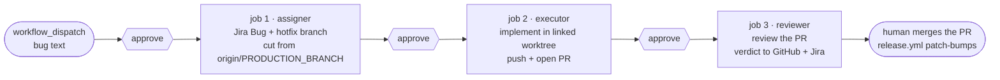

# CI application: the hotfix-flow demo (assigner → executor → reviewer)

> **Note on this document:** this describes
> [`demo-claude-hotfix-flow.yml`](../../../../.github/workflows/demo-claude-hotfix-flow.yml)
> at the **marketplace repo root** — a GitHub Actions workflow that chains all
> three `jira-sdlc` skills headlessly, one job per skill, to turn a typed bug
> report into a reviewed hotfix PR. It is an **application demo**: a worked
> example of running the skills in a CI environment, meant to be read next to
> the workflow file (whose comments carry the line-level rationale) and copied
> into other repos. It is **not** this repo's hotfix procedure — that stays
> human-driven ([SDLC.md §4](../SDLC.md)). The workflow-by-workflow CI
> reference is [CI.md](../CI.md); this file covers just this one workflow, in
> depth.

## What it demonstrates

One `workflow_dispatch` input — free-form bug text — flows through three
sequential jobs, each a fresh runner VM, each running one skill under its own
Jira identity, with the issue key and branch handed forward through job
outputs:

1. **assigner** — turns the text into a Jira `Bug`, cuts
   `hotfix/<KEY>-<slug>` from the freshly fetched
   `origin/<PRODUCTION_BRANCH>`, pushes it, and assigns the issue to the
   executor.
2. **executor** — rebuilds a linked worktree for that branch, implements the
   fix, pushes, and opens a PR targeting `<PRODUCTION_BRANCH>`.
3. **reviewer** — rebuilds the worktree again, reviews the PR, and posts its
   verdict to both GitHub and Jira.

Nothing is merged. The run ends with an open, reviewed PR into
`<PRODUCTION_BRANCH>`; merging it is a human act, after which the repo's
`release.yml` patch-bumps the tag as for any `hotfix/*` merge
([SDLC.md §5](../SDLC.md)).



Every gate above is real, not decorative — see the next section.

## The `environment: production` gate — one approval per skill

Every job in the workflow declares:

```yaml
environment: production
```

and the `production` environment in this repo has GitHub's **Required
reviewers** protection rule checked. Environment protection is evaluated
**before each job starts**, so a single dispatch pauses three times:

| Pause | Approving it releases | What has happened so far |
| :--- | :--- | :--- |
| before job 1 | the assigner | nothing — this is the "should this run at all" gate |
| before job 2 | the executor | a Jira Bug exists and `hotfix/<KEY>-<slug>` is pushed — the owner can inspect both before any code is written |
| before job 3 | the reviewer | the fix is pushed and the PR is open — the owner can eyeball the diff before the automated review spends tokens on it |

That is the point of reusing **one** environment across all three jobs rather
than defining three: the protection rule fires per *job*, so one environment
already yields one human checkpoint per skill. Three separate environments
would buy nothing but configuration to keep in sync.

The environment is also the **secret scope**. Every credential the demo needs
is an environment secret on `production`, not a repo-level secret — so a job
that forgot its `environment:` line would see empty strings (and fail the
explicit up-front secret check), never real credentials:

| Secret | Used by | Notes |
| :--- | :--- | :--- |
| `ANTHROPIC_API_KEY` | every job | read from the environment by the claude CLI — the only one never written to the env file |
| `JIRA_ACCOUNT_URL` | every job | |
| `JIRA_ASSIGNER_EMAIL` / `JIRA_ASSIGNER_TOKEN` | job 1 | the assigner's Jira identity |
| `JIRA_EXECUTOR_EMAIL` / `JIRA_EXECUTOR_TOKEN` | job 2 | job 1 also receives the *email* only — it is the assignment target, not a credential |
| `JIRA_REVIEWER_EMAIL` / `JIRA_REVIEWER_TOKEN` | job 3 | |
| `GITHUB_PAT_TOKEN` | every job, optional | falls back to the built-in `GITHUB_TOKEN`, see the workflow header |

Each secret is named **exactly as the `jira-sdlc-tools.local.env` key it
becomes**, which lets each job's env-file bootstrap be a single loop over a
`KEYS` list instead of hand-mapped `printf`s.

## Why each job is shaped the way it is

The skills were written for a developer machine: a persistent checkout,
sibling worktrees, machine-local git config, an interactive turn to answer
questions. A GitHub-hosted runner has none of that, so each job spends its
first steps reconstructing exactly the state the skills' own healthchecks
demand. This is the part worth studying before copying the pattern elsewhere.

**Fresh VM per job → rebuild everything.** No disk survives between jobs.
Each job rewrites `.jst/jira-sdlc-tools.local.env` from its own (role-scoped)
secrets, and jobs 2/3 rebuild a *linked* worktree for the issue branch from
`origin` — not as convenience, but because the executor and reviewer both
hard-stop unless they run in a linked worktree (`.git` is a file) on a
`feature/*`/`hotfix/*` branch, which a bare `actions/checkout` is not.

**`parentbranch` is machine-local.** The assigner records the PR target in
`git config branch.<branch>.parentbranch`, which evaporates with job 1's VM.
Jobs 2/3 re-set it from job 1's `pr_base` output — the assigner's durable
"PR target branch" Jira comment is the fallback the skills would otherwise
resolve it from.

**The checkout stands on `<DEFAULT_BASE_BRANCH>` — and the hotfix still comes
from `<PRODUCTION_BRANCH>`.** The obvious objection ("a hotfix must branch
from production!") confuses where the assigner *stands* with what it *cuts
from*. Assigner step 5C sets its cut point to `origin/<PRODUCTION_BRANCH>`,
the freshly fetched remote ref, regardless of the local checkout — precisely
so a stale local production branch can never poison a hotfix. The checkout
branch only decides (a) that the assigner's start-state check passes, and
(b) **which version of the skill prompts gets loaded**, since
`--plugin-dir` points into this checkout. That second point is why the base
branch beats production for the demo: skill changes reach
`<PRODUCTION_BRANCH>` only after a release, so standing on production would
run *yesterday's* skills against today's demo.

**Never export `GH_TOKEN`/`GITHUB_TOKEN` into a step that runs a skill.**
Every skill starts with statuscheck, which logs `gh` in from the
`GITHUB_PAT_TOKEN` *inside the env file* via
`gh auth logout && gh auth login --with-token` — and `gh` refuses that login
while either token variable is exported, which fails the healthcheck before
any work happens. The demo's skill-running steps therefore export only
`ANTHROPIC_API_KEY`, and the one step that needs `GH_TOKEN` (job 2's
"Confirm a PR was opened") sets it inline, after the skill has exited.

**Self-review is by design.** Job 3's `gh` session is the same account that
opened the PR in job 2, and GitHub blocks approving your own PR. The reviewer
skill already accounts for this: both verdicts land as PR **comments** with a
machine-detectable `APPROVED — …` / `CHANGES REQUESTED — …` prefix, and the
Jira transition is the actual workflow gate.

**Headless means no questions.** The skills run with `-p` and
`--dangerously-skip-permissions` (acceptable on a throwaway non-root runner
VM, and nowhere else). There is no interactive turn, so a run where the
assigner stops to ask a clarifying question produces no branch — and job 1's
capture step fails loud (`expected exactly 1 new hotfix/* branch`) rather
than letting the chain continue on a guess. Likewise the reviewer's closing
"move these to Done?" question goes unanswered, so a completed demo leaves
the Jira issue in `<STATUS_IN_REVIEW>` — the merge automation (or a human)
takes it to `<STATUS_DONE>` after the PR merges.

**Deliberate duplication.** The bootstrap steps (env file, config resolve,
base-branch switch, CLI install) are near-identical across the three jobs
and are *not* factored into a composite action: this workflow is meant to be
copied into other repos as a single file, which a sibling helper would
quietly break. Keep the copies byte-identical apart from the role, so a diff
between two jobs shows only what genuinely differs.

## Running it

1. Create the `production` environment (repo → Settings → Environments),
   check **Required reviewers**, and add the owner (or whoever should gate
   each step) as a reviewer.
2. Add the secrets from the table above **to that environment**.
3. Dispatch *Demo — Claude hotfix flow* from the Actions tab with a bug
   report as `issue_text` — phrased as the emergency it simulates, since the
   workflow's prompt adds the explicit hotfix directive the assigner's
   step 5C requires.
4. Approve each of the three pauses as it arrives, inspecting the Jira
   issue / branch / PR between them.
5. When job 3 finishes, read the review verdict on the PR. Merging it (and
   the patch release that follows) is yours.

Runs are serialized by a `concurrency` group — two at once would race on the
same Jira project — and each job uploads its full skill transcript as an
artifact (`assigner-log`, `executor-log`, `reviewer-log`, 7-day retention)
for post-mortems.

## What this demo is not

A production incident response. A real hotfix in this repo is a human
decision end to end ([SDLC.md §4](../SDLC.md)): a human cuts or requests the
branch, reviews the fix, and merges it. What the demo borrows from that flow
is only the *branch semantics* — assigner step 5C's
`hotfix/<KEY>-<slug>` cut from `origin/<PRODUCTION_BRANCH>`, single-step
scope forced, PR aimed at production — which are real and identical to what
the skills do on a developer machine. The wiring around them (job chaining,
output handoff, environment gates) is the CI pattern this document exists to
explain.
