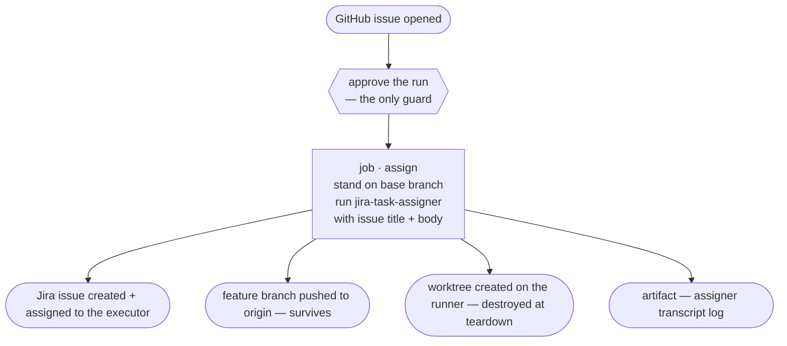

# CI application: the issue-to-task demo (jira-task-assigner alone)

> **Note on this document:** this describes
> [`demo-claude-issue-to-task.yml`](../../../../.github/workflows/demo-claude-issue-to-task.yml)
> at the **marketplace repo root** — a GitHub Actions workflow that runs the
> `jira-task-assigner` skill headlessly when a GitHub issue is opened, turning
> it into a Jira issue plus a pushed `feature/*` branch. It is an
> **application demo**: a worked example meant to be read next to the workflow
> file (whose comments carry the line-level rationale) and copied into other
> repos, **not** this repo's development procedure ([SDLC.md](../SDLC.md)).
> The workflow-by-workflow CI reference is [CI.md](../CI.md).
>
> Its siblings are [ci-feature-flow-demo.md](./ci-feature-flow-demo.md) and
> [ci-hotfix-flow-demo.md](./ci-hotfix-flow-demo.md) (the full three-skill
> chains) and [ci-review-pr-demo.md](./ci-review-pr-demo.md) (the reviewer
> alone). This is the *first* skill of the chain, alone — the mirror image of
> the reviewer demo, and the only one triggered automatically.

## What it demonstrates

Someone opens a GitHub issue. One job turns it into planned, assigned work:
a Jira issue, a `feature/<KEY>-<slug>` branch cut from `<DEFAULT_BASE_BRANCH>`
and pushed, and a worktree. Then it stops — nothing is implemented, no PR is
opened.



The invocation is the same one a developer types, with the issue's text as the
free-form description:

```bash
# the skills come from the marketplace, not from this checkout —
# external consumers: swap the URL for your own fork or clone
claude plugin marketplace add https://github.com/kantorv/jira-sdlc-tools.git
claude plugin install jira-sdlc@jira-sdlc-tools

claude --dangerously-skip-permissions \
  -p "/jira-sdlc:jira-task-assigner $(cat "$RUNNER_TEMP/assigner-prompt.txt")"
```

That prompt file is the issue's **title, a blank line, then the body** — never
the issue's comments, and never a hand-written template.

## ⚠️ The approval gate is the only guard — do not skip it

Every other demo checks *who* asked. The comment-triggered ones require
`author_association == 'OWNER' || 'MEMBER'` before doing anything. **This
workflow has no `if:` condition at all** — its job runs on `issues: opened`,
full stop, for any issue opened by anyone who can open one.

The only thing between "a stranger files an issue" and "an LLM creates a Jira
issue and pushes a branch, unattended" is the **Required reviewers** rule on
the `production` environment. That rule is *optional* in GitHub's model
([APPLICATIONS.md §3.1](./APPLICATIONS.md#31-create-the-environment)) — for
the other demos, leaving it unchecked just means they run unattended. Here it
means the workflow fires on every opened issue, from anyone, on a public repo.

**Treat Required reviewers as mandatory for this one.** With it enabled, runs
queue as `waiting` until a human approves — in this repo one has sat pending
for over 23 hours, which is exactly the intended behaviour, not a hang.

## Why the assigner needs the *opposite* checkout from the other skills

The reviewer and executor demos go to real trouble to build a **linked
worktree** — those skills hard-stop unless `.git` is a *file*. The assigner
inverts that requirement:

| | Assigner | Executor / Reviewer |
|---|---|---|
| Required checkout | **Main checkout** (`.git` is a directory) | **Linked worktree** (`.git` is a file) |
| Required branch | The base branch | The issue's `feature/*` or `hotfix/*` branch |
| Why | It *creates* worktrees — it doesn't run inside one. A linked-worktree reading is a stop condition. | They derive their issue key *from* the worktree's branch. |

So this workflow does the simple thing on purpose: a plain
`actions/checkout` (already a main checkout), `git switch` onto the base
branch, and no `git worktree add` anywhere. `fetch-depth: 0` is still needed —
the assigner cuts the new branch from a fetched `origin/<base>`, which a
shallow single-branch clone doesn't have.

The base branch is read from the team-shared config, never hardcoded:

```bash
cfg() { grep -E "^[[:space:]]*$1[[:space:]]*=" .jst/jira-sdlc-tools.env | tail -1 | sed -e 's/^[^=]*=[[:space:]]*//' -e 's/[[:space:]]*$//'; }
```

A missing `DEFAULT_BASE_BRANCH` fails the step loudly rather than defaulting to
a guess.

## The issue text is data, never script

Issue titles and bodies are attacker-controlled strings on a public repo. The
workflow never interpolates `github.event.issue.*` into a shell command.
Instead it binds them to environment variables, then `printf`s them into a
file:

```yaml
env:
  ISSUE_TITLE: ${{ github.event.issue.title }}
  ISSUE_BODY: ${{ github.event.issue.body }}
run: |
  {
    printf '%s\n\n' "$ISSUE_TITLE"
    printf '%s' "${ISSUE_BODY:-}"
  } > "$RUNNER_TEMP/assigner-prompt.txt"
```

The values stay data at every hop — never part of the script text, never
re-expanded by the shell. Copy this pattern rather than
`-p "… ${{ github.event.issue.body }}"`, which would let an issue body end the
quoted argument and run arbitrary shell on your runner.

(The text still reaches the model, so ordinary prompt-injection caution
applies — this protects the *runner*, not the model's judgement.)

## The worktree does not survive — and that's why it stops here

The assigner produces two things with different lifetimes:

- **The branch** is pushed to `origin`. It survives the job.
- **The worktree** is created under `WORKTREES_DIR`
  (`$RUNNER_TEMP/worktrees` here). Each job gets a fresh VM, so it is
  destroyed at teardown.

A later executor run expects that worktree to *already exist*. On hosted
runners it won't. That is the whole reason this demo stops after one skill
instead of chaining — the full flows solve it by having each job rebuild a
linked worktree from the pushed branch
([ci-feature-flow-demo.md](./ci-feature-flow-demo.md)). A persistent or
self-hosted runner, whose disk survives across runs the way a developer's
machine does, wouldn't need the trick.

`WORKTREES_DIR` is deliberately **not** a secret: it's a path on this runner.
A value carried over from a developer's machine would point somewhere that
doesn't exist here.

## Secrets and the credentials that aren't ones

All are environment secrets on `production`, each named exactly as the
`.jst/jira-sdlc-tools.local.env` key it becomes, so the bootstrap is one loop
over a `KEYS` list:

| Secret | Role here |
|---|---|
| `CLAUDE_CODE_OAUTH_TOKEN` | Read by the CLI from the environment — the only one never written to the file. |
| `JIRA_ACCOUNT_URL` | Jira site. |
| `JIRA_ASSIGNER_EMAIL` / `JIRA_ASSIGNER_TOKEN` | The assigner's own Jira identity. |
| `JIRA_EXECUTOR_EMAIL` | **Not a credential** — just an address. The assigner assigns every issue it creates to the executor, and `get_assignee_email.sh` reads this from the env file. No executor *token* is present in this job. |
| `GITHUB_PAT_TOKEN` | Not a secret either — always wired straight to the built-in `GITHUB_TOKEN`, which can push given `permissions: contents: write`. Stays an env-file key because `statuscheck` reads it from `.jst/jira-sdlc-tools.local.env` to log `gh` in; a real PAT is only needed for local/dev use. |

The bootstrap checks its whole set up front and fails with `::error::` rather
than letting the CLI die halfway through on a missing key.

Note the job requests only `contents: write` — enough to push the branch, and
deliberately not `issues: write`, so it *cannot* comment back on the
triggering issue.

## What comes out of a run

- **A Jira issue**, assigned to the executor, with the assigner's plan posted
  as a Jira comment.
- **A pushed `feature/<KEY>-<slug>` branch** off `<DEFAULT_BASE_BRANCH>`.
- **One artifact**, `assigner-log` — the full transcript, which is where the
  keys, branches, and worktree paths are reported.

Two things the flow demos have and this one doesn't: there is **no comment
posted back to the GitHub issue** (it lacks the permission to), and **no
transcript GIF** artifact. If you want either, copy the corresponding step out
of
[`demo-claude-feature-flow.yml`](../../../../.github/workflows/demo-claude-feature-flow.yml)
and add `issues: write` for the comment.

So the Actions log and the `assigner-log` artifact are the only places the run
reports itself. Expect to open the run to find out what it created.

## Headless means no clarifying questions

Interactively, the assigner asks when a request is ambiguous, and asks whether
the work is single-step or multistep. A `-p` run has no interactive turn to
answer with. A run where the assigner would have stopped to ask **ends with no
branch created** — it is not a silent partial success.

This is the main reason a vague one-line issue produces a worse result here
than the same text typed at a prompt. Issues intended for this workflow should
read like a task description, not a question.

## Running it

1. Ensure the `production` environment exists **with Required reviewers
   enabled** (see the warning above), holding the secrets in the table.
   [APPLICATIONS.md §3.4](./APPLICATIONS.md#34-setting-secrets-via-github-cli)
   has the `gh secret set` commands.
2. Confirm `.jst/jira-sdlc-tools.env` sets `DEFAULT_BASE_BRANCH`.
3. Open a GitHub issue whose title and body read as a task description.
4. Approve the pending run when GitHub asks.
5. Read the `assigner-log` artifact for the Jira key and branch it created.

Typical successful runs in this repo take **2–7 minutes**.

## What this demo is not

- **Not an end-to-end pipeline.** It stops after planning. Nothing is
  implemented and no PR is opened — see the flow demos for the full chain.
- **Not durable.** The only lasting artifacts are the pushed branch, the Jira
  issue, and the uploaded log. The worktree is gone with the VM.
- **Not safe without the approval gate.** It has no author check of its own.
- **Not a triage bot.** It does not label, dedupe, or close issues, and it
  runs on `opened` only — reopening or editing an issue does nothing.
