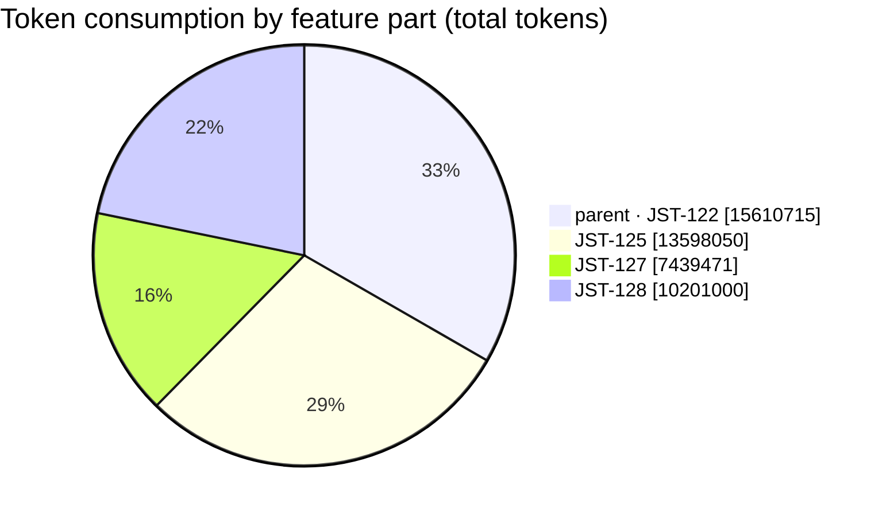
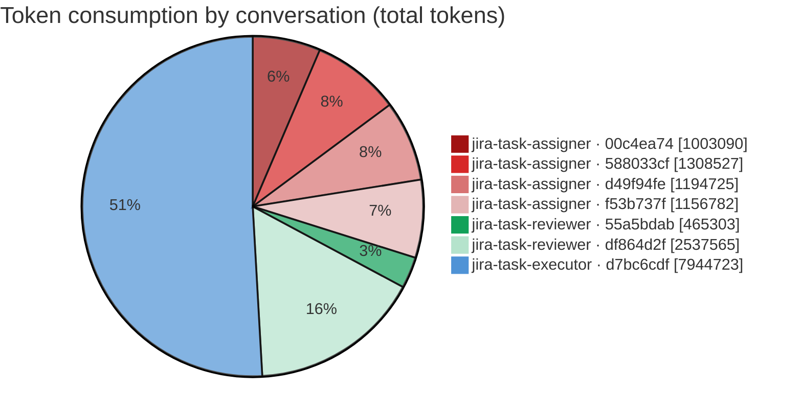
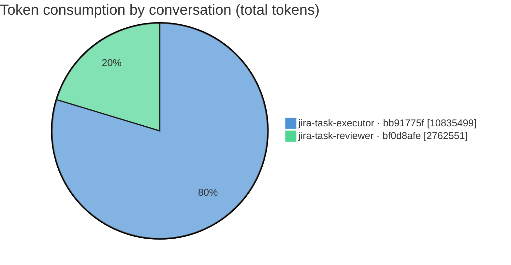
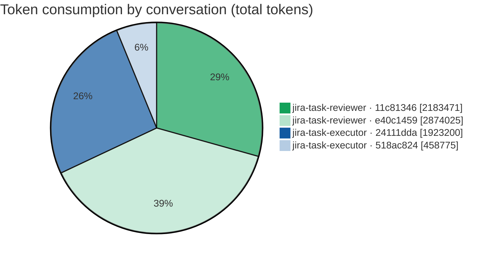
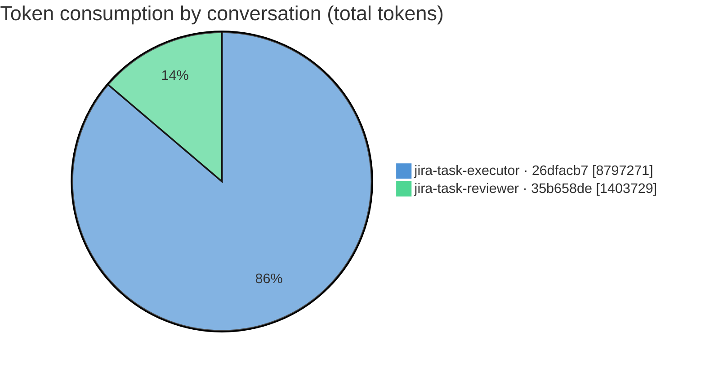
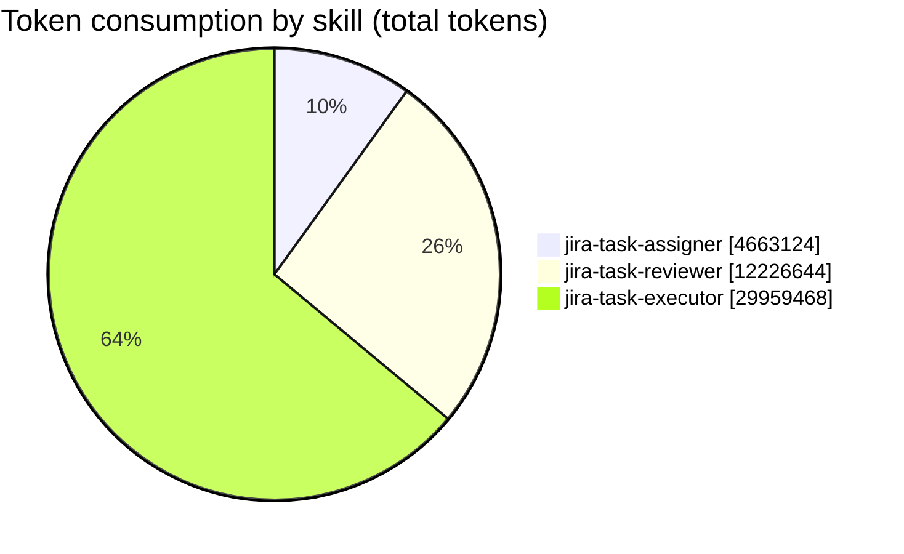
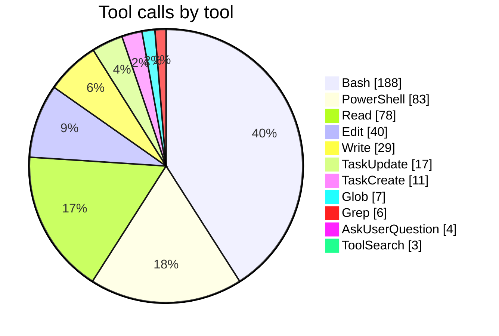

# Feature report — JST-122 (multistep)

_Generated by `feature_report` from `collect_feature` JSON — multistep feature: parent **JST-122** + 3 child feature(s), 15 conversation(s) feature-wide, 15 with measured metrics. Every figure is the collector's own; nothing is re-estimated._

## Feature summary

| metric | value |
|---|---|
| Feature (parent) | JST-122 |
| Parent summary | conversation-debugger: feature-level token/cost + model report (JSON collector + markdown report-builder) |
| Child features | 3 |
| Conversations (feature-wide) | 15 (analyzed: 15) |
| **Total token consumption** | **46,849,236** |
| — input | 10,053 |
| — output | 499,343 |
| — cache read | 44,761,058 |
| — cache write | 1,578,782 |
| Models used | claude-fable-5, claude-opus-4-8 |
| Skills exercised | jira-task-assigner, jira-task-reviewer, jira-task-executor |
| Issue keys touched | JST-122, JST-125, JST-127, JST-128 |
| Total skill turns | 428 |
| Total tool calls | 466 (errors: 24) |
| Distinct tools used | 11 |
| Activity span | 25h 16m 1s (2026-07-18 10:02:11Z → 2026-07-19 11:18:13Z) |

## Token share by feature part

| feature part | key | conversations | total tokens |
|---|---|--:|--:|
| parent (own) | JST-122 | 7 | 15,610,715 |
| child | JST-125 | 2 | 13,598,050 |
| child | JST-127 | 4 | 7,439,471 |
| child | JST-128 | 2 | 10,201,000 |

## Parent feature — JST-122

_conversation-debugger: feature-level token/cost + model report (JSON collector + markdown report-builder)_

### Per-conversation — tokens

| conversation | provenance | skill | issue | model(s) | in | out | cache-read | cache-write | total | tool calls | elapsed (s) | size |
|---|---|---|---|---|--:|--:|--:|--:|--:|--:|--:|--:|
| `00c4ea74-384f-422d-a387-00c241561a24` | worktree | jira-task-assigner | JST-128 | claude-opus-4-8 | 9,260 | 19,645 | 902,861 | 71,324 | 1,003,090 | 16 | 586.0 | 309.7 KB |
| `55a5bdab-48ca-4a8e-88c1-39b013c357fb` | worktree | jira-task-reviewer | JST-122 | claude-fable-5 | 17 | 4,338 | 417,057 | 43,891 | 465,303 | 9 | 200.0 | 147.9 KB |
| `588033cf-fa48-4c74-b96a-2f24c7545d42` | worktree | jira-task-assigner | JST-125 | claude-opus-4-8 | 27 | 17,056 | 1,209,352 | 82,092 | 1,308,527 | 21 | 797.0 | 382.9 KB |
| `d49f94fe-0190-41b6-8882-edccdc3e8fd9` | worktree | jira-task-assigner | JST-127 | claude-opus-4-8 | 30 | 20,955 | 1,111,557 | 62,183 | 1,194,725 | 19 | 1,043.0 | 278.7 KB |
| `d7bc6cdf-16e7-4a69-b430-e748aac67bc6` | worktree | jira-task-executor | JST-122 | claude-opus-4-8 | 114 | 77,772 | 7,707,927 | 158,910 | 7,944,723 | 64 | 8,085.0 | 862.6 KB |
| `df864d2f-3115-4f06-b3c2-24456615eed0` | worktree | jira-task-reviewer | JST-122 | claude-opus-4-8 | 54 | 26,305 | 2,420,502 | 90,704 | 2,537,565 | 28 | 1,229.0 | 1.3 MB |
| `f53b737f-a287-4de1-91e5-a9ad596b2d43` | main-checkout | jira-task-assigner | JST-122 | claude-opus-4-8 | 28 | 17,393 | 1,067,168 | 72,193 | 1,156,782 | 17 | 1,176.0 | 313.1 KB |

### Per-conversation — performance

| conversation | skill | skill turns | sidechain turns | tool calls | tool errors | tools used (calls) | elapsed (s) | first activity | last activity |
|---|---|--:|--:|--:|--:|---|--:|---|---|
| `00c4ea74-384f-422d-a387-00c241561a24` | jira-task-assigner | 14 | 0 | 16 | 0 | Bash:10, Read:3, Write:2, AskUserQuestion:1 | 586.0 | 2026-07-19 09:58:23Z | 2026-07-19 10:08:09Z |
| `55a5bdab-48ca-4a8e-88c1-39b013c357fb` | jira-task-reviewer | 9 | 0 | 9 | 0 | Bash:8, Write:1 | 200.0 | 2026-07-19 11:14:53Z | 2026-07-19 11:18:13Z |
| `588033cf-fa48-4c74-b96a-2f24c7545d42` | jira-task-assigner | 15 | 0 | 21 | 1 | PowerShell:10(!1), Read:7, Glob:2, Write:2 | 797.0 | 2026-07-18 15:43:05Z | 2026-07-18 15:56:22Z |
| `d49f94fe-0190-41b6-8882-edccdc3e8fd9` | jira-task-assigner | 16 | 0 | 19 | 1 | PowerShell:10(!1), Read:4, AskUserQuestion:2, Write:2, Glob:1 | 1,043.0 | 2026-07-18 22:02:25Z | 2026-07-18 22:19:48Z |
| `d7bc6cdf-16e7-4a69-b430-e748aac67bc6` | jira-task-executor | 58 | 0 | 64 | 3 | PowerShell:19(!3), Bash:13, Edit:8, Write:7, Read:5, TaskCreate:5, TaskUpdate:5, ToolSearch:2 | 8,085.0 | 2026-07-18 10:35:59Z | 2026-07-18 12:50:44Z |
| `df864d2f-3115-4f06-b3c2-24456615eed0` | jira-task-reviewer | 29 | 0 | 28 | 3 | PowerShell:15(!3), Grep:4, Read:4, Bash:3, Write:2 | 1,229.0 | 2026-07-18 13:40:56Z | 2026-07-18 14:01:25Z |
| `f53b737f-a287-4de1-91e5-a9ad596b2d43` | jira-task-assigner | 15 | 0 | 17 | 0 | Bash:6, PowerShell:4, Read:4, Write:2, AskUserQuestion:1 | 1,176.0 | 2026-07-18 10:02:11Z | 2026-07-18 10:21:47Z |

## Child feature — JST-125

_conversation-debugger: multistep feature report — nested child-feature roll-up (multistep-json + multistep-md)_

### Per-conversation — tokens

| conversation | provenance | skill | issue | model(s) | in | out | cache-read | cache-write | total | tool calls | elapsed (s) | size |
|---|---|---|---|---|--:|--:|--:|--:|--:|--:|--:|--:|
| `bb91775f-028f-48b1-acdb-9eaec28d6d9b` | worktree | jira-task-executor | JST-125 | claude-opus-4-8 | 127 | 112,680 | 10,441,502 | 281,190 | 10,835,499 | 75 | 12,827.0 | 1.2 MB |
| `bf0d8afe-225b-48b5-9dce-1a5f56929d7b` | worktree | jira-task-reviewer | JST-125 | claude-opus-4-8 | 52 | 36,539 | 2,614,121 | 111,839 | 2,762,551 | 30 | 785.0 | 940.1 KB |

### Per-conversation — performance

| conversation | skill | skill turns | sidechain turns | tool calls | tool errors | tools used (calls) | elapsed (s) | first activity | last activity |
|---|---|--:|--:|--:|--:|---|--:|---|---|
| `bb91775f-028f-48b1-acdb-9eaec28d6d9b` | jira-task-executor | 69 | 0 | 75 | 3 | Bash:23(!2), PowerShell:15(!1), Read:15, Edit:12, Glob:4, Write:4, Grep:2 | 12,827.0 | 2026-07-18 15:57:04Z | 2026-07-18 19:30:51Z |
| `bf0d8afe-225b-48b5-9dce-1a5f56929d7b` | jira-task-reviewer | 28 | 0 | 30 | 2 | Bash:26(!2), Read:3, Write:1 | 785.0 | 2026-07-18 19:33:28Z | 2026-07-18 19:46:33Z |

## Child feature — JST-127

_conversation-debugger: port feature roll-up scripts to POSIX/bash (collect_feature + feature_report)_

### Per-conversation — tokens

| conversation | provenance | skill | issue | model(s) | in | out | cache-read | cache-write | total | tool calls | elapsed (s) | size |
|---|---|---|---|---|--:|--:|--:|--:|--:|--:|--:|--:|
| `11c81346-e759-41f9-9a70-f9a6d91ac754` | worktree | jira-task-reviewer | JST-127 | claude-opus-4-8 | 52 | 34,784 | 2,040,025 | 108,610 | 2,183,471 | 25 | 1,045.0 | 674.9 KB |
| `24111dda-c794-4b0f-8e71-f0cb7da336d7` | worktree | jira-task-executor | JST-127 | claude-opus-4-8 | 48 | 12,448 | 1,812,740 | 97,964 | 1,923,200 | 24 | 464.0 | 1.4 MB |
| `518ac824-fe10-44ce-be69-486829417dad` | worktree | jira-task-executor | JST-127 | claude-opus-4-8 | 17 | 4,689 | 426,809 | 27,260 | 458,775 | 10 | 322.0 | 157.4 KB |
| `e40c1459-d6ef-40bc-bb1e-a44d07612e5d` | worktree | jira-task-reviewer | JST-127 | claude-opus-4-8 | 59 | 33,385 | 2,717,876 | 122,705 | 2,874,025 | 31 | 860.0 | 566.6 KB |

### Per-conversation — performance

| conversation | skill | skill turns | sidechain turns | tool calls | tool errors | tools used (calls) | elapsed (s) | first activity | last activity |
|---|---|--:|--:|--:|--:|---|--:|---|---|
| `11c81346-e759-41f9-9a70-f9a6d91ac754` | jira-task-reviewer | 26 | 0 | 25 | 4 | Bash:19(!3), Read:3, Write:2(!1), Edit:1 | 1,045.0 | 2026-07-19 07:04:46Z | 2026-07-19 07:22:11Z |
| `24111dda-c794-4b0f-8e71-f0cb7da336d7` | jira-task-executor | 24 | 0 | 24 | 1 | Bash:13(!1), Read:11 | 464.0 | 2026-07-18 23:11:56Z | 2026-07-18 23:19:40Z |
| `518ac824-fe10-44ce-be69-486829417dad` | jira-task-executor | 9 | 0 | 10 | 1 | PowerShell:10(!1) | 322.0 | 2026-07-18 22:25:16Z | 2026-07-18 22:30:38Z |
| `e40c1459-d6ef-40bc-bb1e-a44d07612e5d` | jira-task-reviewer | 32 | 0 | 31 | 3 | Bash:21(!2), Read:7, Write:2(!1), Edit:1 | 860.0 | 2026-07-19 00:20:18Z | 2026-07-19 00:34:38Z |

## Child feature — JST-128

_feature_report: add conversation-size (KB/MB) column via collector_

### Per-conversation — tokens

| conversation | provenance | skill | issue | model(s) | in | out | cache-read | cache-write | total | tool calls | elapsed (s) | size |
|---|---|---|---|---|--:|--:|--:|--:|--:|--:|--:|--:|
| `26dfacb7-03c1-41e0-99e9-d8376406c337` | worktree | jira-task-executor | JST-128 | claude-opus-4-8 | 124 | 56,246 | 8,565,796 | 175,105 | 8,797,271 | 76 | 1,102.0 | 989.8 KB |
| `35b658de-d59b-43f1-80db-a3ad9f25671b` | worktree | jira-task-reviewer | JST-128 | claude-opus-4-8 | 44 | 25,108 | 1,305,765 | 72,812 | 1,403,729 | 21 | 729.0 | 327.6 KB |

### Per-conversation — performance

| conversation | skill | skill turns | sidechain turns | tool calls | tool errors | tools used (calls) | elapsed (s) | first activity | last activity |
|---|---|--:|--:|--:|--:|---|--:|---|---|
| `26dfacb7-03c1-41e0-99e9-d8376406c337` | jira-task-executor | 62 | 0 | 76 | 2 | Bash:27(!1), Edit:18(!1), TaskUpdate:12, Read:11, TaskCreate:6, ToolSearch:1, Write:1 | 1,102.0 | 2026-07-19 10:13:22Z | 2026-07-19 10:31:44Z |
| `35b658de-d59b-43f1-80db-a3ad9f25671b` | jira-task-reviewer | 22 | 0 | 21 | 0 | Bash:19, Read:1, Write:1 | 729.0 | 2026-07-19 10:38:04Z | 2026-07-19 10:50:13Z |

## Tokens by skill

| skill | conversations | in | out | cache-read | cache-write | total |
|---|--:|--:|--:|--:|--:|--:|
| jira-task-assigner | 4 | 9,345 | 75,049 | 4,290,938 | 287,792 | 4,663,124 |
| jira-task-reviewer | 6 | 278 | 160,459 | 11,515,346 | 550,561 | 12,226,644 |
| jira-task-executor | 5 | 430 | 263,835 | 28,954,774 | 740,429 | 29,959,468 |

## Tokens by provenance

| provenance | conversations | in | out | cache-read | cache-write | total |
|---|--:|--:|--:|--:|--:|--:|
| worktree | 14 | 10,025 | 481,950 | 43,693,890 | 1,506,589 | 45,692,454 |
| main-checkout | 1 | 28 | 17,393 | 1,067,168 | 72,193 | 1,156,782 |

## Tool usage

| tool | conversations | calls | errors |
|---|--:|--:|--:|
| Bash | 12 | 188 | 11 |
| PowerShell | 7 | 83 | 10 |
| Read | 13 | 78 | 0 |
| Edit | 5 | 40 | 1 |
| Write | 13 | 29 | 2 |
| TaskUpdate | 2 | 17 | 0 |
| TaskCreate | 2 | 11 | 0 |
| Glob | 3 | 7 | 0 |
| Grep | 2 | 6 | 0 |
| AskUserQuestion | 3 | 4 | 0 |
| ToolSearch | 2 | 3 | 0 |

## Feature totals

| token bucket | tokens |
|---|--:|
| input | 10,053 |
| output | 499,343 |
| cache read | 44,761,058 |
| cache write | 1,578,782 |
| **grand total** | **46,849,236** |

Models across the feature: **claude-fable-5, claude-opus-4-8**

## Activity timeframe

| metric | value |
|---|---|
| First activity | 2026-07-18 10:02:11Z |
| Last activity | 2026-07-19 11:18:13Z |
| Span (first → last) | 25h 16m 1s |

_Span is wall-clock from the earliest to the latest measured turn across the feature — it includes idle gaps between sessions and human wait time, so it is not compute time and does not equal the sum of per-conversation elapsed._

