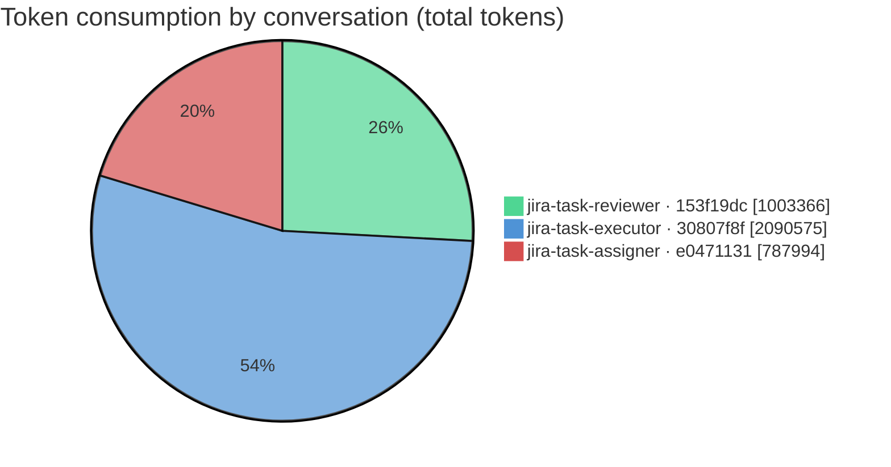
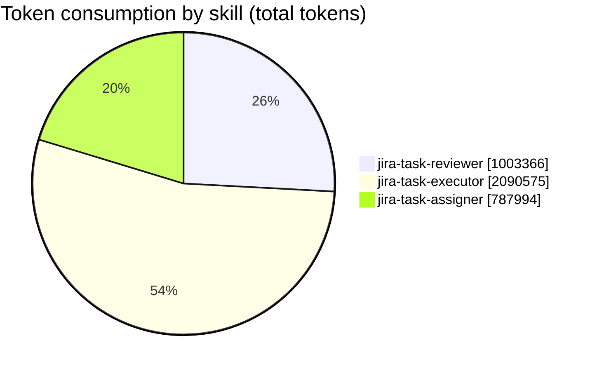
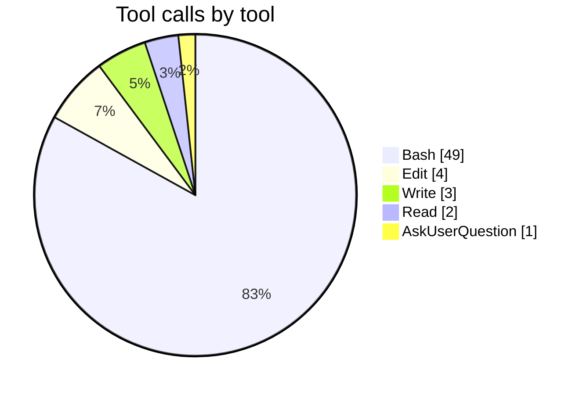

# Feature report — JST-126

_Generated by `feature_report` from `collect_feature` JSON — 3 conversation(s), 3 with measured metrics. Every figure is the collector's own; nothing is re-estimated._

## Summary

| metric | value |
|---|---|
| Feature | JST-126 |
| Conversations | 3 (analyzed: 3) |
| **Total token consumption** | **3,881,935** |
| — input | 122 |
| — output | 56,243 |
| — cache read | 3,640,251 |
| — cache write | 185,319 |
| Models used | claude-opus-4-8 |
| Skills exercised | jira-task-reviewer, jira-task-executor, jira-task-assigner |
| Issue keys touched | JST-126 |
| Total skill turns | 62 |
| Total tool calls | 59 (errors: 1) |
| Distinct tools used | 5 |
| Activity span | 5h 28m 25s (2026-07-18 15:53:03Z → 2026-07-18 21:21:28Z) |

## Per-conversation — tokens

| conversation | provenance | skill | issue | model(s) | in | out | cache-read | cache-write | total | tool calls | elapsed (s) | size |
|---|---|---|---|---|--:|--:|--:|--:|--:|--:|--:|--:|
| `153f19dc-b1fa-44ba-9a7e-b89825c7a755` | worktree | jira-task-reviewer | JST-126 | claude-opus-4-8 | 36 | 13,836 | 934,619 | 54,875 | 1,003,366 | 17 | 525.0 | 726.1 KB |
| `30807f8f-4527-48cb-a636-bcd3ab9de52f` | worktree | jira-task-executor | JST-126 | claude-opus-4-8 | 56 | 25,321 | 1,980,842 | 84,356 | 2,090,575 | 27 | 719.0 | 420.6 KB |
| `e0471131-44aa-44cb-9ed8-9ca85852bc89` | main-checkout | jira-task-assigner | JST-126 | claude-opus-4-8 | 30 | 17,086 | 724,790 | 46,088 | 787,994 | 15 | 516.0 | 193.1 KB |

## Per-conversation — performance

| conversation | skill | skill turns | sidechain turns | tool calls | tool errors | tools used (calls) | elapsed (s) | first activity | last activity |
|---|---|--:|--:|--:|--:|---|--:|---|---|
| `153f19dc-b1fa-44ba-9a7e-b89825c7a755` | jira-task-reviewer | 18 | 0 | 17 | 0 | Bash:17 | 525.0 | 2026-07-18 21:12:43Z | 2026-07-18 21:21:28Z |
| `30807f8f-4527-48cb-a636-bcd3ab9de52f` | jira-task-executor | 28 | 0 | 27 | 1 | Bash:20(!1), Edit:4, Read:2, Write:1 | 719.0 | 2026-07-18 20:49:18Z | 2026-07-18 21:01:17Z |
| `e0471131-44aa-44cb-9ed8-9ca85852bc89` | jira-task-assigner | 16 | 0 | 15 | 0 | Bash:12, Write:2, AskUserQuestion:1 | 516.0 | 2026-07-18 15:53:03Z | 2026-07-18 16:01:39Z |

## Tokens by skill

| skill | conversations | in | out | cache-read | cache-write | total |
|---|--:|--:|--:|--:|--:|--:|
| jira-task-reviewer | 1 | 36 | 13,836 | 934,619 | 54,875 | 1,003,366 |
| jira-task-executor | 1 | 56 | 25,321 | 1,980,842 | 84,356 | 2,090,575 |
| jira-task-assigner | 1 | 30 | 17,086 | 724,790 | 46,088 | 787,994 |

## Tokens by provenance

| provenance | conversations | in | out | cache-read | cache-write | total |
|---|--:|--:|--:|--:|--:|--:|
| worktree | 2 | 92 | 39,157 | 2,915,461 | 139,231 | 3,093,941 |
| main-checkout | 1 | 30 | 17,086 | 724,790 | 46,088 | 787,994 |

## Tool usage

| tool | conversations | calls | errors |
|---|--:|--:|--:|
| Bash | 3 | 49 | 1 |
| Edit | 1 | 4 | 0 |
| Write | 2 | 3 | 0 |
| Read | 1 | 2 | 0 |
| AskUserQuestion | 1 | 1 | 0 |

## Feature totals

| token bucket | tokens |
|---|--:|
| input | 122 |
| output | 56,243 |
| cache read | 3,640,251 |
| cache write | 185,319 |
| **grand total** | **3,881,935** |

Models across the feature: **claude-opus-4-8**

## Activity timeframe

| metric | value |
|---|---|
| First activity | 2026-07-18 15:53:03Z |
| Last activity | 2026-07-18 21:21:28Z |
| Span (first → last) | 5h 28m 25s |

_Span is wall-clock from the earliest to the latest measured turn across the feature — it includes idle gaps between sessions and human wait time, so it is not compute time and does not equal the sum of per-conversation elapsed._

