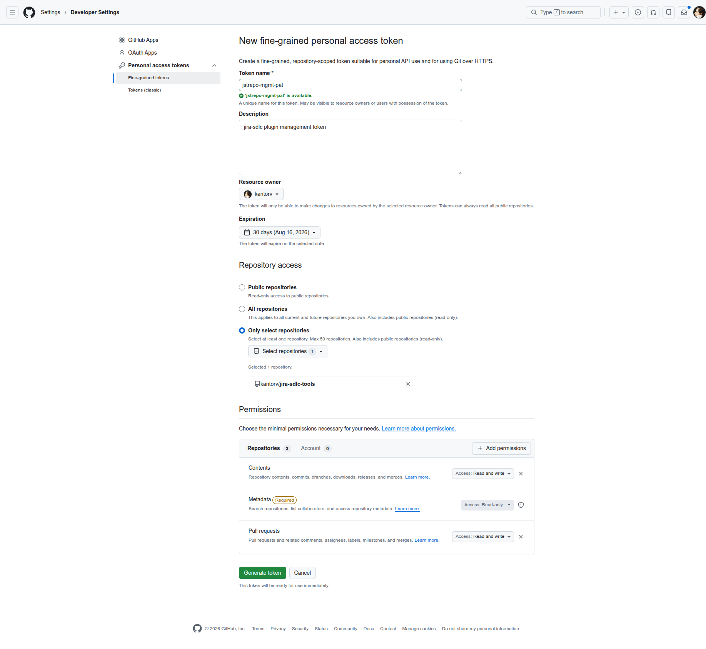

# gh CLI auth — persistent PAT session login

The jira-sdlc skills use the GitHub CLI (`gh`) to open PRs (`gh pr create`).
Rather than relying on the developer having run `gh auth login` by hand before a
session, the healthcheck logs `gh` in deterministically from a Personal Access
Token at the very start of every run — logging **out** first so a stale token
can't survive — and holds that session for the whole conversation.

This is the flow implemented in **`statuscheck.sh`** (and its Windows twin
`statuscheck.ps1`) — the pre-flight healthcheck every skill runs before it
touches anything. It's the healthcheck's job rather than a per-skill step
because `gh` uses one shared PAT (per-role GitHub identities are out of scope,
below), so — unlike the per-role `acli` login, which lives in each skill's
credential block — a single role-agnostic login in the shared healthcheck
covers every skill.

## The setting: `GITHUB_PAT_TOKEN`

A fine-grained GitHub Personal Access Token, scoped to let `gh pr create` open
pull requests on this repo.

It is a **secret, machine-specific** value, so it lives **only** in the
gitignored `jira-sdlc-tools.local.env` — never in the tracked, team-shared
`jira-sdlc-tools.env`. This is the same treatment `JIRA_TOKEN` /
`JIRA_*_TOKEN` get: real credentials never enter git history.

`jira-sdlc-tools.local.env.example` carries a **placeholder** entry
(`GITHUB_PAT_TOKEN="XXXXXXXXXXXXXXXXXX"`) so a new checkout knows the variable
exists; you replace the placeholder with your own token in your local, untracked
`jira-sdlc-tools.local.env`.

## Generating the token

On GitHub, navigate to the fine-grained token creation view:

1. Click your **profile picture** (top right) → **Settings**.
2. In the left sidebar, **Developer settings** → **Personal access tokens** →
   **Fine-grained tokens**.
3. Click **Generate new token** (top right).

Then, on the token creation form:

- **Repository access** → **Only select repositories** → pick *this* repo.
- **Permissions** → **Repository permissions**:
  - **Contents** → **Read and write**
  - **Pull requests** → **Read and write**
  - **Metadata** → **Read-only** — GitHub adds this automatically (it's marked
    *Required*); leave it as-is.

Those two write scopes are what let `gh pr create` push the branch and open the
PR. Copy the generated token and paste it as `GITHUB_PAT_TOKEN` in your local,
untracked `jira-sdlc-tools.local.env`.



## What the healthcheck does

At the start of the run, the `gh_auth` check resolves `GITHUB_PAT_TOKEN` from
`jira-sdlc-tools.local.env`, logs `gh` **out** of github.com, then logs it back
in with the token — equivalent to:

```bash
source jira-sdlc-tools.local.env \
  && gh auth logout --hostname github.com \
  && echo "$GITHUB_PAT_TOKEN" | gh auth login --with-token \
  && gh auth status
```

The logout is the point: like `acli`, a second `gh auth login` does not reliably
overwrite an already-stored credential, so without it a stale (e.g. read-only)
token could survive and only surface as a 403 at `gh pr create` — after the work
is already implemented, committed, and pushed (JST-143). Logging out first
guarantees `GITHUB_PAT_TOKEN` is the active token before any work begins.

Because this runs first, the resulting `gh` session is held for the **entire
conversation** — subsequent `gh` calls (notably `gh pr create`) just use it. The
`gh_auth` row reports the logged-in account on success.

**The opening logout is the only teardown.** It drops whatever `gh` session was
there so a stale token can't linger; nothing logs back out at the *end* of the
run, so the `GITHUB_PAT_TOKEN` session persists for the whole conversation.

## Halt on a missing token

If `GITHUB_PAT_TOKEN` is not present in settings, the run **stops**: the
`gh_auth` row `FAIL`s with a clear remedy (add `GITHUB_PAT_TOKEN` to
`jira-sdlc-tools.local.env`), exactly like every other `FAIL` row in the
healthcheck. Nothing downstream — no branch, commit, push, or PR — runs until
the token is supplied. This keeps a run from getting most of the way through and
only discovering the missing auth at `gh pr create` time.

## Accepted tradeoff: this overwrites your own global gh login

`gh auth login --with-token` writes to `~/.config/gh/hosts.yml` (the equivalent
OS-user-global config on Windows), which is **global to the OS user, not
per-repo**. Because the agent and the developer run as the same OS user, this
login **overwrites the developer's own personal `gh` session** — the run's
opening logout drops whatever was there, and since nothing logs back into your
personal identity afterward, it **stays** as `GITHUB_PAT_TOKEN` after the run.

This is a deliberately accepted tradeoff in favor of a simpler, session-wide
login: one `gh auth login` at the start, held for the whole conversation, versus
prefixing every `gh` invocation with a per-command token. If you need your
personal `gh` identity back afterward, re-run `gh auth login` yourself.

> **Note — a different, competing strategy exists.** The per-command
> `GH_TOKEN=<pat> gh …` approach (which deliberately never runs
> `gh auth login`/`gh auth logout`, so your global `gh` session is never
> touched) is documented separately in `GITHUB-AUTH-STRATEGY.md` in this same
> folder (introduced by JST-118). The two are competing designs for the same
> goal; this doc covers the persistent session-login approach.

## Out of scope

- **Per-role GitHub identities** — one shared PAT is used, not a separate token
  per skill role. (Jira does use per-role accounts; GitHub does not.)
- **Merges** remain human-only.
- **git remote / `git push` auth** is unchanged — this is specifically about the
  `gh` CLI session login.
