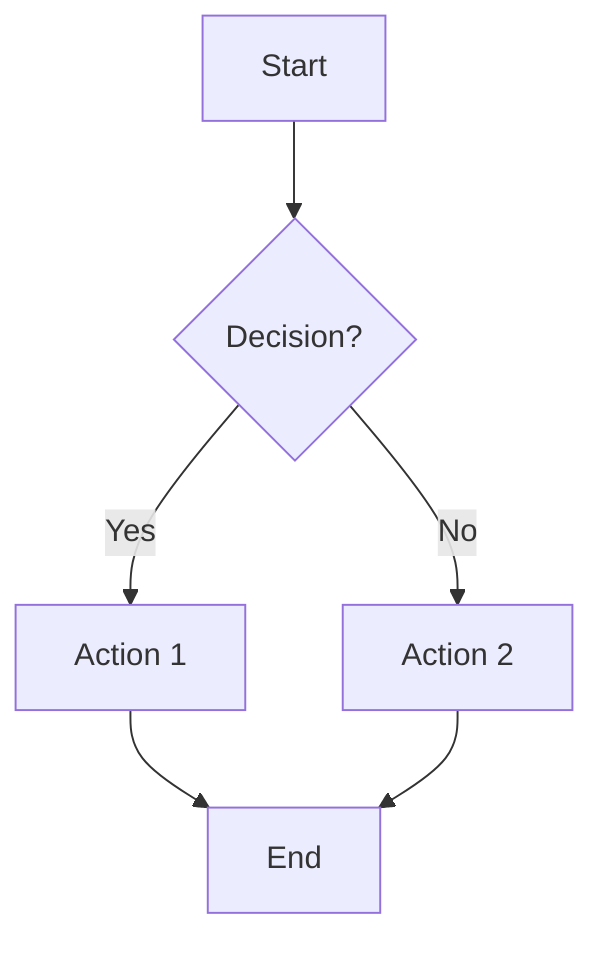
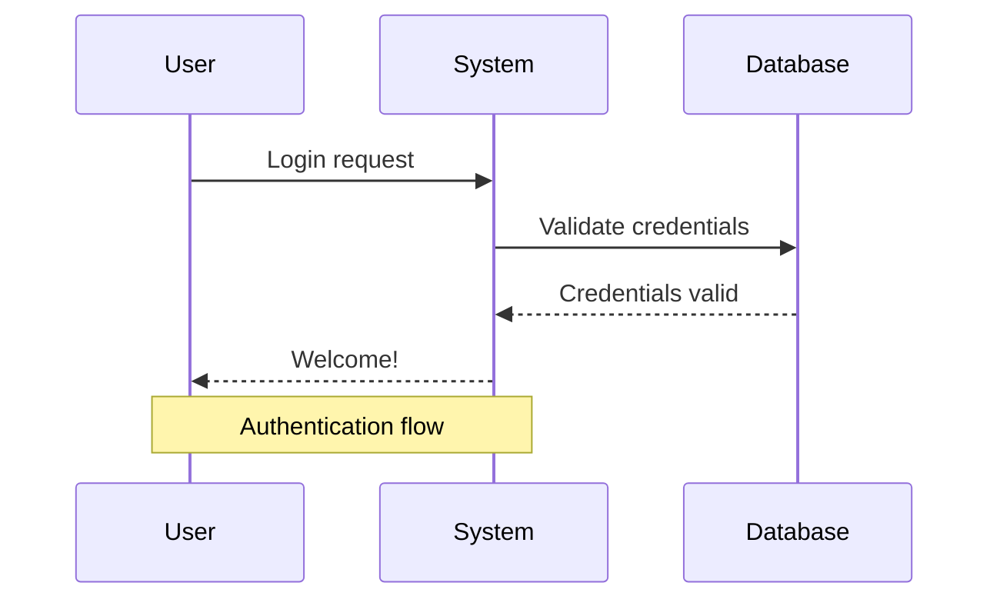
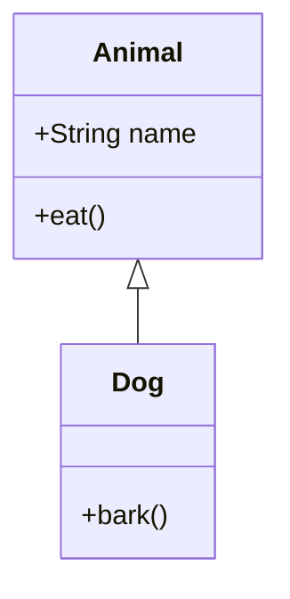
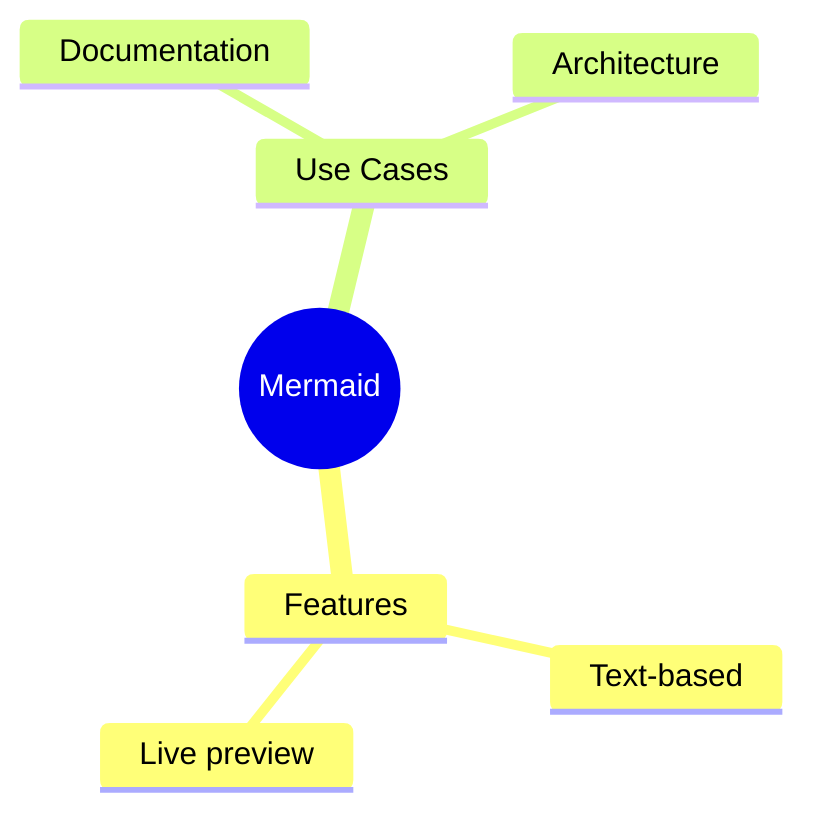
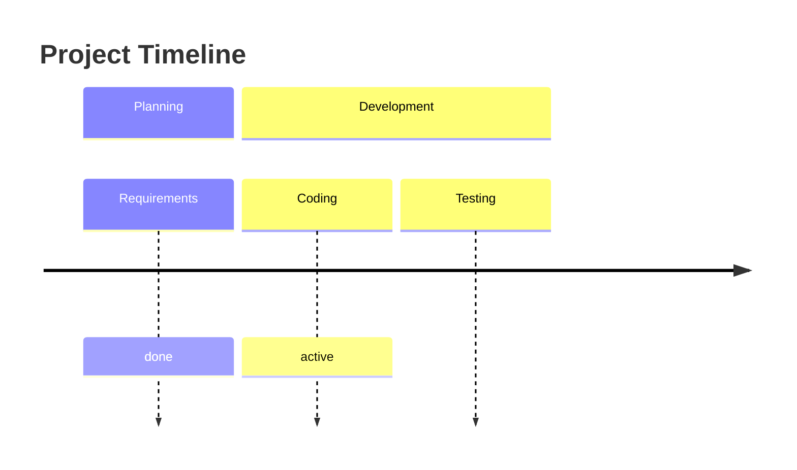
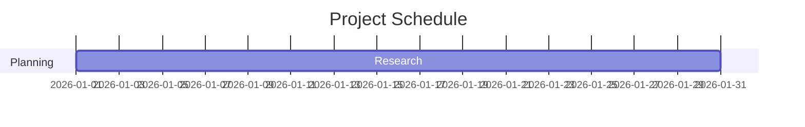
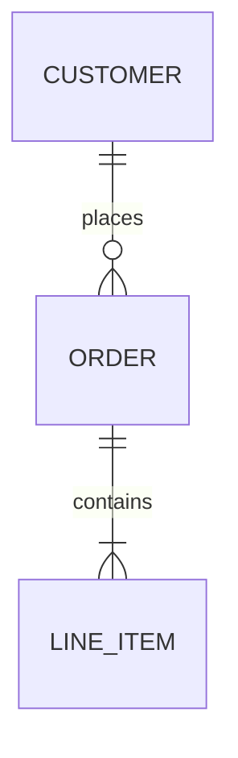
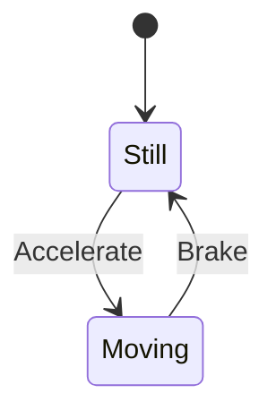
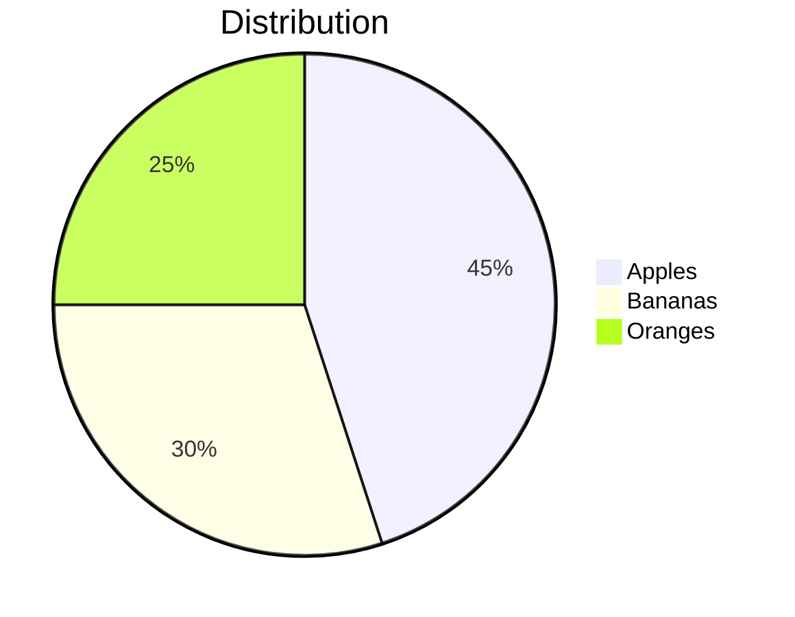
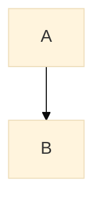

### 1. Basic Structure

Every Mermaid diagram starts the same way:

```text
    ```mermaid
    [diagram type] [direction]
        [content]
    ```
```

### 2. Main Diagram Types & Syntax Variations

Here are the most useful ones with syntax examples:

#### **Flowchart** (most popular)



**Direction variations**:
- `TD` or `TB` → Top to Bottom
- `BT` → Bottom to Top
- `LR` → Left to Right
- `RL` → Right to Left

**Node shape variations**:
- `A[Text]` → Rectangle
- `A(Text)` → Rounded
- `A((Text))` → Circle
- `A[[Text]]` → Stadium
- `A[(Text)]` → Cylinder
- `A{{Text}}` → Hexagon
- `A[/Text/]` → Parallelogram

#### **Sequence Diagram**



#### **Class Diagram**



#### **Other Popular Types**

**Mindmap**


**Timeline**


**Gantt Chart**


**Entity Relationship (ER)**


**State Diagram**


**Pie Chart**


### 3. Advanced Syntax Features

- **Comments**: `%% This is a comment`
- **Styling**:
  ```mermaid
  flowchart TD
      A[Start] --> B[Process]
      style A fill:#f9f,stroke:#333,stroke-width:4px
      classDef blue fill:#2196f3,stroke:#fff
      class B blue
  ```
- **Subgraphs** (grouping nodes):
  ```mermaid
  flowchart TD
      subgraph One
          A --> B
      end
  ```
- **Click interactions**:
  ```mermaid
  flowchart TD
      A[Click me] --> B[Result]
      click A href "https://example.com"
  ```

### 4. Configuration Options

You can add configuration at the top:



Common themes: `default`, `base`, `dark`, `forest`, `neutral`.