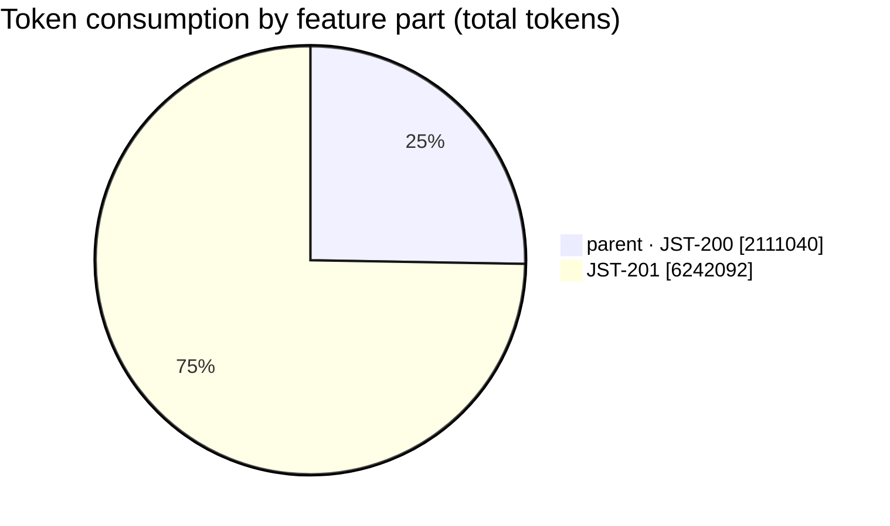
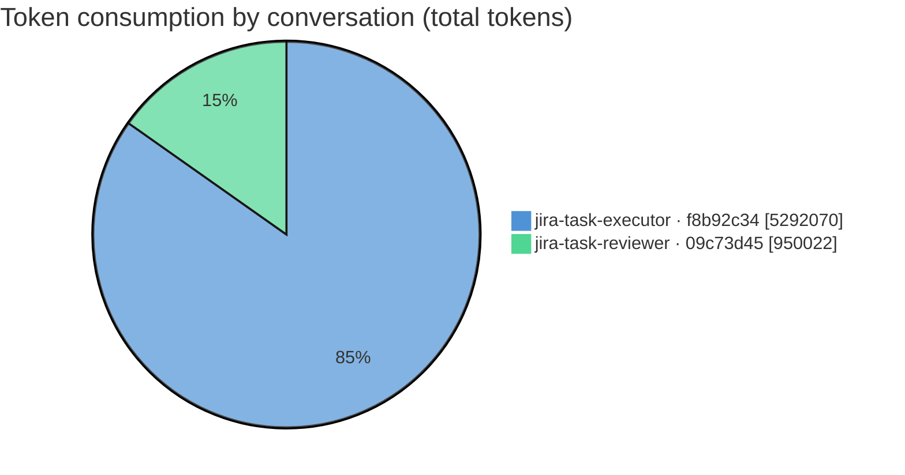
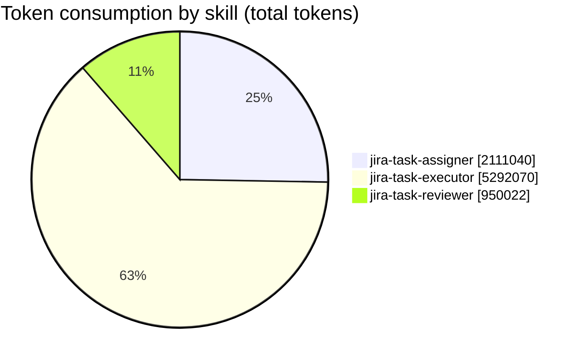
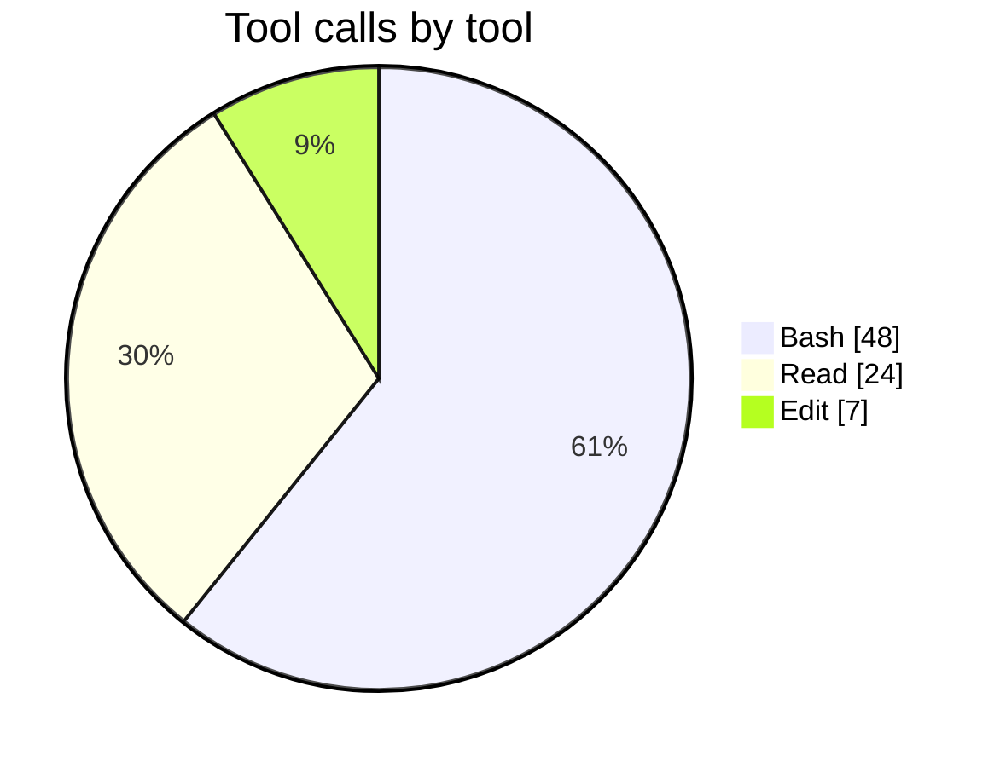

# Feature report — JST-200 (multistep)

_Generated by `feature_report` from `collect_feature` JSON — multistep feature: parent **JST-200** + 2 child feature(s), 3 conversation(s) feature-wide, 3 with measured metrics. Every figure is the collector's own; nothing is re-estimated._

## Feature summary

| metric | value |
|---|---|
| Feature (parent) | JST-200 |
| Parent summary | Example multistep feature — parent story |
| Child features | 2 |
| Conversations (feature-wide) | 3 (analyzed: 3) |
| **Total token consumption** | **8,353,132** |
| — input | 132 |
| — output | 82,000 |
| — cache read | 8,000,000 |
| — cache write | 271,000 |
| Models used | claude-opus-4-8 |
| Skills exercised | jira-task-assigner, jira-task-executor, jira-task-reviewer |
| Issue keys touched | JST-200, JST-201 |
| Total skill turns | 59 |
| Total tool calls | 79 (errors: 3) |
| Distinct tools used | 3 |
| Activity span | 23h 3m 28s (2026-07-10 09:00:00Z → 2026-07-11 08:03:28Z) |

## Token share by feature part

| feature part | key | conversations | total tokens |
|---|---|--:|--:|
| parent (own) | JST-200 | 1 | 2,111,040 |
| child | JST-201 | 2 | 6,242,092 |
| child | JST-202 | 0 | 0 |

## Parent feature — JST-200

_Example multistep feature — parent story_

### Per-conversation — tokens

| conversation | provenance | skill | issue | model(s) | in | out | cache-read | cache-write | total | tool calls | elapsed (s) | size |
|---|---|---|---|---|--:|--:|--:|--:|--:|--:|--:|--:|
| `e5a61b23-5555-4abc-8def-000000000005` | main-checkout | jira-task-assigner | JST-200 | claude-opus-4-8 | 40 | 21,000 | 2,000,000 | 90,000 | 2,111,040 | 25 | 415.2 | 148.8 KB |

### Per-conversation — performance

| conversation | skill | skill turns | sidechain turns | tool calls | tool errors | tools used (calls) | elapsed (s) | first activity | last activity |
|---|---|--:|--:|--:|--:|---|--:|---|---|
| `e5a61b23-5555-4abc-8def-000000000005` | jira-task-assigner | 18 | 0 | 25 | 1 | Bash:15(!1), Read:10 | 415.2 | 2026-07-10 09:00:00Z | 2026-07-10 09:06:55Z |

## Child feature — JST-201

_Example child feature — implemented and reviewed_

### Per-conversation — tokens

| conversation | provenance | skill | issue | model(s) | in | out | cache-read | cache-write | total | tool calls | elapsed (s) | size |
|---|---|---|---|---|--:|--:|--:|--:|--:|--:|--:|--:|
| `f8b92c34-6666-4bcd-9eff-000000000006` | worktree | jira-task-executor | JST-201 | claude-opus-4-8 | 70 | 52,000 | 5,100,000 | 140,000 | 5,292,070 | 40 | 1,980.5 | 4.5 MB |
| `09c73d45-7777-4cde-8aff-000000000007` | worktree | jira-task-reviewer | JST-201 | claude-opus-4-8 | 22 | 9,000 | 900,000 | 41,000 | 950,022 | 14 | 208.7 | 82.3 KB |

### Per-conversation — performance

| conversation | skill | skill turns | sidechain turns | tool calls | tool errors | tools used (calls) | elapsed (s) | first activity | last activity |
|---|---|--:|--:|--:|--:|---|--:|---|---|
| `f8b92c34-6666-4bcd-9eff-000000000006` | jira-task-executor | 30 | 1 | 40 | 2 | Bash:28(!2), Edit:7, Read:5 | 1,980.5 | 2026-07-10 10:00:00Z | 2026-07-10 10:33:00Z |
| `09c73d45-7777-4cde-8aff-000000000007` | jira-task-reviewer | 11 | 0 | 14 | 0 | Read:9, Bash:5 | 208.7 | 2026-07-11 08:00:00Z | 2026-07-11 08:03:28Z |

## Child feature — JST-202

_Example child feature — not started yet_

_No conversations resolved for this child feature yet (no worktree, or no sessions in it)._

## Tokens by skill

| skill | conversations | in | out | cache-read | cache-write | total |
|---|--:|--:|--:|--:|--:|--:|
| jira-task-assigner | 1 | 40 | 21,000 | 2,000,000 | 90,000 | 2,111,040 |
| jira-task-executor | 1 | 70 | 52,000 | 5,100,000 | 140,000 | 5,292,070 |
| jira-task-reviewer | 1 | 22 | 9,000 | 900,000 | 41,000 | 950,022 |

## Tokens by provenance

| provenance | conversations | in | out | cache-read | cache-write | total |
|---|--:|--:|--:|--:|--:|--:|
| main-checkout | 1 | 40 | 21,000 | 2,000,000 | 90,000 | 2,111,040 |
| worktree | 2 | 92 | 61,000 | 6,000,000 | 181,000 | 6,242,092 |

## Tool usage

| tool | conversations | calls | errors |
|---|--:|--:|--:|
| Bash | 3 | 48 | 3 |
| Read | 3 | 24 | 0 |
| Edit | 1 | 7 | 0 |

## Feature totals

| token bucket | tokens |
|---|--:|
| input | 132 |
| output | 82,000 |
| cache read | 8,000,000 |
| cache write | 271,000 |
| **grand total** | **8,353,132** |

Models across the feature: **claude-opus-4-8**

## Activity timeframe

| metric | value |
|---|---|
| First activity | 2026-07-10 09:00:00Z |
| Last activity | 2026-07-11 08:03:28Z |
| Span (first → last) | 23h 3m 28s |

_Span is wall-clock from the earliest to the latest measured turn across the feature — it includes idle gaps between sessions and human wait time, so it is not compute time and does not equal the sum of per-conversation elapsed._

