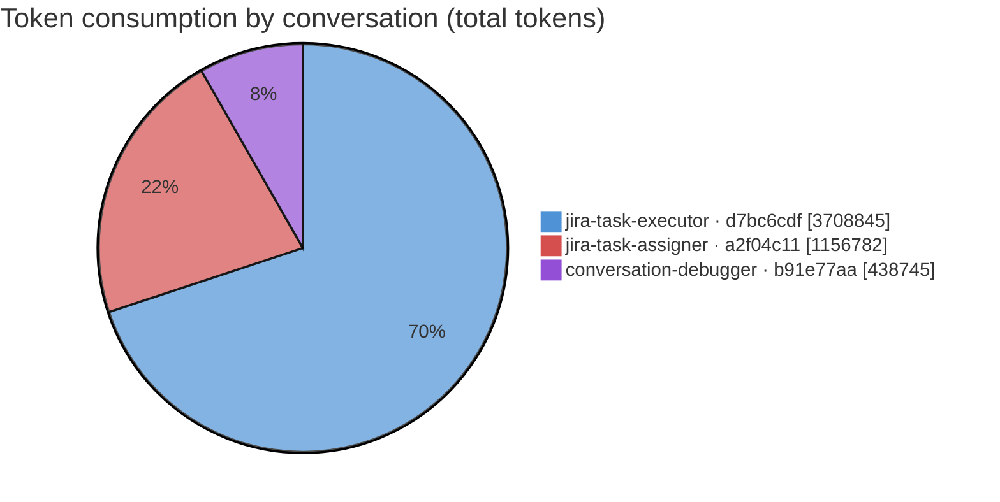
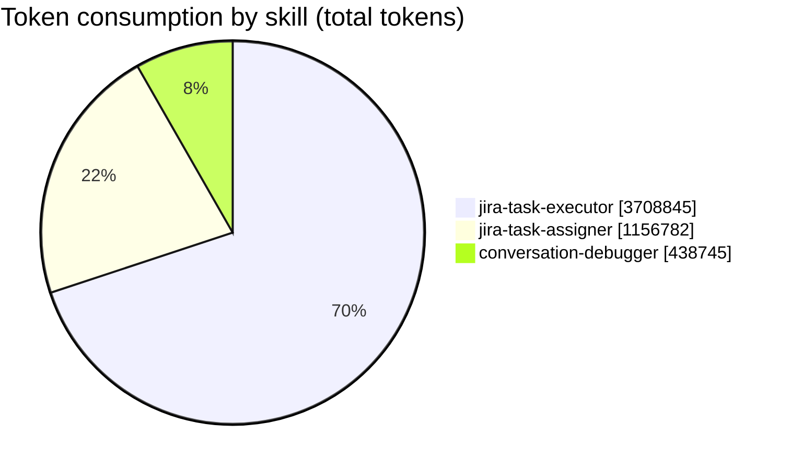
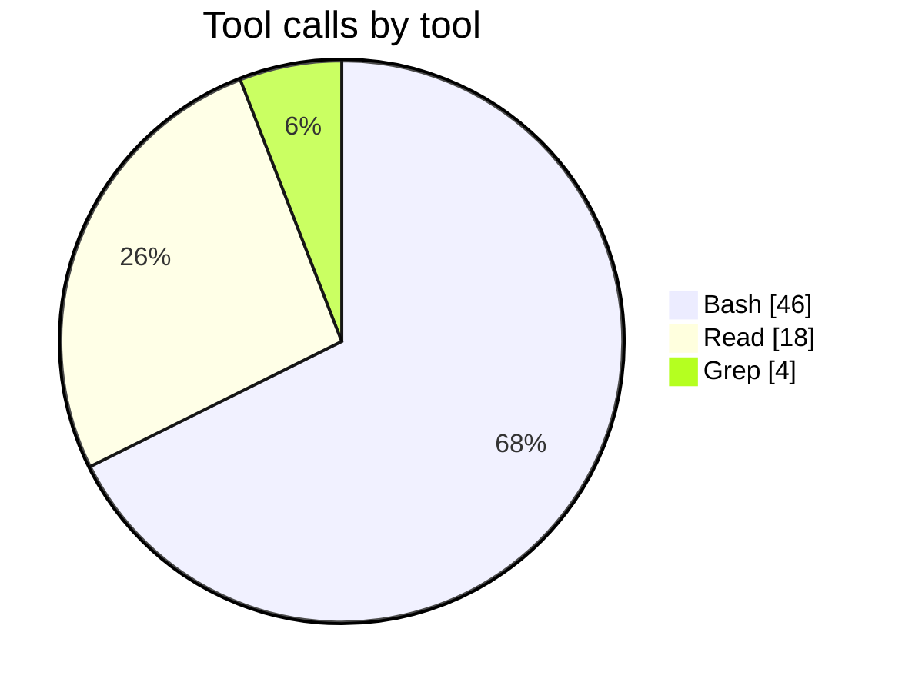

# Feature report — JST-122

_Generated by `feature_report` from `collect_feature` JSON — 4 conversation(s), 3 with measured metrics. Every figure is the collector's own; nothing is re-estimated._

## Summary

| metric | value |
|---|---|
| Feature | JST-122 |
| Conversations | 4 (analyzed: 3) |
| **Total token consumption** | **5,304,372** |
| — input | 104 |
| — output | 75,452 |
| — cache read | 5,002,845 |
| — cache write | 225,971 |
| Models used | claude-opus-4-8, claude-haiku-4-5 |
| Skills exercised | jira-task-executor, jira-task-assigner, conversation-debugger |
| Issue keys touched | JST-122 |
| Total skill turns | 49 |
| Total tool calls | 68 (errors: 3) |
| Distinct tools used | 3 |
| Activity span | 4h 59m 14s (2026-07-18 10:02:11Z → 2026-07-18 14:01:25Z) |

## Per-conversation — tokens

| conversation | provenance | skill | issue | model(s) | in | out | cache-read | cache-write | total | tool calls | elapsed (s) | size |
|---|---|---|---|---|--:|--:|--:|--:|--:|--:|--:|--:|
| `d7bc6cdf-1111-4aaa-8bbb-000000000001` | worktree | jira-task-executor | JST-122 | claude-opus-4-8 | 64 | 49,637 | 3,535,466 | 123,678 | 3,708,845 | 36 | 1,392.9 | 3.7 MB |
| `a2f04c11-2222-4ccc-9ddd-000000000002` | main-checkout | jira-task-assigner | JST-122 | claude-opus-4-8, claude-haiku-4-5 | 28 | 17,393 | 1,067,168 | 72,193 | 1,156,782 | 21 | 302.4 | 48.3 KB |
| `b91e77aa-3333-4eee-8fff-000000000003` | worktree | conversation-debugger | JST-122 | claude-opus-4-8 | 12 | 8,422 | 400,211 | 30,100 | 438,745 | 11 | 55.6 | 10.0 KB |
| `c3d5e8f0-4444-4aaa-9bbb-000000000004` | unknown | _(no skill)_ | - | _not analyzed: stub_ | — | — | — | — | — | — | — | — |

## Per-conversation — performance

| conversation | skill | skill turns | sidechain turns | tool calls | tool errors | tools used (calls) | elapsed (s) | first activity | last activity |
|---|---|--:|--:|--:|--:|---|--:|---|---|
| `d7bc6cdf-1111-4aaa-8bbb-000000000001` | jira-task-executor | 26 | 0 | 36 | 2 | Bash:30(!2), Read:6 | 1,392.9 | 2026-07-18 10:35:59Z | 2026-07-18 10:59:12Z |
| `a2f04c11-2222-4ccc-9ddd-000000000002` | jira-task-assigner | 14 | 2 | 21 | 1 | Bash:12(!1), Read:5, Grep:4 | 302.4 | 2026-07-18 10:02:11Z | 2026-07-18 10:07:13Z |
| `b91e77aa-3333-4eee-8fff-000000000003` | conversation-debugger | 9 | 0 | 11 | 0 | Read:7, Bash:4 | 55.6 | 2026-07-18 13:58:00Z | 2026-07-18 14:01:25Z |
| `c3d5e8f0-4444-4aaa-9bbb-000000000004` | _(no skill)_ | — | — | — | — | — | — | — | — |

## Tokens by skill

| skill | conversations | in | out | cache-read | cache-write | total |
|---|--:|--:|--:|--:|--:|--:|
| jira-task-executor | 1 | 64 | 49,637 | 3,535,466 | 123,678 | 3,708,845 |
| jira-task-assigner | 1 | 28 | 17,393 | 1,067,168 | 72,193 | 1,156,782 |
| conversation-debugger | 1 | 12 | 8,422 | 400,211 | 30,100 | 438,745 |

## Tokens by provenance

| provenance | conversations | in | out | cache-read | cache-write | total |
|---|--:|--:|--:|--:|--:|--:|
| worktree | 2 | 76 | 58,059 | 3,935,677 | 153,778 | 4,147,590 |
| main-checkout | 1 | 28 | 17,393 | 1,067,168 | 72,193 | 1,156,782 |

## Tool usage

| tool | conversations | calls | errors |
|---|--:|--:|--:|
| Bash | 3 | 46 | 3 |
| Read | 3 | 18 | 0 |
| Grep | 1 | 4 | 0 |

## Feature totals

| token bucket | tokens |
|---|--:|
| input | 104 |
| output | 75,452 |
| cache read | 5,002,845 |
| cache write | 225,971 |
| **grand total** | **5,304,372** |

Models across the feature: **claude-opus-4-8, claude-haiku-4-5**

## Activity timeframe

| metric | value |
|---|---|
| First activity | 2026-07-18 10:02:11Z |
| Last activity | 2026-07-18 14:01:25Z |
| Span (first → last) | 4h 59m 14s |

_Span is wall-clock from the earliest to the latest measured turn across the feature — it includes idle gaps between sessions and human wait time, so it is not compute time and does not equal the sum of per-conversation elapsed._

